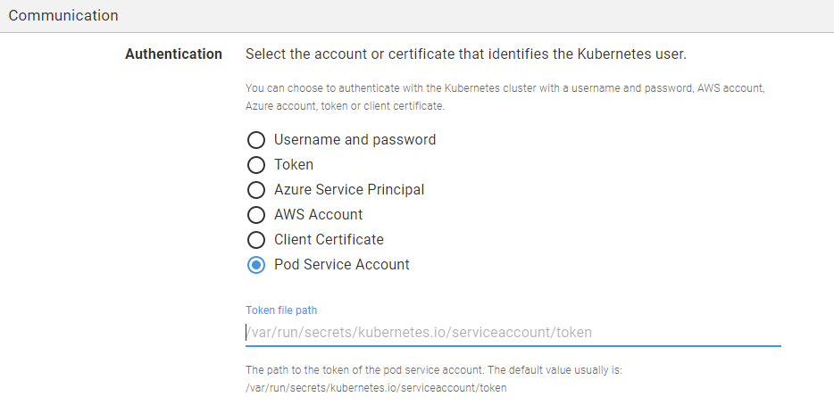
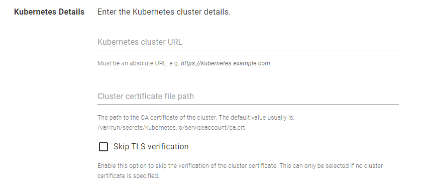
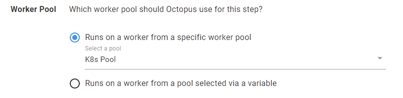

TODO: Add blog image.

I'm happy to announce that we're introducing simpler authentication for Octopus Workers running inside Kubernetes clusters, using the Kubernetes Pod Service Account's credentials. In this blog post, I'll introduce the new support and show you how to get started to take advantage of this update.

Octopus introduced Workers as a way to shift deployment work off the Octopus Server to pools of machines. Workers are helpful for teams in several scenarios, such as backing up databases, performing database schema migrations, and configuring load balancers. Additionally, it's also possible for teams to create a pool of workers as a container running inside a Kubernetes cluster.

When running a pool of workers as a container in a Kubernetes cluster, the workers are now possible to connect back to the parent cluster using the Pod Service Account token and cluster certificate files mounted as files in the pod. This allows the workers to manage the cluster they are deploying to without having any additional credentials sent to them from Octopus Server.

## Create a worker pool running inside a Kubernetes cluster
You can run a pool of Octopus workers inside a Kubernetes cluster. There are a couple of reasons you'd want to do this; to create a dedicated worker for that cluster or simply to create a bunch of workers to use with Octopus Deploy. 

This can be done either by deploying the [Tentacle image](https://hub.docker.com/r/octopusdeploy/tentacle) hosted in Docker Hub or using [Octopus Deploy Runbooks](https://octopus.com/docs/runbooks). Please refer to [this blog post](https://octopus.com/blog/kubernetes-workers) for comprehensive instructions on how to use Octopus Deploy to deploy a worker pool to Kubernetes clusters.

Once you have a set of healthy workers running inside the Kubernetes cluster, you need to ensure `kubectl`, [the Kubernetes command-line tool](https://kubernetes.io/docs/tasks/tools/) which allows you to run commands against Kubernetes clusters, is installed in each Octopus worker. To do this, navigate to each worker's directory and run the commands below.

```bash
$ curl -LO "https://dl.k8s.io/release/$(curl -L -s https://dl.k8s.io/release/stable.txt)/bin/linux/amd64/kubectl"
$ chmod +x ./kubectl
$ mv ./kubectl /usr/local/bin
```

Then, you can verify that `kubectl` has been installed successfully by checking its version.

```bash
$ kubectl version
```

## Add a Kubernetes target using Pod Service Account authentication
Now we have a pool of healthy worker(s) running inside the Kubernetes cluster. The next step is to add a deployment target using the new authentication mode, Pod Service Account.

1. Navigate to **Infrastructure** ➜ **Deployment Targets**, and click **ADD DEPLOYMENT TARGET**.
1. Select **KUBERNETES CLUSTER** and click **ADD** on the Kubernetes Cluster card.
1. Enter a display name for the Kubernetes Cluster.
1. Select at least one [environment](https://octopus.com/docs/infrastructure/environments) for the target.
1. Select at least one [target role](https://octopus.com/docs/infrastructure/deployment-targets#target-roles) for the target.
1. Select **Pod Service Account** as the Authentication mode.
1. Enter the path to the token file of the **Pod Service Account**. The default path usually is `/var/run/secrets/kubernetes.io/serviceaccount/token`. Please note that the path is relative to the pod's directory.

1. Enter the URL of the Kubernetes cluster. Each Kubernetes target in Octopus Deploy requires the cluster URL, which can be located by retrieving the cluster information (running `kubectl cluster-info` in the Kubernetes cluster).
1. Optionally, enter the path to the cluster certificate. The default path usually is `/var/run/secrets/kubernetes.io/serviceaccount/ca.crt`. Please note that the path is relative to the pod's directory. If you select **Skip TSL verification**, you are not required to enter this detail.

1. *Important*: Select the worker pool which contains the workers running inside the Kubernetes cluster. Otherwise, the health check for the deployment target will fail.


## Create a deployment process
The deployment target is now ready to be used in Kubernetes deployment processes. You can proceed to create a [Deploy Kubernetes containers](https://octopus.com/docs/deployments/kubernetes/deploy-container) step to target the [target role](https://octopus.com/docs/infrastructure/deployment-targets#target-roles) of this deployment target.

Similar to the deployment target created earlier, the deployment steps require a worker pool running inside the Kubernetes cluster. Please ensure that you select a valid **Worker Pool** for your steps.


## Conclusion
This blog post demonstrates how you can utilize the **Pod Service Account** authentication mode when creating a **Kubernetes deployment target**. 

One of the benefits of this authentication mode is that it enables the workers to connect back to the parent cluster by itself. Hence, no certificate data of your cluster is required to be stored in Octopus Server.

Happy deployments!
