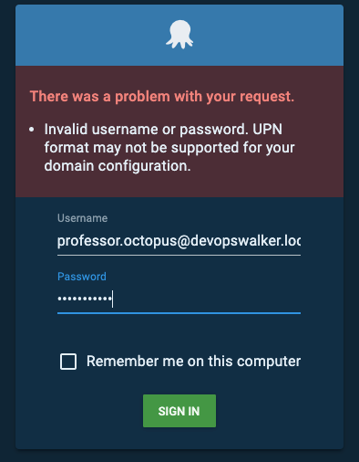
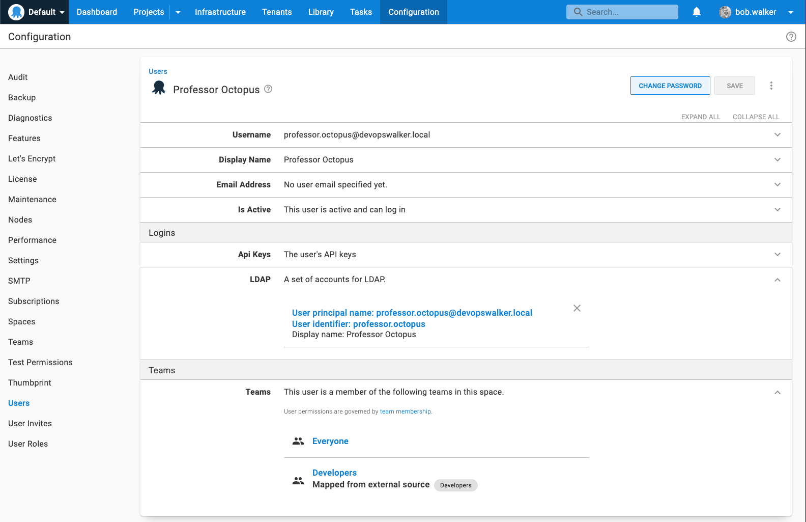
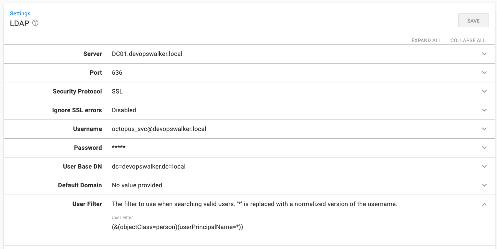
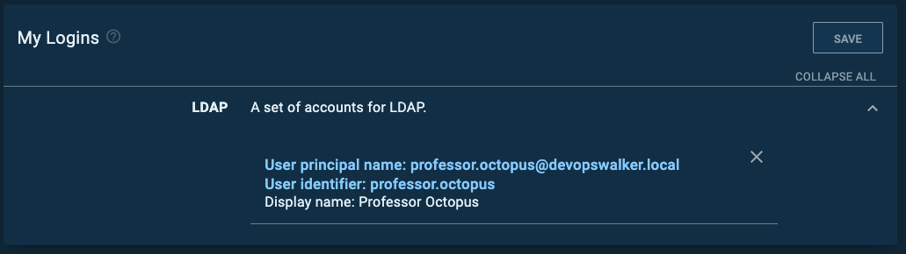

In Octopus Deploy 2021.2, we are adding the [LDAP](https://ldap.com/) authentication provider.  In this post, I will walk you through the steps to configure the LDAP authentication provider to work with your LDAP Server.  By the end of this post, my Octopus Deploy instance will authenticate over LDAP to my local domain, `devopswalker.local`, running on Windows Server 2019.

:::hint
This article assumes you are familiar with directory services core concepts.  If you are unsure of any of these concepts, please get in touch with your local system administrator.
:::

## LDAP Background

LDAP, or Lightweight Directory Access Protocol, is an open, vendor-neutral, industry-standard protocol for interacting with directory servers.  It is easy to confuse LDAP with a directory server such as Active Directory.  LDAP itself is not a directory server.  It is the protocol used to communicate with a directory server.  Like `http` is the protocol for web servers, or `wss` is the protocol to communicate with web servers via sockets.  The default configuration for Active Directory enables LDAP support.  Chances are if you have Active Directory running on-premise, you already have an LDAP server!

## Why LDAP

There are three primary use cases why we added LDAP support.

1. Not everyone is running Active Directory.  LDAP is vendor-neutral, meaning more non-Microsoft users can take advantage of external authentication.
2. Active Directory / integrated authentication requires servers to be added to the domain.  That does not work with the Octopus Linux Container.
3. Using Active Directory authentication on a non-Windows client (specifically MacOS) is a pain.  

There are several other advantages to using LDAP, such as cross-domain queries.  I'd recommend spending a few hours on [ldap.com](https://ldap.com) to learn more about what LDAP can and cannot offer.

## Secure your LDAP Server First

By default, LDAP traffic is not encrypted.  By monitoring network traffic, an eavesdropper could learn your LDAP password.  Before configuring the LDAP provider in Octopus Deploy, please consult the vendor documentation for your directory server for communicating over SSL or TLS.  Securing an LDAP server is outside the scope of this blog post.  The rest of this post assumes you have worked with your system administrators on securing your LDAP server.

## Understanding DNs

In LDAP, a DN, or a distinguished name, uniquely identifies an entry and the position in a directory information tree.  Think of it as a path to a file on a file system.

As I stated earlier, my domain is `devopswalker.local`.  Translating that to a DN LDAP can understand is `dc=devopswalker,dc=local`.  All users are stored in the group users.  The DN for that is `cn=users,dc=devopswalker,dc=local`.  My user account `Bob Walker` DN is `cn=Bob Walker,cn=users,dc=devopswalker,dc=local`

## What you will need

Before configuring LDAP, you will need the following.

- The fully qualified domain name, or FQDN, of the server to query.  In my example, it will be `DC01.devopswalker.local`.
- The port number and security protocol to use.  I'm using the standard secure LDAP port 636 for my domain controller and SSL.
- The username and password of a service account that can perform user and group lookups.  In my example, it will be `octopus_svc@devopswalker.local`.
- The root DN you wish to use.  In my example, it will be `dc=devopswalker,dc=local`.

**Please Note**: my example is using a straightforward Active Directory configuration.  Your DN and FQDN might be much more complex.

## Configuring LDAP Authentication Provider in Octopus Deploy

Navigate to {{Configuration, Settings, LDAP}}.  Enter values in the following fields:

- Server: Enter the FQDN of your server.
- Port: Change the port (if your secure port is different from the default).
- Security Protocol: Change to SSL or StartTLS.
- Username: Enter the username that will be used to perform the user lookups.  It can either be `[username]@[domain name]` or the user's DN.
- User base DN: enter the base DN for your users, which in my example is `dc=devopswalker,dc=local`.
- Group base DN: enter the base DN for your users, which in my example is `dc=devopswalker,dc=local`.
- Is Enabled: Check the check box to enable the feature.

:::hint
If you want to limit the LDAP query, add more values to the user and group base DN.  For example, `cn=users,dc=devopswalker,dc=local`.
:::

## Testing the LDAP Authentication Provider

After I configured the LDAP authentication provider, I made the mistake of logging out and logging back in.  That was rather annoying during the troubleshooting sessions.  I discovered two easy tests I can do without performing the authentication dance.

- External User Lookup
- External Group Lookup

For the external user lookup, go to {{Configuration,Users}} and select a user account.  Once that screen is loaded, expand the LDAP section under logins and click the `ADD LOGIN` button.  If everything is working correctly, then you will see a modal window similar to this.

However, I did not see that screen at first. Instead, I saw this:

The error `Unable to connect to the LDAP server.  Please see your administrator if this re-occurs.  Error Code 49 Invalid Credentials` is an LDAP lookup error.  In this case, it means I misconfigured to perform the user and group lookups.  There are also data codes for each LDAP error type code.  To access that information, open up your Octopus Server logs.   

:::hint
After banging my head against the wall for a while, I found that my authentication provider was misconfigured.  If you get errors you can't explain, try performing a similar action using an LDAP explorer on the same server hosting Octopus Deploy.  Take Octopus out of the equation.  If everything works via the explorer, reach out to [support@octopus.com](mailto:support@octopus.com) for more help.
:::

The external group lookup is the same as the external user lookup.  Except, go to {{Configuration,Teams}} and select a team.  Then click the button `ADD LDAP GROUP` and perform a search.  If everything is configured correctly, then you will see this message:

If the lookup fails, then perform the same troubleshooting you did for the user lookup.

## Signing In

After the above tests are successful, it is time to try the next test, logging into Octopus using the LDAP authentication provider.  I created a test account, `Professor Octopus`, and added it to the `Developers` group.  When I first tried to sign in as `professor.octopus@devopswalker.local`, I got this error:

Changing the username to just `professor.octopus` worked as expected.  The new user was created and assigned to the appropriate team.

While it all worked, I would like to use the fully qualified name to log in.  It turns out; it is the LDAP configuration in Octopus that needs modification.  Change the User Filter to be `(&(objectClass=person)(userPrincipalName=*))`.  

I needed to change that filter because the fully qualified name is stored as the user principal name in my domain controller.

## Conclusion

As you can see, unlike the Active Directory authentication provider, the LDAP authentication provider doesn't "just work" out of the box with little to no configuration.  You'll have to do some testing to make sure everything works as expected.  Because of that, I recommend setting up a test instance to dial in all your LDAP authentication settings.  

That being said, I'm very excited about adding the LDAP authentication provider to Octopus Deploy.  For quite some time, I've wanted to have active directory authentication but dreaded turning it on.  I have multiple user accounts on my local active directory, each with different permissions in Octopus.  The thought of logging out/logging in on my actual computer each time I wanted to test something was not appealing.  LDAP solves that problem, along with a host of other problems.

Until next time, Happy Deployments!