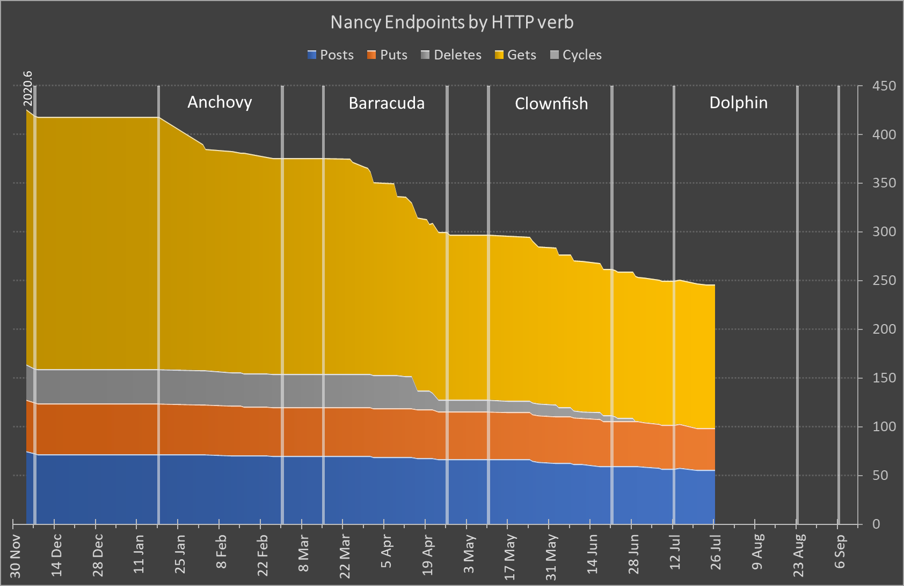

When Octopus Deploy was announced in 2011, the low-ceremony approach of [NancyFx](https://github.com/NancyFx/Nancy) made it an ideal framework for our API layer. On top of Nancy, we added a bespoke layer to make it easy to add new routes which conformed to our conventions.

As we grew though, this bespoke layer became a source of confusion for new starters. The world also changed around us, and as of 2020, Nancy was no longer being maintained. 

So we've migrated Octopus Deploy to a new, more standardized way of writing an API. It's one that leverages the existing knowledge of developers who join the company. We chose ASP.NET controllers.

The Octopus Deploy API contains 426 different endpoints spread across 73 Nancy modules (a collection of endpoints grouped into a single class). Each module defines endpoints that relate to a specific resource type. 

It was clear to us this was going to be a significant undertaking. So we adopted a [strategy](https://lethain.com/migrations/): Derisk, Enable, Finish.

## Derisk

We devised a way to allow ASP.NET to live side-by-side with Nancy:

- Incoming requests were passed to ASP.NET middleware. 
- If the request matched an ASP.NET route, then the relevant controller was called. 
- If a match wasn’t found, then the request was passed on to Nancy.

Next we started with a single Nancy module and migrated the endpoints one-by-one. This was done in three steps per endpoint:

1. Analyse & Test
2. Migrate
3. Verify

### Analyse & Test

We used [Assent](https://github.com/droyad/Assent) tests to snapshot the entire HTTP response from an endpoint, for both the happy path and any edge cases. These tests also measured the response time for an endpoint so we could check for any performance regressions.

### Migrate

For a simple GET endpoint, the migration could be trivial. For endpoints that mutated the state, things could be more time consuming. Rules such as validation were considered, understood, and ported over to the ASP.NET controller pattern.

### Verify

The previously-added tests were re-run in CI, alerting us to any performance regressions, functional changes, or alterations to the response content. Objective decisions were then made about changes and whether they were acceptable or not.

## Enable

This approach was successful and proved that migrating the entire Octopus Deploy API was possible. 

It also showed us:

- Nancy endpoints typically took around 100ms to return a response.
- The first call to an ASP.NET endpoint would return in around 200ms but subsequent calls took only 30–40ms.

A team of 4 engineers spent six months focussing on migrations.

To refine migrations, we targeted endpoints which were similar and less-complex. To find out which endpoints met these criteria we wrote a C# script, executed in LINQPad, which reflected over the Octopus Deploy codebase and grouped endpoints by common code and base classes. 

To get a measure of relative complexity, we sorted by a metric based on lines of code and cyclomatic complexity. This grouping and sorting allowed us to focus on the mechanism of migration while avoiding too much domain complexity.

We learned a few things:

- Due to the performance improvements of ASP.NET, it wasn't necessary to continue testing for performance regressions.
- Snapshot-based tests can be challenging to write because you have to account for and “scrub” data that changes between invocations of an endpoint, such as timestamps or IDs.
- For tests checking edge cases, it's simpler to assert on the parts of the response that you really care about, such as response code and error text.
- Tests need data, which can be nontrivial to create, so it’s important to separate this concern from the specifics of your tests.
- It's vital to establish and document repeatable patterns for how you migrate, so others in the engineering team can do migrations as well.
- Understanding the domain that is specific to an endpoint can be the hardest part of a migration.

We also found this type of work can be repetitive, risking dips in developer motivation. To combat this, we celebrated milestones along the way. These included percentage of endpoints migrated, and migration of all endpoints of a specific grouping or type.

We also tracked our progress with a variation on the classic burndown chart.

## Finish

From the outset, we agreed the largest celebration and benefit would be seen when 100% of the API had been migrated to ASP.NET.

After six months we had 40% of the API endpoints migrated, so we've moved to a new phase of migrations, with agreement across the engineering team *that if you're changing an area, cover it with tests and migrate the rest of the Nancy endpoints in that area while you're in that space.* 

This approach leverages developer domain knowledge and spreads the migration work across the engineering team.

## Conclusion

- A migration like this can be done, but it's a significant investment of time.
- It’s important to quantify the work, and find the most effective way to organize efforts.
- This is very parallelizable work.
- Establishing and documenting patterns allows any developer in your organization to help.
- You have to accept a certain level of risk.
- Measuring progress allows you to celebrate key milestones along the way.

Happy deployments!