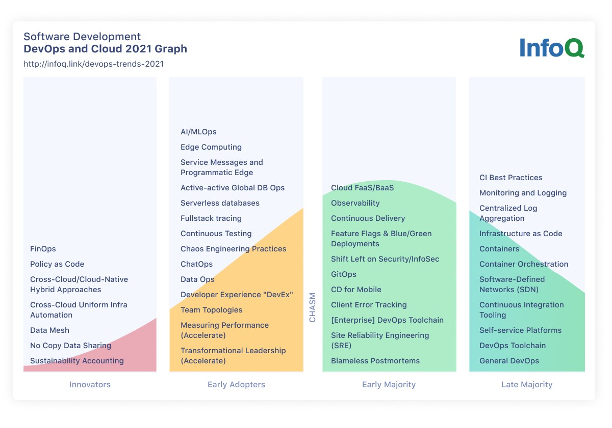
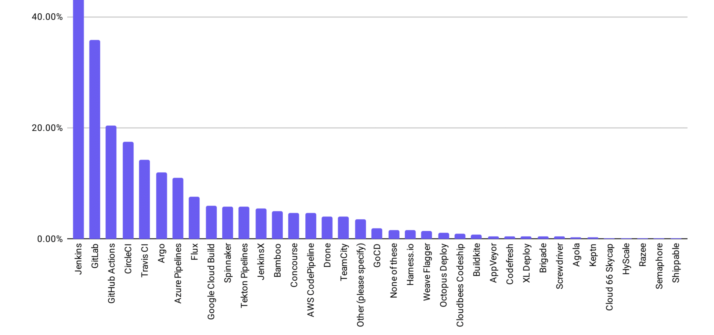
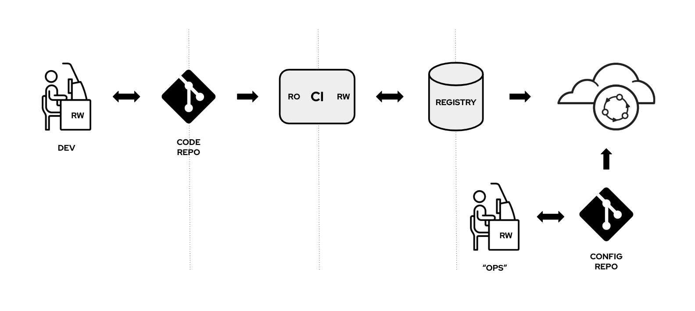
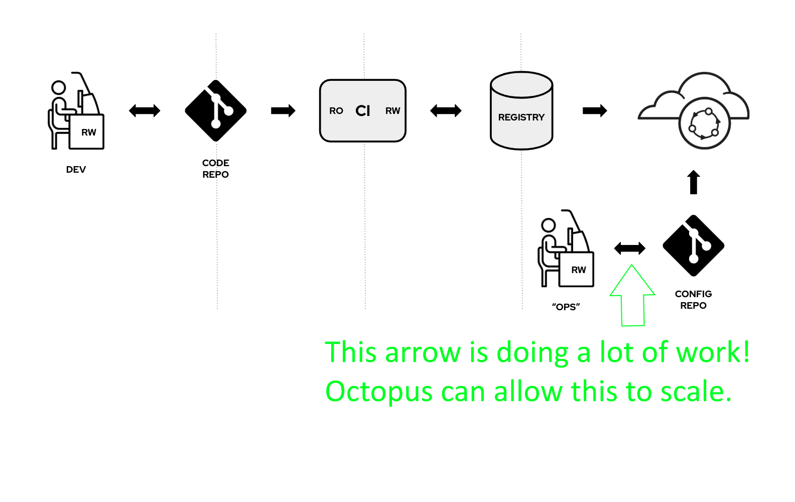
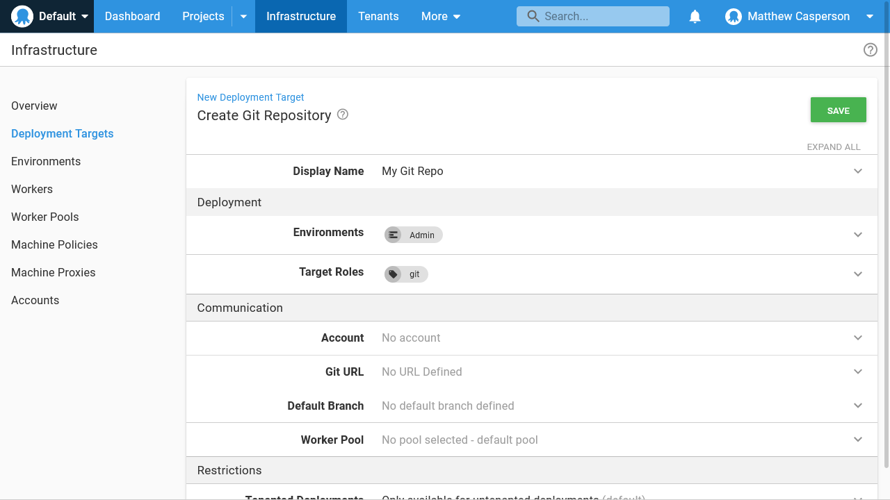

GitOps is a relative newcomer to the deployment scene, with the term having been coined by WeaveWorks in a blog post called [Operations by Pull Request](https://www.weave.works/blog/gitops-operations-by-pull-request) in 2017.

[InfoQ reports that GitOps is now being adopted by an early majority](https://www.infoq.com/articles/devops-and-cloud-trends-2021):

> Both GitOps and site reliability engineering (SRE) practices are increasingly being adopted.

*InfoQ DevOps and Cloud InfoQ Trends Report - July 2021*

[We're also seeing GitOps being mentioned in customer calls](https://octopusdeploy.slack.com/archives/C0223UFAEAY/p1627262125186800):

> "At Crowe, Octopus is our first choice." Reasons to not go with OD: Kubernetes (they prefer a more git-ops model with Flux)"
>
> I've heard this on a few calls re: k8s. Flux and Argo are usually mentioned

ArgoCD and Flux are 6th and 8th most popular tools to manage CI/CD pipelines in the [2020 CNCF survey](https://www.dropbox.com/s/j7nbbc9vrag0wda/CNCF_Survey_Report_2020.pdf?dl=0):

*CNCF 2020 Survey results.*

## What is GitOps

While GitOps is a nebulous term, the [GitOps Working Group](https://github.com/gitops-working-group/gitops-working-group) has provided some initial principals:

* Declarative Configuration: All resources managed through a GitOps process must be completely expressed declaratively.
* Version controlled, immutable storage: Declarative descriptions are stored in a repository that supports immutability, versioning and version history. For example, git.
* Automated delivery: Delivery of the declarative descriptions, from the repository to runtime environment, is fully automated.
* Software Agents: Reconcilers maintain system state and apply the resources described in the declarative configuration.
* Closed loop: Actions are performed on divergence between the version controlled declarative configuration and the actual state of the target system.

Today the emphasis on GitOps is what happens after configuration has been committed to a git repository (which I'll refer to as "right of the git repo"). Tools like [Argo CD](https://argoproj.github.io/argo-cd/) and [Flux](https://fluxcd.io/) are used to manage Kubernetes clusters, while there are some early homegrown solutions appearing for other declarative tools like Terraform and Ansible.

This diagram from the post [Ops by pull request: an Ansible GitOps story](https://www.ansible.com/blog/ops-by-pull-request-an-ansible-gitops-story) provides a nice overview of the current state of GitOps:

*Typical GitOps workflow diagram.*

What we see time and again in the GitOps space is developers and operations staff committing directly to a git repository, and then using the "magic of GitOps" to realise its many benefits.

We know from our experience deploying applications that there is a huge amount of work required to scale up deployment pipelines. You need environments, secrets, tenants, dashboards, interventions, templates, security, automated testing, reporting and more to manage deployments at scale. I propose paradigms like GitOps also need these features, and anyone implementing GitOps at scale today is most likely twisting a CI server into knots implementing these features.

This post proposes new targets and steps that allow Octopus to deploy to a git repository like any other deployment target, which will position Octopus as the best solution for GitOps "left of the git repo":

*Where Octopus fits in GitOps.*

## What problems are we trying to solve?

[To quote a recent panel discussion on GitOps](https://www.youtube.com/watch?v=qC6JkWDgv4g&list=PL2KXbZ9-EY9TRND2YHxordGt8pOw5r45R&index=7&t=1177s):

> The interface to operations is now through git

GitOps views the evolution of operations and deployments as:

1. Starting with manual configuration performed through SSH or RDP.
2. To processes automated through CLI tools like `kubectl`.
3. And finally git commits by end users defining the declarative state of a system to be reified by an agent of some kind.

GitOps identified running adhoc commands with tools like `kubectl` as a weakness in a delivery pipeline operating at scale. This RFC identifies running adhoc `git` commits as a similar weakness, because any sufficiently advanced GitOps workflow must eventually treat a git repo like a database.

One of the stated goals of team steps is to prefer [declarative over imperative](https://github.com/OctopusDeploy/Architecture/blob/main/Steps/StepDesignGuidelines.md#declarative-over-imperative), meaning new steps will default to creating declarative representations of deployments rather than execute custom commands against an SDK. This fits nicely with the GitOps paradigm.

The three problems this RFC aims to solve are deploying declarative state to a git repository, integrating common git operations like pull requests into existing deployment processes or runbooks, and allowing GitOps to scale.

### Deploying declarative state to git

Steps like `Deploy Kubernetes containers` and the upcoming ECS deployment have been designed from the ground up to build declarative templates. By committing these templates to a git repository rather than applying them directly, Octopus can replace the role of a developer or operations staff performing manual updates.

### Managing pull requests

Pull requests are a central tenant of GitOps, as this is how changes are reviewed and authorized. Octopus will provide the opportunity to review, comment on, approve, and merge PRs as part of a standard deployment process or runbook.

### Allowing GitOps to scale

GitOps is all about scale. To implement the infrastructure required to support GitOps, teams must reach an advanced point in their deployment and DevOps maturity. Most GitOps workflows focus heavily on responding to changes to a git repo, but don't offer a good solution for managing the incoming changes.

GitOps at scale means many teams committing to many repositories with many PRs to be processed. This in turn means providing notifications or a dashboard of pending reviews, which Octopus can provide.

Fine grained security with git repos inevitably requires many (probably dozens, possibly hundreds - see this talk called [Cloud-native Patterns - Ops Edition](https://www.youtube.com/watch?v=fZEFWh4xBEw&list=PLXOML2VBdIo7xEp8Bo9kFB-d6tTlHK5Fk&index=10) where a repo per microservice is one suggested approach) of individual repos as the git security model can typically only scope permissions to a branch or a repo. Octopus can provide a source of truth for these many repos, while optionally being the single system that can write to them.

Reporting is a challenge in GitOps. To report on commits to a git repo, a reporting tool must be able to query all the commits and infer meaning from the changes. Git will never scale to the point where it can be read like a structured database, so this won't be a viable solution. This means today the tooling "to the right of the repo" must then interpret the changes being applied in the context of reportable metrics. This is possible, but will always be limited by the ability of tooling to infer intention (like "a new version of the web application was deployed") from a change to a file (like "the file webapplication.yaml had the image field updated"). 

Octopus offers a solution here because a deployment process or runbook captures the intention of an action, which can then be used to generate meaningful metrics.

The only solution provided by GitOps to ensure that consistent and well formed resources are committed to a repo are pull requests. This does not scale well, as relying on manual reviews of complex YAML or JSON to ensure rules, like labels are consistently applied or memory limits are within a certain range, will eventually overwhelm reviewers. Octopus provides a solution by committing well known resources defined in repeatable steps.

## How might we solve the problem?

To allow Octopus to function "left of the git repo" we will introduce a new Git Repository target type, allow this target to be used from the existing Kubernetes steps, and introduce new steps to allow Octopus to create and manage pull requests.

### New Git Repository target

A new target called Git Repository will be created. This target will include the git repository URL, credentials, and the default branch:

*A mockup of a git target.*

### Deploy declarative state to a git repo

Existing Kubernetes steps that generate declarative templates, like **Deploy Kubernetes containers**, will accept the new git target. When deploying to a git repo, Octopus will commit the generated templates to the selected branch.

The commits can be made directly to the main branch, or to a feature branch that will then be used as part of a pull request.

### New steps to manage pull requests

A number of new steps will be added to Octopus to allow it to manage and respond to pull requests:

* Create a pull request
* Approve a pull request
* Merge a pull request
* Wait for a pull request to be approved or merged

## Benefits of the new features

We expect these features will allow teams that have embraced early GitOps platforms like ArgoCD and Flux to automate common deployment and operations scenarios at large scale. By taking the next logical step in the GitOps journey and removing the manual task of committing changes to a git repo, Octopus can bring the same benefits it offers today with traditional deployments and apply them "left of the git repo".

Octopus will also provide a natural mix of deploying declarative resources and automating adhoc commands. For example, you can not (in any practical way) use GitOps to perform common management tasks like getting pod logs, delete a pod managed by a deployment, viewing events etc. The asynchronous nature of GitOps simply makes these tasks impractical. However, by using runbooks with Octopus, teams get the best of both worlds.

Looking forward we expect to see more platforms embracing GitOps. The GitOps working group has a number of [interested parties](https://github.com/gitops-working-group/gitops-working-group/blob/main/interested-parties.md), including cloud providers like AWS and Azure.

GitOps is called out on the [AWS CloudFormation landing page](https://aws.amazon.com/cloudformation/):

> With CloudFormation, you can apply DevOps and GitOps best practices using widely adopted processes such as starting with a git repository and deploying through a CI/CD pipeline.

With these new features in place, any step in Octopus that generates a declarative template can be easily modified to write the results to a git repo instead of deploying the template directly.

## When are these features being delivered

This RFC has been written to gauge interest and collect feedback for possible strategies to pursue in 2022. We currently have no commitment to building these features.

## We want your feedback

We want your feedback to determine if this feature is a good fit for Octopus. Specifically we would like to know:

* Is integrating Octopus with GitOps workflows like those used by ArgoCD and Flux valuable?
* Does the idea of writing templates to a git repository make sense?
* Will these proposed features solve problems you have seen customers encountering?
* Would first class GitOps support be valuable for your teams in terms of sales, marketing, or solutions?

Please leave your feedback on this [GitHub issue](https://github.com/OctopusDeploy/StepsFeedback/issues/4).