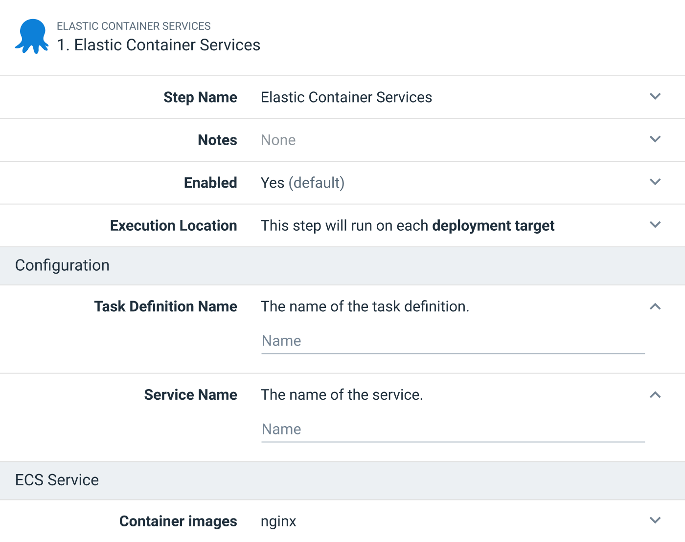
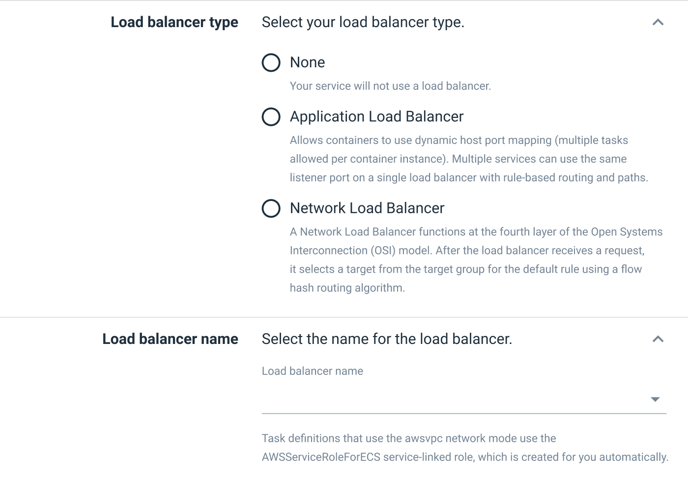

The [first Amazon Elastic Container Service (ECS) integration milestone in Octopus](https://octopus.com/blog/rfc-ecs-integration-with-octopus) is being developed, and will deliver a new step and target, making it easy to deploy your first ECS service through Octopus. 

This first milestone will create and manage an ECS service and task definitions for you via CloudFormation. This frees developers and administrators from writing verbose templates for themselves.

However, one consistent piece of feedback we received early on from teams deploying to ECS, was that they were already successfully managing existing ECS resources, with manually created services, or through tools like Terraform. The challenge wasn't creating services, but updating them with new images as part of their CI/CD pipelines.

For milestone two of our ECS integration, we're proposing a new step that updates existing ECS services without taking ownership of them. This gives teams with an established ECS cluster the opportunity to orchestrate the deployment of new image versions to their services, while retaining control over how the resources are created.

## How we propose to support established ECS clusters

This Request for Comments (RFC) proposes a new step, integrated with the ECS target introduced by the first milestone. The step creates a new task definition revision with a new image tag, and updates a service with the task definition revision.

This milestone also enhances the step delivered in milestone one, by exposing the ability to link existing load balancers.

### The new step

The new step supports people deploying new images to an existing task definition and service.

The step:

- Defines the name of the task definition and its associated service.
- Defines a number of containers to update in the associated task definition:

An ECS deployment to an existing task definition and service will then execute the following process:

1. A new task definition revision is created based on the latest revision.
2. The image versions in the task definition revision with matching container definitions from the step are updated.
3. The service is then updated with the new task definition revision.

### Linking to load balancers

Most services deployed to ECS are exposed to network traffic, which means they receive traffic from a load balancer. 

Milestone two updates the step introduced in milestone one to link a service to an existing load balancer:

## Benefits of the proposed approach

This new step should allow customers with established ECS clusters to orchestrate image deployments through Octopus while still retaining control over any existing infrastructure scripts. 

Octopus selects image versions at release creation time, with all the associated functionality of channels and version rules. Octopus then updates the minimum settings required to deploy the new image or images to ECS, without attempting to own the task definition or service.

This decouples your software release management from your infrastructure release management.

## What is the scope of the second ECS milestone?

Milestone two is focused on supporting teams with established ECS clusters. It also includes some minor updates to existing steps.

The limitations from [milestone one](https://octopus.com/blog/rfc-ecs-integration-with-octopus#what-is-the-scope-of-the-first-ecs-milestone) still apply to milestone two:

- Limiting the original step to deploying to Fargate only (however, the new step proposed in this milestone will update any existing service and task definition, whether it's EC2 or Fargate).
- Only supporting rolling deployments, and not supporting integrated CodeDeploy blue/green deployments.
- Not providing the ability to build a new load balancer (only select an existing one).
- Exclude auto-scaling settings.
- Exclude App Mesh and FireLens settings.
- Exclude service auto-discovery settings.
- Only creating or updating a service, and not supporting tasks or scheduled tasks.

## When will this be released?

Work on milestone two is scheduled to start after milestone one has been completed. We don't have a release date yet, so keep an eye on the [blog](https://octopus.com/blog/) for further announcements.

## We want your feedback

We're still planning the second milestone, so now is a great time to help shape this new feature with your feedback. We have created a [GitHub issue to capture the discussion](https://github.com/OctopusDeploy/StepsFeedback/issues/5).

Specifically, we want to know:

- Will the ability to update an existing task definition and service support your existing ECS clusters?
- What further ECS deployment challenges do you wish Octopus could solve for you?
- Can you foresee any challenges that may stop you from using the proposed step with your existing ECS clusters?

This feedback will help us deliver the best solution we can.

<a class="btn btn-success" href="https://github.com/OctopusDeploy/StepsFeedback/issues/5">Provide feedback</a>

## Conclusion

In summary, the second milestone of our proposed ECS support includes:

- A new step to deploy images to existing task definitions and services.
- The ability to link existing load balancers in the step introduced in milestone one.

Thanks for reading this post. We hope you're as excited about the proposed new ECS functionality as we are.

Any [feedback](https://github.com/OctopusDeploy/StepsFeedback/issues/5) you have is greatly appreciated.

Happy deployments!