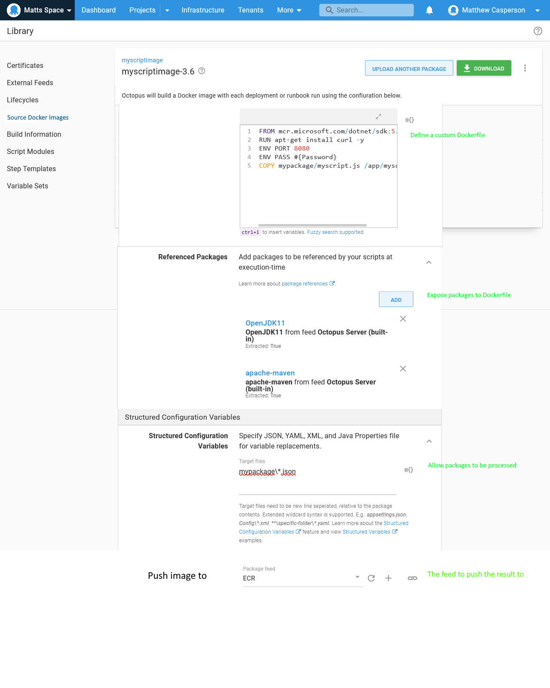
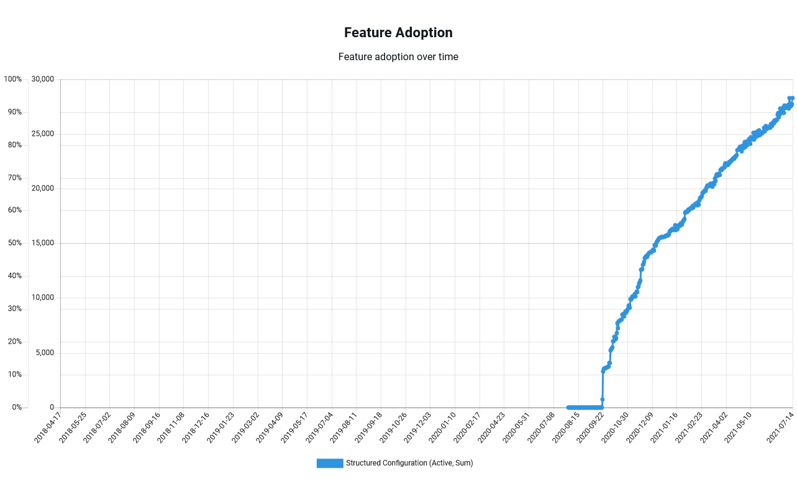

The use of containers is a clear trend in our industry. The [RedHat 2021 State of Enterprise Open Source report](https://www.dropbox.com/s/z12oem8a29lv1zc/rh-enterprise-open-source-report-f27565-202101-en.pdf?dl=0) states:

> Container adoption is already widespread; just under 50% of respondents worldwide use containers in production to at least some degree. 

*RedHat Docker usage graph.*

Octopus has similarly seen steadily increasing usage of Docker feeds:

*Octopus Docker feed usage.*

However, migrating to containerized applications presents a challenge for teams that have relied on features like **Structured Configuration Variables**, **Substitute Variables in Templates**, **.NET Configuration Variables**, and **.NET Configuration Transforms**.

Customers are also increasingly customizing container images (see [here](https://octopusdeploy.slack.com/archives/C012AMYFLPR/p1626360196275400), [here](https://octopusdeploy.slack.com/archives/CB2QY9CTD/p1597324718325100), [here](https://octopusdeploy.slack.com/archives/CB2QY9CTD/p1593708361215100)). This is still quite an involved process involving building and publishing images outside of Octopus to external Docker registries.

This post proposes a process for building and deploying environment specific Docker images, much like traditional application artifacts, and allows container images to be generated on the fly.

## What problems are we trying to solve?

We want to make it easy to migrate to container deployments and to provide customized container images.

### Building environment specific Docker images

The traditional advice for building environment agnostic Docker images has been to [externalize all configuration via environment variables](https://12factor.net/config). This is certainly good advice for a number of scenarios, but does require many legacy applications to be redesigned to load external values, and does not support the traditional (and much used) configuration file modification features in Octopus.

An interesting discussion on this topic can be found in the [Octopus community Slack #advice channel](https://octopususergroup.slack.com/archives/C6UGLUWMQ/p1617283641350800).

By having Octopus build Docker images for each environment, we offer a logical upgrade path for legacy applications, especially those that have relied on configuration file modification.

### Building deployment specific container images

Customers have two choices when it comes to container images: build a single, general purpose image for all deployments, or create smaller task specific images. Both require images to be built and deployed outside of Octopus.

By allowing container images to be built on the fly with deployment specific variables, customers unlock the ability to use relatively small and specialized images without the overhead of first building and pushing them.

## How might we solve the problem?

This RFC proposes the ability to build and publish a new Docker image per deployment or runbook run.

## Hosting Dockerfiles directly

Octopus will be expanded to host specialized packages that contain a `Dockerfile` file and define dependencies to additional external packages. These will be called **Source Docker Images** (SDIs).

Any step that can reference a Docker image (including container images) as part of its deployment can now also reference an SDI. During package acquisition, Octopus will perform the following steps:

1. Extract the SDI along with any additional packages it references.
2. Perform file modifications with traditional features such as **Structured Configuration Variables**, **Substitute Variables in Templates**, **.NET Configuration Variables**, and **.NET Configuration Transforms**.
3. Run `docker build` with a deployment specific tag like `1.2.0-deployments-75`.
4. Push the new Docker image to the associated Docker registry.
5. The step referencing the SDI is then passed an image reference like `myregistry:8080/spaces-1/mywebapp:1.2.0-deployments-75`.

*A mockup of what an SDI might look like.*

## Benefits of the new features

### Embracing environment specific Docker images

Octopus has always supported the idea of deploying a static binary with environment specific configuration to multiple environments. By extracting an artifact, processing configuration files with the **Structured Configuration Variables**, **Substitute Variables in Templates**, **.NET Configuration Variables**, and **.NET Configuration Transforms** features, and deploying the result, Octopus is effectively deploying environment specific artifacts.

This process is battle tested and widely adopted, with tens of thousands of deployments making use of these features:

SDIs embrace this process. They take static binaries from package references or are based on a "golden" Docker image, add processed configuration files, build a new Docker image, and pass the result to the deployment target.

Environment specific Docker images are considered an anti-pattern by some, but I suggest we have real world experience to prove that translating the deployment patterns of traditional artifacts to Docker represents best practice.

### Simplify rollbacks and scale events

The behavior of an application is the combination of the code it is running and the configuration it loaded. To reliably roll back a deployment or scale it up, you must be sure that the application code **and** the configuration are rolled back together or remain consistent while scaling up.

Baking environment specific configuration into an image guarantees that the application code and configuration is consistent. It removes the need to snapshot configuration values and removes a point of failure exposed by loading settings from an external system.

### Not all configuration can be contained in environment variables

Environment variables are great for simple key/pair values, but not all configuration is that simple. For example, test scripts run with testing tools like [Cypress](https://hub.docker.com/r/cypress/included) or [Postman](https://hub.docker.com/r/postman/newman/) would not be placed in an environment variable. Making these scripts available to containers today often means having the container download scripts from an external file host or mapping shared volumes.

SDIs make running ad hoc scripts quick and easy. The script is pushed as a regular package to the built in feed, an SDI includes the script in an environment specific image, and the self contained image is consumed by the hosting platform with no need for volume mounts or external downloads.

### Container images are easy to customize

Using an SDI as a container image allows almost all aspects of the Calamari execution environment to be configured with each deployment or runbook run. Unique container images can be created for each execution, and Octopus can take care of cleaning up the images afterwards.

This also decouples Octopus from the underlying VM hosting a tentacle, lifting concerns like tooling into the container image, with the entire context now being defined in the domain of an Octopus deployment or runbook run.

## When are these features being delivered

This RFC has been written to gauge interest and collect feedback for possible strategies to pursue in 2022. We currently have no commitment to building these features.

## We want your feedback

We want your feedback to determine if this feature is a good fit for Octopus. Specifically we would like to know:

* Does the idea of environment specific images make sense?
* Does the ability to generate container images on the fly make sense?
* Will these proposed features solve problems you have seen customers encountering?
* Would the concept of Source Docker Images be valuable for your teams in terms of sales, marketing, or solutions?

Please leave your feedback on this [GitHub issue](https://github.com/OctopusDeploy/StepsFeedback/issues/2).