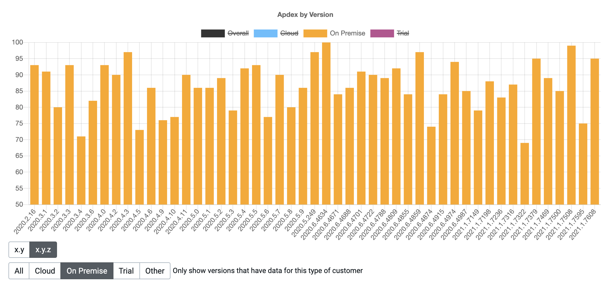
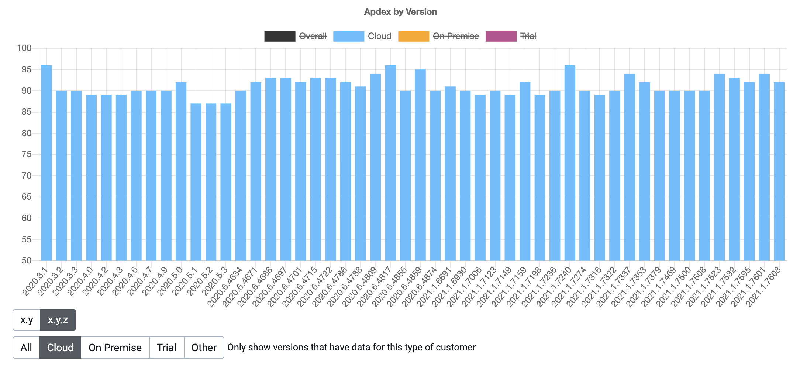
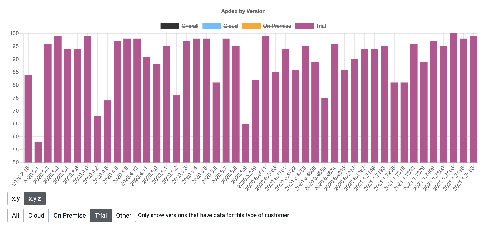

As Octopus Deploy has grown, it now covers a large software surface area. A given user may need to interface with many different touchpoints across Octopus Deploy. These may be viewing the dashboard, signing on through certificates, or viewing the projects page. To serve our customers better, we want to tell whether users accessing these touchpoints receive their content on time.

Telemetry is collecting usage statistics and forwarding them to IT systems where they for analysis. Many software companies use it to gather data on how their customers use and experience their products. Octopus Deploy has implemented a telemetry tool named Crow's Nest. Crow's Nest tracks how quickly customers receive web requests. Telemetry is opt-in by default unless users choose to opt-out. 

The Crow's Nest symbolizes a tool with a high-level overview of how users are experiencing the product. A web request triggers when a customer wants to visit a page or poll an endpoint. These requests get tracked over several versions. 

Only web requests with a 2xx status are in the calculations. A 2xx status indicates a successful web request. Versions with less than 50 instances sending telemetry on any given data get filtered out to remove outliers. The response times of these web requests estimate how satisfied a customer is with their service. 

### Apdex

Apdex (Application Performance Index) aims to convert measurements into insights about user satisfaction. The formula is:

    Apdex = (SatisfiedCount + ToleratingCount * 0.5) / TotalCount
 
Unless in a more specific context (e.g., on individual data records or group of records), the Apdex is calculated using:

- API (Web) Requests that return a 2xx response
- Excluding certain requests that are called often and are cached (e.g., ServerStatus)
- A Satisfied Threshold of <= 50ms
- A Tolerating Threshold of > 50ms and <= 200ms

Apdex has a range of 0-100. The scale is:
- 94-100: excellent
- 85-94: good
- 70-85: fair
- below 70: poor
- below 50: unacceptable

Apdex gives a uniform scale to test the customer experience. A higher number indicates a more positive user experience.  Admin users can vary thresholds to experiment with Apdex scores given a specific appetite for tolerance. The examples in this blog display the default threshold values. These are configurable in real-time in the application to view Apdex scores against different criteria.
 
## Visualizing Apdex and Octopus Deploy

There are several ways to visualize Apdex. The following graphs are how we use Crow's Nest to display Apdex and gain valuable insights.

### Apdex for cloud and deploy

The blue line shows the Apdex performance of recent versions in Octopus Cloud and the deployment server. The cloud Apdex performance has been consistent at around 90 for this period. The deployment server is the internal Octopus instance not released to customers. The orange graph indicates a significant dip in Apdex from 2021.2.2048, where it recovered in 2021.2.4155. Octopus Deploy has fixed the causes of this crash and recovery. It can be helpful to look back and see how different versions affected the user experience. If there is any significant dip in performance, admin users can conduct a root cause analysis to identify and address causes.

### Apdex by version and license

This set of graphs show the Apdex score for different versions and licenses. The licenses are cloud, on-premise, trial, and overall.  The first graph below indicates that the trial subscription suffered a slight dip in Apdex performance. The performance drop was between 2020.3 and 2020.4 and between 2020.5 and 2020.6. On the x.y level, the cloud and on-premise licenses appear to be the most consistent, with the trial license suffers from more dips in performance. Overall, all licenses have Apdex levels around 85 or above, which indicates good performance.

Admin users can filter the Apdex scores at an x.y.z and license level. The orange, blue and purple graphs below show the on-premise, cloud, and trial licenses. The blue graph confirms that the cloud license was the most consistent, maintaining around 90 over many versions. The on-premise license displayed higher peaks along with more frequent dips than the cloud license. The trial license experienced significant dips, which lowered its average Apdex score. The orange and purple graphs indicate that the on-premise and trial licenses have been less consistent than the cloud license. 

An admin user can view these graphs and conduct a usability analysis between the cloud, on-premise, and trial versions. The goal would be to bring up the usability of the on-premise and trial licenses to match the cloud license. The latest results show the overall score above 85 and all licenses are close to one another, which is a good result.

<!--### Apdex customer view

-->

### Apdex overall score

Each customer has an overall Apdex score. Apdex scores below a certain level prompt engineers to fix any faults causing the poor score.

### Apdex routes

Every web request has an endpoint. The endpoint is the subject of the request. The path to fulfilling these requests are routes. The performance of individual routes can are in the customer's view. The view shows metrics such as the mean, median and highest value of a request. Admin users can use these metrics to identify the worst-performing routes in a later version.

#### Apdex route difference

Admin users can use Crow's Nest to view the differences in routes across different versions. The project routes improved between 2020.6 and 2021.1, as indicated by the green difference indicators for the Apdex score.

#### Apdex route view

Historical performance is visible on every route. This is useful when assessing whether updated versions of Octopus Deploy have improved or worsened the route. The performance of the certificates route above degraded from 2020.2 to 2020.6. The Apdex score decreased from 62 to 16. In 2021.1, this route improved, leading to an Apdex score of 77.

#### Future improvements

There have been several improvements to poor-performing routes over many versions. Through the Crow's Nest tool, we are aware of routes that still need more work. The dashboard route below currently has an average response time of 786ms. The Apdex score of 22 shows that it is not where we want to be. Other routes fall into this category, such as the progression and infrastructure/summary route. We aim to improve the Apdex scores of all underperforming routes in later releases. 

Telemetry is a powerful tool that can enable businesses to gain a complete picture of user experiences. Telemetry and Apdex give full visibility of each user and the performance of each route. Administrators can compare performance across different versions and licenses. Comparing versions quantifies the effect of each update. Poor-performing routes are visible on a per-user basis or across the Octopus Deploy platform. Our Crow's Nest tool helps to improve the customer experience, leading to customer satisfaction.

