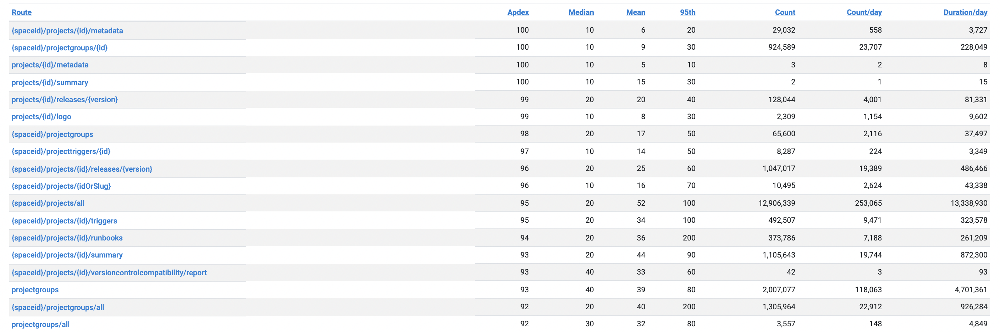
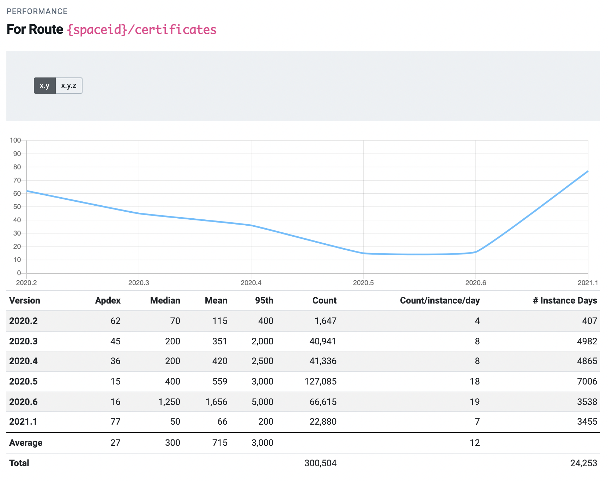

As Octopus Deploy has grown, it now covers a large surface area. A given user may need to use different features across Octopus Deploy. These may be viewing the dashboard, creating or deploying releases, authoring projects or running runbooks against their infrastructure. To serve our customers better, we want to tell whether users receive a fast and responsive experience.

Octopus Deploy, like many software companies, collect telemetry to measure how customers experience the product. Some of the telemetry we collect is the timing of API calls and database operations, which we call 'Performance Telemetry'. We surface this telemetry in our engineering dashboard (code named Crow's Nest).

Crow's Nest provides us with a high-level overview of how users are experiencing the product. A web request triggers when a customer wants to visit a page or poll an endpoint. These requests get tracked over several versions. 

## Apdex

Apdex (Application Performance Index) aims to convert measurements into insights about user satisfaction. The formula is:

    Apdex = (SatisfiedCount + ToleratingCount * 0.5) / TotalCount
 
Unless in a more specific context (e.g., on individual data records or group of records), the Apdex is calculated using:

- API (Web) Requests that return a 2xx response
- Excluding certain requests that are called often and are cached (e.g., ServerStatus)
- A Satisfied Threshold of <= 50ms
- A Tolerating Threshold of > 50ms and <= 200ms

Apdex gives a uniform scale to test the customer experience. A higher number indicates a more positive user experience.  We can vary thresholds to experiment with Apdex scores given a specific appetite for tolerance. The examples in this blog display the default threshold values. These are configurable in real-time in the application to view Apdex scores against different criteria.
 Only web requests with a 2xx status are in the calculations. A 2xx status indicates a successful web request. Versions with less than 50 instances sending telemetry on any given data get filtered out to remove outliers. The response times of these web requests estimate how satisfied a customer is with their service. 
## Visualizing Apdex and Octopus Deploy

There are several ways to visualize Apdex. The following graphs are how we use Crow's Nest to display Apdex and gain valuable insights.

### Apdex for cloud and deploy

The blue line shows the Apdex performance of recent versions in Octopus Cloud and the deployment server. The cloud Apdex performance has been consistent at around 90 for this period. The deployment server is the internal Octopus instance not released to customers. The orange graph indicates a significant dip in Apdex from 2021.2.2048, where it recovered in 2021.2.4155 as we fixed the regressions. It can be helpful to look back and see how different versions affected the user experience. If there is any significant dip in performance, we can conduct a root cause analysis to identify and address causes.

### Apdex by version and license

We can compare the Apdex score for different versions and licenses. The licenses are cloud, on-premise, trial, and overall. There is a lot of variability in these numbers as they are representative of all customers. 

<!--### Apdex customer view

-->

### Apdex overall score

Each customer has an overall Apdex score. This score gives an indication of the responsiveness of the customer experience.

### Apdex routes

The performance of individual routes can are in the customer's view. We time web request and group the results on the route (path). From these timings we show the mean, median and 95th percentile time. By bucketing the requests by route, we avoid sending up huge amounts of data. We can use these metrics to identify the worst-performing routes in a later version. 

#### Apdex route difference

We can use Crow's Nest to view the differences in routes across different versions. The project routes improved between 2020.6 and 2021.1, as indicated by the green difference indicators for the Apdex score.

#### Apdex route view

Historical performance is visible on every route. This allows us to see how the performance of a route has changed in each release. For example, the performance of the certificates route above degraded from 2020.2 to 2020.6. The Apdex score decreased from 62 to 16. In 2021.1, this cause of this slowness was resolved, leading to an Apdex score of 77.

#### Future improvements

We have found that this tool helps us plan on what to work on next. It highlights the areas that need the most attention and should be addressed first. Also it gives us another signal when monitoring our overall application health.

<!---->

Telemetry is a powerful tool that can enable businesses to gain a complete picture of user experiences. Telemetry and Apdex give full visibility of each user and the performance of each route. We can compare performance across different versions and licenses. Comparing versions quantifies the effect of each update. Poor-performing routes are visible on a per-user basis or across the Octopus Deploy platform. Our Crow's Nest tool helps to improve the customer experience, leading to customer satisfaction.

