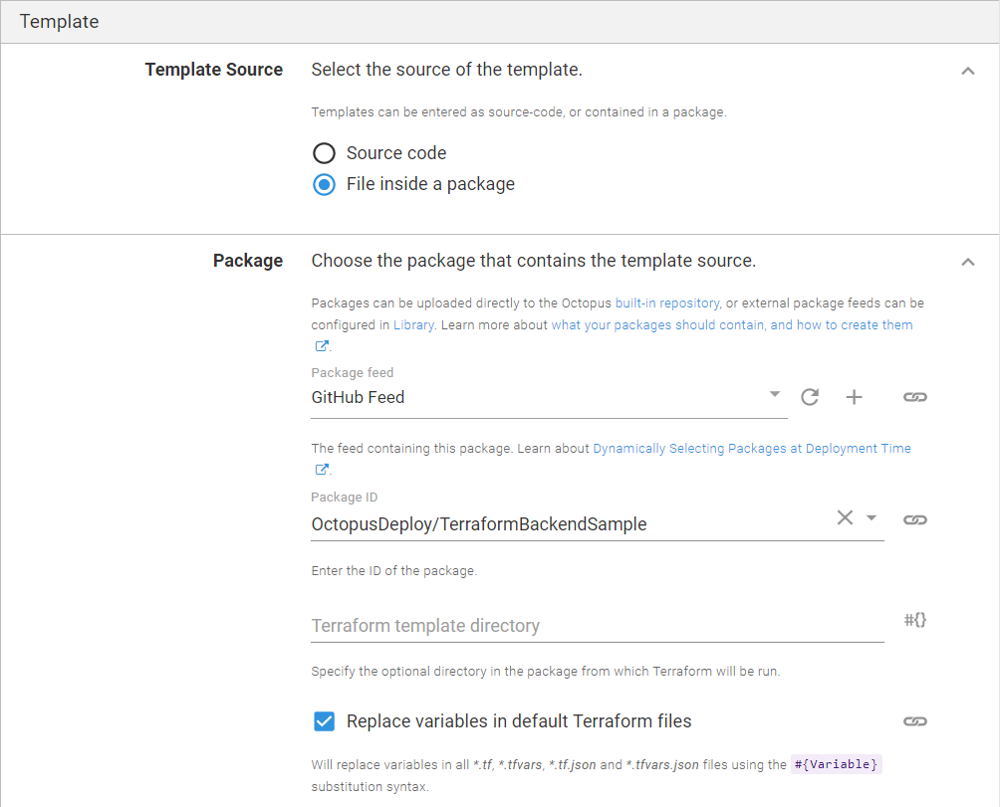
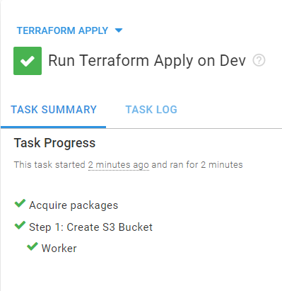

Terraform lets you define infrastructure with code. In this post, I demonstrate how to use a GitHub repository as the source for your Terraform templates and make sure they're version controlled. I also explain how to store workspace states in Terraform's own cloud offering.

## Setting the Terraform version

Be careful when running Terraform commands locally and via Octopus from the same workspace, as different versions of Terraform have incompatible state formats. 

If you use Terraform Cloud you can specify the exact version of Terraform you want to use via **{{Settings > General}}**.

You can use the [tfenv tool](https://github.com/tfutils/tfenv) to manage multiple versions of Terraform.

You can also limit CLI versions that can be used with the workspace by specifying `required_version`.

```
terraform {
  required_version = "= 0.13.5"
}
```

See [this GitHub issue](https://github.com/hashicorp/terraform/issues/23290) for more details.

## Creating a new workspace in Terraform Cloud

First, you need to create a workspace that will serve as your project's back-end at [app.terraform.io](https://app.terraform.io/). 

Create an account, if you don't have one yet.

In the workspace wizard:

- Choose **CLI-driven workflow** - as Octopus's Terraform steps are executed using the CLI.
- Change the Terraform version in the top right corner to the version of the CLI shipped with Octopus (0.11.15 at the time of this post, or check [in GitHub](https://github.com/OctopusDeploy/Octopus.Dependencies.TerraformCLI/blob/master/build.cake#L32)). You can use a different version of Terraform either by supplying a full path to a custom Terraform CLI executable (via `Octopus.Action.Terraform.CustomTerraformExecutable` variable) or by running the step inside a [custom Docker container](https://octopus.com/docs/projects/steps/execution-containers-for-workers).


## Creating an external feed

Next, you need to configure Octopus Deploy to use your GitHub repository as a [package feed](https://octopus.com/docs/packaging-applications/package-repositories/github-feeds).  


## GitHub repository

For this post, I created a [sample repository](https://github.com/OctopusDeploy/TerraformBackendSample) that you can easily fork for your project. 

There are four files in the repository. You can structure these files differently; but ensure your project and back-end variables are kept as separate files.

Remember, only commits with tags are available in the feed, so add a tag to your repository.

**1.** **main.tf** - Here you specify global Terraform options, such as back-end options and the workspace you want to use.

```
terraform {
  backend "remote" {
    organization = "octopus-deploy"
    workspaces {
      name = "egorp-test-workspace"
    }
  }
}

variable "aws_access_key" {
  type = string
}

variable "aws_secret_key" {
  type = string
}

provider "aws" {
  region     = "us-east-1"
  access_key = var.aws_access_key
  secret_key = var.aws_secret_key
}
```

**2.** **buckets.tf** - For this example, create an empty S3 bucket.

```
variable "bucket_name" {
  description = "the bucket name to use"
}

resource "aws_s3_bucket" "mybucket" {
  bucket = var.bucket_name
  force_destroy = true
  acl    = "private"
  tags = {
      Name        = var.bucket_name
      Environment = "Dev"
  }
  cors_rule {
    allowed_headers = ["*"]
    allowed_methods = ["GET","PUT","HEAD","DELETE","POST"]
    allowed_origins = ["*"]
    max_age_seconds = 3000
  }
}
```

**3.** **terraform.auto.tfvars** - Here you store variables used in other files. Octopus will perform [variable substitutions](https://octopus.com/docs/projects/variables/variable-substitutions) before using the file. 

Note that this file must have the extension `.auto.tfvars` otherwise it won't be used by the remote back-end.

``` 
bucket_name = "#{BucketName}"
aws_access_key = "#{AWS Account.AccessKey}"
aws_secret_key = "#{AWS Account.SecretKey}"
```

**4.** **backend.tfvars** - This file is supplied to the `-backend-config` parameter of the `terraform init` command. This allows you to store sensitive variables securely instead of having these values in the repository directly.

```
token = "#{TerrraformCloudRemoteToken}"
```

Your workspace should now look like this:


Next, configure the **Apply a Terraform template** step to use our GitHub repository and perform the necessary variable substitution, providing you with the remote token and the bucket name.

The workspace is now stored in Terraform Cloud, so you can use it by invoking the Terraform CLI manually and as part of your deployment process in Octopus Deploy. 

Terraform will keep track of the [workspace state](https://www.terraform.io/docs/language/state/index.html) and ensure your local state matches the real infrastructure.

## Adding an AWS account

Navigate to **{{Infrastructure > Accounts}}** and add your AWS account key and secret.


## Adding variables
Now navigate to **Variables** on the left and add the two variables that you defined in your `.tfvars` files:

- **AWS Account**: Select the **Value** field, and **change type** to **AWS Account**, then select the account you have added to the **Infrastructure** tab.
- **BucketName**: The desired name of your S3 bucket (if you click **Open editor** and tick **Prompt for value**, the value will have to be entered manually on every runbook run).
- **TerrraformCloudRemoteToken**: Change type to **Sensitive** and paste in the secret token for your Terraform Cloud workspace.


## Creating a runbook

Infrastructure activities are often defined as [runbooks](https://octopus.com/docs/runbooks). This post assumes you're familiar with creating [projects](https://octopus.com/docs/projects) in Octopus, so I'll skip that part.  

1. Create a runbook for your project. I called mine `Terraform Apply`.
1. Add a **Apply a Terraform template** step to your process.

This step template is large, so I'll cover the minimum components to get this working.

### Managed accounts
- **Enable AWS account integration**: Select **Yes**.
- **Execute using the AWS service role for an EC2 instance**: Select **No**.
- **Select Account variable**: Pick the account variable you created in the previous section.
- **Region**: Type in the AWS region that will be used by default, in my case it's `us-east-1`.


### Template section
Select **File inside a package** as the template source, and fill in the following:

- **Package feed**: Select the GitHub feed you created in the first step.
- **Package ID**: Type in your repository address, in my case it's `OctopusDeploy/TerraformBackendSample`.



The rest can be left with the default values.

### Advanced options
Expand the **Terraform Options** and specify the following:

- **Custom terraform init parameters**: `-backend-config=backend.tfvars`


Click **RUN** to run the runbook in the environment of your choice.



You can find the URL for your Terraform Cloud run in the logs of the Terraform Step.


You have now completed your deployment using a shared remote back-end. You can collaborate on the same workspace and allow Terraform to manage the state of your infrastructure automatically.

## Conclusion

In this post I demonstrated how to use Terraform Cloud back-end for your Terraform workspace within Octopus Deploy.

Happy deployments!
