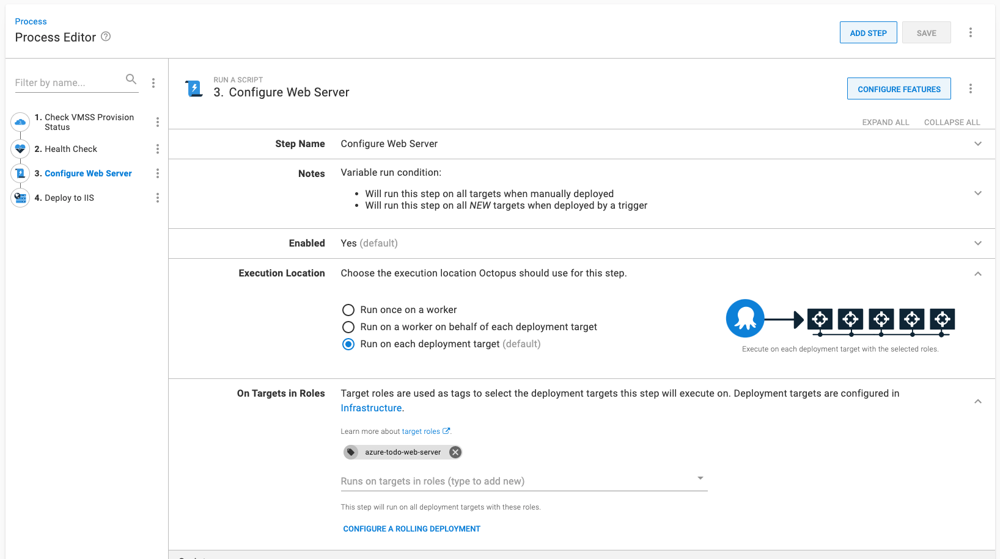
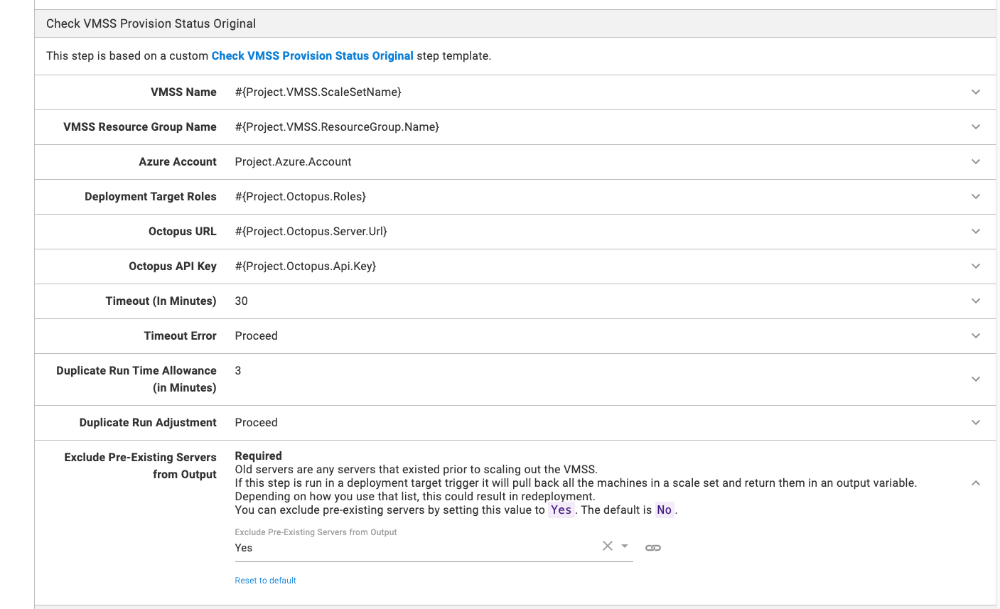
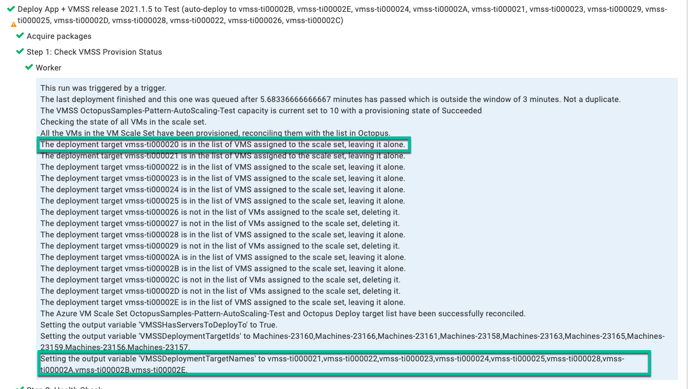
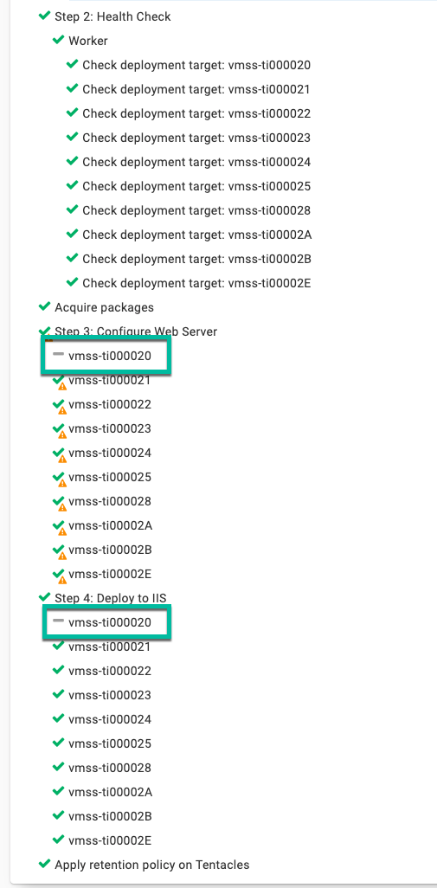
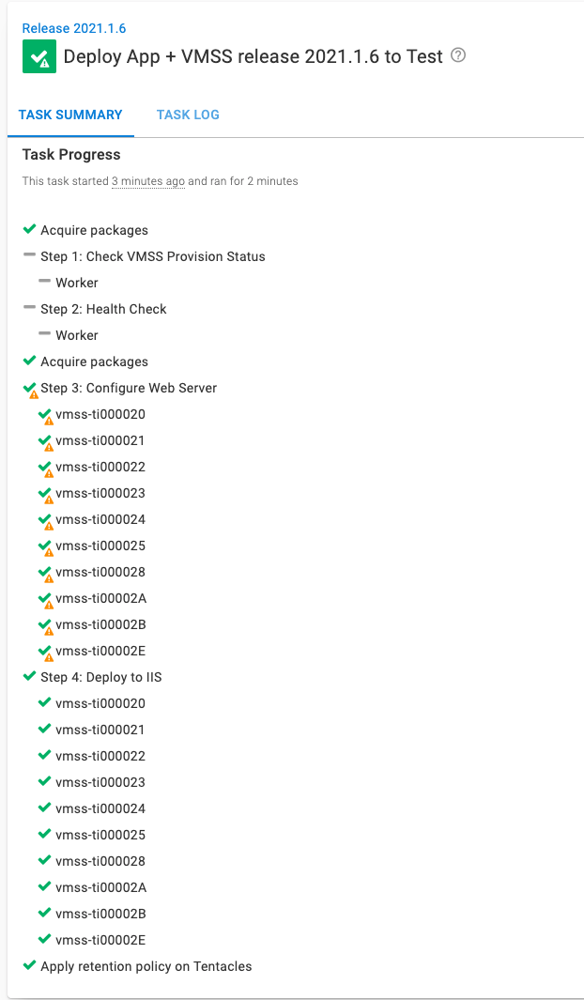
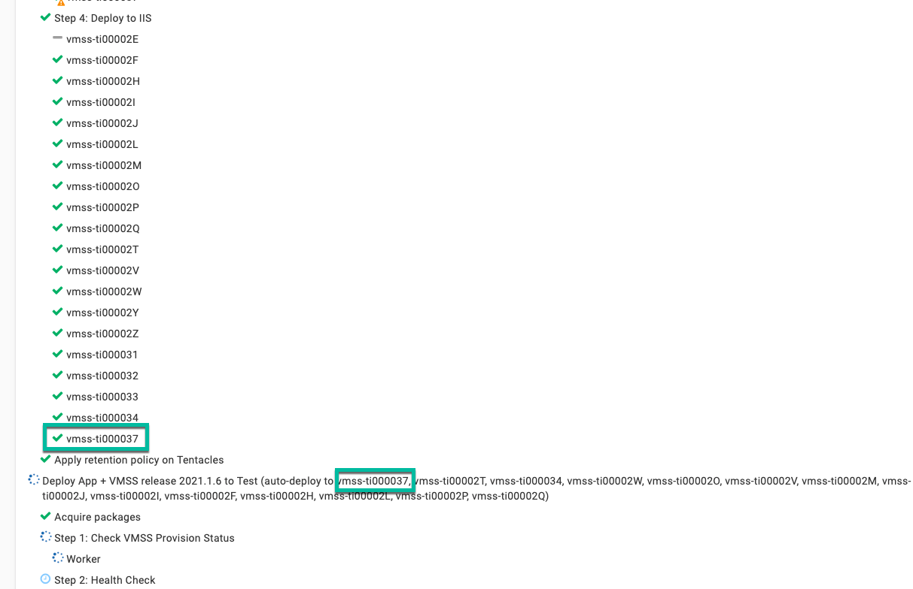
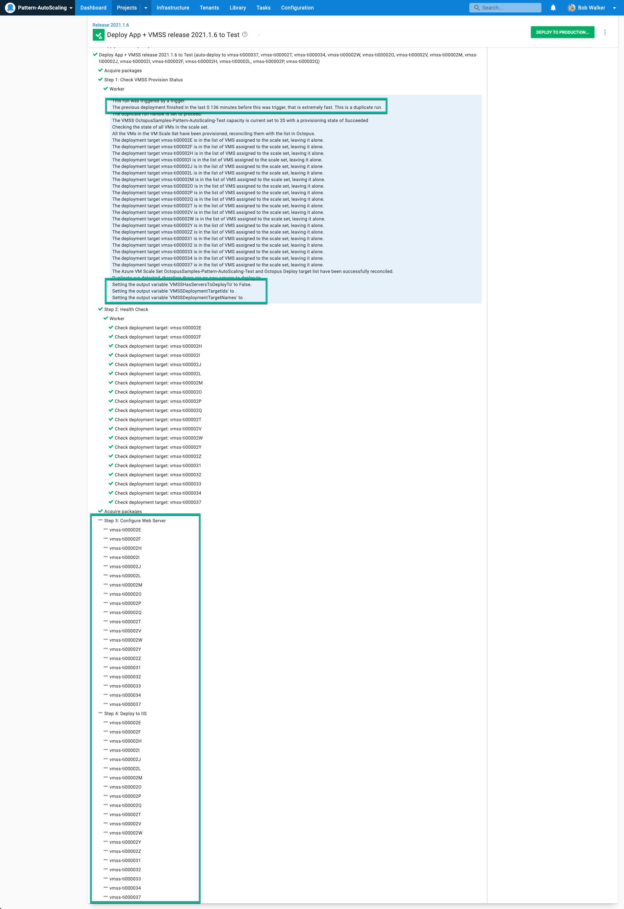

One feature of Octopus Deploy I overuse is [variable run conditions](https://octopus.com/docs/projects/steps/conditions#variable-expressions).  Variable run conditions allow you to skip steps based on business logic.  When combined with [output variables](https://octopus.com/docs/projects/variables/output-variables), they are a powerful tool.  In 2021.2, the filters `Match` and `Contains` [were added to Octostache](https://octopus.com/docs/projects/variables/variable-filters#VariableSubstitutionSyntax-ComparisonFilters).  In this post, I will walk you through how to combine variable run conditions with output variables and the new `Contains` filter.

## The Scenario

I've been helping one of our customers leverage Octopus Deploy with [Azure Virtual Machine Scale Sets](https://docs.microsoft.com/en-us/azure/virtual-machine-scale-sets/overview).  Virtual machines can be added or removed via a schedule or based on metrics.  An example of a metric-based rule would be if CPU usage is 60% for 10 minutes, then add more virtual machines.  

For our customer's scenario, the items to note are:

- At night, they scale down the number of virtual machines in the scale set.
- In the morning, they add 10+ virtual machines to the scale set.
- They use a standard image, but each application installs and configures additional back-end software (IIS, MSMQ, .NET, etc.).

The customer leverages [deployment target triggers](https://octopus.com/docs/projects/project-triggers/deployment-target-triggers) to trigger a deployment when a new deployment target is added.

## The Problem To Solve

At 50,000 feet, everything looks great and works as it should, but we see a timing problem when we zoom in.

- The virtual machine scale set can't and won't finish provisioning all virtual machines simultaneously.
- Octopus Deploy is unaware of virtual machine scale sets; it will grab a batch of new deployment targets and do the deployment.
- It takes 30+ minutes for each application to finish installing and configuring back-end software.
- By default, Azure Virtual Machine Scale Sets have overprovisioning enabled.  Ask for ten additional Virtual Machines, and you'll see 14 initially created.  Once ten virtual machines are successfully running, the additional four are deleted.  But those four have registered themselves with Octopus Deploy.

Each morning, scaling out the number of virtual machines takes 2x-3x longer than it should.  For example, they increase their virtual machine count from 5 to 25.  They see this happen:

1. Azure creates 27 new virtual machines (instead of 20) and starts the provisioning process.  
2. The virtual machines come online and register themselves with Octopus Deploy in a scattershot fashion.
3. The deployment target trigger in Octopus Deploy selects five to eight virtual machines and starts the deployment.
4. The deployment starts installing additional software.
5. 90-180 seconds later, the remaining virtual machines finish provisioning.
6. Azure removes the additional seven virtual machines.
7. That first deployment slows down because one of those seven virtual machines was in the first batch.  The slowdown is because Octopus is waiting for a timeout to occur.
8. The first deployment finishes 30 minutes later.
9. The deployment target trigger picks up the remaining machines.
10. The second deployment finishes over an hour after the virtual machines were added to the virtual machine scale set.

Because of that, the customer starts the scale-out much earlier in the morning.  They need to ensure there are enough virtual machines for the start of the business day.

## Solution Requirements

Waiting over an hour is not acceptable.  While schedules can be tweaked, there is still the problem of scaling because of an unexpected load.  At this point, that is when the customer reached out with the question:

> How hard is it to configure Octopus to pause a deployment while a virtual machine scale set finishes provisioning all the new virtual machines?

After a discussion, we landed on these requirements:

- Octopus should pause and wait for the virtual machine scale set to finish provisioning.
- All the new virtual machines should be configured and deployed at the same time.
- All the existing virtual machines should be skipped.
- A single deployment process should handle both manual deployments and deployments created by the deployment target trigger.

## The solution

With those requirements in hand, I set out to craft a solution that would solve this problem.  I knew it would use the new [Check VMSS Provision Status](https://library.octopus.com/step-templates/e04c5cd8-0982-44b8-9cae-0a4b43676adc/actiontemplate-check-vmss-provision-status-(deployment-targets)) step template (I'd hope so, I wrote it to help solve this customer's problem), the [Health Check Step](https://octopus.com/docs/projects/built-in-step-templates/health-check), and a [variable run condition](https://octopus.com/docs/projects/steps/conditions#variable-expressions).

The simplified deployment process is:

1. Check VMSS Provision Status -> only run when a deployment target causes the deployment.
2. Health Check Step -> only run when a deployment target causes the deployment.
3. Configure server
4. Deploy the application


All the steps in this deployment process use a variable run condition.  Steps 1 and 2 only need to run when a deployment target trigger causes the deployment.  I'll get to steps 3 and 4 in the next section.

```
#{unless Octopus.Deployment.Error}#{if Octopus.Deployment.Trigger.Name}True#{/if}#{/unless}
```

### Check VMSS Provision Status

Check VMSS Provision Status is a new step template with the following functionality:

- It will wait until the VMSS finishes provisioning all the virtual machines in the scale set.
- After the VMSS finishes provisioning, it will reconcile the list of virtual machines in the scale set with Octopus Deploy.  Any additional deployment target registrations will be removed.
- Set output variables containing machine names, machine ids, and a boolean value indicating if new deployment targets were added.

Add that step to the top of the deployment process.


Don't forget to set the run condition to the value from earlier!

### Health Check Step

The health check step will add all the new virtual machines to the deployment.  The health check step is how we will deploy to _all_ new virtual machines added to the scale set, not just the ones that caused the deployment target trigger to fire.

Set the following options:

- On Targets in Roles: the same role as the deployment targets.
- Health Check Type: perform a connection-only test (the initial health check done by the machine policy took care of the full health check, no need to do it again).
- Health Check Errors: skip the deployment targets that are unavailable.
- New Deployment Targets: Include new deployment targets in the deployment.


## Skipping Existing Virtual Machines

The health check step will add _all_ the virtual machines in the scale set to the deployment.  That is a problem, as one requirement is that all existing virtual machines should be skipped during the deployment.  In a nutshell, this is what would happen:

1. The number of virtual machines in the virtual machine scale set is increased from 5 to 25.
2. Deployment target trigger would see seven new deployment targets and start a deployment.
3. The check VMSS provision status step would wait until the remaining 13 deployment targets were added.
4. The health check step would add in the new 15 deployment targets AND the pre-existing five deployment targets.

The health check step increased the number of deployment targets for the trigger from 7 to 25, rather than 20 (the number of new virtual machines).  I needed a way to skip 5 of those deployment targets.

One of the little-known facts about variable run conditions is that they will run for each deployment target when a step is configured to execute on a role.



That means that when I have 25 deployment targets, it will run the variable run condition 25 times!  Anytime the variable run condition returns `False,` it will skip that deployment target.  

:::hint
The same holds for parent/child steps or rolling deployments.  I wanted to keep this post simple, so rolling deployments was outside the scope of this article.
:::

Getting the deployment target ID is trivial; use `#{Octopus.Machine.Id}`.  What I need is a list of _new_ virtual machines to compare that ID with.

That is where the [Check VMSS Provision Status](https://library.octopus.com/step-templates/e04c5cd8-0982-44b8-9cae-0a4b43676adc/actiontemplate-check-vmss-provision-status-(deployment-targets)) step template comes in.  If you recall, it creates an output variable containing a list of all the deployment target Ids added to the virtual machine scale set.



In this example run, the virtual machine `vmss-ti000020` already existed, as you can see, it excluded that from the output variable.



Now I have a list of newly created deployment targets AND the specific deployment target to deploy to.  The last piece of the puzzle is a variable run condition.  This is where the new `Contains` [variable filter comes in](https://octopus.com/docs/projects/variables/variable-filters#VariableSubstitutionSyntax-ComparisonFilters).  The `Contains` filter does what it says on the tin; it checks to see if one string contains another string.  `Match` works the same way, but it uses regular expressions.  With my use case, a regular expression is overkill.

Here is the run condition in full.

```
#{unless Octopus.Deployment.Error}
    #{if Octopus.Deployment.Trigger.Name}
        #{Octopus.Action[Check VMSS Provision Status].Output.VMSSDeploymentTargetIds | Contains #{Octopus.Machine.Id} }
     #{else}
        True
     #{/if}
#{/unless}
```

What that run condition is saying is:

1. If there is an error, then don't run this step.
2. When doing a manual deployment, then deploy to all deployment targets
3. When a trigger caused the deployment, then check to see if the current deployment target is in the output variable from the step template.  If it is not, then skip that deployment target.

Continuing on from the previous screenshot, we can see that `vmss-ti000020` was skipped.



Manual deployments will skip steps 1 and 2 and run steps 3 and 4 on all deployment targets.



## One final gotcha

In some of my practice deployments, I noticed that the deployment target trigger would run a second deployment within a minute of finishing the first deployment.  That happened despite the fact that the previous deployment deployed to all the machines.  



That can be problematic; the last thing you'd want is to redeploy and cause an outage.  Thankfully the [Check VMSS Provision Status](https://library.octopus.com/step-templates/e04c5cd8-0982-44b8-9cae-0a4b43676adc/actiontemplate-check-vmss-provision-status-(deployment-targets)) handles that.  It can detect a duplicate run by calculating the difference between the queue time of the current deployment minus the finish time of the previous deployment.  If that difference is less than three minutes, it is a duplicate run.  You can configure the step template to cancel the current deployment or let it proceed.

But that isn't needed!  We configured the step earlier to remove pre-existing machines.  A pre-existing deployment target is one that existed 3 minutes before the trigger fired.  Unless your deployments take less than three minutes, all the existing deployment targets from the first run will be excluded.  



Our pre-existing combination of the new variable filters combined with output variables and run conditions handled this scenario without additional configuration.  For you, it might be a moot point.  That tended to happen when I added more than ten virtual machines to a virtual machine scale set in my testing.  

## Wrapping Up

As you can see, when you combine Octostache, Output Variables, and Run Conditions, you can get a robust deployment process.  The addition of the `Contains` and `Match` filters in Octostache has made that combination even more powerful.  Instead of doing index matching or looping, we can use easier to maintain `Contains` comparisons.

If you have any questions on how to combine all three in your deployment process, reach out to the Customer Solutions team at [advice@octopus.com](mailto:advice@octopus.com).  We'd love to help!

Until next time, happy (complex) deployments!