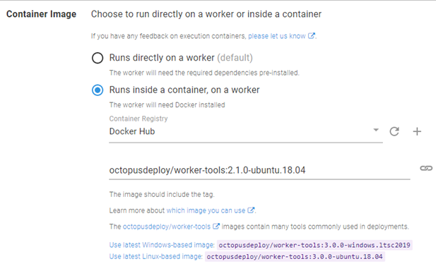
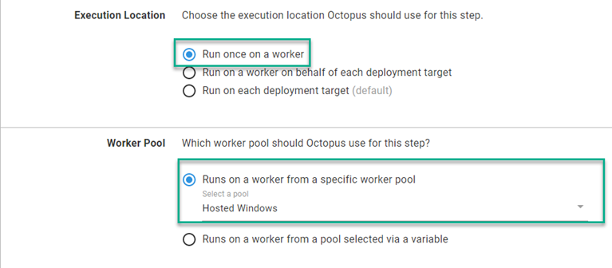
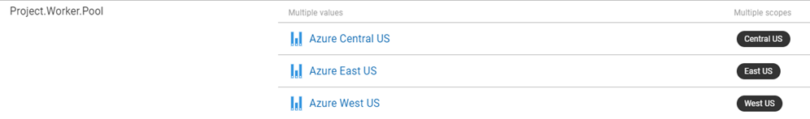
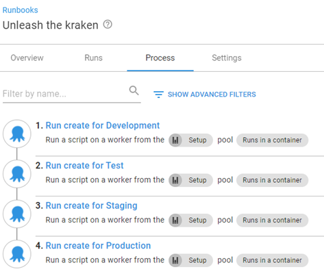
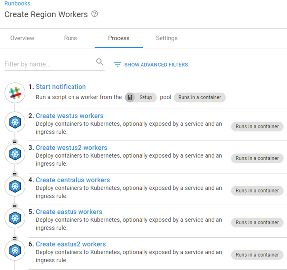
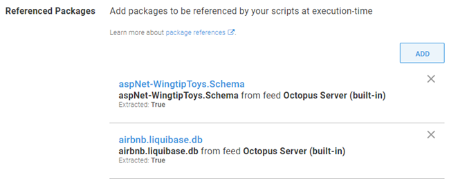

In the early days of Octopus Deploy, as the product evolved, increasing demands were being made on the server it was installed on.  Any step that didn't execute directly on a [target](https://octopus.com/docs/infrastructure/deployment-targets) was executed on the server itself.  

To address the growing list of tasks executing directly on the server, we created the concept of Workers.  

In this post, I address common questions about Workers and how they operate.

## What exactly is a Worker?
In essence, a Worker is a Tentacle.  It runs the same Tentacle software as a deployment target, however it's registered with the server in Worker Pools.  Worker Pools are a collection of Worker Machines.

### If a Worker is a Tentacle, does it count as a target for licensing?
Despite running the Tentacle software, Workers are viewed as an extension of the Octopus Server, therefore not counted as targets.  

Under the current licensing model, there's no limit to how many Worker Machines you can have.

## What is the Built-in Worker?
All Octopus instances come with a **Default Worker Pool** defined.  Any step that selects the **Default Worker Pool** executes on the Built-in Worker, which is the Octopus Server.  If, however, a Worker Machine is added to the **Default Worker Pool**, the Built-in Worker is no longer used.

## What can a Worker be used for?
Workers can be used with steps that don't _need_ to be executed on a target.  The most common use cases are:

- Database deployments 
- API or Web service calls
- Running scripts
- Kubernetes deployments

### Database deployments
Deploying database updates only requires a connection string to the database server and database you're working with.  Workers help perform database deployments without having to install additional software on the database server.

### API or Web service calls
Workers are perfect for calling an API, or a Web service that doesn’t need a target to run on. Examples include:

- Slack notifications
- Microsoft Teams messages
- Deploying SQL Server Reporting Services reports

### Running scripts
Running scripts is another use case for Workers.  Process intensive operations can be offloaded to run on a Worker instead of slowing down the Octopus Server.

### Kubernetes deployments
Kubernetes (K8s) targets are the only target type that require Workers. 

Workers for K8s targets require that the `kubectl` CLI is installed.  For this reason, you have the ability to select a Worker Pool to use during health check operations on the K8s target screen.  

Kubernetes deployments interact with an API, providing instructions to the K8s cluster rather than deploying files directly to it.  This makes a perfect use case for Workers.

## Advantages of using Workers
Workers offer two major advantages:

- Offload processes from the Octopus Server
- Ability to run customized software

### Offload processes from the Octopus Server
Long running or intensive processes can hinder performance of the Octopus Server.  These tasks can be offloaded to a Worker Machine, freeing resources and allowing the Octopus Server to perform optimally.

### Customized software
The bundled software that ships with Octopus might not include everything you need for a process.  With a Worker, you can install custom software packages to aid your deployment or runbook process.

:::info
If the Worker has Docker installed, it can use the [execution containers](https://octopus.com/docs/projects/steps/execution-containers-for-workers) feature for customized containers versus installing software directly on the Worker.
:::



## How do I specify a step to use a Worker?
When defining a step in a [Runbook](https://octopus.com/docs/runbooks) or [Project Deployment Process](https://octopus.com/docs/projects/deployment-process), you can tell Octopus that this step runs on a Worker and select a pool.



### Worker Pool variable
You might have noticed there's a second selection for the **Worker Pool** section, **Runs on a Worker from a pool selected via a variable**.  We created the [Worker Pool variable](https://octopus.com/docs/projects/variables/worker-pool-variables) for when you need a different Worker Pool for different situations, such as environments.  

Some people have security segregated so that Workers in Development are not allowed to touch resources in Test.  Using a Worker Pool variable, you can scope pools to environments or even [Tenant Tags](https://octopus.com/docs/deployments/patterns/multi-tenant-deployments/tenant-tags) denoting things like specific Azure regions.



## How do Workers execute differently from targets?
If you attempt to execute two deployments against the same target machine, you may notice the deployments seem to bounce back and forth between the tasks, executing one step at a time.  This behavior was designed to protect the target from multiple deployments attempting to update the same resource at the same time, such as an IIS metabase.  Workers, on the other hand, are configured to handle multiple tasks simultaneously.

:::hint
Activities such as `Acquire Packages` result in a Worker being locked, and any other deployment/runbook using the same Worker is in a wait state.
:::

## How is a Worker selected from the pool?
Workers are selected from a pool in a round-robin fashion.  It's important to note that Workers are selected at the *beginning* of a deployment or runbook run.  There are caveats to Worker selection that I explain later in this post.

:::info
It's safest to assume that each step is executed by a different Worker in the pool.
:::

Consider the following scenario where Worker Pool `Setup` consists of:

- worker1
- worker2
- worker3

Runbook **Unleash the kraken** calls the runbook `Create AWS RDS` for environments Development, Test, Staging, and Production.



All steps in the process execute sequentially, but are configured not to wait for the runbook to complete before moving on to the next step (see [Run Octopus Deploy Runbook step](https://library.octopus.com/step-templates/0444b0b3-088e-4689-b755-112d1360ffe3/actiontemplate-run-octopus-deploy-runbook) for details).  Worker selection would be as follows:

```
Unleash the kraken
|
+-- worker1
|    |
     Create AWS RDS Development
     |
     +-- worker1
     |
     Create AWS RDS Test
     |
     +-- worker2
     |
     Create AWS RDS Staging
     |
     +-- worker3
     |
     Create AWS RDS Production
     |
     +-- worker1
```
### Worker selection caveats
There are scenarios which can affect how Octopus selects Workers:

- Steps that reference packages
- Package reference ordering
- Manual interventions

#### Steps that reference packages
Any step that uses the same package(s) executes on the same Worker Machine.  For example, runbook **Create Region Workers** deploys the same image to Kubernetes clusters in different Azure regions.  Because steps 2 to 6 use the same package (image), they all use the same Worker.



#### Referenced package ordering
Package reference ordering also affects Worker selection.  For example, if you have two steps that reference the same packages in the same order, Octopus runs both steps on the same Worker.


However, if the ordering of the packages is different, Octopus selects different Workers for each step.



#### Manual intervention
When a [Manual Intervention](https://octopus.com/docs/projects/built-in-step-templates/manual-intervention-and-approvals) step is encountered, it's removed from the task queue.  After the intervention has been acted on, the task is added back into the queue which forces Worker selection to occur again.

## I'm using Octopus Cloud, how do Dynamic Workers work?
Octopus Deploy maintains a set of Workers (VMs) that you can use on demand as Dynamic Workers.  These Workers are available in the following pools:

- Default Worker Pool (Windows Server 2016)
- Hosted Windows (Windows Server 2019`*`)
- Hosted Ubuntu (Ubuntu 18.04`*`)

`*` Pool can use the Execution Containers feature.

Each cloud instance can lease one Worker per pool, exclusive to that cloud instance.  After the lease expires, the Worker is destroyed (see [this article about Dynamic Workers](https://help.octopus.com/t/how-do-dynamic-workers-work-in-octopus-cloud/25228/2) for time expiration.)  After being destroyed, a new Worker is provisioned and added to the pool of available Workers for cloud instances to lease.

## Conclusion
I hope this post clarifies what Workers are, how they're used and selected.  I certainly learned a lot writing this post.

If you need help or would like to learn more about using Workers, you can contact our customer success team at [customersuccess@octopus.com](mailto:customersuccess@octopus.com). 

Happy deployments!
