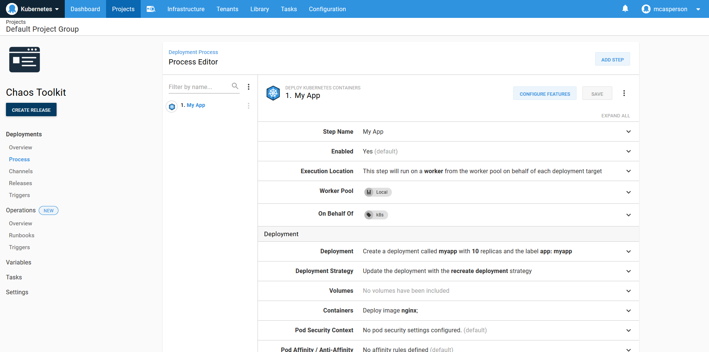
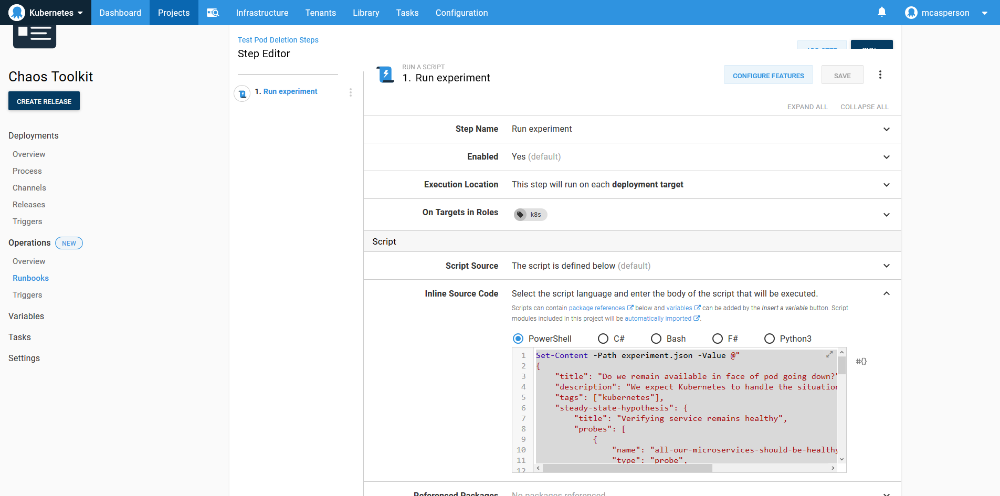
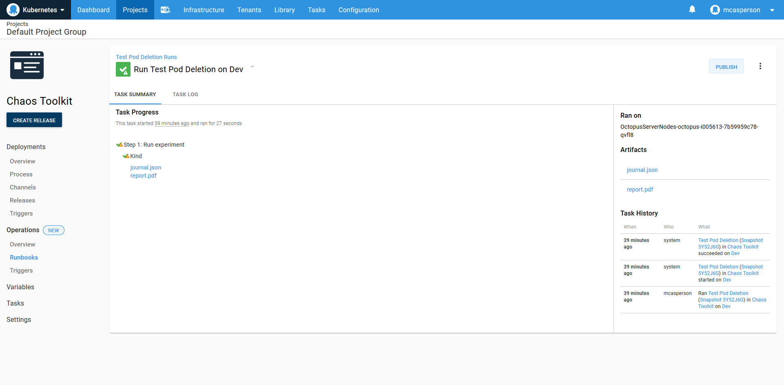
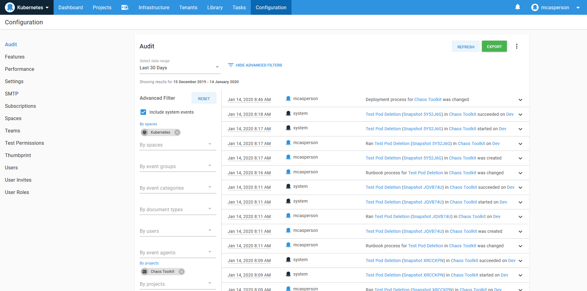
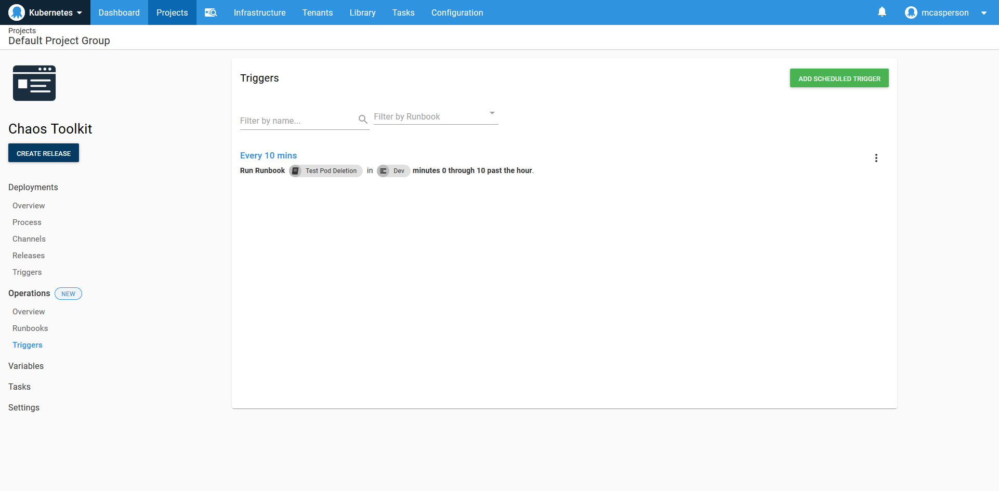

Operations Runbooks in Octopus put the Ops in DevOps. This post is part of a series:

- [Operations Runbooks overview](https://octopus.com/blog/operations-runbooks)
- [DevOps, Runbooks and kubectl](https://octopus.com/blog/devops-runbooks-and-kubectl)
- **Chaos engineering and runbooks**
- [Linting your Kubernetes cluster with Clusterlint and runbooks](https://octopus.com/blog/clusterlint-with-runbooks)

---

:::hint
Octopus 2021 Q3 includes updated support for Kubernetes deployments, and runbooks for Google Cloud, AWS, and Azure users. Learn more in our [release announcement](https://octopus.com/blog/octopus-release-2021-q3).
:::

The promise of declarative systems that automatically reconfigure themselves to a desired state is:

> Most faults caused by stopped or destroyed resources will be rectified without any manual intervention.

Kubernetes is a perfect example of this, as deleted pods in a deployment are recreated as the deployment brings the cluster back to the desired state.

Proving that a system can tolerate the failure of individual components is the essence of chaos engineering. 

In his talk [BoF Deep Dive: Chaos Engineering](https://youtu.be/Qus15C5vT5Y?list=PLj6h78yzYM2PpmMAnvpvsnR4c27wJePh3&t=1447), Sylvain Hellegouarch, the creator of the [Chaos Toolkit](https://chaostoolkit.org/), provides an overview of how to apply chaos engineering to Kubernetes. While the technical details of this talk are valuable, his advice about how and when to run chaos experiments is of most interest to Octopus users (this is 24 minutes into the talk):

> Don’t necessarily tie your chaos engineering to your deployment. Run that part orthogonally.

> You should always have chaos engineering that runs constantly, because the problem with doing [chaos engineering] at rollout is that your system lives between your deployments. It evolves, so keep changing the system as you run.

Until recently, running any kind of automated process in Octopus meant creating a deployment. It was possible to hack the idea of a deployment to implement management tasks, but it was awkward.

With Octopus Runbooks, Octopus now has first-class support for running management tasks in parallel to deployments. Runbooks have access to all the existing environments, variables, targets, steps, security, auditing, and reporting, but without being tied to the concept of a deployment or a lifecycle.

This makes runbooks ideal for running tools like the Chaos Engineering Toolkit. In this post, we create a very simple chaos experiment as a runbook, and call out the advantages runbooks provide for this kind of task.

## The Kubernetes deployment

We start by creating a deployment process that spins up a number of pods on a Kubernetes cluster. This is implemented with the *Deploy Kubernetes containers* step in Octopus. 

In the screenshot below, you can see I created a single deployment that creates 10 NGINX pods.

 

## The chaos runbook example

Alongside the deployment, I also have a runbook that executes a simple Chaos Toolkit experiment, which deletes a pod and ensures that the deployment is healthy using the [microservice_available_and_healthy](https://docs.chaostoolkit.org/drivers/kubernetes/#microservice_available_and_healthy) function.

After the test has completed, a [PDF report](https://docs.chaostoolkit.org/reference/usage/report/) is generated, showing the results of the experiment. The output generated by the **chaos** tool and the report are captured as artifacts.

 ```PowerShell
 Set-Content -Path experiment.json -Value @"
 {
     "title": "Do we remain available in face of pod going down?",
     "description": "We expect Kubernetes to handle the situation gracefully when a pod goes down",
     "tags": ["kubernetes"],
     "steady-state-hypothesis": {
         "title": "Verifying service remains healthy",
         "probes": [
             {
                 "name": "all-our-microservices-should-be-healthy",
                 "type": "probe",
                 "tolerance": true,
                 "provider": {
                     "type": "python",
                     "module": "chaosk8s.probes",
                     "func": "microservice_available_and_healthy",
                     "arguments": {
                         "name": "myapp"
                     }
                 }
             }
         ]
     },
     "method": [
         {
             "type": "action",
             "name": "terminate-db-pod",
             "provider": {
                 "type": "python",
                 "module": "chaosk8s.pod.actions",
                 "func": "terminate_pods",
                 "arguments": {
                     "label_selector": "app=my-app",
                     "name_pattern": "my-app-[0-9]$",
                     "rand": true
                 }
             },
             "pauses": {
                 "after": 5
             }
         }
     ]
 }
 "@
 chaos run experiment.json
 docker run `
     -v "$(Get-Location):/tmp/result" `
     -it `
     chaostoolkit/reporting
 New-OctopusArtifact journal.json
 New-OctopusArtifact report.pdf
 ```



Here is the result of the runbook execution with the output JSON and report PDF available as artifacts:



We have successfully implemented a simple chaos engineering experiment alongside the original deployment. 

So what benefits do runbooks bring to this process?

## Deployments and runbooks side by side

By defining the deployment and the runbook in a single project, we have a single context that captures both the deployment process and any ongoing testing or management of the deployment.

From a convenience point of view, this means there is: 

- A single user interface
- A shared set of variables
- Closely linked overview dashboards
- Consolidated reporting

From a management point of view, there is a single project to configure security rules against and a consolidated audit log.



Runbooks keeps the management tasks you run against deployments alongside the deployments themselves. This makes it easy to run, review and track the state of your infrastructure.

## Shared context

Complex Kubernetes deployments will implement namespaces to keep resources separate, and RBAC controls on service accounts to ensure rogue deployment definitions don’t interfere with the rest of the cluster. When these permission boundaries are represented in Octopus Kubernetes targets, they lend themselves nicely to runbooks by ensuring management tasks are also constrained.

Like almost any CLI tool that operates with Kubernetes, the Chaos Toolkit can access a cluster from the details in a Kubernetes `config` file. Octopus provides a local copy of this configuration file based on the target a deployment or runbook is executing against. So whether a deployment uses a specialized Kubernetes step or a runbook implements a general Kubernetes script, both share a single target that is defined once.

## Independent execution workflows

While sharing the same underlying context, runbooks are executed independently from deployments. Runbooks define their own scheduled triggers, or they can be run manually against any environment without being bound to a lifecycle.

This is ideal for chaos engineering. As Sylvain noted in his talk, chaos experiments should be run continuously between deployments to validate a cluster.

In the screenshot below, the chaos experiment is being run every ten minutes to continuously validate the cluster.



## Conclusion

I was pleasantly surprised at how easy it was to get Chaos Toolkit up and running in Octopus. With a Kubernetes deployment already defined, scripting another tool against the existing targets and environments took very little effort.

Beyond the initial ability to simply execute a tool, Octopus Runbook automation provides cross-cutting functionality like logging, audits, security, user management, reporting, and dashboards out of the box as an established and proven foundation to scale processes like chaos engineering within an organization.

Happy deployments!
