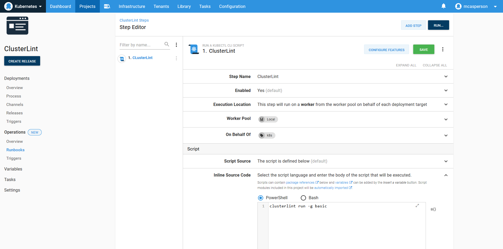
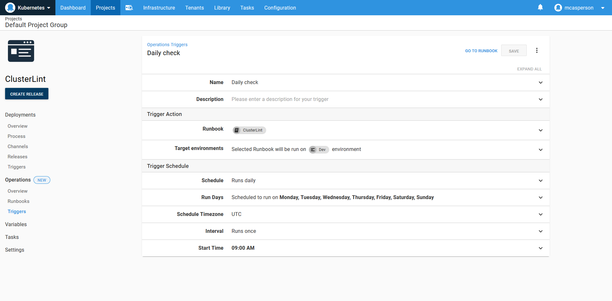
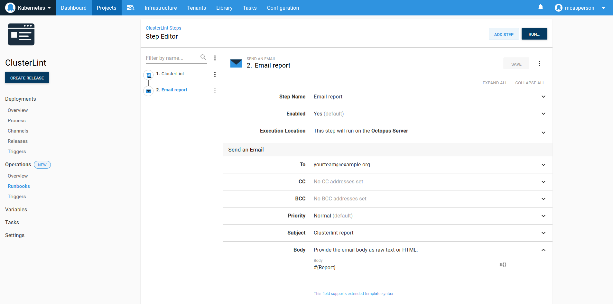
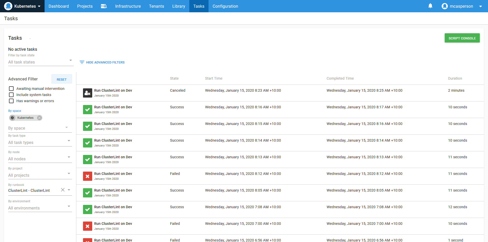

Operations Runbooks in Octopus put the Ops in DevOps. This post is part of a series:

- [Operations Runbooks overview](https://octopus.com/blog/operations-runbooks)
- [DevOps, Runbooks and kubectl](https://octopus.com/blog/devops-runbooks-and-kubectl)
- [Chaos engineering and runbooks](https://octopus.com/blog/chaos-engineering-and-runbooks)
- **Linting your Kubernetes cluster with Clusterlint and runbooks**

---

:::hint
Octopus 2021 Q3 includes updated support for Kubernetes deployments, and runbooks for Google Cloud, AWS, and Azure users. Learn more in our [release announcement](https://octopus.com/blog/octopus-release-2021-q3).
:::

*Kubernetes made the simple things hard and the hard things possible.* This is an apt statement. You only need to look at the number of best practice guides available for Kubernetes and the surrounding ecosystem to understand that running even a single pod *properly* is a daunting task.

This is where linting tools can help. By encapsulating best practices into an automated check of your cluster, a linting tool can highlight improvements you may not be aware of and create a feedback loop for improving your infrastructure.

One such linting tool is [Clusterlint](https://github.com/digitalocean/clusterlint). It's developed by DigitalOcean, and integrated into their hosted Kubernetes offering, reducing support load by identifying issues before operations like cluster updates. However, most of the checks are generally applicable to any cluster.

## A lint feedback loop

A question to ask when implementing a linting tool is whether it should target a subset, for example, just a single deployment, or the entire cluster. If you target the results of a single deployment, it makes sense to include a lint check as part of the deployment process.

However, I would caution against baking linting into a deployment process too early. Coming from a development background, I’ve seen global code linting implementations fail every time because they generate too many false positives, have opinions that are not shared by the development team, and are ultimately ignored or implemented in an ad-hoc fashion because they get in the way.

A better solution is to implement linting outside of the deployment workflow, at least initially. This provides the ability to generate a focused lint ruleset with the most value, and identify issues with configuration that no-one is likely to touch and would be missed by checks only run against active deployments.

So how do you implement a workflow that sits outside of a deployment using Octopus? Until recently, every automated process in Octopus was considered to be a deployment. Now, with the introduction of Operations Runbooks, Octopus has built-in support for running management and maintenance tasks without a deployment.

## A linting runbook example

In the screenshot below, you can see a runbook that calls the `clusterlint` executable.



What is notable about this runbook example is how simple it is. Just one line of code adds an automated check of your Kubernetes cluster.

The runbook is simple because it leverages existing support for Kubernetes in Octopus. The **Run a kubectl Script** step is used to execute `clusterlint` with a `kubectl` config file generated from a Kubernetes target. If you're performing Kubernetes deployments with Octopus, these targets are already configured.

## Scaling beyond a proof of concept

The real benefit of Runbooks is how they provide the foundation for a workflow that scales beyond a proof of concept.

Linting should be automated to run on a regular schedule. Runbooks supports this with a custom trigger:



Lint results don’t mean anything unless they're shared and acted upon. With some scripting we can generate a summary report and capture it in an Octopus variable called `Report`:

```
$emailReport = clusterlint run -g basic -o json |
  ConvertFrom-Json |
  Select -ExpandProperty Diagnostics |
  Group-Object -Property Check -NoElement |
  % {$report="Clusterlint report`n----"} {$report += "`n$($_.Name): $($_.Count)"} {$report}

Write-Host $emailReport

Set-OctopusVariable -name "Report" -value $emailReport
```

Octopus has steps for sending reports through channels like email, Slack, HipChat, and Teams. Here I have configured a step to send an email with the report summary:



When your lint ruleset is locked down, you can fail the runbook if any rules are broken. The audit log then gives you a history of the state of your cluster:



And these examples are just the tip of the iceberg. You can use:

- [Security rules](https://octopus.com/docs/administration/managing-users-and-teams) to restrict access to executing the runbook
- [Step templates](https://octopus.com/docs/deployment-process/steps/custom-step-templates) to create a reusable step for your team
- Reports can be captured as [artifacts](https://octopus.com/docs/deployment-process/artifacts)
- The [reporting endpoint](https://octopus.com/docs/administration/reporting) can be used to visualize your progress

## Conclusion

Conceptually, runbooks are a simple idea. They let you run the same automated processes that power deployments, just without requiring a deployment.

But there is so much more to repeatable deployments than the actual act of deploying software, and runbooks inherit all of this cross-cutting functionality. With runbook automation, you get security, logging, auditing, reporting, dashboards, and scheduling built-in.

As we have seen in this post, even the simplest one line script can take advantage of these features to scale up to a robust, production ready solution.

Happy deployments!
