Infrastructure as Code (IaC) allows teams to create infrastructure resources through a configuration file.  Hashicorp's Terraform is one of the most popular IaC solutions. 

In this blog post, I will show you how to deploy a Virtual Private Cloud (VPC) network in Google Cloud Platform using Terraform in Octopus Deploy. A VPC provides connectivity for Compute Engine virtual machine instances.

To do this, you will need: 

- an Octopus instance with a project
- a Google Cloud Platform Account

First we will create a project in Google Cloud Platform. This is found by going to the Google Cloud Platform, clicking the dropdown menu next to Google Cloud Platform and clicking **New Project**.

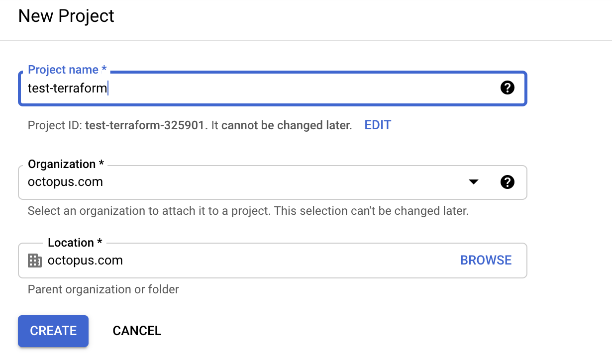

When the project is created, create a service account in the project and give it the editor role. You will need to click **create and continue** and select the editor role.

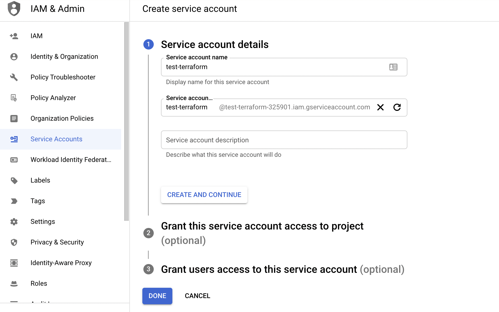

<!--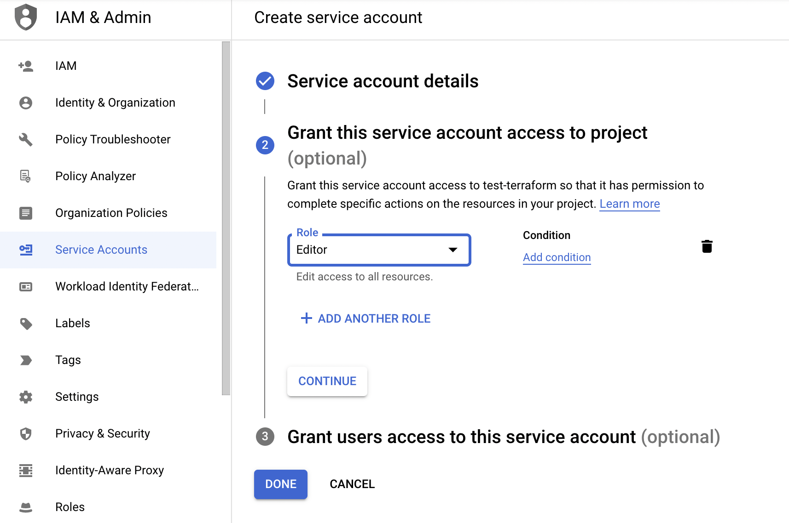-->

After the service account is created, add a key so that Octopus Deploy can access the account. Download the  JSON file as it will be used later to authenticate Octopus Deploy to Google Cloud Platform.

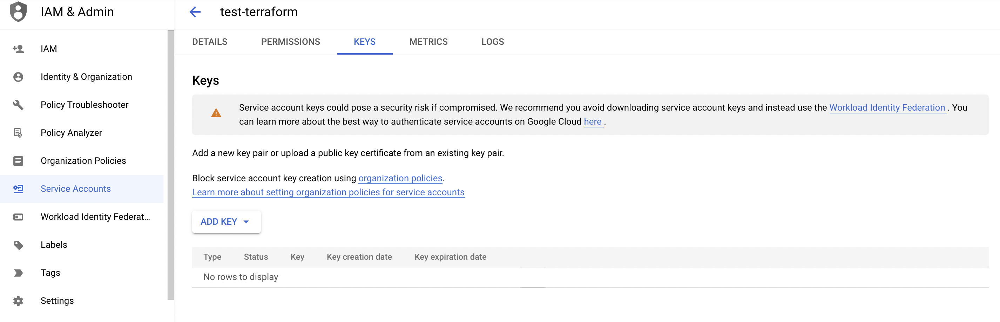

We need to enable the Google Compute Engine API to allow the VPC to be created in the project. You can search for this setting in the search bar or find it under **{{Menu, Compute}}**.

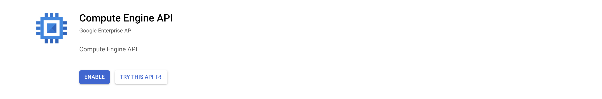

Select the project drop down menu and take note of the Google project ID for use later.

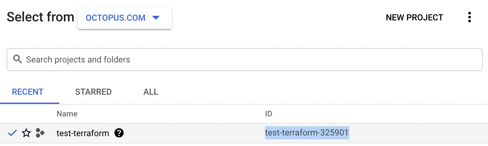

In your Octopus instance, go to **{{Infrastructure,Accounts}}** and add a Google Cloud Platform account. Upload the key that was downloaded earlier.

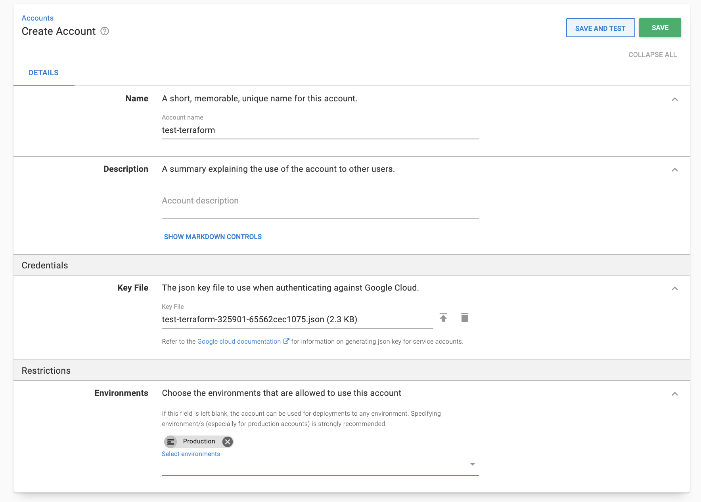

In your project, go to Variables and add the following variables. I have given the example values I used.

|  Variable | Example Value |
|---|---|
| GCP-project-ID  | test-terraform-325901   |
| GCP-region  | australia-southeast1  |
| GCP-VPC-name  |  terraform-network-test-octopus-deploy |
| GCP-zone   |  australia-southeast1-a |    
|  GCP-Variable  |Change type &rarr; Google Cloud Account &rarr; Select your Google Account | 

### Configure Docker external feed

We will use docker to access some resources for our proess step Go to **{{Library, External Feeds, Add Feed}}**. For feed type, select **Docker Container Registry**, give the feed a name, accept default settings and save.

Runbooks are a way to automate processes that aren't part of a deployment. In this case, creating a VPC network. Go to **{{Operations,Runbooks}}** and add a runbook with the **apply a Terraform template** step.

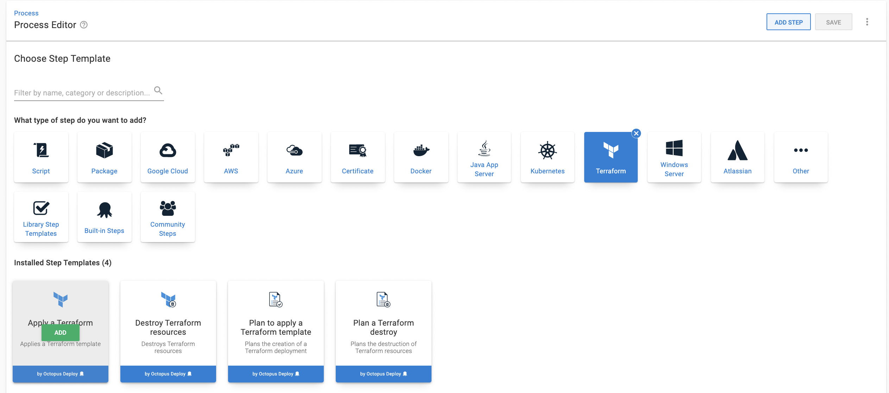

Under worker pool, check **runs on a worker from a specific worker pool** and select the **Hosted Ubuntu** pool.

Under container image, check **runs inside a container, on a worker** and use the docker container registry you set up earlier. Use the octopusdeploy/worker-tools:3.0.0-ubuntu.18.04 worker tool.

Add the Google Cloud Platform account and pass the project-id, region and zone parameters to authenticate Octopus Deploy with Google. 

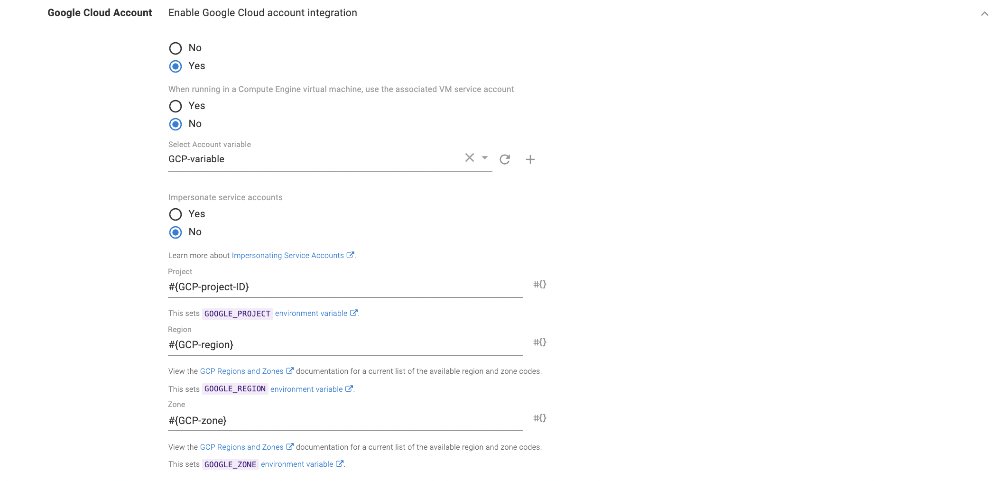

Copy the following code into the 'source code' block.

```
terraform {
  required_providers {
    google = {
      source = "hashicorp/google"
      version = "3.5.0"
    }
  }
}

variable "project" {
  description = "GCP project"
}

variable "region" {
  description = "GCP region"
}

variable "zone" {
  description = "GCP zone"
}

variable "resource_name" {
  description = "Resource Name"
}

provider "google" {
  project = var.project
  region  = var.region
  zone    = var.zone
}

resource "google_compute_network" "vpc_network" {
  name = var.resource_name
}
```

We tell terraform about the project, region, zone, and resource variables. Because we are not specifying a default value for the variables, we need to link them to the Octopus variables defined earlier.

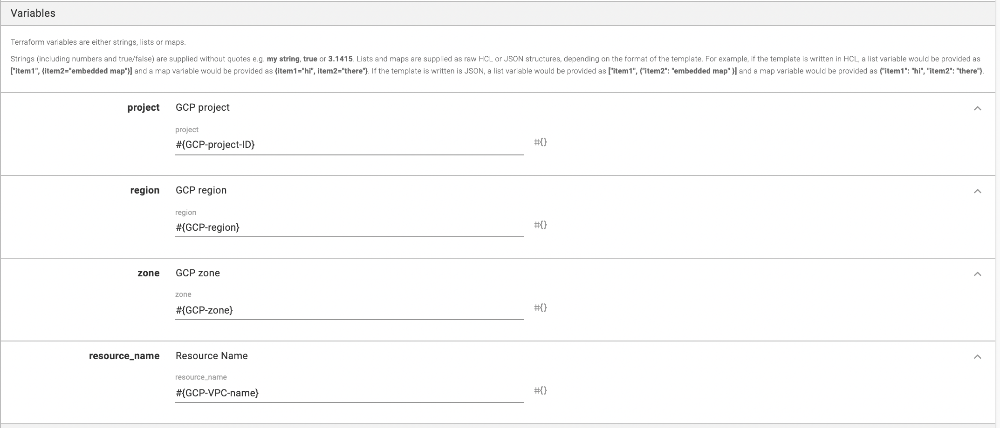


Click run to run the runbook. When complete, the VPC network will be deployed to Google Cloud Platform. We can confirm this by going to the VPC network section and searching for the network.

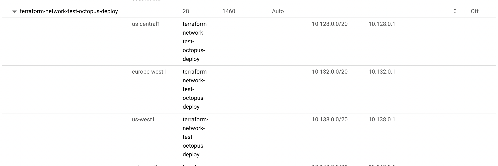

In this blog post, you have created VPC network in a Google Cloud Project using Terraform. You did this by running an Octopus Deploy runbook with variables. This can be used to connect different virtual machines together in a network.

Happy Deployments!
