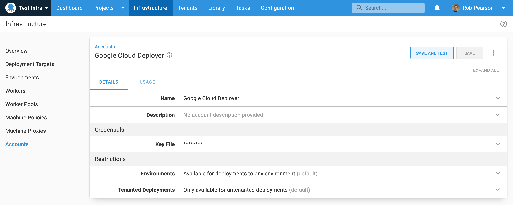
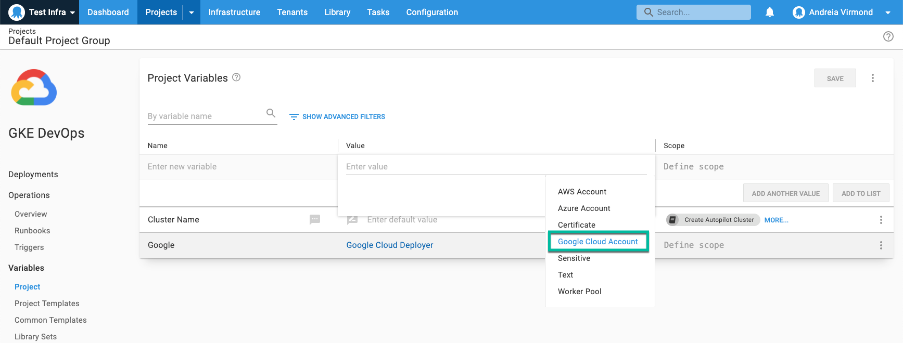
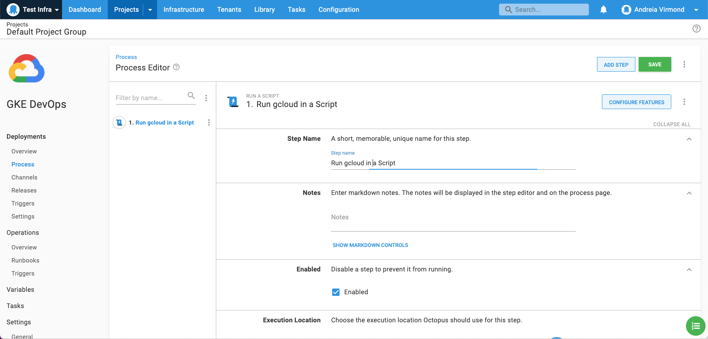
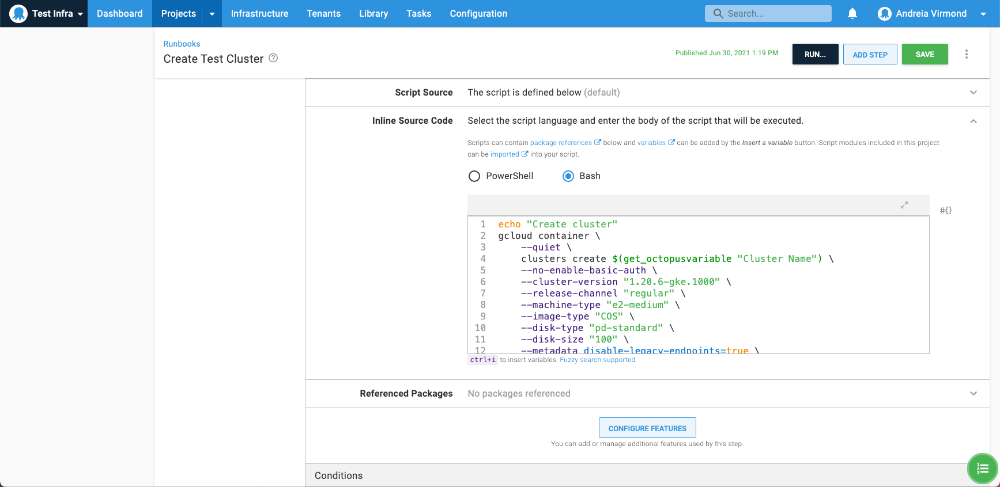

 
In line with our [public roadmap](https://octopus.com/company/roadmap), we introduced built-in support for [Google Cloud Platform (GCP)](https://cloud.google.com/).

With this addition, Octopus now offers built-in support for the three major cloud providers:
 
- [AWS](https://aws.amazon.com)
- [Azure](https://azure.microsoft.com/)
- [GCP](https://cloud.google.com/)

This meets the evolving needs of our customers, particularly those who have GCP Kubernetes clusters and are running Tentacles on GCP virtual machines.

Built-in integration of Octopus with GCP allows you to:

- Connect and authenticate with GCP via a dedicated account type - this allows you to centralize and secure your GCP authentication and use it in your deployments and runbooks
- Use [gcloud](https://cloud.google.com/sdk/gcloud), the GCP command-line tool, in custom scripts out-of-the-box
- Create and tear down GCP infrastructure with [Terraform](https://www.terraform.io/)
- Access Docker images hosted with [Google Container Registry (GCR)](https://cloud.google.com/container-registry)
- Deploy, scale and manage containerized applications on GCP with Octopus and Kubernetes

GCP integration is available in Octopus Deploy 2021.2 and newer. Octopus Cloud customers are already running this version, and on-premises customers can [download it now](https://octopus.com/downloads).

!include <octopus-2021-q3>

## How to deploy to Google Cloud

To see this new integration in action, this post explains how to add a new Google Cloud account in Octopus, and run a `gcloud` script to create a new Kubernetes cluster.

### Google Cloud accounts



To integrate with GCP, first define a Google Cloud account in Octopus. Do this in **{{Infrastructure > Accounts}}**, alongside any AWS or Azure accounts you already have. 

Octopus manages the GCP credentials used by the Google Cloud steps. This means you don't need to worry about authentication in a deployment process or runbook, and you can run pre-authenticated `gcloud` scripts.

Google Cloud accounts are secured by the JSON credentials key file, which can be retrieved from the service account assigned to the instance that is executing the deployment.

Learn more about [creating a Google Cloud account](https://octopus.com/docs/infrastructure/accounts/google-cloud) and see the [Google Cloud documentation](https://cloud.google.com/iam/docs/creating-managing-service-account-keys) for instructions on creating a service account and downloading the key file.

### Google Cloud account variable



After you create Google Cloud accounts, they can be accessed in a project through a [project variable](https://octopus.com/docs/projects/variables) of the type **Google Cloud Account**. Project variables are available to both deployment and runbook processes.

Learn more about setting up [Google Cloud account variables](https://octopus.com/docs/projects/variables/google-cloud-account-variables) in our docs.

#### Running gcloud scripts

Octopus Deploy helps you run scripts on targets with the Google Cloud Platform. In this example, we create a new Kubernetes cluster.

These scripts typically rely on tools being available on the target Workers, however there are a few options to get started quickly: 

- If you're using Octopus Cloud, the built-in "Windows 2016" [Dynamic Workers](https://octopus.com/docs/infrastructure/workers/dynamic-worker-pools) have `gcloud` pre-installed. 
- Another option is using the Octopus [`worker-tools`](https://hub.docker.com/r/octopusdeploy/worker-tools) Docker image with [execution containers for workers](https://octopus.com/docs/projects/steps/execution-containers-for-workers). 
- In general, we recommend provisioning your own tools on your Worker. This gives you control over tool versions, and can ensure their compatibility with the scripts you're trying to execute.

:::hint
Workers move deployment work off the Octopus Server and onto other machines running in Worker Pools. Octopus Cloud uses them to execute custom scripts and they're also commonly used to run deployment and runbook work for cloud platforms and database deployments.

Read our documentation about [Workers](https://octopus.com/docs/infrastructure/workers) and [Worker Pools](https://octopus.com/docs/infrastructure/workers/worker-pools) to learn more.
:::

When executing a script against GCP, Octopus automatically uses your provided Google Cloud account details to authenticate you to the target instance. Alternatively, you can use the service account associated with the target instance.



In this example, you add a new [runbook](https://octopus.com/docs/runbooks) process to create a new Kubernetes cluster using the `gcloud` command-line interface. 

To do this, add a **Run gcloud in a Script** step to your automated process with a `gcloud container clusters create` command. 



You need to customize the script for your needs, but it should look something like this:

```sh
echo "Create cluster"
gcloud container \
	--quiet \
    clusters create $(get_octopusvariable "Cluster Name") \
    --no-enable-basic-auth \
    --cluster-version "1.20.6-gke.1000" \
    --release-channel "regular" \
    --machine-type "e2-medium" \
    --image-type "COS" \
    --disk-type "pd-standard" \
    --disk-size "100" \
    --metadata disable-legacy-endpoints=true \
    --scopes "https://www.googleapis.com/auth/devstorage.read_only","https://www.googleapis.com/auth/logging.write","https://www.googleapis.com/auth/monitoring","https://www.googleapis.com/auth/servicecontrol","https://www.googleapis.com/auth/service.management.readonly","https://www.googleapis.com/auth/trace.append" \
    --num-nodes "3" \
    --enable-stackdriver-kubernetes \
    --enable-ip-alias \
    --network "projects/<your project>/global/networks/default" \
    --subnetwork "projects/<your project>/regions/australia-southeast1/subnetworks/default" \
    --default-max-pods-per-node "110" \
    --no-enable-master-authorized-networks \
    --addons HorizontalPodAutoscaling,HttpLoadBalancing,GcePersistentDiskCsiDriver \
    --enable-autoupgrade \
    --enable-autorepair \
    --max-surge-upgrade 1 \
    --max-unavailable-upgrade 0 \
    --enable-shielded-nodes
```

## Conclusion

We hope you enjoy deploying infrastructure to Google Cloud Platform. 

Try it and let us know what you think. If you have any questions or comments, we’d love to hear them. Please use the comments section below or join the conversation in the [Octopus community Slack](https://octopus.com/slack).

Happy deployments!
