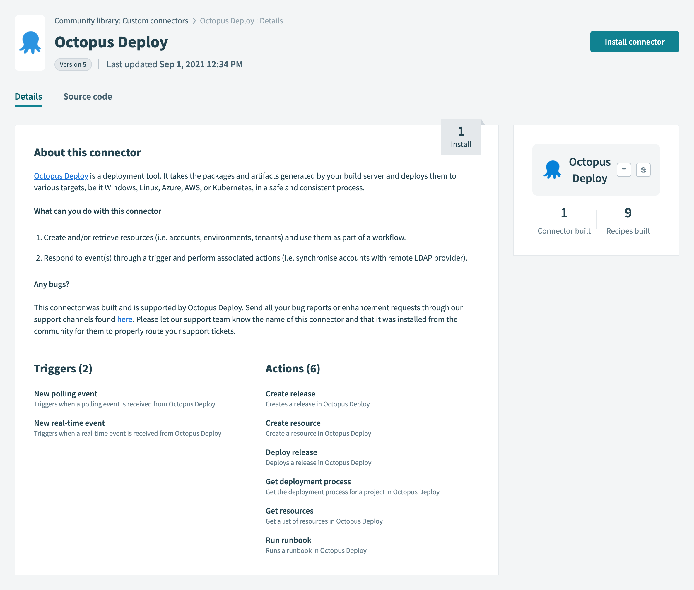
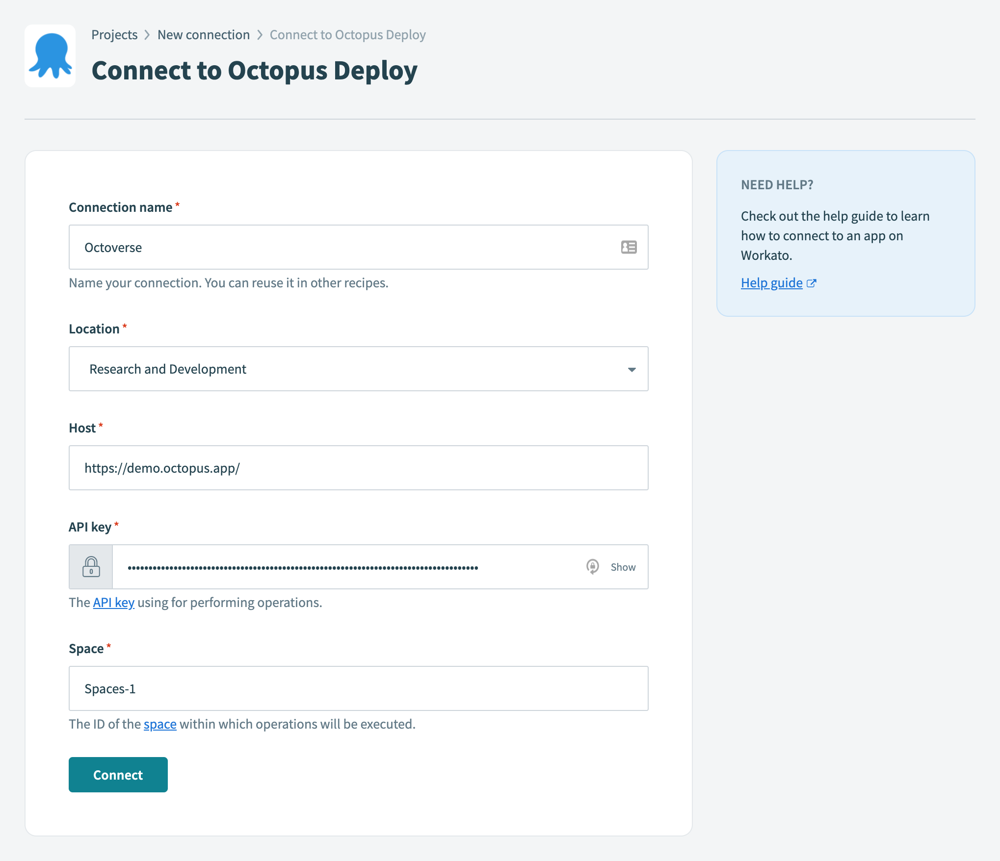
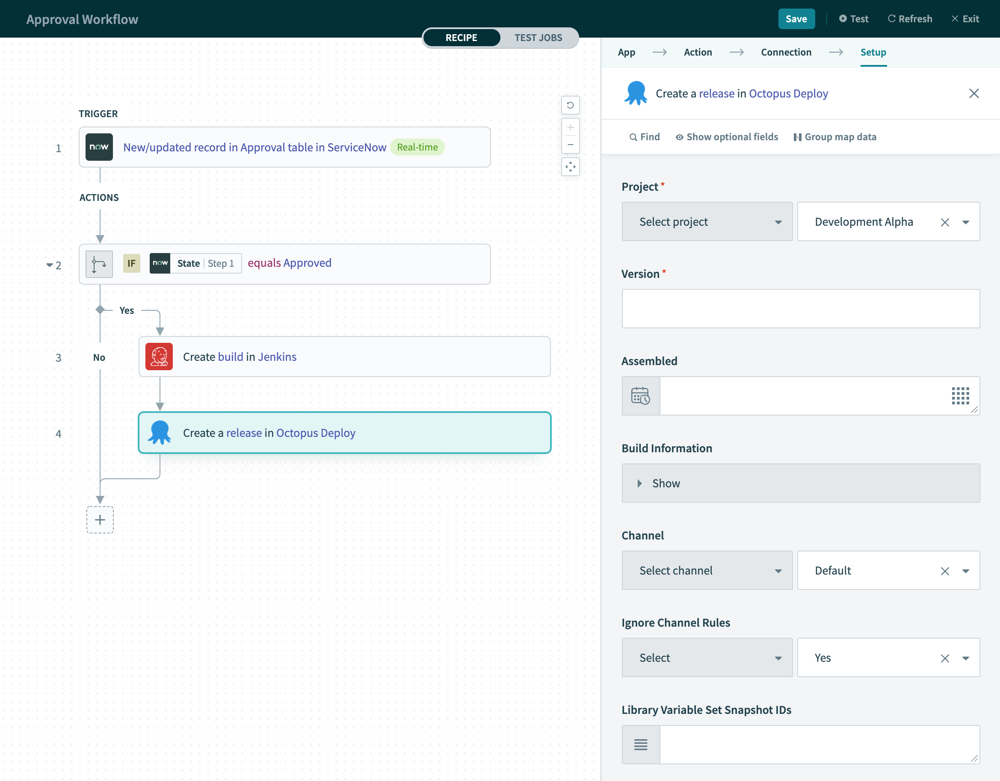

A [Workato connector for Octopus Deploy](https://www.workato.com/integrations/community/octopus-deploy) is now available. Our support for Workato will make a wide variety of workflow scenarios possible for Octopus Deploy customers.

[Workato](https://www.workato.com/) is an enterprise Integration Platform as a Service (iPaaS) that helps you to build workflow automations. You construct workflows through a low-code/no-code visual designer, supporting hundreds of different platforms and systems. Built in Ruby, Workato connectors are defined as a JSON configuration and registered through the Workato development environment.

We know IT teams still play a significant role in [workflow automations](https://www.workato.com/the-connector/work-automation-index/), but product teams and business operations teams are becoming more involved. This requires quick implementations, which can be optimized with Workato's low-code interface.

The Workato connector for Octopus lets you quickly integrate Octopus with your workflows. It supports performing numerous actions with Octopus Deploy, including:

- Creating a release
- Creating resources such as accounts, channels, deployments, environments, and projects
- Deploying a release
- Fetching a deployment process
- Fetching various resources from Octopus Deploy (including deployment targets, feeds, runbooks, teams, and tenants)
- Running a runbook
- Creating recipes that respond to events in Octopus through a trigger

Additional actions can also be added to the connector if you need them.

!include <octopus-2021-q3>

## Getting started

Creating workflows in Workato with the Octopus Deploy connector is simple:

- Search for `Octopus` in the **Custom connectors** section of the Workato **Community library**. Navigating to the connector will provide its description along with its source code.
- To use the connector, click the **Install connector** button.

Before configuring the connector, you need to create an API key in Octopus Deploy. The connector uses this API key to perform operations against Octopus Deploy on your behalf. Information on how to do this is provided in our [How to Create an API Key documentation](https://octopus.com/docs/octopus-rest-api/how-to-create-an-api-key).

After creating an API key, you need to establish a connection between the Octopus Deploy connector in Workato, and the instance of Octopus you wish to integrate in a workflow:

The host address is the URL that points to Octopus Deploy. Make sure you include the space you want to target in the configuration.

After you click **Connect** you can start creating workflows in Workato.

## Octopus Deploy Workato examples

Workato is a flexible and powerful integration platform and you can build endless workflows to suit your team's needs. The following are two examples of what's possible, and we're keen to see these used in real world environments.

### Example: Notify a Slack channel when events occur in Octopus Deploy

A workflow used frequently by customers is to notify a Slack channel when a particular event occurs in Octopus Deploy:

This is achieved through the new subscription event trigger that responds to real-time events raised by Octopus Deploy. When this occurs, a Slack channel is notified with details of the event (for example, new deployment created).

### Example: Approve in ServiceNow; Build with Jenkins; Release with Octopus Deploy

This scenario provides a more elaborate example of the kinds of workflows you can create with Workato:

In this workflow, real-time approval events from an instance of ServiceNow trigger a series of actions. Specifically, a build in Jenkins starts, followed by the creation of a release in Octopus Deploy. Conditions may be checked and used to drive decisions as part of the workflow. These are similar to control flow statements like `if`-`then`-`else` statements in programming languages.

## Conclusion

Workato's automated recipes allow you to construct workflows through a visual designer, providing a low-code tool for system integrations.

As well as triggering a runbook automation in systems such as Slack, Microsoft Teams, Jira or others, Workato makes it easy for Octopus and Workato users to publish updates to other systems after development, test or production deployments. These could be simple notifications, or update tickets in third party systems.

The power of Workato is its ability to easily integrate other systems with Octopus Deploy.

Happy deployments!
