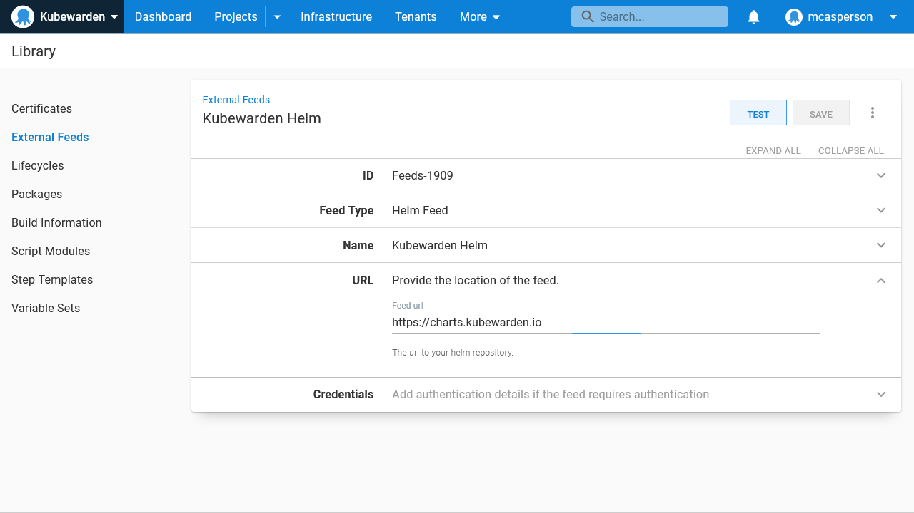

Kubernetes is fast becoming the operating system of the cloud. Every major cloud provider has a supported Kubernetes platform, Kubernetes can be run on-premises, and Kubernetes even has a package manager with Helm. And thanks to the [operator pattern](https://kubernetes.io/docs/concepts/extend-kubernetes/operator/), Kubernetes can natively describe and manage almost [any kind of workload](https://operatorhub.io/).

This flexibility is a blessing and a curse. Kubernetes has the ability to run almost anything, and yet it would be all but impossible to maintain any real world production cluster hosting anything that was thrown at it.

Kubernetes security policies provide some level of control over the resources hosted by a cluster. However, security policies can only allow top level resources, like deployments or pods, to be created. A pod can host almost anything, so teams that need a greater level of control will need to look beyond security policies.

[Admission controllers](https://kubernetes.io/blog/2019/03/21/a-guide-to-kubernetes-admission-controllers/) go one step further by allowing each new resource being created or updated to be inspected, modified, accepted, or rejected by a custom service. This provides a very fine grained level of control over resources created in a cluster, and ensure only those resources that meet your particular requirements are deployed.

In this post we'll look at the [Kubewarden](https://www.kubewarden.io/) admission controller, which is an early project providing the ability to define admission policies written in a number of languages compiled down to WebAssembly. We'll create a number of runbooks and deployments in Octopus to manage Kubewarden and deploy pods to Kubernetes.

## Installing Kubewarden

The easiest way to install Kubewarden is via its Helm chart. Create a new Helm Feed in Octopus pointing to https://charts.kubewarden.io:

