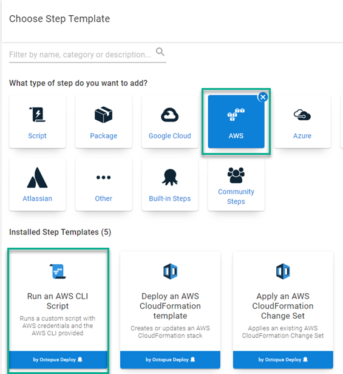
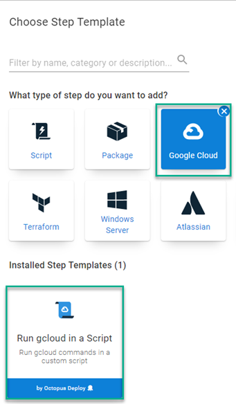
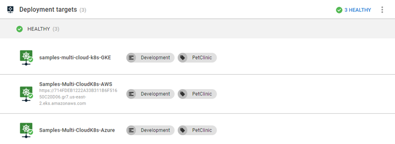

Containerizing applications on cloud platforms is a hot topic.  The big three cloud providers (Azure, Amazon Web Services (AWS), and Google Cloud Platform (GCP)) have all implemented a Kubernetes (K8s) platforms; Azure Kubernetes Service (AKS), Elastic Kubernetes Service (EKS), and Google Kubernetes Engine (GKE).  In this post, I'll demonstrate how easy it is to move from K8s cloud platform to another using Octopus Deploy.

## Creating clusters
Before diving into deployments, let's first create a cluster in each of the cloud providers previously mentioned.  Each provider has a command-line interface (CLI) available for you to use.  We'll utilize the [Runbooks](https://octopus.com/docs/runbooks) feature of Octopus to create the clusters.  In addition, we'll be using the [Execution Containers for Workers](https://octopus.com/docs/projects/steps/execution-containers-for-workers) feature as the [worker tools](https://hub.docker.com/r/octopusdeploy/worker-tools) image contains the CLI for all three platforms as well as kubectl.


:::hint
You will need to configure an External Feed to a Docker Registry such as Docker Hub to use the Execution Containers feature
:::

### Azure
To work with AKS, you'll first need to create and Azure Service Principal.  This post assumes you are framiliar with how to create an Azure Service Principal, so this topic will not be covered.  Once the Service Principal has been created, it needs to be added as an Azure Account within Octopus Deploy.  You will need the following pieces of information to add it to Octopus:
- Subscription ID
- Directory (tenant) ID
- Application (client) ID
- Application Key/Password (client secret for an App Registration)

Microsoft has developed the [az CLI](https://docs.microsoft.com/en-us/cli/azure/install-azure-cli) that can be used to interface with all of your Azure resources.  Using the CLI, we're able to create a K8s cluster and add it to Octopus Deploy in 3 steps:
- Create Resource group
- Create K8s cluster
- Add cluster as deployment target

#### Create Resource group
The first two steps in your process will use the `Run an Azure Script` step template.  To add this, Add a step to your runbook, choose the Azure category, and select the `Run an Azure Script` step


The `Run an Azure Script` requires the Azure Account configured earlier, select that account, then add the following script:
```powershell
$resourceGroupName = "<ResourceGroupName>"
$resourceGroupLocation = "<ResourceGroupRegionCode>"

if ((az group exists --name $resourceGroupName) -eq $false)
{
	Write-Output "Creating resource group $resourceGroupName in $resourceGroupLocation"
    az group create --location $resourceGroupLocation --name $resourceGroupName 
}
```

#### Create K8s cluster
With a Resource Group created, you are now in a position to create the K8s cluster.  Repeat the steps for Create Resource Group to add another `Run an Azure Script` to the Runbook process.  Add the following script:

```powershell
# Get the variables
$clusterName = "<Name of cluster to create>"
$resourceGroupName = "<Resource group name you created from previous step>"
$azureLocation = "<Azure region code>"
$dnsPrefix = "<DNS prefix>"
$azureNodeSize = "<VM size to be used for nodes>"
$azureServicePrincipalClientId = "<Client ID>" 
$azureServicePrincipalSecretKey = "<Key/Password for Service Principal Account>" 

# Create the Azure Kubernetes cluster
$azureKubernetesCluster = az aks create --name $clusterName --resource-group $resourceGroupName --dns-name-prefix $dnsPrefix --location $azureLocation --node-count 1 --node-vm-size $azureNodeSize --generate-ssh-keys --service-principal $azureServicePrincipalClientId --client-secret $azureServicePrincipalSecretKey
$azureKubernetesCluster = $azureKubernetesCluster | ConvertFrom-JSON

$azureKubernetesCluster
```
:::hint
If you add an Azure Account as a variable, you are able to get the Client ID and Key/Password directly from the variable itself without having to enter it again.  For example, if you create the variable with the name `Azure.Account.Name` you can get use the following syntax
```powershell
$clientId = $OctopusParameters['Azure.Account.Name.Client']
$secretKey = $OctopusParameters['Azure.Account.Name.Password']
```
:::

#### Add cluster as deployment target
The third and final step is to register the cluster with Octopus Deploy as a deployment target.  The Octopus Deploy cmdlet `New-OctopusKubernetesTarget` was designed specifically for this very purpose.  Add a `Run a script` step to the runbook and use the following script:

```powershell
# Get the variables
$clusterName = "<Name of the cluster>"
$resourceGroupName = "<Name of the resource group the cluster is in>"

# Add new Kubernetes cluster target
New-OctopusKubernetesTarget -Name "<Display name of target>" -clusterName $clusterName -clusterResourceGroup $resourceGroupName -octopusRoles "<Role list>" -octopusAccountIdOrName "<Name of Azure Account>" -namespace "default" -skipTlsVerification $true
```

### AWS
Similar to Azure, the first thing you'll need to do is create an AWS account in Octopus Deploy to interact with your AWS resources. This post assumes you are framiliar with how to create AWS IAM users.  To create the AWS account within Octopus, you will need the following:
- Access Key
- Secret Key

Amazon has developed the [aws CLI](https://aws.amazon.com/cli/) that can be used to interface with all of your AWS resources.  Using the CLI, we're able to create a K8s cluster and add it to Octopus Deploy in 2 steps:
- Create EKS cluster
- Add cluster as deployment target

:::hint
An alternative to creating an AWS account is to use an IAM Role on a VM to perform the creation of the cluster.  Using an IAM Role will be specified in the `Create EKS cluster` step
:::


#### Create EKS cluster
For creating an EKS cluster, you'll first need to add a `Run an AWS CLI Script` to your runbook.  Add a step to the runbook, choosing the AWS category



The `Run an AWS CLI Script` is capable of using an IAM Role or executing under a different AWS service role.  For this post, you're going to use the AWS Account created earlier.  In addition to the Account, the template also needs to know the AWS Region code.  Once you've added that, add the following script to create an EKS cluster:

```powershell
# Get variables
$clusterName = "<Name of the cluster>"
$region = "<AWS Region code>"
$roleArn = "<AWS Role Arn that can create K8s clusters>"
$subnet1Id = "<ID of first subnet to use in your AWS VPC>"
$subnet2Id = "<ID of second subnet to use in your AWS VPC>"
$securityGroupId = "<ID of the security group to use in your AWS VPC>"


# Create EKS cluster
$eksCluster = aws eks create-cluster --name $clusterName --role-arn $roleArn --resources-vpc-config subnetIds=$subnet1Id,$subnet2Id,securityGroupIds=$securityGroupId
$eksCluster = $eksCluster | ConvertFrom-JSON

# Wait until the cluster is in a CREATING state
Write-Host "Waiting for cluster to be done creating..."
while ($eksCluster.Cluster.Status -eq "CREATING")
{
	# Wait for cluster to be done creating
	$eksCluster = aws eks describe-cluster --name $clusterName --instance-type "t3.medium" --instance-count 1
	$eksCluster = $eksCluster | ConvertFrom-JSON
}

# Display the final status of the cluster
Write-Host "Status of cluster: $($eksCluster.Cluster.Status)" 

# Save the endpoint to an output variable
Set-OctopusVariable -name "EKSURL" -value $eksCluster.Cluster.Endpoint
```

#### Add cluster as deployment target
Add a `Run a Script` step to your runbook (see screenshot in Azure section for reference).  You will again use the `New-OctopusKubernetesTarget` cmdlet, but with slightly different parameters

```powershell
# Get the variables
$clusterName = "<Name of cluster>"
$region = "<AWS region code>"
$eksUrl = $OctopusParameters['Octopus.Action[Create EKS Cluster].Output.EKSURL']

# Add new Kubernetes cluster target
New-OctopusKubernetesTarget -Name "<Display name of target" -clusterName $clusterName -octopusRoles "<Role list>" -octopusAccountIdOrName "<Name of AWS Account>" -namespace "default" -skipTlsVerification $true -clusterUrl $eksUrl
```

### GCP
Just like the other two methods, we'll first need to create a Google Cloud Account in Octopus Deploy.  This post assumes that you are framiliar with how to create a Service Account in GCP and will not be covering that part.  To create a Google Cloud Account, you will need the JSON key file generated when adding a `Key` to a Service Account.

:::warning
GCP integration was released in Octopus Depoloy 2021.2.  At the time of this writing, 2021.2 has not been released for the self-hosted version of Octopus Deploy.
:::

Google has developed the [gcloud CLI](https://cloud.google.com/sdk) that can be used to interface with all of your GCP resources.  Using the CLI, we're able to create a K8s cluster and add it to Octopus Deploy in 2 steps:
- Create GKE cluster
- Add cluster as deployment target

#### Create GKE Cluster
To create a GKE cluster, you'll need to add a `Run GCloud in a Script` step to your runbook.  Choose the Google Cloud Category, Run gcloud in a Script step.



Similar to AWS, the `Run GCloud in a Script` step is capable of using a VM service account to perform operations as well as impersonating.  For this post, you'll use the Google Account you created previously.  Fill in the following:
- Google cloud account
- Project (Google Cloud Project)
- Region
-or-
- Zone

Once you have that filled in, paste in the following script:

```powershell
# Get variables
$clusterName = "<Cluster name>"

# Get the GKE default kubernetes version
$kubernetesVersion = (gcloud container get-server-config --flatten="channels" --filter="channels.channel=STABLE" --format="json" | ConvertFrom-JSON)
$kubernetesVersion = $kubernetesVersion.defaultClusterVersion

# Create the GKE cluster
$gkeCluster = (gcloud container clusters create $clusterName --cluster-version=$kubernetesVersion --num-nodes=1 --format="json" | ConvertFrom-JSON)

# Save the end point
Set-OctopusVariable -name "GKEURL" -value $gkeCluster.Endpoint
```

#### Add cluster as deployment target
Add a `Run a Script` step to your runbook (see screenshot in Azure section for reference).  At the time of this writing, the `New-OctopusKubernetesTarget` cmdlet has not been updated to work the GCP, the script to register the target is going to look a bit different.

```powershell

# Get the variables
$clusterName = "<Cluster name>"
$octopusUrl = "<Url of your Octopus server>"
$apiKey = "<API Key for registerting target>"
$spaceId = $OctopusParameters['Octopus.Space.Id']
$headers = @{ "X-Octopus-ApiKey" = $apiKey }

# Add new Kubernetes cluster target
$newMachine = @{
	Name = "<Display name of target>"
    Endpoint = @{
    	CommunicationStyle = "Kubernetes"
        Authentication = @{
        	AuthenticationType = "KubernetesGoogleCloud"
            AccountId = "<Google Account>"
            UseVmServiceAccount = $false
            ImpersonateServiceAccount = $false
            Project = "<Google Project Name>"
            Region = "<Google region code>"
            ClusterName = $clusterName
        }
        AccountType = "GoogleCloudAccount"
        DefaultWorkerPoolId = "<Your worker pool id>"
        Container = @{
        	FeedId = "<Your external feed id>"
            Image = "octopusdeploy/worker-tools:3.0.0-ubuntu.18.04"
        }
    }
    Roles = @("Test1")
    EnvironmentIds = @($OctopusParameters['Octopus.Environment.Id'])
}

# Call API to register cluster
Invoke-RestMethod -Method Post -Uri "$octopusUrl/api/$spaceId/machines" -Body ($newMachine | ConvertTo-JSON -Depth 10) -Headers $headers
```

Once all three runbooks have executed, you should have three Kubernetes clusters



## Switching cloud provider K8s services
The [Octopus Samples](https://samples.octopus.app) instance contains a space where we can see the [PetClinic](https://samples.octopus.app/app#/Spaces-105/projects/petclinic/deployments) application being deployed to an EKS cluster.  I've used the new [Import/Export](https://octopus.com/blog/octo-exe-import-export) functionality to copy this project into a new space so I didn't have to recreate it.

For this post we'll start off deploying to AWS EKS since we know it already works and disable the other two targets.  The deployment process for PetClinic consists of:
- Deploy MySQL: this step deploys a MySQL container to the K8s cluster to be used as the database back end.
- Run Flyway job: this step executes a K8s job that will create and seed the database on the MySQL container.
- Deploy petclinic web with load balancer: this step creates a deployment for the PetClinic web front-end and places a load balancer in front of it.
- Deploy Kubernetes ingress resource: this step creates an NGINX ingress controller in front of the load balancer.


