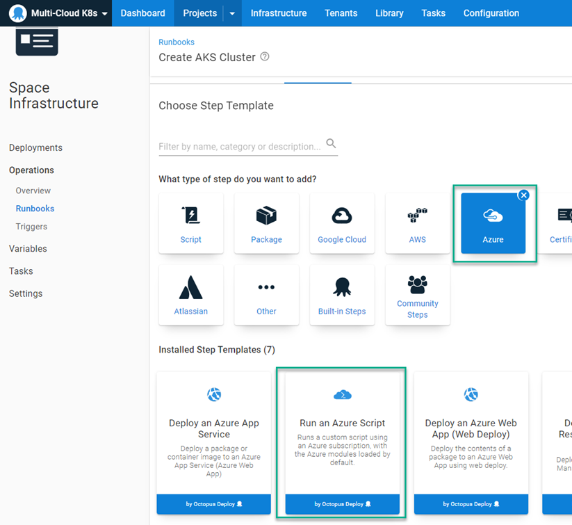
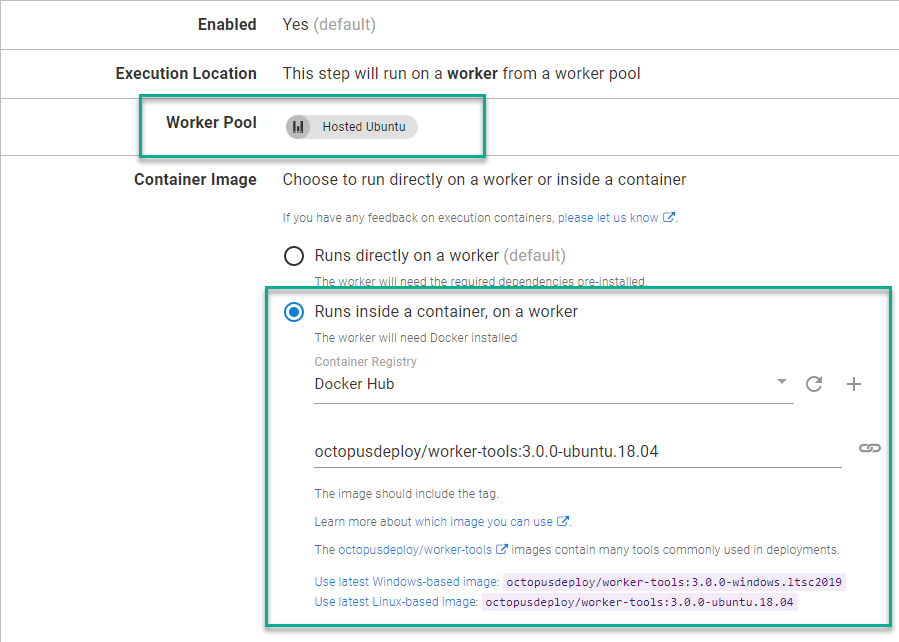

Containerizing applications on cloud platforms is a hot topic.  The big three cloud providers (Azure, Amazon Web Services (AWS), and Google Cloud Platform (GCP)) have all implemented a Kubernetes (K8s) platforms; Azure Kubernetes Service (AKS), Elastic Kubernetes Service (EKS), and Google Kubernetes Engine (GKE).  In this post, I'll demonstrate how easy it is to move from K8s cloud platform to another using Octopus Deploy.

## Creating clusters
Before diving into deployments, let's first create a cluster in each of the cloud providers previously mentioned.  Each provider has a command-line interface (CLI) available for you to use.  We'll utilize the [Runbooks](https://octopus.com/docs/runbooks) feature of Octopus to create the clusters.  In addition, we'll be using the [Execution Containers for Workers](https://octopus.com/docs/projects/steps/execution-containers-for-workers) feature as the [worker tools](https://hub.docker.com/r/octopusdeploy/worker-tools) image contains the CLI for all three platforms as well as kubectl.

### Azure
To work with AKS, you'll first need to create and Azure Service Principal.  This post assumes you are framiliar with how to create an Azure Service Principal, so this topic will not be covered.  Once the Service Principal has been created, it needs to be added as an Azure Account within Octopus Deploy.  You will need the following pieces of information to add it to Octopus:
- Subscription ID
- Directory (tenant) ID
- Application (client) ID
- Application Key/Password (client secret for an App Registration)

Microsoft has developed the [az CLI](https://docs.microsoft.com/en-us/cli/azure/install-azure-cli) that can be used to interface with all of your Azure resources.  Using the CLI, we're able to create a K8s cluster and add it to Octopus Deploy in 3 steps:
- Create Resource group
- Create K8s cluster
- Add cluster as deployment target

#### Create Resource group
The first two steps in your process will use the `Run an Azure Script` step template.  To add this, Add a step to your runbook, choose the Azure category, and select the `Run an Azure Script` step



Add the following script:
```powershell
$resourceGroupName = "<ResourceGroupName>"
$resourceGroupLocation = "<ResourceGroupRegionCode>"

if ((az group exists --name $resourceGroupName) -eq $false)
{
	Write-Output "Creating resource group $resourceGroupName in $resourceGroupLocation"
    az group create --location $resourceGroupLocation --name $resourceGroupName 
}
```

Be sure to change the `Execution Location` to a worker pool and choose the worker tools container image



:::hint
You will need to configure an External Feed to a Docker Registry such as Docker Hub to use the Execution Containers feature
:::

#### Create K8s cluster
With a Resource Group created, you are now in a position to create the K8s cluster.  Repeat the steps for Create Resource Group to add another `Run an Azure Script` to the Runbook process.  Add the following script:

```powershell
# Get the variables
$clusterName = "<Name of cluster to create>"
$resourceGroupName = "<Resource group name you created from previous step>"
$azureLocation = "<Azure region code>"
$dnsPrefix = "<DNS prefix>"
$azureNodeSize = "<VM size to be used for nodes>"
$azureServicePrincipalClientId = "<Client ID>" 
$azureServicePrincipalSecretKey = "<Key/Password for Service Principal Account>" 

# Create the Azure Kubernetes cluster
$azureKubernetesCluster = az aks create --name $clusterName --resource-group $resourceGroupName --dns-name-prefix $dnsPrefix --location $azureLocation --node-count 1 --node-vm-size $azureNodeSize --generate-ssh-keys --service-principal $azureServicePrincipalClientId --client-secret $azureServicePrincipalSecretKey
$azureKubernetesCluster = $azureKubernetesCluster | ConvertFrom-JSON

$azureKubernetesCluster
```
:::hint
If you add an Azure Account as a variable, you are able to get the Client ID and Key/Password directly from the variable itself without having to enter it again.  For example, if you create the variable with the name `Azure.Account.Name` you can get use the following syntax
```powershell
$clientId = $OctopusParameters['Azure.Account.Name.Client']
$secretKey = $OctopusParameters['Azure.Account.Name.Password']
```
:::

#### Add cluster as deployment target
The third and final step is to register the cluster with Octopus Deploy as a deployment target.  The Octopus Deploy cmdlet `New-OctopusKubernetesTarget` was designed specifically for this very purpose.  Add a `Run a script` step to the runbook and use the following script:

```powershell
# Get the variables
$clusterName = "<Name of the cluster>"
$resourceGroupName = "<Name of the resource group the cluster is in>"

# Add new Kubernetes cluster target
New-OctopusKubernetesTarget -Name "<Display name of target>" -clusterName $clusterName -clusterResourceGroup $resourceGroupName -octopusRoles "<Role list>" -octopusAccountIdOrName "<Name of Azure Account>" -namespace "default" -skipTlsVerification $true
```

### AWS
Similar to Azure, the first thing you'll need to do is create an AWS account in Octopus Deploy to interact with your AWS resources. This post assumes you are framiliar with how to create AWS IAM users.  To create the AWS account, you will need the following:
- Access Key
- Secret Key

Amazon has developed the [aws CLI](https://aws.amazon.com/cli/) that can be used to interface with all of your AWS resources.  Using the CLI, we're able to create a K8s cluster and add it to Octopus Deploy in 3 steps:
- Create EKS cluster
- Add cluster as deployment target

:::hint
An alternative to creating an AWS account is to use an IAM Role on a VM to perform the creation of the cluster.  Using an IAM Role will be specified in the `Create EKS cluster` step
:::


#### Create EKS cluster
