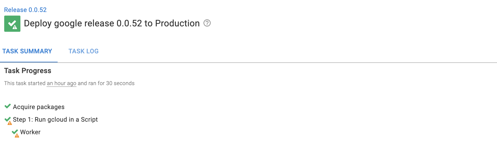
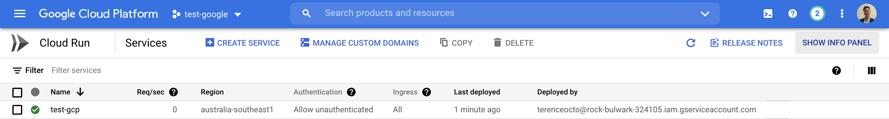
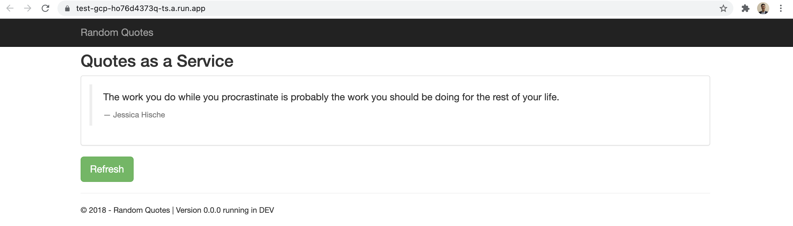
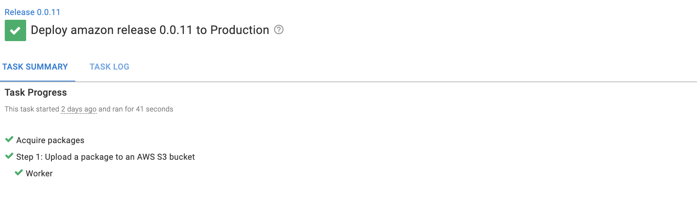
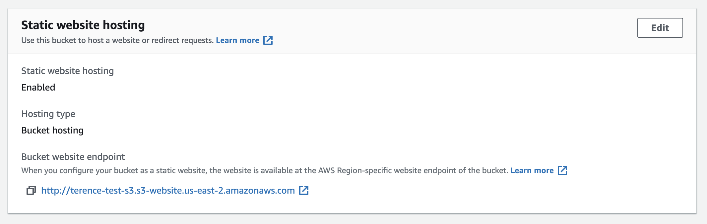

In continuous deployment, a build server builds and pushes images to a central repository. Engineers can then deploy the image on-premise or to a cloud service. There are several vendors that an organization could choose for continuous deployment.  Within organizations, affinity to certain vendors can vary from team to team. There is the added overhead of learning the UI of each vendor. 

This blog demonstrates how Octopus can work with a range of build servers, cloud repositories, and cloud targets. Octopus can be the central orchestrator with a straightforward UI and bring all these services together into one place.

## Flow Diagram

## Build Servers

The role of a build server is to take raw code, build it, and package it into a form ready for deployment. A common way for a build server to do this is through YAML configuration files. I build and push a sample web application called Random Quotes to two container registries: Docker Hub and Google Container Registry.

The repository I used is from the Octopus Deploy [samples repository](https://github.com/OctopusSamples/RandomQuotes-JS). Each build server requires a config folder in the root level containing a YAML configuration file. The repository stores access keys to the build server and container registry. These keys are used in the YAML file to authenticate, build and push an image. I used Github Actions to push to the Google Content Registry and Travis CI and CircleCI to push to DockerHub. Each build server can push to any other content registry. There are other build servers such as Jenkins or TeamCity. I focussed on a few that were free to set up.

For a step by step guide in how to set up a YAML configuration file in Github, see my post on [Github/Docker]

This step results in a build success message in each build server, confirming the image on the container registry.

### Github Actions

Github Actions is a workflow automation tool that adds continuous delivery to Git repositories. There are step templates for many deployment types, and I was able to deploy to Google Container Registry and Docker by using the templates.

### Travis CI

Travis CI is an open-source continuous delivery tool. It is free to sign up to and contains Github integrations. I connected my Github repository to Travis CI, and it automatically detects changes on the repository and triggers a build.  I did not see a templating function to help me with building a workflow, but there were ample resources online for me to use. The solution I found called a script to deploy to DockerHub, whereas other build servers would call the step in the YAML file. 

### Circle CI

Circle CI is another build server alternative that is free to start. It also contains Github integrations. I found that the ability to import template YAML configuration files was helpful in quickly setting up a deployment flow. I could select the language of the package, and Circle CI would populate the step template, and I just needed to fill in the blanks.

## Repositories

A content repository is a place to store deployable images or packages. Octopus Deploy references these repositories and orchestrates the deployment to a target. Octopus Deploy has integrations with Docker Hub, Google Container Registry, and others like Azure Container Registry and AWS Elastic Container Registry.

### Docker Hub

Docker Hub is a central repository for Docker images. It is free to sign up and create public repositories.

### Google Container Registry

Google Container Registry is a container registry for the Google Cloud Platform. I did not see a way to deploy to Google Cloud run using a Docker Hub image directly. I found that I had to pull a Docker Hub image and push it to Google Container Registry. To complete the flow, I added the Google Container Registry to the Github Actions step to push to Google Container Registry directly.

### Built-in repository

Octopus Deploy contains a built-in repository to manage local packages. The built-in repository can be helpful for self-managing the packages that are deployed or keeping them private.

### Octopus Deploy

The steps below are where Octopus Deploy enters the picture. Octopus Deploy can retrieve the image from the registry and choose between several steps to deploy to different targets. The benefit is that Octopus is the central orchestrator with a friendly UI experience. See my post on [Github/Docker] for steps to automate the process from build server to deployment.

### Azure

Octopus Deploy deploys to Azure via the Azure script. It references the random quotes image, authenticates with an Azure account, and uses the Azure CLI to create a web application. For a step-by-step guide on how to deploy to Azure, see [Deployable Package]().

### Google Cloud Platform

The Run gcloud in a Script step was added in Octopus 2021.2. The step uses the gcloud CLI installed on a custom worker, authenticates to the Google Cloud Platform, and deploys the Google Container Registry image to a new web application.

### Amazon Web Services

I used the built-in repository to deploy a local package to an Amazon S3 bucket. This bucket can host static HTML, and I have used it to host a package from [an earlier post]().

http://terence-test-s3.s3-website.us-east-2.amazonaws.com/web/index.html

Build servers, content repositories, and deployment targets work together with Octopus Deploy. Octopus Deploy provides an easy UI and many step templates for continuous deployment. It can act as a central orchestrator to create happier deployments.

