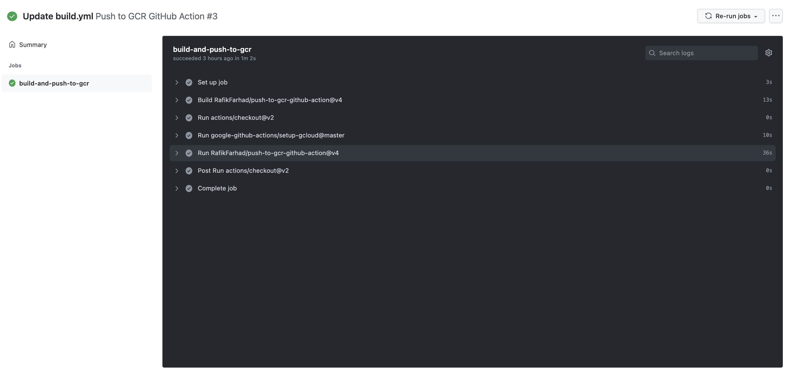
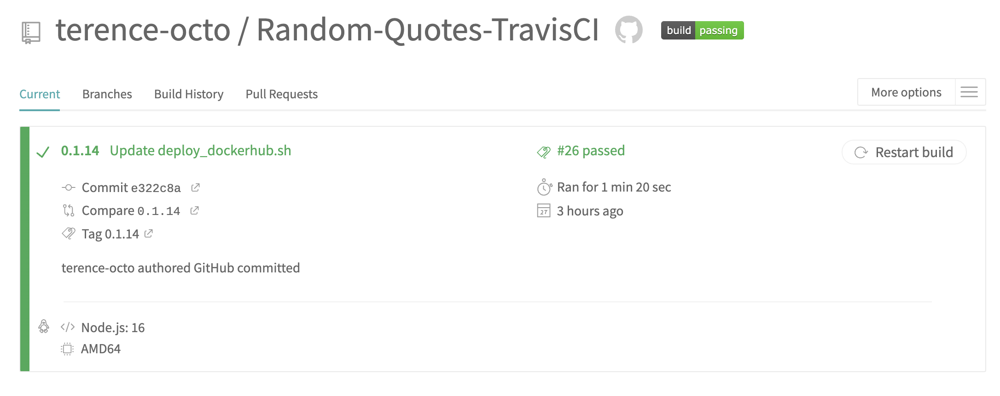
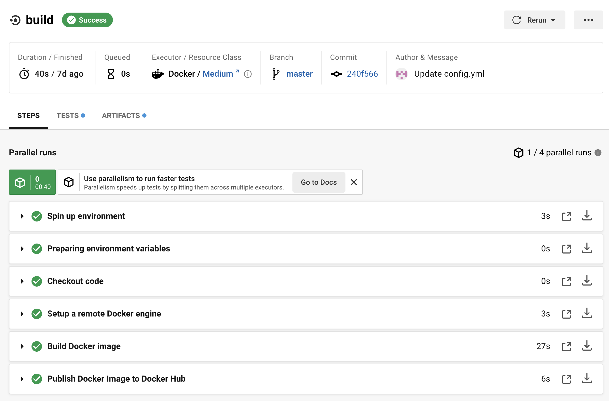
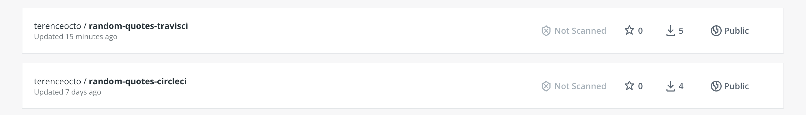
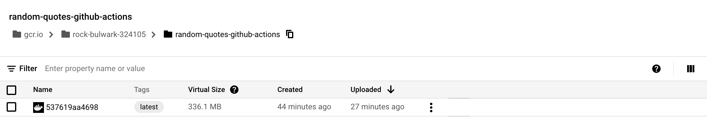
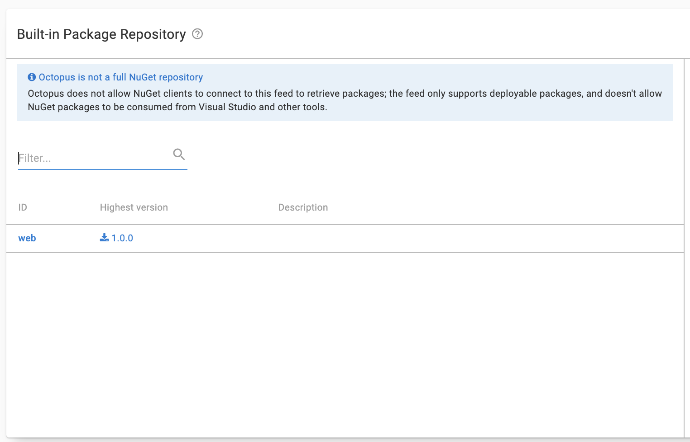
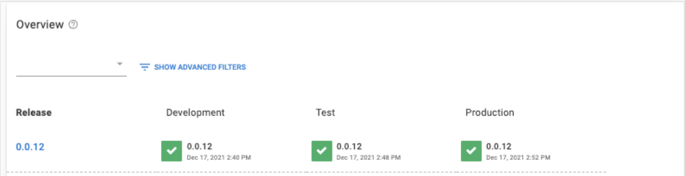
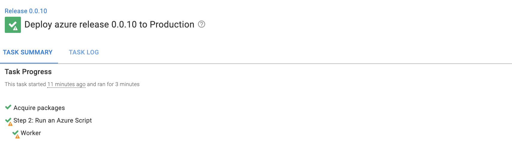
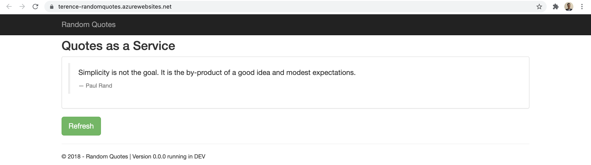

Deployment tools like build servers, image repositories, and deployment targets come in different shapes and sizes. Octopus Deploy supports a range of tools through a straightforward user interface and a best-in-class deployment experience. This blog shows you some deployment tools and how Octopus works to make deployments easier.

## Build Servers

The role of a build server is to take raw code, build it, and package it into a form ready for deployment. Build servers do this through YAML files. I built and pushed a sample web application called [Random Quotes](https://github.com/OctopusSamples/RandomQuotes-JS). I used GitHub Actions to push to the Google Content Registry and Travis CI and CircleCI to push to DockerHub. Build servers are interchangeable, and they can push to any content registry.

### GitHub Actions

GitHub Actions allows DevOps operations to be performed directly on a GitHub repository. GitHub Actions uses workflows, a feature that allows configuration files to specify a deployment process. The GitHub community maintains templates that cover different deployment targets. I used a basic one to set up a job to deploy to GCR.

### Travis CI

Travis CI is an open-source continuous delivery tool. It is free to sign up and works with GitHub. I connected my GitHub repository to Travis CI. Travis CI automatically detects changes on the repository and triggers a build. There wasn't a Travis CI template to use, but there were resources online to make it work.

### Circle CI

Circle CI is also free to start and works with GitHub. Circle CI does have templates that you can import. The templates were helpful in quickly setting up a deployment flow.

## Repositories

An image repository is a place to store deployable images. Octopus Deploy uses these images and deploys them to a target. Octopus Deploy supports image repositories like Docker Hub, Google Container Registry, Azure Container Registry, and AWS Elastic Container Registry.

### Docker Hub

Docker Hub is a central repository for Docker images. It is free to sign up and create public repositories. Here are the Travis CI and Circle CI images pushed to Docker Hub.  

### Google Container Registry

Google Container Registry is a container registry for the Google Cloud Platform. I added the Google Container Registry to the GitHub Actions step to push to Google Container Registry directly.

### Built-in repository

Octopus Deploy contains a built-in repository to manage local packages. The built-in repository can be helpful for self-managing the packages that are deployed or keeping them private.

### Octopus Deploy

We have explored different tools that are part of a deployment. Octopus Deploy is a deployment tool that takes an image and deploys it to deployment targets. Octopus has broad support for deployment tools and has a friendly UI. Octopus Deploy uses dedicated environments to split releases into stages. This view is helpful to see the progress of a release.

### Deployment Targets

Octopus Deploy deploys to Azure, Google, and Amazon through an Octopus step. The step uses the Random Quotes image, authenticates with the Cloud, and calls the Cloud API to create a web application.

The image below shows the Web Application in Azure, Google, and Amazon. The Web Application displays a random quote by a historical figure on every refresh.

## Conclusion

This blog introduced different build servers, content repositories, and deployment targets. You saw how each tool has slightly different features and configuration requirements. A deployment process could use a wide range of tools. Octopus Deploy can work well with these tools by using a simple UI and providing the best-in-class deployment experience. If you would like Octopus Deploy to help make deployments easier, [you can start a free trial!](https://octopus.com/start)

Happy Deployments!
