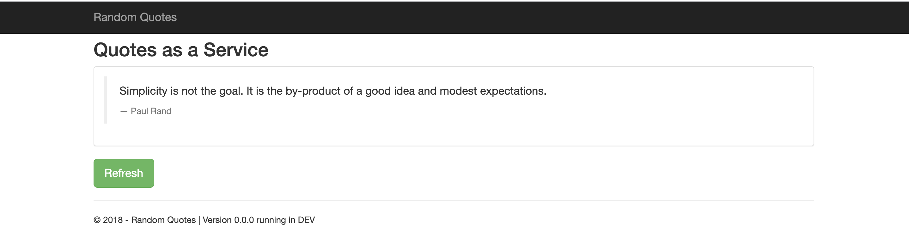

Tools like build servers, image repositories, and deployment targets come in different shapes and sizes. Octopus Deploy supports a range of tools through a straightforward user interface and a best-in-class deployment experience. This blog shows you how Octopus Deploy works with other tools in your CI/CD pipeline to simplify complex deployments.

## Build Servers

The role of a build server is to take raw code, build it, and package it into a form ready for deployment. Build servers can do this through YAML files. I built and pushed a sample web application called [Random Quotes](https://github.com/OctopusSamples/RandomQuotes-JS) with GitHub Actions to the Google Content Registry and Travis CI and CircleCI to push to DockerHub. Build servers are interchangeable, and they can push to any content registry.

### GitHub Actions

GitHub Actions allows DevOps operations to be performed directly on a GitHub repository. GitHub Actions uses workflows, a feature that allows configuration files to specify a deployment process. The GitHub community maintains templates that cover different deployment targets. I used a basic one to set up a job to deploy to GCR so it is easy to get started.

### Travis CI

Travis CI is an open-source continuous delivery tool. It is free to sign up and works with GitHub. I connected my GitHub repository to Travis CI. Travis CI automatically detects changes on the repository and triggers a build. There wasn't a Travis CI template to use, but there were resources online to make it work.

### Circle CI

Circle CI is also free to start and works with GitHub. Circle CI does have templates that you can import. The templates were helpful in quickly setting up a deployment flow. The added benefit of templates along with a clearer UI made Circle CI easier for me to start with than Travis CI.

## Repositories

An image repository is a place to store deployable images. Octopus Deploy uses these images and deploys them to a deployment target. Octopus Deploy supports image repositories like Docker Hub, Google Container Registry, Azure Container Registry, and AWS Elastic Container Registry. Octopus Deploy is repository agnostic, which gives you flexibility to store images where you want to.

### Docker Hub

Docker Hub is a central repository for Docker images that [works with Octopus Deploy](https://octopus.com/docs/packaging-applications/package-repositories/guides/container-registries/docker-hub). It is free to sign up and create public repositories. The Travis CI and Circle CI images can then be deployed to a target by Octopus Deploy. Docker Hub is popular because it is not tied to a specific Cloud vendor like Google, Microsoft or Amazon. Docker Hub provides repository functionality without the added bloat of additional cloud services. 

### Google Container Registry

Google Container Registry is a container registry for the Google Cloud Platform and [is supported by Octopus Deploy](https://octopus.com/docs/packaging-applications/package-repositories/guides/container-registries/google-container-registry). I used it as a way to test a GitHub Actions step template. Other cloud repositories like Microsoft and Amazon also have equivalent GitHub Actions steps. Each one would require slightly different configuration setups. I used the step to push from GitHub Actions to Google Container Registry directly.

### Built-in repository

[Octopus Deploy contains a built-in repository to manage local packages](https://octopus.com/docs/packaging-applications/package-repositories/built-in-repository). The built-in repository can be helpful for self-managing the packages that are deployed or keeping them private. A built-in repository is suitable in offline scenarios where continually redownloading images from the internet is not viable. 

### Octopus Deploy

We have explored different tools that are part of a deployment. Octopus Deploy is a deployment tool that takes an image and deploys it to deployment targets. Octopus has broad support for deployment tools and has a friendly UI. Octopus Deploy uses dedicated environments to split releases into stages. Releases can exist in different deployment stages and can progress forwards towards production. The Octopus UI allows users to visualise which version each stage is at, helping release management.

### Deployment Targets

Octopus Deploy deploys to Azure, Google, and Amazon through an Octopus step. The step uses the Random Quotes image, authenticates with the Cloud, and calls the Cloud API to create a web application.

Octopus Deploy works with a range of build servers, content repositories and deployment targets to produce a consistent deployment result. The image below shows the Web Application in Azure, Google, and Amazon. The web application displays a random quote by a historical figure on every refresh. A different deployment image could be specified on any of the deployment targets by changing the image that was referenced in Octopus Deploy. This means that the same deployment process can be reused for a different image. 

## Conclusion

This blog introduced different build servers, content repositories, and deployment targets. You saw how each tool has slightly different features and configuration requirements. A deployment process could use a wide range of tools. Octopus Deploy can work well with these tools by using a simple UI and providing the best-in-class deployment experience. If you would like Octopus Deploy to help make deployments easier, [you can start a free trial!](https://octopus.com/start)

Happy Deployments!
