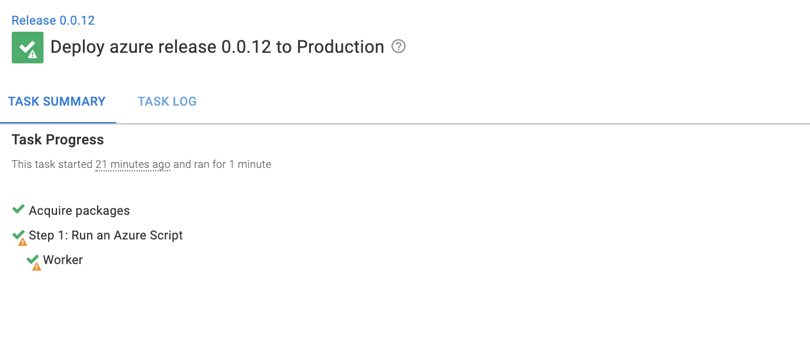

In a deployment flow, there are several options. Commonly there is a build server that pushes images to a central repository. The image can then be deployed to a cloud service. In this blog, we demonstrate how Octopus can work with a range of build servers, cloud repositories and cloud targets.

## Build Servers

The role of a build server is to take raw code, build it, and package it into a form ready for deployment. A common way for a build server to do this is through yaml configuration files. For the demonstration, we are going to build and push a sample web application called Random Quotes

### Travis CI

### Github actions

### Circle CI

## Repositories

### Docker

#### Google Container Registry

### Octopus Deploy

### Built-in repository

## Cloud targets

### Azure

### Google Cloud Platform

### Amazon Web Services

http://terence-test-s3.s3-website.us-east-2.amazonaws.com/web/index.html

