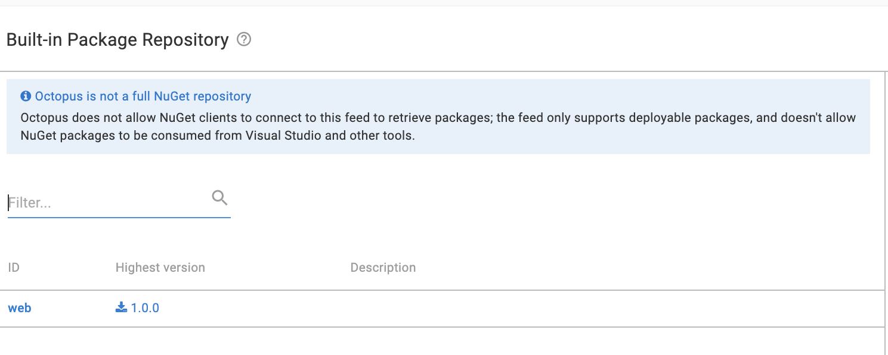

In a continuous deployment, a build server builds and pushes images to a central repository. The image can then be deployed on premise or to a cloud service. There are several vendors that an organization could choose for continuous deploymnet.  Within organizations, affinity to certain vendors can vary from team to team. There is the added overhead of learning the UI of each vendor. 

In this blog, we demonstrate how Octopus can work with a range of build servers, cloud repositories and cloud targets. Octopus can be the main orchestrator with one simple UI and bring all these services together into one place.

## Flow Diagram

## Build Servers

The role of a build server is to take raw code, build it, and package it into a form ready for deployment. A common way for a build server to do this is through YAML configuration files. For the demonstration, we are going to build and push a sample web application called Random Quotes to two container registries, Docker Hub and Google Container Registry.

The repository is forked from the Octopus Deploy [samples repository](https://github.com/OctopusSamples/RandomQuotes-JS). Each build server requires a config folder in the root level containing a YAML configuration file. The repository is configured to contain access keys to the build server and container registry. These keys are used in the YAML file to authenticate, build and push an image. I used Github Actions to push to the Google Content Registry and Travis CI and CircleCI to push to DockerHub. Each build server can push to any content registry, and there are other content registries such as Azure Content Registry that can be used. There are other build servers such as Jenkins or TeamCity, I focussed on a few that were free to set up.

For a step by step guide in how to set up a YAML configuration file in Github, see my post on [Github/Docker]

The result of this step is a build success message in each build server, confirming that the image has been pushed to the container registry.

### Github Actions

Github Actions is a workflow automation tool that adds continuous delivery to Git repositories within the repository itself. There are step templates for many types of deployment and I was able to deploy to Google Conatiner Registry and Docker easily by using the templates.

### Travis CI

Travis CI is an open source continous delievery tool. It is free to sign up and contains Github integrations. I connected my Github respository to Travis CI and it automatically detects changes on the repository and triggers a build. In my limited time with the tool, I did not see a templating function to help me with building a workflow, however there were ample resources online for me to use. One thing I did notice was that my solution called a script to deploy to DockerHub whereas other build servers would have the call in the step explicitly. 

### Circle CI

Circle CI is another build server alternative that is free to start. It also contains Github integrations. I found that the ability to import template YAML configuration files was helpful in quickly setting up a deployment flow. I could select the language of the package and Circle CI would populate the step template and I just neeeded to fill in the blanks.

## Repositories

A content repository is a place to store deployable images or packages. Octopus Deploy references these repositories and orchestrates the deployment to a target. Octopus Deploy has integrations with Docker Hub, Google Container Registry as well as others like Azure Container Registry and AWS Elastic Container Registry.

### Docker Hub

Docker Hub is a central repository for Docker images. It is free to sign up and create public repositories.

### Google Container Registry

Google Container Registry is a container registry for the Google Cloud Platform. I did not see a way to deploy to Google Cloud run using a Docker Hub image directly. I found that I had to pull a Docker Hub image and push it to Google Container Registry. To complete the flow I added the Google Container Registry to the Github Actions step to push to Google Container Registry directly.

### Built-in repository

Octopus Deploy contains a built-in repository to manage local packages. This can be useful for self-managing the packages that are deployed or keeping them private.

### Octopus Deploy

The steps below is where Octopus Deploy enters the picture. Once the image or package is uploaded to the repository, Octopus Deploy can retreive the image and choose a number of steps to deploy to different targets. The benefit is that Octopus is the central orchestrator with one UI and a standard experience. 

### Azure

Octopus Deploy deploys to Azure via the Azure script. It references the random quotes image, authenticates with an Azure account and uses the Azure CLI to create a web application. For a step by step guide on how to deploy to Azure see [Deployable Package]().

### Google Cloud Platform

The gcloud in a script step was introduced in Octopus Deploy 2021.2. The step uses the gcloud CLI installed on a custom worker, authenticates with the Google Cloud Platform and deploys the Google Container Registry image to a new web application.

### Amazon Web Services

To demonstrate Octopus Deploy's ability to orchestrate many different tagets and sources, I used the built-in repository to deploy a local package to an Amazon S3 bucket. This bucket can host static html, and I have used it to host a package from [an earlier post]().

http://terence-test-s3.s3-website.us-east-2.amazonaws.com/web/index.html

In this post, you have learned how build servers, content repositories and deployment targets can all work together with Octopus deploy to create happier deployments. 

