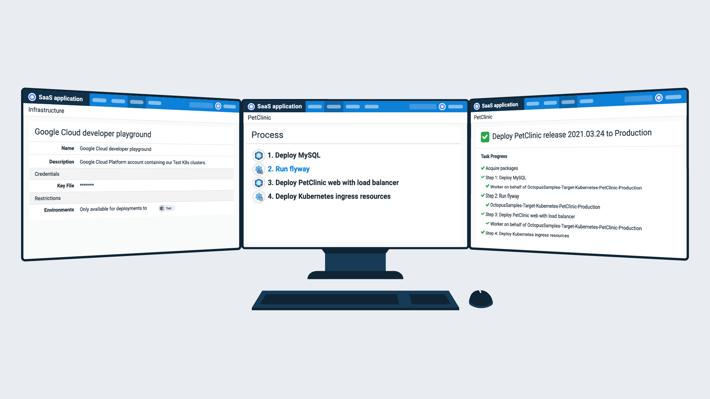

The Octopus 2021 Q3 release is now available.

Built-in support for Google Cloud makes it easier to manage deployments and runbook automation on Google infrastructure — including containerized applications with Kubernetes.

Other features allow you to:

- Integrate Octopus Deploy with business workflows using our no-code Workato connector
- Authenticate to Active Directory via LDAP when you're self-hosting Octopus on Linux
- Create more dynamic run conditions with new variable substitution (Octostache) filters

## Included in the Q3 release

- Octopus Server 2021.2 ([release notes](https://octopus.com/downloads/whatsnew/2021.2))
- Workato connector for Octopus Deploy 5
- Tentacle 6.1.736
- Terraform Provider for Octopus Deploy 0.7.58

## Long term support

The following table shows the Octopus Server releases with long term support. 

| Release               | Long term support              |
| --------------------- | ---------------------------    |
| Octopus 2021.2        | Yes                            |
| Octopus 2021.1        | Yes                            |
| Octopus 2020.6        | Yes (until 30 September 2021)  |
| Octopus 2020.5        | Expired                        |

## Release Tour

<iframe width="560" height="315" src="https://www.youtube.com/embed/j3jTawfQuJo" frameborder="0" allowfullscreen></iframe>

## Google Cloud Platform

Dedicated integration with Google Cloud Platform (GCP) means you can:

- Connect and authenticate with GCP via a dedicated account type
- Use gcloud, the GCP command-line tool
- Create and tear down GCP infrastructure with Terraform
- Store and secure your Docker images in the Google Container Registry (GCR)
- Deploy, scale, and manage containerized applications on GCP with Octopus and Kubernetes 

Learn how to get started in our post [Introducing Google Cloud Platform integration for Octopus Deploy](https://octopus.com/blog/google-cloud-platform-integration).

## Kubernetes deployments and runbooks on Google Cloud

Octopus Deploy makes it easy to manage your Kubernetes resources, whether you're starting simple or want complete control over a complex setup.

We've supported Kubernetes deployments for 3 years and added Runbooks in 2020. Fully-featured support for GCP in 2021.2 delivers the ultimate Kubernetes experience for engineers and operations professionals.

- Centralize your Kubernetes clusters and resources in a single place so you can focus on your applications and customers
- Use built-in service accounts for simple and secure authentication
- Streamline your deployments and runbooks with shared variables
- Implement deployment patterns like blue/green, canary, and rolling deployments
- Use pre-approved kubectl scripts
- Automate routine maintenance and respond more quickly to emergencies

Our Kubernetes automation supports three approaches:

1. A structured UI step that guides you through the configuration without any YAML input
2. A fully flexible step configured with raw YAML
3. Helm chart automation steps

Learn more about our [Kubernetes support](https://octopus.com/docs/deployments/kubernetes) in our documentation.

### Register for the webinar: Kubernetes on Google Cloud with Octopus

Join us at next month's webinar to learn how Google Cloud, Octopus Deploy, and Octopus Runbooks deliver the ultimate Kubernetes experience. [Register now](https://octopus.com/events/gcp-kubernetes-deployments-and-provisioning-with-octopus). 

## Octopus Workato connector

Workato is an Integration Platform as a Service (iPaaS) to integrate apps and automate business workflows. It connects a vast library of apps across different industries and job functions.

Our new Workato connector makes it easy to:

- Include Octopus Deploy in Workato workflows without writing code
- Perform operations against Octopus Deploy, such as create and deploy releases
- Create recipes that respond to events in Octopus through a trigger

Here are some ideas to get you started:

- Trigger a deployment from other systems such as Slack, Microsoft Teams, or Jira
- Publish updates to other systems after development, test, or production deployments:
  - Push notifications to Slack
  - Automatically update tickets in other systems such as Jira, Zendesk, and ServiceNow

Learn how to get started in our post [Introducing the Workato connector for Octopus Deploy](https://octopus.com/blog/introducing-workato-connector).

## LDAP provider

Octopus 2021.2 includes support for the Lightweight Directory Access Protocol (LDAP). LDAP is a protocol for interacting with directory servers.

Our LDAP authentication provider opens up more use cases for Octopus customers:

- Authenticate to Microsoft's Active Directory when self-hosting Octopus on Windows or in a Linux container
- Interact with other directory servers like OpenLDAP
- Support users with non-Windows clients, including macOS

Learn how to [get started with the LDAP auth provider for Octopus Deploy](https://octopus.com/blog/getting-started-with-ldap-auth-provider).

## New variable substitution filters

Octopus allows you to define variables and reference them in deployment steps, runbooks, and files.

In 2021.2, we added the comparison filters `Contains`, `Match`, `EndsWith`, and `StartsWith` to Octostache, the variable substitution syntax for Octopus Deploy.

These filters are useful for specifying the condition in an `#{if}` block. They return `true` or `false` depending on the result of the comparison.

Learn more about variable substitution [comparison filters](https://octopus.com/docs/projects/variables/variable-filters#VariableSubstitutionSyntax-ComparisonFilters) in our documentation, or check out our post [Creating dynamic run conditions with new Octostache filters](https://octopus.com/blog/variable-run-conditions-with-octostache).

## Breaking changes

This release includes one breaking change.

### Steps that use bundled tools require the `OctopusUseBundledTooling` property

The new upgrade script sets the `OctopusUseBundledTooling` property to `False` for steps that use an execution container. Otherwise, the script sets the property to `True` or respects the legacy variables. This change only impacts users with custom Windows execution containers who rely on Octopus to inject the Azure or AWS tooling. Read about the workaround for that use case [in the GitHub issue](https://github.com/OctopusDeploy/Issues/issues/6999).

## Upgrade or get started

Octopus Cloud users are already running this release, and self-hosted Octopus customers can download the latest version now.  

<a class="btn btn-success" href="https://octopus.com/downloads/2021.2.0">Download the latest version</a>

We encourage you to review the [steps for upgrading Octopus Server](https://octopus.com/docs/administration/upgrading). Please see the [release notes](https://octopus.com/downloads/whatsnew/2021.2) for further information.

If you've never used Octopus before, [sign up](https://octopus.com/start) for a free trial or [email our Customer Success team](mailto:customersuccess@octopus.com) to see a demo and learn more.

## What's coming in future releases?

Check out our [public roadmap](https://octopus.com/roadmap) to stay informed and register for updates.

## Conclusion

Octopus 2021 Q3 delivers Google Cloud support with centralized Kubernetes deployments and runbooks.

This release also includes the Workato connector for Octopus, our new LDAP provider, and new variable substitution filters for Octostache.

We look forward to shipping more great features in the next release.

We'd love to hear from you with any questions or comments. You can leave a comment below or join the conversation in our [Octopus Community Slack](https://octopus.com/slack).

Happy deployments!
