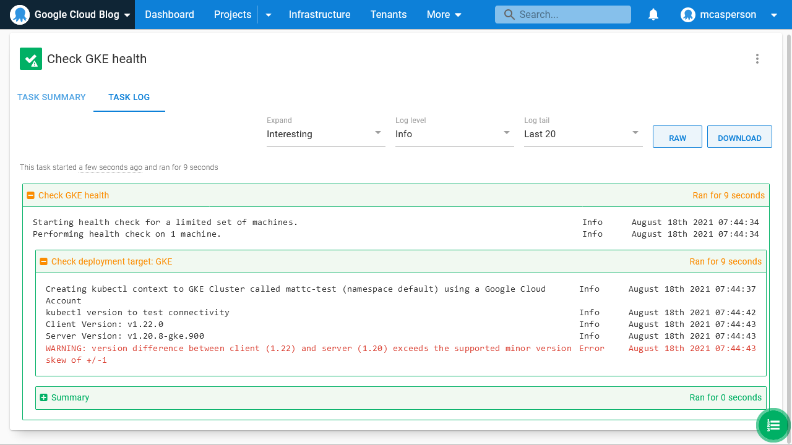

Octopus 2021.2 brings a number of features to support teams deploying to the Google Cloud Platform (GCP). With 2021.2, Octopus has core support for the AWS, Azure, and Google Cloud platforms.

This post introduces the new features in Octopus supporting GCP deployments and provides tips on how they can be used in your own deployment processes.

At the end of the post, you can provide your feedback about how these new features work, or don't work, for you, and suggest future GCP features.

## Service account support

Octopus includes a new account type called **Google Cloud Account**. This account securely stores a JSON key generated for a service account:


## Inheriting VM service accounts

For teams that prefer to manage credentials outside of Octopus, each integration with GCP allows a service account to be inherited from a Worker. 

Here is a Google Compute Engine (GCE) VM with an associated service account:


This VM has a Worker Tentacle installed on it and linked to the **GCP** Worker Pool:


We can then use the service account associated with the VM. Here's an example of a Kubernetes target configured to inherit the credentials of the Worker it's run on:


Note that the target must be configured with the Worker Pool containing the GCE worker:


Operations like health checks and deployments are performed with the credentials assigned to the worker VM, removing the need to store those details in Octopus:



## Google Container Registry support

Google Container Registry (GCR) support has been included in the existing Docker feed type. Define the feed URL as one of the [regional GCR URLs](https://cloud.google.com/container-registry/docs/pushing-and-pulling#add-registry) and supply a service account JSON key for authentication.

:::hint
To query GCR feeds, the **Cloud Resource Manager** API must be enabled. This can be done [in the Google Cloud Platform dashboard](https://console.developers.google.com/apis/api/cloudresourcemanager.googleapis.com/overview). Without this API, image searches return no results in Octopus.
:::


Images are then available from the GCR feed:


## Support for gcloud script

A new step called **Run gcloud in a Script** is available to run scripts in the context of a GCP account. 

Any scripts run as part of this step can take advantage of the login process managed by Octopus. This allows the script to focus on the operations it needs to perform, rather than the boilerplate process of logging in:


## Terraform support

The Terraform steps include the ability to establish a context with the selected Google credentials, lifting this concern from the Terraform template and into the step.

:::hint
Deploying Terraform requires the ability to persist state. A convenient solution for Google users is to [save Terraform state in a Google Cloud Storage (GCS) bucket](https://www.terraform.io/docs/language/settings/backends/gcs.html):

```hcl
terraform {
  backend "gcs" {
    bucket  = "octopus-tf-state" # change this to match the name of your GCS bucket
    prefix  = "terraform/state"
  }
}
```
:::


## Conclusion

With support for GCP service accounts, GCR feeds, GKE authentication options, a dedicated GCP script step, and Google authentication support in Terraform, Octopus 2021.2 makes it easy to deploy to and manage your GCP infrastructure.

## We want your feedback

We would love to hear your feedback! We have a [GitHub issue where you can post a comment](https://github.com/OctopusDeploy/StepsFeedback/issues/7) about how these new features work, or don't work, for you, as well as any suggestions for future GCP features. All feedback is welcome, and we'd love to know:

- What deployments or operations tasks do you perform to GCP today?
- What are the pain points when deploying to or managing GCP?
- Do you use platforms like Google Kubernetes Engine, Google App Engine, Google Cloud Functions, Google Cloud Run, or others?
- Do the new features work for you? If not, what suggestions do you have that could improve them?

<span><a class="btn btn-success" href="https://github.com/OctopusDeploy/StepsFeedback/issues/7">Provide feedback</a></span>

Happy deployments!
