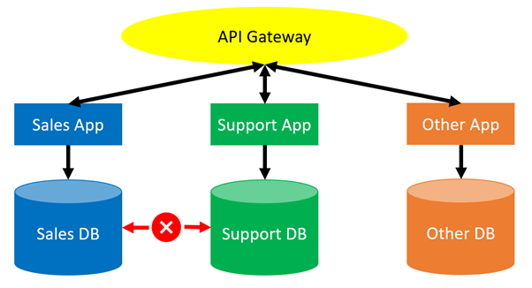
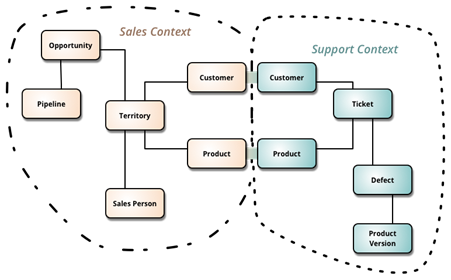

This blog post is part 4 of my safe schema updates series.

Links to the other posts in this series are available below:

!include <safe-schema-updates-posts>

In part 2 of this series we discussed the idea of resilience vs robustness. We talked about the value of designing systems where failure is acknowledged, contained and rapidly resolvable.

In part 3 we explore the true meaning of "continuous integration", beyond automated builds. The central idea is to reduce the amount of work in progress and the need for complicated integrations or merges.

In this post we imagine a software and database architecture that intrinsically supports both the development and maintenance of resilient systems. This architecture is also a great enabler of continuous integration, since it significantly reduces the amount of concurrent work on any one component. Hence, this architecture naturally results in safer systems that are easier to develop, test, deploy and maintain.

This post will focus on technical details. However, arguably the human and cultural consequences of adopting this architecture are of equal or greater significance. I’m going to leave out the human aspects in this post, not because I don’t think they are important, but because I feel they are so fundamental that they deserve their own dedicated post. You can look forward to that in part 5.

I’m also not going to talk about the practicalities associated with building or refactoring existing systems into shape. For now we’ll just imagine what better might look like, and we’ll worry about how to deliver it in later posts.

In part 1 of this series I described the creation of a typical monolithic database, which supports a myriad of critical services. If you’ve worked with databases for a while, you’ve probably dealt with one of these before. I won’t repeat the problems they cause here, so if you’d like a recap, this would be a good point to [re-read part 1](https://octopus.com/blog/safe-schema-updates-1-delivery-hell). Suffice to say, it’s difficult to deliver updates regularly and reliably to monolithic systems. When these systems fail, and they often fail, it’s usually a disaster.

## Loosely coupled databases for faster, safer delivery

What if each service managed its own data?

For example, whenever our imaginary “Support” service needed to access data from our equally imaginary “Sales” service, the services could communicate using some API or other communication tier, rather than direct database calls. This would enable the teams who look after each service to be responsible for their own data, so long as their API remains available.

The database administration concerns for each service are isolated from each other. Large datasets are split into smaller, more manageable datasets. The complexity of releases to any one service are significantly reduced since dependency management just got a lot simpler. It’s relatively easy to create simple tests for any API calls that each subsystem needs to support, without needing to concern ourselves with which dependent systems are actually using them.

Of course, the API chatter might grow, and that’s a new problem that needs to be managed. However, through patterns like infrastructure as code, automatic scaling and chaos engineering, those issues are easier and safer to manage than the challenges associated with monolithic, single-point-of-failure database refactors.

## Domain-driven design and bounded contexts

Some readers will think this architecture is unrealistic. For example, both the sales and the support systems need access to similar customer data. If they need access to the same data, how can the databases be split up?

For these people, I recommend taking an evening to read Vaughn Vernon’s [Domain-Driven Design Distilled](https://octopus.com/blog/devops-reading-list#ddd), a short and more accessible version of Eric Evans more thorough [Domain-Driven Design](https://www.goodreads.com/book/show/179133.Domain_Driven_Design).

Vernon and Evans describe a process for data modeling that puts the concept of bounded contexts front and center. In fact, my sales and support example above, as well as the image below, are both taken from [Martin Fowler's excellent BoundedContext blog post](https://martinfowler.com/bliki/BoundedContext.html):

*Image source: [https://martinfowler.com/bliki/BoundedContext.html](https://martinfowler.com/bliki/BoundedContext.html)*

In this example, the teams who look after the sales and support applications have agreed on a ubiquitous data structure for a product and a customer and they have made their data available through APIs to other services. For example, the sales and support databases might both have identical customer and product tables, with some unique field(s) used to identify matches. The APIs would have an agreed set of methods for retrieving data and these methods would be tested routinely through the build/deployment pipeline.

## Smaller systems are easier to provision, develop and test

Now that the sales and support databases *do not* interact directly, many engineering challenges become easier to solve.

When a developer for the support system wishes to provision a dev environment to complete a task, they do not need to provision the entire global system and all the dependencies - all they need is the support system.

If they need data from the sales system, in most cases it could be mocked, but where both systems really are required, that’s no issue.

These two services are probably just two of many, so the overall size of the dev environment is still considerably reduced compared to deploying the entire monolith.

This smaller dev environment is faster and cheaper to deploy. Data masking, privacy and storage concerns are significantly reduced. The overall complexity of the system is much easier to manage and dependencies on other systems are explicit and testable.

## Loose coupling enables Continuous Integration

As discussed in part 3, Continuous Integration (CI) teaches us that we should prioritize the completion and integration/deployment of existing work in progress (WIP) over the creation of new WIP. That goes for any and all dev work that exists in any place and has not yet been successfully merged, deployed to production and validated. Without the prioritization of merging over diverging, we end up with ever-increasing amounts of WIP, which has enormous hidden costs.

When we have a large, monolithic system, perhaps with a hundred developers across a dozen teams, our CI problems are significant. With so many tasks being performed in parallel on the same codebase, it’s difficult to manage everything. This is often where we see complicated branching plans and jumbled up dev environments, containing a mess of half-finished or long-since abandoned dev and test code.

However, if those ten teams are generally working on separate, loosely coupled services, each in their own repository, the complexity associated with managing the changes for any given service is exponentially reduced. Each service will only ever have a handful of concurrent tasks under development at any one time.

This level of complexity could, for example, be practically comprehended and managed during a short daily team stand-up. Branch plans become simpler and release co-ordination concerns evaporate, as long as all the required APIs remain available.

With more loosely coupled systems it’s much easier for developers to integrate their work, continuously. This significantly reduces challenges associated with WIP, environment drift, branch hell, politics and project management overheads.

What’s more, loosely coupled systems scale up in a manageable way. If the idea of a dozen teams working on the same monolithic backend terrifies you, imagine the challenges associated with Amazon or Google scale systems.

If you anticipate that your system is likely to grow (and as long as companies stay in business, their critical systems tend to grow), it’s wise to design your systems with loose coupling in mind from the very beginning.

## Loose coupling creates fire breaks

Given enough time, everything breaks. That’s true for monolithic systems and it’s true for loosely coupled services. Failures will still happen, but loosely coupled systems are more resilient: the data eggs are no longer all in the same basket.

Each service would host its data independently. If a meteor strikes the data centre hosting the sales service, the support service might not be affected. In this way, failures are better isolated, and the affected services are smaller, simpler and easier to fix. All this has been achieved without slowing down the pace of development. In fact, development is simpler and safer now.

Of course, there are certain rules we need to follow.

Each service needs to be designed to fail/degrade gracefully when dependent services are unavailable. For example, the support system should be designed such that it can still run, possibly with degraded functionality, when the sales service is unavailable. Perhaps the support team might lose some functionality and visibility of the sales data, but they should still be able to conduct core support operations.

As a developer, it becomes critical to test dependencies. If you are dependent on an API call to another service, you should ensure that there’s a test in place to verify the dependency, and you should be designing systems to fail gracefully and log an error if the API call fails.

With a monolith, that poorly tuned upgrade script might have caused a global outage. With loose coupling, we’ve only taken down the sales system, reducing the impact of the failure. Additionally, since the loosely coupled sales system is so much smaller than the old monolith, it’s much easier to bring it back online quickly.

## Next time

In this post (post 4) we imagined a more loosely coupled architecture. This architecture was more resilient to failure since it created natural fire breaks. What’s more, smaller services are generally easier and faster to develop and restore.

Additionally, the more granular nature of the system made it easier to manage different flows of work. The significant reduction in concurrent work streams for any given service reduces the project management/release management/branching overheads.

Taken alone, these points will result in significantly safer database releases. However, the benefits are compounded by human factors. In the next post (post 5), we look at those human factors in more detail. 

Links to the other posts in this series are available below:

!include <safe-schema-updates-posts>

## Watch the webinars 

Our first webinar discussed how loosely coupled architectures lead to maintainability, innovation, and safety. Part two discussed how to transition a mature system from one architecture to another. 

### Database DevOps: Imagining better systems

<iframe width="560" height="315" src="https://www.youtube.com/embed/oJAbUMZ6bQY" title="YouTube video player" frameborder="0" allow="accelerometer; autoplay; clipboard-write; encrypted-media; gyroscope; picture-in-picture" allowfullscreen></iframe>

### Database DevOps: Building better systems

<iframe width="560" height="315" src="https://www.youtube.com/embed/joogIAcqMYo" title="YouTube video player" frameborder="0" allow="accelerometer; autoplay; clipboard-write; encrypted-media; gyroscope; picture-in-picture" allowfullscreen></iframe>

Happy deployments!
