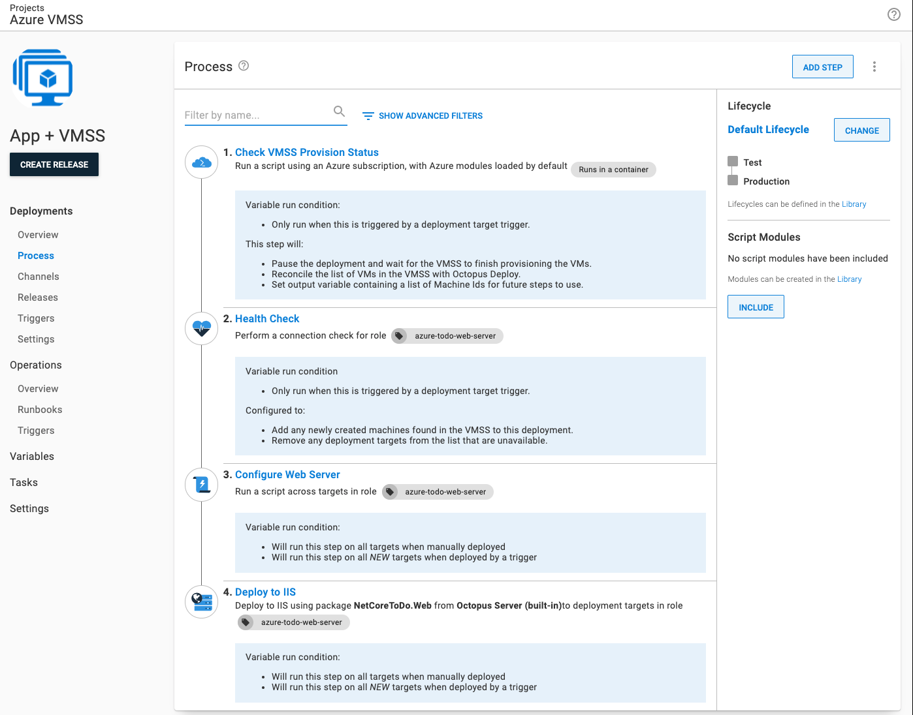
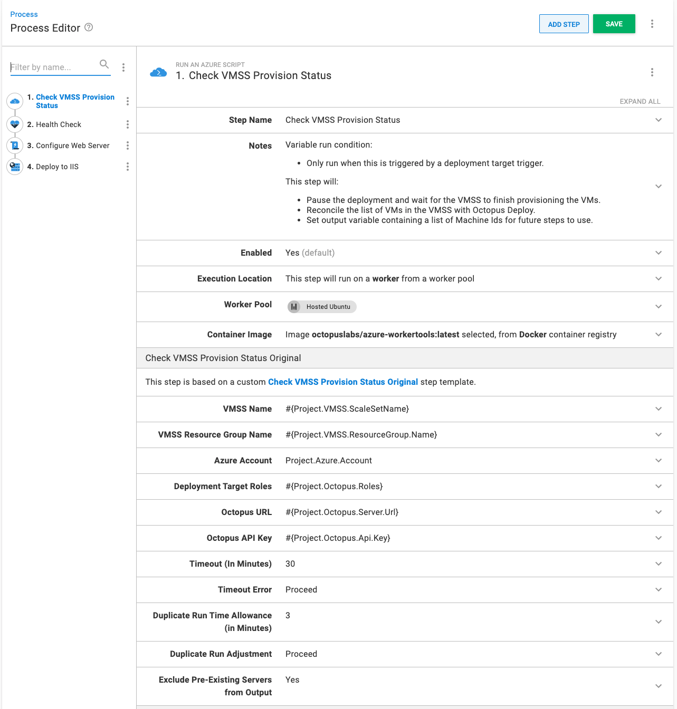
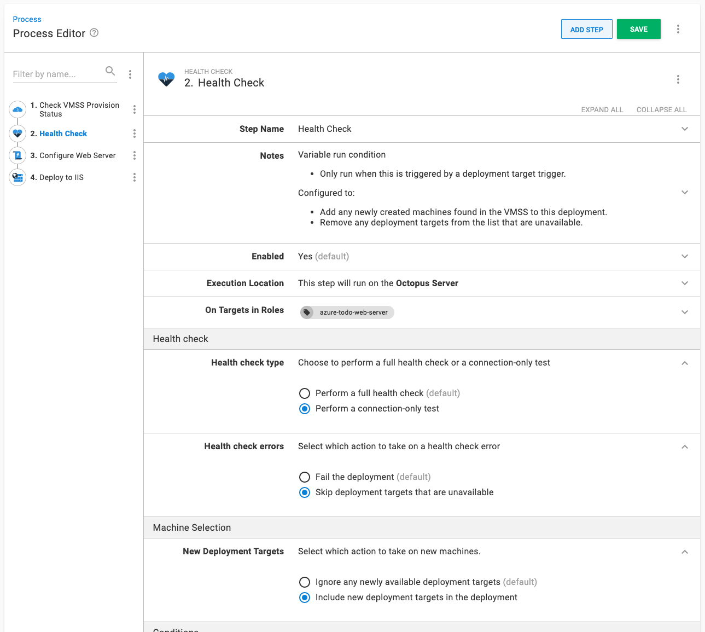
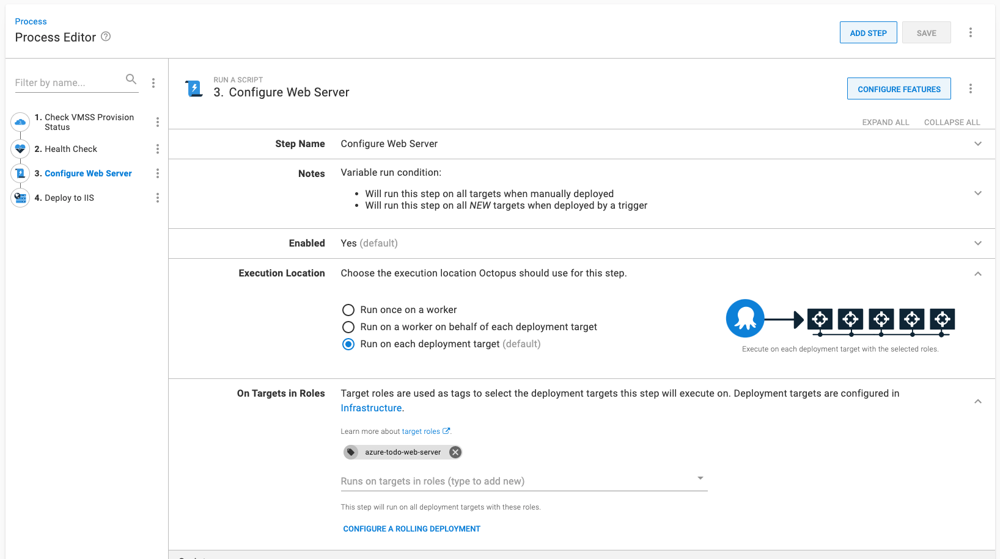
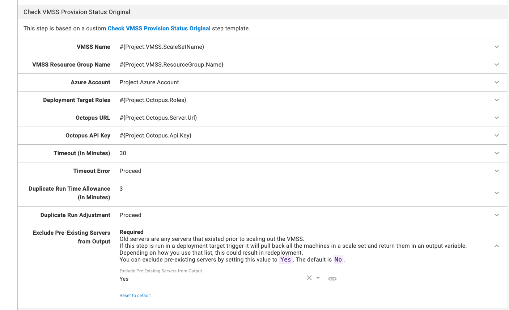
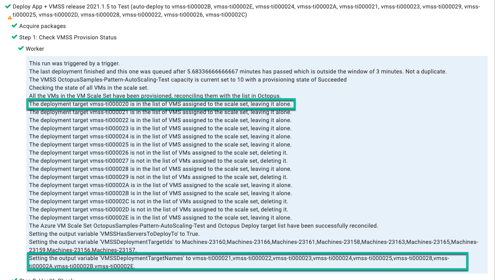
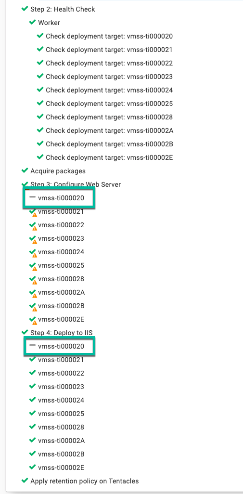
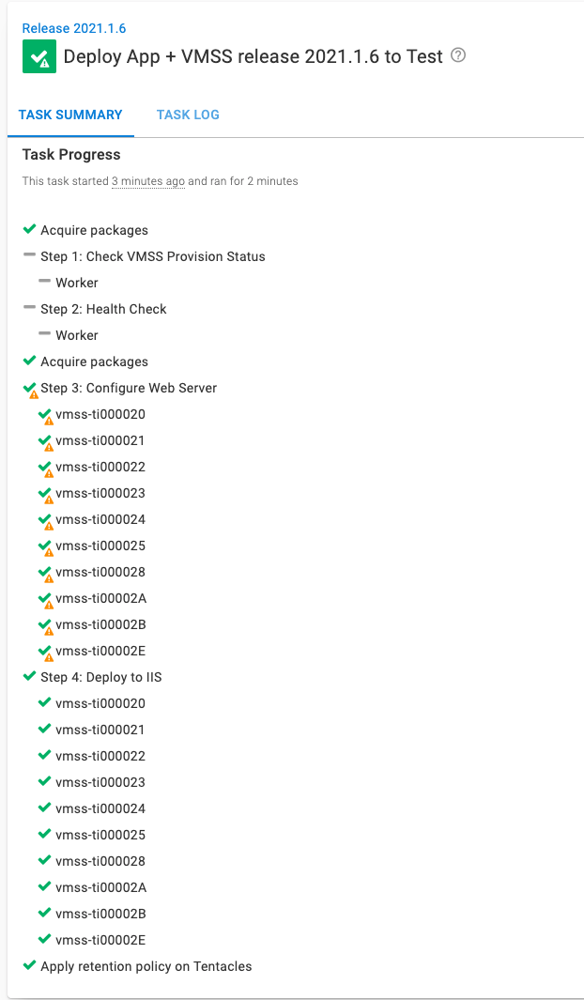
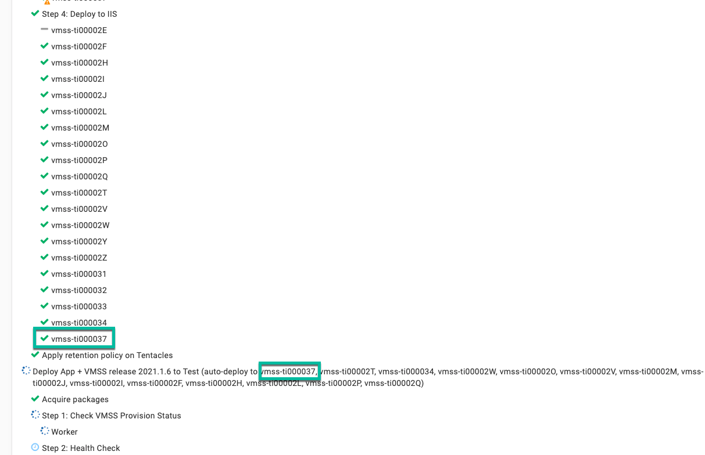
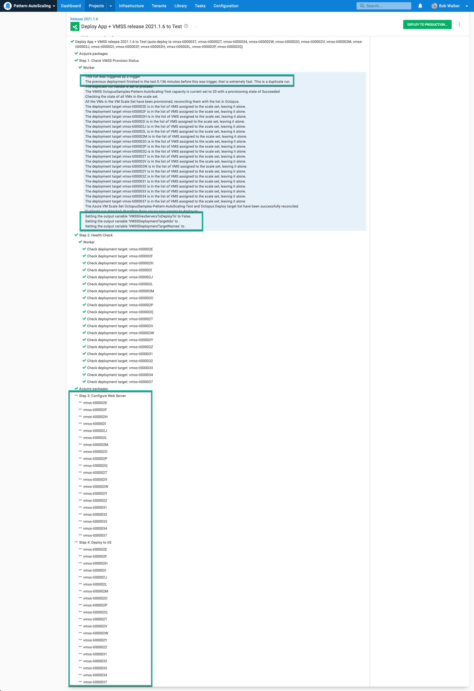

One feature of Octopus Deploy I love using is [variable run conditions](https://octopus.com/docs/projects/steps/conditions#variable-expressions).  Variable run conditions allow you to skip steps based on business logic.  When combined with [output variables](https://octopus.com/docs/projects/variables/output-variables), they're a powerful tool.  

In our 2021.2 release, the filters `Match` and `Contains` [were added to Octostache](https://octopus.com/docs/projects/variables/variable-filters#VariableSubstitutionSyntax-ComparisonFilters).  

!include <octopus-2021-q3>

In this post, I walk you through how to combine variable run conditions with output variables and the new `Contains` filter.

## The scenario

I've been helping a customer use Octopus Deploy with [Azure virtual machine scale sets](https://docs.microsoft.com/en-us/azure/virtual-machine-scale-sets/overview).  Virtual machines can be added or removed on a schedule or based on metrics.  An example of a metric-based rule is, if CPU usage is 60% for 10 minutes, then add more virtual machines.  

For our customer's scenario, the items to note are:

- At night, they scale down the number of virtual machines in the scale set
- In the morning, they add 10+ virtual machines to the scale set
- They use a standard image, but each application installs and configures additional back-end software (IIS, MSMQ, .NET, etc.)

The customer uses [deployment target triggers](https://octopus.com/docs/projects/project-triggers/deployment-target-triggers), to trigger a deployment when a new deployment target is added.

## The problem to solve

From afar, everything looks great and works as it should, but zoom in and there's a timing problem:

- The virtual machine scale set can't finish provisioning all virtual machines simultaneously.
- Octopus Deploy is unaware of virtual machine scale sets; it grabs a batch of new deployment targets and does the deployment.
- It takes 30+ minutes for each application to finish installing and configuring back-end software.
- By default, Azure virtual machine scale sets have over-provisioning enabled.  Ask for 10 additional virtual machines, and 14 are initially created.  Once 10 virtual machines are successfully running, the additional 4 are deleted.  But those 4 register themselves with Octopus Deploy.

Each morning, scaling out the number of virtual machines takes twice or triple the amount of time than it should.  For example, if they increase their virtual machine count from 5 to 25, this happens:

1. Azure creates 27 new virtual machines (instead of 20) and starts the provisioning process.  
2. The virtual machines come online and register themselves with Octopus Deploy in a scattershot fashion.
3. The deployment target trigger in Octopus Deploy selects 5 to 8 virtual machines and starts the deployment.
4. The deployment starts installing additional software.
5. Then 90–180 seconds later, the remaining virtual machines finish provisioning.
6. Azure removes the additional 7 virtual machines.
7. That first deployment slows down because one of those 7 virtual machines was in the first batch. Octopus is waiting for a timeout to occur.
8. The first deployment finishes 30 minutes later.
9. The deployment target trigger picks up the remaining machines.
10. The second deployment finishes over an hour after the virtual machines were added to the virtual machine scale set.

As a result, the customer starts the scale-out much earlier in the morning.  They need to ensure there are enough virtual machines for the start of the business day.

## Solution requirements

Waiting over an hour isn't acceptable.  While schedules can be tweaked, there's still the problem of scaling because of an unexpected load.  This is when the customer asked:

> How hard is it to configure Octopus to pause a deployment while a virtual machine scale set finishes provisioning all the new virtual machines?

After a discussion, we landed on these requirements:

- Octopus should pause and wait for the virtual machine scale set to finish provisioning.
- All the new virtual machines should be configured and deployed at the same time.
- All the existing virtual machines should be skipped.
- A single deployment process should handle both manual deployments and deployments created by the deployment target trigger.

## The solution

I knew solving this would use the new [Check VMSS Provision Status](https://library.octopus.com/step-templates/e04c5cd8-0982-44b8-9cae-0a4b43676adc/actiontemplate-check-vmss-provision-status-(deployment-targets)) step template (which I wrote to help solve this customer's problem), the [Health Check step](https://octopus.com/docs/projects/built-in-step-templates/health-check), and a [variable run condition](https://octopus.com/docs/projects/steps/conditions#variable-expressions).

The simplified deployment process is:

1. **Check VMSS Provision Status**: only run when a deployment target causes the deployment
2. **Health Check step**: only run when a deployment target causes the deployment
3. **Configure Web Server**
4. Deploy the application



All the steps in this deployment process use a variable run condition.  Steps 1 and 2 only need to run when a deployment target trigger causes the deployment.  I cover steps 3 and 4 in the next section.

```
#{unless Octopus.Deployment.Error}#{if Octopus.Deployment.Trigger.Name}True#{/if}#{/unless}
```

### Check VMSS Provision Status

**Check VMSS Provision Status** is a new step template with the following functionality:

- It waits until the VMSS finishes provisioning all the virtual machines in the scale set.
- After the VMSS finishes provisioning, it reconciles the list of virtual machines in the scale set with Octopus Deploy. Any additional deployment target registrations are removed.
- Set output variables containing machine names, machine IDs, and a boolean value indicating if new deployment targets were added.

Add that step to the top of the deployment process.

Don't forget to set the run condition to the value from earlier.



### Health Check step

The **Health Check step** will add all the new virtual machines to the deployment.  The **Health Check step** is how we deploy to _all_ new virtual machines added to the scale set, not just the ones that caused the deployment target trigger to fire.

Set the following options:

- **On Targets in Roles**: the same role as the deployment targets.
- **Health check type**: perform a connection-only test (the initial health check done by the machine policy took care of the full health check, so there's no need to do it again).
- **Health check errors**: skip the deployment targets that are unavailable.
- **New Deployment Targets**: include new deployment targets in the deployment.



## Skipping existing virtual machines

The **Health Check step** will add _all_ the virtual machines in the scale set to the deployment.  That's a problem because one requirement is that all existing virtual machines should be skipped during the deployment.  In a nutshell, this would happen:

1. The number of virtual machines in the virtual machine scale set is increased from 5 to 25.
2. Deployment target trigger would see 7 new deployment targets and start a deployment.
3. The check VMSS provision status step would wait until the remaining 13 deployment targets were added.
4. The health check step would add in the new 15 deployment targets, and the pre-existing 5 deployment targets.

The **Health Check step** increased the number of deployment targets for the trigger from 7 to 25, rather than 20 (the number of new virtual machines).  I need to skip 5 of those deployment targets.

A little-known fact about variable run conditions is that they run for each deployment target when a step is configured to execute on a role.



That means when I have 25 deployment targets, it runs the variable run condition 25 times. Anytime the variable run condition returns `False,` it skips that deployment target.  

:::hint
The same is true for parent/child steps or rolling deployments.  To keep this simple, rolling deployments are outside the scope of this post.
:::

Getting the deployment target ID is trivial; use `#{Octopus.Machine.Id}`.  I need a list of _new_ virtual machines to compare to that ID.

This is where the [Check VMSS Provision Status](https://library.octopus.com/step-templates/e04c5cd8-0982-44b8-9cae-0a4b43676adc/actiontemplate-check-vmss-provision-status-(deployment-targets)) step template comes in.  As mentioned, it creates an output variable containing a list of all the deployment target IDs added to the virtual machine scale set.



In this example run, the virtual machine `vmss-ti000020` already exists, and it excludes that from the output variable.



Now I have a list of newly created deployment targets AND the specific deployment target to deploy to.  The last puzzle piece is a variable run condition.  This is where the new `Contains` [variable filter comes in](https://octopus.com/docs/projects/variables/variable-filters#VariableSubstitutionSyntax-ComparisonFilters).  

The `Contains` filter checks to see if one string contains another string.  `Match` works the same way, but it uses regular expressions.  With my use case, a regular expression is overkill.

Here is the run condition in full:

```
#{unless Octopus.Deployment.Error}
    #{if Octopus.Deployment.Trigger.Name}
        #{Octopus.Action[Check VMSS Provision Status].Output.VMSSDeploymentTargetIds | Contains #{Octopus.Machine.Id} }
     #{else}
        True
     #{/if}
#{/unless}
```

The run condition is saying:

1. If there is an error, then don't run this step.
2. When doing a manual deployment, then deploy to all deployment targets.
3. When a trigger caused the deployment, check to see if the current deployment target is in the output variable from the step template.  If it is not, then skip that deployment target.

Continuing on from the previous screenshot, we can see that `vmss-ti000020` was skipped.



Manual deployments will skip steps 1 and 2, and run steps 3 and 4, on all deployment targets.



## One final gotcha

In some of my practice deployments, the deployment target trigger would run a second deployment within one minute of finishing the first deployment.  That happened despite the previous deployment deploying to all the machines.  



That's problematic; you don't want to redeploy and cause an outage.  Thankfully the [Check VMSS Provision Status](https://library.octopus.com/step-templates/e04c5cd8-0982-44b8-9cae-0a4b43676adc/actiontemplate-check-vmss-provision-status-(deployment-targets)) handles that.  It detects a duplicate run by calculating the difference between the queue time of the current deployment minus the finish time of the previous deployment.  If the difference is less than 3 minutes, it's a duplicate run.  You can configure the step template to cancel the current deployment or let it proceed.

But that isn't required. We configured the step earlier to remove pre-existing machines.  A pre-existing deployment target is one that existed 3 minutes before the trigger fired.  Unless your deployments take less than 3 minutes, all the existing deployment targets from the first run are excluded.  



Our pre-existing combination of the new variable filters combined with output variables and run conditions handles this scenario without additional configuration.  For you, it might be a moot point.  That tended to happen when I added more than 10 virtual machines to a virtual machine scale set in my testing.  

## Conclusion

When you combine Octostache, output variables, and run conditions, you get a robust deployment process.  The addition of the `Contains` and `Match` filters in Octostache has made the combination even more powerful.  Instead of index matching or looping, you can use easier to maintain `Contains` comparisons.

If you have questions on how to combine Octostache, output variables, and run conditions in your deployment process, reach out to the Customer Success team at [customersuccess@octopus.com](mailto:customersuccess@octopus.com).  We'd love to help.

Happy deployments!