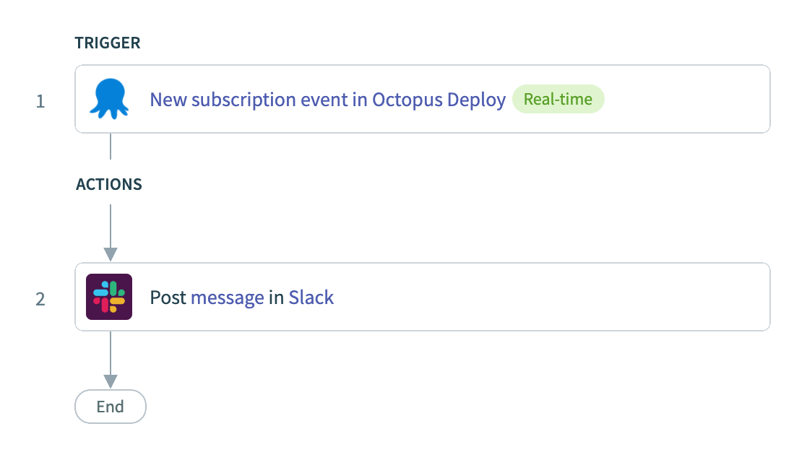
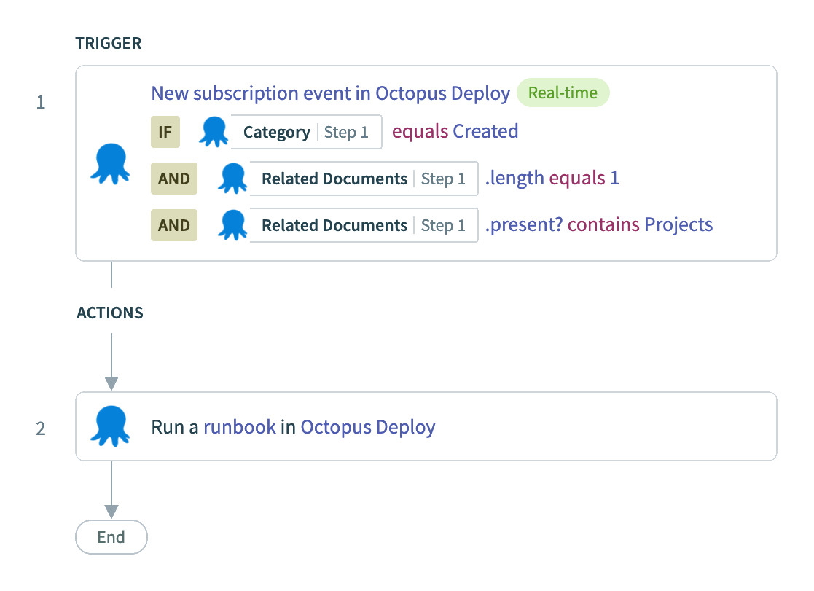

A [Workato connector for Octopus Deploy](https://www.workato.com/integrations/community/octopus-deploy) is now available!

[Workato](https://www.workato.com/) is an enterprise integration Platform-as-a-Service (iPaaS) that enables you to build workflow automation. Users construct workflows through a visual designer, providing a low-code tool for system integrations.

The Workato connector for Octopus Deploy enables you to quickly integrate Octopus Deploy with your workflows. It support performing numerous actions with Octopus Deploy, such as:

- Create release
- Create resources such as accounts, channels, deployments, environments, projects, etc.
- Deploy release
- Get deployment process
- Get resources (i.e. deployment targets, feeds, runbooks, teams, tenants)
- Run Runbook

Create recipes that respond to events in Octopus through a trigger.

Additional actions may be added to the connector if/when required.

Built in Ruby, Workato connectors are defined as a JSON configuration and registered through the Workato development environment.

According to Workato, while various teams within IT still play a significant role in [workflow automations](https://www.workato.com/the-connector/work-automation-index/), product teams and business operations teams are getting more and more involved in the process, requiring quick implementations, which can be optimised with Workato’s low-code interface.

## Getting Started

You can find Octopus in the [Workato Integrations](https://www.workato.com/integrations) page, or in the Community Library>Community connectors as a logged-in user.

Below we show a simple example of an integration between Slack and Octopus Deploy using the Octopus Deploy Workato connector:

## Example: Notify Slack Channel when Events Raised from Octopus Deploy

## Example: Run Runbook  from Octopus Deploy

## Conclusion

[Workato](https://www.workato.com/)'s automated recipes allows users to construct workflows through a visual designer, providing a low-code tool for system integrations.

Apart from triggering a runbook automation in systems such as Slack, Microsoft teams, Jira or others, Workato makes it easy for Octopus and Workato users to publish updates to other systems after development, test or production deployments. This could be simple notifications or update tickets in third party systems.

The power of Workato is its ability to easily integrate other systems with Octopus.

Happy deployments!
