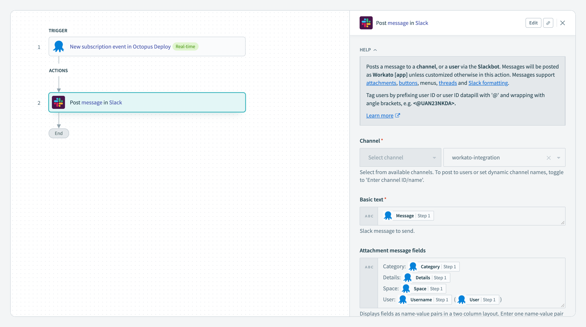

A [Workato connector for Octopus Deploy](https://www.workato.com/integrations/community/octopus-deploy) is now available!

[Workato](https://www.workato.com/) is an enterprise integration Platform-as-a-Service (iPaaS) that enables you to build workflow automation. Users construct workflows through a low-code/no-code visual designer that supports hundreds of different platforms and systems. According to Workato, while various teams within IT still play a significant role in [workflow automations](https://www.workato.com/the-connector/work-automation-index/), product teams and business operations teams are getting more and more involved in the process, requiring quick implementations, which can be optimised with Workato's low-code interface. By enabling support for Workato, we hope facilitate a wide variety of workflow scenarios for Octopus Deploy customers.

Built in Ruby, Workato connectors are defined as a JSON configuration and registered through the Workato development environment. The Workato connector for Octopus Deploy enables you to quickly integrate Octopus Deploy with your workflows. It support performing numerous actions with Octopus Deploy, such as:

- Create a release
- Create resources such as accounts, channels, deployments, environments, projects, etc.
- Deploy a release
- Get a deployment process
- Get various resources from Octopus Deploy (i.e. deployment targets, feeds, runbooks, teams, tenants)
- Run a runbook
- Create recipes that respond to events in Octopus through a trigger.

Additional actions may be added to the connector if/when required.

## Getting Started

Creating workflows in Workato with the Octopus Deploy connector is easy; simply search for "Octopus" to the **Custom Connectors** section of the **Community Library**. Navigating to the connector will provide its description along with its source code. To use it, simply click the button, "Install connector".

Before configuring the connector, you'll need to create an API key in Octopus Deploy. The connector uses this API key to perform operations against Octopus Deploy on your behalf. Documentation on how to do this is provided in our documentation: [How to Create an API Key](https://octopus.com/docs/octopus-rest-api/how-to-create-an-api-key).

After creating an API key, the next step will be to establish a connection between the Octopus Deploy connector in Workato and the instance of Octopus Deploy you wish to integrate within a workflow:

The host address is the URL that points to Octopus Deploy. Please also include the space you wish to target in the configuration. After you click the button, "Connect" you'll be ready to start creating workflows in Workato!

## Example: Notify Slack Channel when Events Raised from Octopus Deploy

## Example: Run Runbook from Octopus Deploy

## Conclusion

[Workato](https://www.workato.com/)'s automated recipes allows users to construct workflows through a visual designer, providing a low-code tool for system integrations.

Apart from triggering a runbook automation in systems such as Slack, Microsoft teams, Jira or others, Workato makes it easy for Octopus and Workato users to publish updates to other systems after development, test or production deployments. This could be simple notifications or update tickets in third party systems.

The power of Workato is its ability to easily integrate other systems with Octopus Deploy.

Happy deployments!
