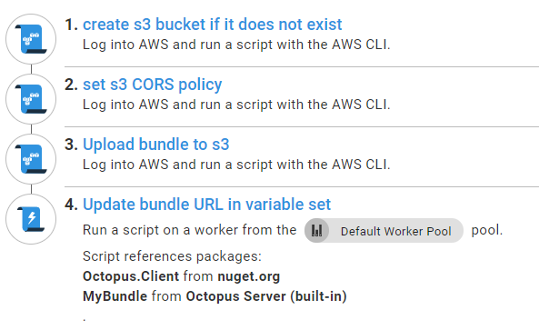
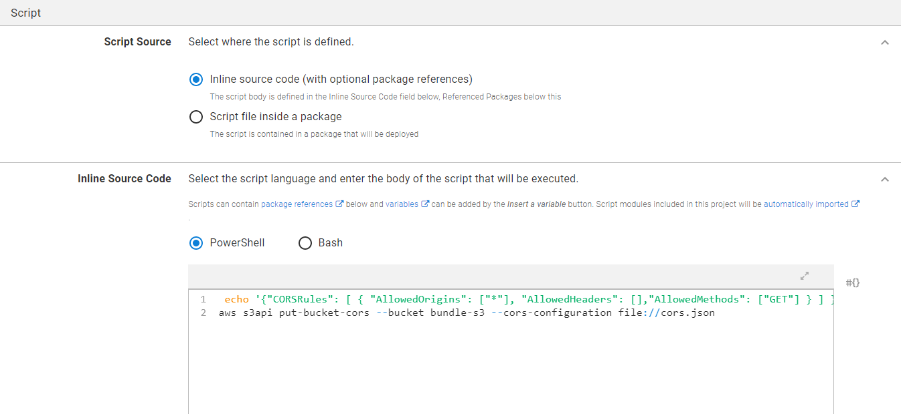
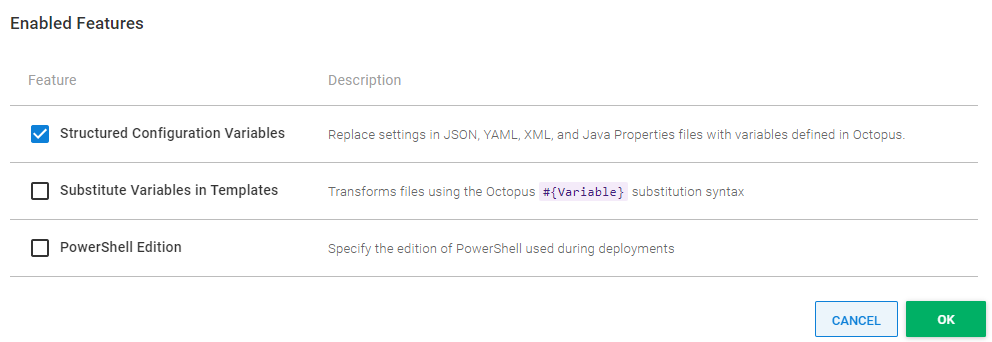
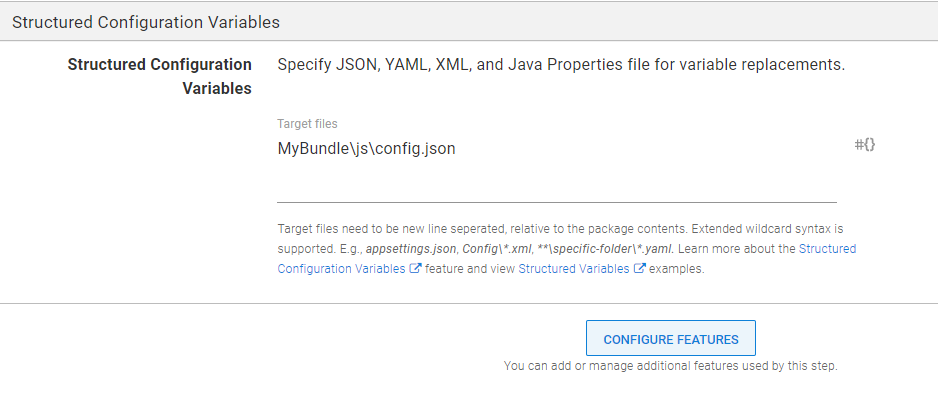

There’s a common front-end dev pattern that starts with the best intentions but can lead to pain if not handled with care. You see a need to reuse front-end code across multiple projects, maintained by different teams using different tech. You create a shared JavaScript library project with its own repo and release process. It's a sensible idea but opens questions that need good answers, to stop our bundle of joy from growing into a monster. 

In this post, I explain how to manage the deployment process for a shared JavaScript project that is simple to reference from other Octopus projects. My example uses a Vue JS bundle deployed to Amazon S3, but the same principles can be applied to any combination of front-end framework and hosting provider.

## The process

Our finished deployment process looks like this in Octopus:



I explain the reason for each step and how they work.

## Creating an S3 bucket if it doesn't exist

In the spirit of treating servers like cattle and not pets, I don't assume much about our deployment target, beyond having an AWS account with appropriate permissions. In a specific case, I had dedicated buckets for combinations of regions and the environments of test, staging, and production, so I appreciate a build process that only needs me to name the bucket and region in scoped variables, and will set it up correctly if required. This is achieved with an [AWS CLI step](https://octopus.com/docs/deployments/custom-scripts/aws-cli-scripts) that runs the following PowerShell script, which uses the AWS CLI to see if you get a non-error result trying to list the contents of the bucket. Otherwise, it creates the bucket, then polls to confirm the bucket exists before the step finishes.

```ps
$bucket = $OctopusParameters["s3-bucket-name"]
$region = $OctopusParameters["s3-region"]
$found = aws s3 ls s3://$bucket/ --recursive --summarize | Select-String -Pattern 'Total Objects:'
if ([string]::IsNullOrWhiteSpace($found)) {
    aws s3api create-bucket --bucket $bucket --region $region
    aws s3api wait bucket-exists --bucket $bucket
}
```

## Setting S3 CORS policy

This is another AWS CLI script with the following PowerShell inline:

```ps
echo '{"CORSRules": [ { "AllowedOrigins": ["*"], "AllowedHeaders": [],"AllowedMethods": ["GET"] } ] }' | out-file -encoding ASCII cors.json
aws s3api put-bucket-cors --bucket bundle-s3 --cors-configuration file://cors.json
```

You can be more sophisticated with CORS as needed, but in my example, I assume our bundles live in their own dedicated bucket, so a simple `allow all GET requests` makes sense. 

The encoding step is important, rather than echoing straight to a file. I'm unsure why the [CLI command](https://docs.aws.amazon.com/cli/latest/reference/s3api/put-bucket-cors.html) for setting CORS insists on reading from a file, and won't let you pass JSON through the command line. If you need a more complicated CORS policy though, it's cleaner to choose **Script file inside a package** and have the .ps1 and cors.json files source controlled in your bundle repo, rather than the inline option I use here.



## Uploading bundle to S3

There are a few prerequisites for the next **AWS CLI step**, which I explain before showing how it's set up in Octopus. I demonstrate how it's achieved in Vue. The steps will be different for other frameworks, but the explanation will point you in the right direction.

### One JavaScript file to rule them all

By default, Vue creates a separate CSS file, a production source map file, and a vendor libraries file. This is an optimization that webpack performs, for better caching of common dependencies that don't change often. 

These are sensible defaults, but for a shared JS bundle that's not massive, you can start by allowing consumers to reference the one JS file, to get all styling and behavior. You can always introduce support later, as needed, for optimizations, source maps, and external CSS.

To instruct Vue to build just one JavaScript file, you can add the following vue.config.js at the root of your Vue project next to package.json:

```js
 module.exports = {
  configureWebpack: {
    optimization: {
      splitChunks: false
    }
  },
  css: {
    extract: false,
  },
  productionSourceMap: false
}
```

### A separate config.json file

[Octopus variable substitutions](https://octopus.com/docs/projects/variables/variable-substitutions) are powerful. To take advantage of them for your front-end project, you need to tell Octopus about a config.json file that sits next to our bundle. 

For Vue CLI to include the file in its dist folder, which will be zipped to create the package sent to Octopus, you need to create `js\config.json` in the public folder that Vue generates when starting a new project. 

This is a similar pattern to the configuration examples shown for [React and Angular](https://octopus.com/blog/javascript-configuration), except implemented for Vue in the context of a complete deployment process.

Now you need to run the following:

```console
npm run build      
```

You can see that Vue has copied the config.json as a separate file in the output folder. To tell Vue to use it, create the following helper module:

```js
const configUrl = document.currentScript.src.substring(0, document.currentScript.src.lastIndexOf('/')) + '/config.json'

module.exports = async function() {
    const response = await fetch(configUrl);
    return await response.json();
};
```

Now when you call this function, the bundle will fetch its neighboring config.json in the S3 folder it's deployed to.

Here's how you can use that in a Vue component:

```html
<template>
  <div id="app">
    
    <HelloWorld msg="Welcome to Your Vue.js App"/>
  </div>
</template>

<script>
import HelloWorld from './components/HelloWorld.vue'
import getConfig from './config.js'

export default {
  name: 'App',
  components: {
    HelloWorld
  },
  data() {
    return { config: { } }
  },
  async created () {
    this.config = await getConfig();
  },
}
</script>
```

:::hint
You need to give a base URL to any images or other references to external assets, with something like the **bucketUrl** setting. This is because the relative paths Vue produces by default don't work on the consumer for assets in S3.
:::

To tell Octopus to substitute variables in our config.json file, click **Configure Features**, and tick **Structured Configuration Variables**.



Tell Octopus to replace variables in `MyBundle\js\config.json` where `MyBundle` is the ID of your package.



### Uploading your bundle

Finally, you give the step the CLI command to upload your bundle, config.json, and assets to a folder named after the current release.

```ps
aws s3 cp MyBundle s3://#{s3-bucket-name}/release_#{Octopus.Release.Number} --recursive --exclude index.html --acl public-read
```

I skip uploading the index.html file that Vue CLI produces because legacy consumers of your bundle can't use that index.html, and need the URL to the uniquely named bundle file instead. 

The focus of the next and final step is providing the URL of the newest bundle for the environment to any project that wants it.

## Updating the bundle URL in a variable set

Being able to tell other projects where to get the cache-busted shared bundle through an automatically populated config setting is an advantage of building an Octopus process for this type of JavaScript project. 

There's an astonishing [variety of strategies for cache-busting](https://css-tricks.com/strategies-for-cache-busting-css/) and, in my experience, many lead to pain. For me, this pain stemmed from either the consumer knowing too much about the bundling process, or the bundler knowing too much about the consumer. Ideally, any project that consumes the bundle only reads a config setting with the URL of the bundle. Fortunately, Octopus lets you achieve this at deployment time without much custom code.

After deployment, this custom script step updates the bundle URL for the scoped `BundleUrl` variable in a [library variable set](https://octopus.com/docs/projects/variables/library-variable-sets) that can be referenced by other projects. To do that, reference the Octopus.Client NuGet package in the step as explained [in our docs](https://octopus.com/docs/octopus-rest-api/octopus.client/using-client-in-octopus). 

The step also needs a reference to the package you deployed, to find the name of the JavaScript file you uploaded. Then it can run the following PowerShell:

```ps
Add-Type -Path 'Octopus.Client/lib/net452/Octopus.Client.dll'

$bundle = Get-ChildItem -Path MyBundle/js/*.js | Select-Object -First 1

$endpoint = new-object Octopus.Client.OctopusServerEndpoint $octopusURI,$octopusApiKey
$repository = new-object Octopus.Client.OctopusRepository $endpoint

$scope = New-Object Octopus.Client.Model.ScopeSpecification
$enviornmentName = $OctopusParameters["Octopus.Environment.Name"]
$envID = $repository.Environments.FindByName($enviornmentName).Id
$scope.Add([Octopus.Client.Model.Scopefield]::Environment,(New-Object Octopus.Client.Model.ScopeValue($envID)))

$libraryVariableSetId = $repository.LibraryVariableSets.FindByName('BundleVariables').Id
$libraryVariableSet = $repository.LibraryVariableSets.Get($libraryVariableSetId);
$variables = $repository.VariableSets.Get($libraryVariableSet.VariableSetId);
$releaseId = $OctopusParameters["Octopus.Release.Number"]
$variables.AddOrUpdateVariableValue("BundleUrl", $bucketUrl + 'release_' + $releaseId + '/js/' + $bundle.Name,$scope)
$repository.VariableSets.Modify($variables)
```

That's it! Now any number of other projects can reference your shared JavaScript bundle by including the `BundleVariables` library variable set, and can make use of the `BundleUrl` variable.

## Conclusion

This post explains how you can apply the concepts of scoped variables, servers as cattle, and variable sets, to achieve sane management of a shared JavaScript project.

I had good results following this strategy in production, compared to other solutions for managing JavaScript projects. I did find myself explaining to front-end specialists that they need to re-release the consumer project to make it upgrade itself to the latest version of the bundle, but it's logical after people get the hang of it. I've had good feedback from the front-end specialists on my team about the way this deployment process pattern works.

Happy deployments!
