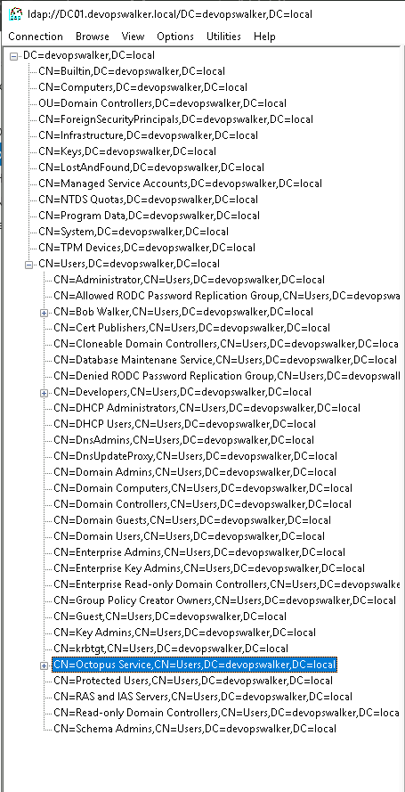
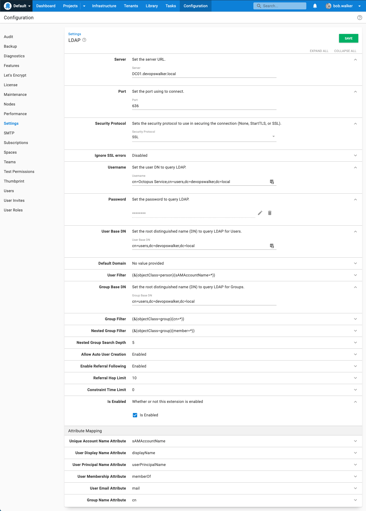
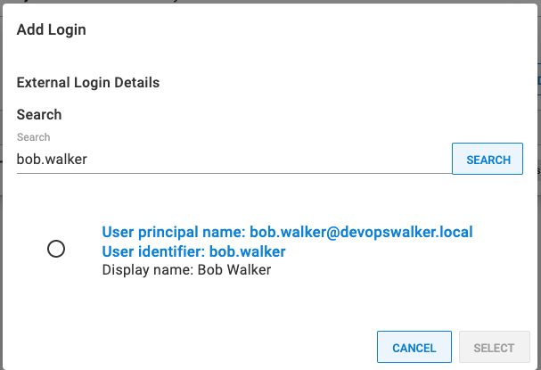
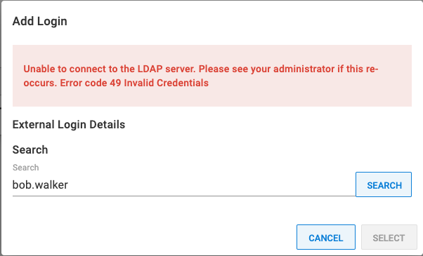
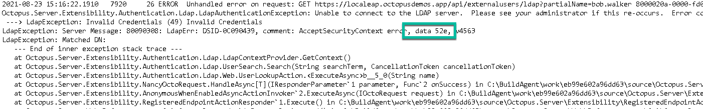
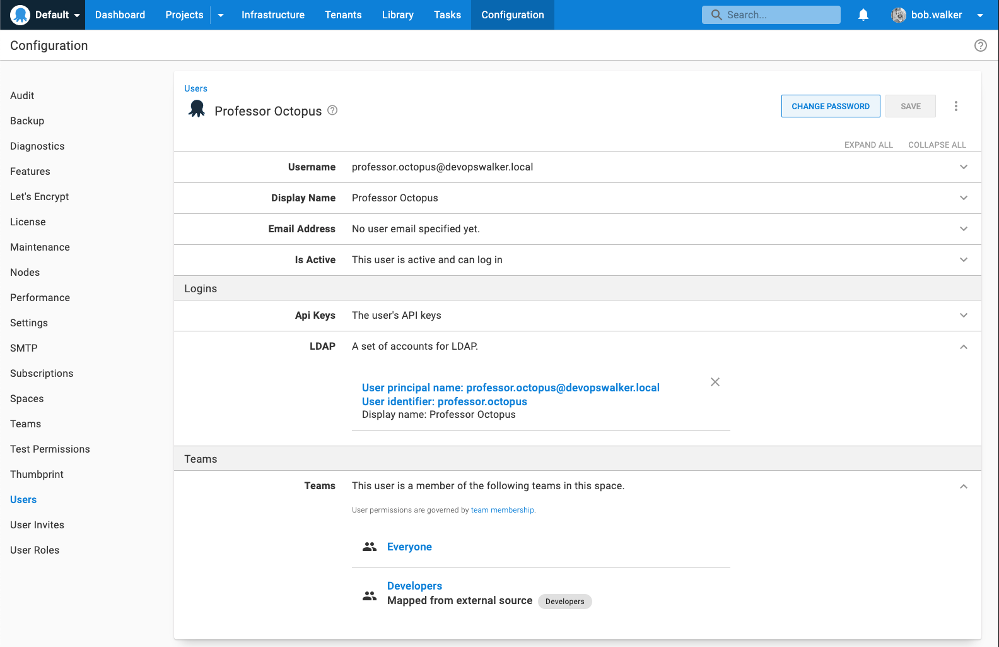
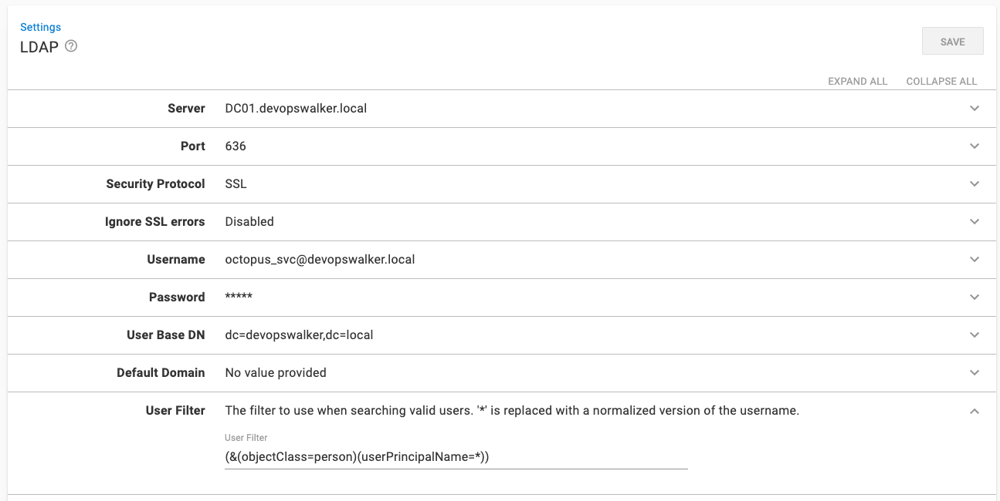

In Octopus Deploy 2021.2, we added the [Lightweight Directory Access Protocol (LDAP)](https://ldap.com/) authentication provider. 

!include <octopus-2021-q3>

Many customers want to migrate to the Octopus Linux Container, but they have to authenticate via Active Directory.  Active Directory is also an LDAP server, meaning with the new LDAP provider you can now use the Octopus Linux Container **and** authenticate to Active Directory.  

In this post, I walk you through the steps to configure the LDAP authentication provider.  By the end of this post, my Octopus Deploy instance will authenticate over LDAP to my local domain, `devopswalker.local`, running on Windows Server 2019.

:::hint
This article assumes you're familiar with directory services core concepts.  If you're unsure about any of these concepts, please talk with your local system administrator.
:::

## LDAP background

LDAP, or Lightweight Directory Access Protocol, is an open, vendor-neutral, industry-standard protocol for interacting with directory servers.  

It's easy to confuse LDAP with a directory server such as Active Directory.  LDAP itself is not a directory server.  It's the protocol used to communicate with a directory server, like `http` is the protocol for web servers, or `wss` is the protocol to communicate with web servers via sockets.  

The default configuration for Active Directory enables LDAP support.  If you have Active Directory running on-premises, you probably already have an LDAP server.

## Why LDAP?

There are three primary use cases that explain why we added LDAP support:

1. Not everyone is running Active Directory.  LDAP is vendor-neutral, so more non-Microsoft users can take advantage of external authentication.  Most, if not all, directory servers support LDAP.  
2. Active Directory / integrated authentication requires servers to be added to the domain.  That does not work with the Octopus Linux Container.
3. Users with non-Windows clients (specifically macOS) will have the same experience as Windows clients.  With Active Directory, if you click the **Sign in with a domain account** button on Chrome running on macOS, you could find yourself in an endless login prompt loop.  At least I did (and I didn't have the patience to fix it).

There are other advantages to using LDAP, such as cross-domain queries.  I recommend reading [ldap.com](https://ldap.com) to learn more about what LDAP can and cannot offer.  It's a flexible protocol, and each directory server, be it Active Directory or OpenLDAP, offers a lot of functionality.

## Secure your LDAP server first

By default, LDAP traffic is not encrypted.  By monitoring network traffic, an eavesdropper could learn your LDAP password.  

Before configuring the LDAP provider in Octopus Deploy, please consult the vendor documentation for your directory server for communicating over SSL or TLS.  

Securing an LDAP server is outside the scope of this post, and is unique to each vendor.  The rest of this post assumes you worked with your system administrators on securing your LDAP server.

## Understanding DNs

In LDAP, a DN (distinguished name), uniquely identifies an entry and the position in a directory information tree, like a path to a file on a file system.

As mentioned, my domain is `devopswalker.local`.  
Translating that to a DN that LDAP can understand is `dc=devopswalker,dc=local`.  

All users and groups where my directory server are stored have a common DN of `cn=users,dc=devopswalker,dc=local`.  

My user account `Bob Walker` DN is `cn=Bob Walker,cn=users,dc=devopswalker,dc=local`. 

## What you need

Before configuring LDAP, you need the following:

- The fully qualified domain name, or FQDN, of the server to query.  In my example it's `DC01.devopswalker.local`.
- The port number and security protocol to use.  I'm using the standard secure LDAP port 636 for my domain controller and SSL.
- The username and password of a service account that can perform user and group lookups.  In my example it's `cn=Octopus Service,cn=users,dc=devopswalker,dc=local`.
- The root DN you wish to use for user and group lookup.  In my example, both are `cn=users,dc=devopswalker,dc=local`.

:::hint
Use a tool such as ldp.exe for Windows or [LDAP Administrator](https://www.ldapadministrator.com/download.htm#browser) to find the highest part on the tree / forest you want to start at.  Starting at the root, for example `dc=devopswalker,dc=local` could lead to performance problems as the LDAP query is forced to traverse hundreds or thousands of records.  The less data to go through, the faster the query will be.  Because of my active directory configuration, all users and groups are stored in `cn=users,dc=devopswalker,dc=local`.  Your server might be different.

:::

## Configuring LDAP authentication provider in Octopus Deploy

Navigate to {{Configuration > Settings > LDAP}}.  Enter values in the following fields:

- Server: Enter the FQDN of your server.
- Port: Change the port (if your secure port is different from the default).
- Security Protocol: Change to SSL or StartTLS.
- Username: Enter the username that will be used to perform the user lookups.  It can either be `[username]@[domain name]` or the user's DN.
- User base DN: enter the base DN for your users, which in my example is `cn=users,dc=devopswalker,dc=local`.
- Group base DN: enter the base DN for your groups, which in my example is `cn=users,dc=devopswalker,dc=local`.
- Is Enabled: Check the check box to enable the feature.

:::hint
As mentioned, I'm using Active Directory running on Windows Server 2019.  Your root DN might be different.  Please consult a system administrator or use an LDAP explorer to find the right user and group DNs for your directory service.
:::

## Testing the LDAP authentication provider

After I configured the LDAP authentication provider, I made the mistake of logging out and logging back in. I discovered two easy tests I can do without performing the authentication dance.

- External User Lookup
- External Group Lookup

For the External User Lookup, go to {{Configuration > Users}} and select a user account.  After the screen loads, expand the LDAP section under logins and click the **Add Login** button.  

If everything is working correctly, you see a modal window similar to this:

I didn't see that screen at first. Instead, I saw this:

The error, "Unable to connect to the LDAP server.  Please see your administrator if this re-occurs.  Error Code 49 Invalid Credentials", is an LDAP lookup error.  I mistyped the password for the Lookup User.  

LDAP also returns a data code for each error code.  To find that information, open your Octopus Server logs.

:::hint
For errors you can't explain, perform a similar action using an LDAP explorer on the same server hosting Octopus Deploy.  Take Octopus out of the equation, get everything working via the explorer tool, then configure Octopus Deploy.  If everything works via the explorer and something still isn't working with Octopus Deploy, reach out to [customersuccess@octopus.com](mailto:customersuccess@octopus.com) for more help.
:::

The External Group Lookup is similar to the External User Lookup.  

- Go to {{Configuration > Teams}} and select a team.  
- Click the button **Add LDAP Group** and perform a search.  

If configured correctly, you see this message:

If the lookup fails, perform the same troubleshooting you did for the User Lookup.

## Signing in

After the above tests are successful, try the next test, logging into Octopus using the LDAP authentication provider.  

I created a test account, `Professor Octopus`, and added it to the `Developers` group.  

When I first tried to sign in as `professor.octopus@devopswalker.local`, I got this error:

Changing the username to just `professor.octopus` worked as expected.  This is because the default configuration uses the `sAMAccountName` to match on.  The new user was created and assigned to the appropriate team.

I prefer to use `professor.octopus@devopswalker.local` to log in.  If you have a similar preference (or company policy), change the **User Filter** to be `(&(objectClass=person)(userPrincipalName=*))`.  

In our testing we noticed less reliable results using `user@domain`; however your configuration might be different to our testing environment.

I chose `userPrincipalName` because that is where the fully qualified name, `professor.octopus@devopswalker.local`, is stored in my domain controller.  Your directory server might be different.

## Conclusion

Unlike the Active Directory authentication provider, the LDAP authentication provider is more flexible, because LDAP is more flexible.  This adaptability does make the LDAP authentication provider more complex though, so it might take some trial and error to dial in your settings. I recommend setting up a test instance to test all your LDAP authentication settings.  

After you've dialed in your settings, the LDAP authentication provider offers a number of benefits.  You can use the Octopus Linux Container with Active Directory, or you don't have to use Active Directory at all.  

If you are using Active Directory, I found the LDAP provider was easier to use than Active Directory because it's an open standard.  I don't have to worry about picking NTLM or Kerberos, or how the Windows Server hosting Octopus/Active Directory/Domain Controller relationship is managed.  

If you have multiple user accounts on your local active directory, each with different permissions in Octopus, logging out and logging in on your computer for testing is no longer an issue.  LDAP solves these problems, along with a host of others.

Happy deployments!
