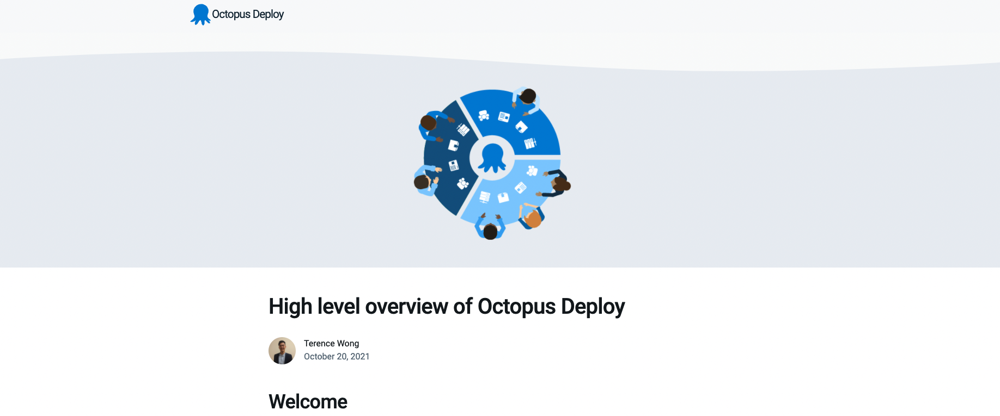

Setting up your first deployment can be challenging. There are new systems to learn and multiple configurations to get right.

In this post, I guide you through your first deployment with Octopus Deploy.

To make this easy, I configured a project that deploys a sample application to an Azure web application.

Using the [Export/Import feature](https://octopus.com/blog/exporting-projects) that was introduced in Octopus 2021.1, I exported an Octopus project, and I show you how to import and deploy this project.

After it's deployed, the application will be visible to you, and shareable with your colleagues.

## Getting set up

The only prerequisite to follow along with this post is a running Octopus Deploy instance, either in Octopus Cloud or the self-hosted Octopus Server.

There are five steps I walk you through to deploy the web application in Octopus:

1. Import the existing project
2. Configure an Azure account
3. Upload the package I provide
4. Add your deployment targets
5. Deploy to Azure web application

If you haven't set up an Octopus Deploy instance, you need to do that now by selecting one of the following options:

- [Octopus Cloud](https://octopus.com/start/cloud): we host the Octopus Deploy instance for you, it connects to your servers.
- [Self-hosted on a Windows Server](https://octopus.com/start/server): you host it on your infrastructure by [downloading our MSI](https://octopus.com/download) and installing it on Windows Server with a SQL Server back-end. Learn more about [our installation requirements](https://octopus.com/docs/installation/requirements).
- [Self-hosted as a Docker container](https://octopus.com/blog/introducing-linux-docker-image): you run Octopus in a Docker container (currently an early access preview). You still need a [free license](https://octopus.com/start/server).

After your Octopus instance is ready, the first step is importing an existing project.

## Importing an existing project

The Export/Import feature can export one or more projects into a zip file, which can then be imported into other spaces. The target space can be in a different Octopus Server instance, and can even be moved between self-hosted and Octopus Cloud instances.

:::hint
Now's a great time to [upgrade to Octopus Deploy 2021.2](https://octopus.com/downloads) if you haven't already.
:::

The **Export/Import features** are accessed from the overflow menu on the **Projects** page.

You need to import the following project into your Octopus instance:

:::success
[project_export_latest.zip](https://octopus.com/images/blog/deployable-blog-post/project_export_latest.zip)
:::

In the Octopus Web Portal, navigate to **Projects**, then **Import Projects**, the click **SELECT ZIP FILE** and upload the project zip. Click **IMPORT** to complete.

:::hint
The password for this project is `html`.
:::

:::hint
Importing the project means you don't have to configure the environment or deployment steps of your project manually. This is only a small project, but some projects are large and include complex deployment steps, so importing the project is much easier than recreating it. Using the Export/Import feature ensures your environments and deployment steps persist across spaces.
:::

Congratulations, you successfully imported the project!

There are a few other items to configure before deploying the web application. Exporting and importing a project doesn't capture the deployment targets or the required packages for the project. Deployment targets need a new connection on a new instance. Packages are excluded from the exported project because of their potentially large file size.

## Configuring an Azure account

You need to configure an Azure account and web application to act as a target for the deployment from Octopus. Other targets are possible, such as AWS, or Linux and Windows servers.

Create an account in Azure by navigating to the [Azure portal](https://portal.azure.com/).

### Creating an Azure Service Principal with the Azure portal {#create-service-principal-account-in-azure}

<iframe width="560" height="315" src="https://www.youtube.com/embed/QDwDi17Dkfs" frameborder="0" allow="accelerometer; autoplay; encrypted-media; gyroscope; picture-in-picture" allowfullscreen></iframe>

1. In the Azure portal, open the top left menu and navigate to **Azure Active Directory**, then **Properties**.
2. Copy the value from the **Tenant ID** field. This is your **Tenant ID**.
3. Next you need your **Application ID**:
   - If you created an AAD registered application, navigate to **Azure Active Directory**, then select **App registrations**, click **View all applications**, select the app and copy the **Application ID**. Please note, the Azure UI defaults to the **Owned applications** tab. Click the **All applications** tab to view all app registrations.
   - If you haven't created a registered app, navigate to **Azure Active Directory**, then select **App registrations**, click on **New registration** and add the details for your app, and click **Save**. Make note of the **Application ID**.
4. Generate a one-time password by navigating to **Certificates & Secrets**, then **New client secret**. Add a new **secret**, enter a description, and click **Save**. Make note of the displayed application password for use in Octopus. You can change the expiry date, if you don’t want to accept the default one-year expiry for the password.

You now have the following:

- **Tenant ID**
- **Application ID**
- **Application Password/secret**

Next, you need to configure your resource permissions.

### Resource permissions {#resource-permissions}

Resource permissions ensure your registered app has permission to work with your Azure resources.

1. In the Azure portal navigate to **Resource groups** and select the resource group(s) that you want the registered app to access. If a resource group doesn't exist, create one by going to **Home**, then **Resource groups**, then select **Create**. After it's created, take note of the Azure subscription ID of the resource group.
2. Click the **Access control (IAM)** option. Under **Role assignments**, if your app isn't listed, click **Add role assignment**. Select the appropriate role (**Contributor** is a common option) and search for your new application name. Select it from the search results, then click **Save**.

The next step is setting up an [Azure web application](#web-application-setup) and configuring its properties.

### Web application setup {#web-application-setup}

1. In your **Resource group** click **Create**, then **Web App**
2. Create a Windows Node Application under **Runtime stack** and **Operating System**
3. Take note of your Azure app name, as this will be the address of your web application: [your-site].azurewebsites.net
4. After the web app is set up, route the path of the web application to default to the home path by navigating to **Configuration**, then **Path mappings**, then **Virtual applications and directories**
5. Set the Physical path to `site\wwwroot\guide` and the Virtual Path to `/`

### Add the Service Principal account in Octopus {#add-service-principal-account}

With the following values, you can add your account to Octopus:

- Application ID
- Tenant ID
- Application Password/Key

1. Navigate to **Infrastructure**, then select **Accounts**
2. Select **ADD ACCOUNT**, then click **Azure Subscription**
3. Give the account the name you want it to be known by in Octopus
4. Give the account a description
5. Add your Azure Subscription ID - this is found in the Azure portal under **Subscriptions**
6. Add the **Application ID**, the **Tenant ID**, and the **Application Password/Keyword**

Click **SAVE AND TEST** to confirm the account can interact with Azure. Octopus will attempt to use the account credentials to access the Azure Resource Management (ARM) API and list the Resource Groups in that subscription.

You may need to safelist the IP addresses for the Azure Data Center that you're targeting. See [deploying to Azure via a firewall](https://octopus.com/docs/deployments/azure/deploying-to-azure-via-a-firewall) for more details.

:::hint
A newly created Service Principal can take several minutes before the credential test passes. If you've double-checked your credential values, wait 15 minutes and try again.
:::

Now that you have the Azure account set up in Azure and Octopus, you upload the package for Azure.

## Uploading an existing package

The web application you're deploying requires some code to deploy. Octopus makes this code available to deployment targets through packages.

A package is code that will deploy to a target. In this case, it will be a deployable tutorial that your web application can display.

The package system makes it convenient to interchange or update packages for redeployment at a later stage. The following is the package that you'll be using to deploy with Octopus Deploy:

:::success
[guide.1.0.0.zip](https://octopus.com/images/blog/deployable-blog-post/guide.1.0.0.zip)
:::

You can manually upload the package to the Octopus built-in repository in the Octopus web portal.

1. Navigate to the **Library** tab
1. Click **UPLOAD PACKAGE**
1. Select the package you want to upload and click **UPLOAD**

In the next step, you set up the deployment target that the application will be deployed to.

## Adding deployment targets

1. Go to **Infrastructure**, then select **Deployment Targets**
2. Select an Azure Web App
3. Enter a **Display Name**
4. Fill out the **Environments** and **Target Roles**
5. Select the Azure account and web app created earlier
6. Click **SAVE**

## Deploying to Azure web application

You can deploy the application after you've imported a project, set up the Azure account, set up the deployment target, and uploaded the package.

- Go to **Projects**, then select **HTML**, then click **CREATE RELEASE** and step through to deploy the web application to Azure from the Azure production environment.

Check your application by going to [your-site].azurewebsites.net where you will see the following page:

## Conclusion

Well done! You've taken an existing project and deployed a package to an Azure web application through Octopus Deploy. You can share this with your team to teach them how to import and deploy their first Octopus project.

If you need assistance with your deployment or have any questions, please reach out to our customer success team at [customersuccess@octopus.com](mailto:customersuccess@octopus.com).

Happy deployments!
