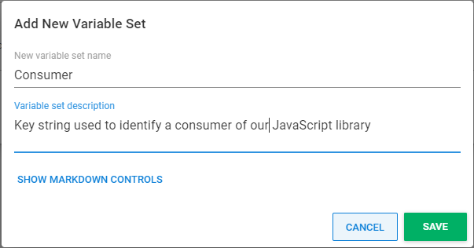

In my [previous post](https://octopus.com/blog/deploying-javascript-library-project-with-octopus), you learned how to use Octopus to deploy a hash-named JavaScript library bundle to cloud storage, where it could be referenced by other projects via an automatically updated variable within a [Library Variable Set](https://octopus.com/docs/projects/variables/library-variable-sets). That's a solid start for managing reusable front-end code in Octopus. It keeps every consumer of your bundle on the latest version of your library as releases happen, which might be the exact behavior you need, especially if you have only a few internal projects referencing a small or medium-sized JavaScript library. However, if you continue this pattern as your organisation scales up, you might hit some dilemmas.

### What if a team using your library needs to deploy an update to their project, but doesn't want to retest against the latest version?

This might happen when a hotfix is needed. As your front-end library grows, you won't want to rush upgrading it for the sake of releasing an unrelated fix. You could override the Library Variable at the project level. This would be a reasonable solution once in a while, but if it's normal development flow, and multiple teams reference your script and want to be able to upgrade when it's convenient, then clear visibility into which consumer is on which version of your library is helpful. You'd also like to be able to roll back a change that inadvertently broke one consumer, or upgrade some website that's failing due to a known bug in an old version of your library. In these situations, you want to release not only to a specific environment, but also to a specific set of consumers.  

### What if the consumer of your library isn't an internal project?

Maybe you created a widget that users add to their website by copy-pasting a code snippet from your website. Or a library started life as internal, but turned out to be general-purpose enough for your company to make it available to the world via a CDN. In these cases, it becomes impossible for you to update the HTML references to your script, so you have to separate the concept of releasing your JavaScript and releasing the code that uses it, and you have to solve cache busting in a new way.

## Tenants to the rescue

[Tenants](https://octopus.com/docs/tenants) are a good conceptual fit for representing consumers of your JavaScript library. Tenants are often used to represent customers of your application. Your customers in this case might be internal, but here at Octopus scaling up our engineering team has shown it's helpful to think of other teams as internal customers. You are updating script dependencies on different websites instead of deploying software to different customers' infrastructure, but all the requirements for how you manage that in Octopus are the same as if you were deploying appropriate versions of a server-side app for different customers. Here's an example of the dashboard you end up with after following the instructions in this post. In this example, imagine you are deploying your shared script to a company WordPress blog, an external customer, and your company's main website. 

Each of these is represented as a tenant which we will assign a unique idenitifier using a [Common Variable](https://octopus.com/docs/tenants/tenant-variables#common-variables), since those are not scoped per environment, and this consumer key can be constant for all environments.

### Setup your consumer key variable

Navigate to the **Library** tab and then the **Variable Sets** section. Then click **ADD NEW VARIABLE SET** and fill out the dialog as follows:

Click on your newly created variable set, then click **VARIABLE TEMPLATES**, then the **ADD TEMPLATE** button. Fill out the details as follows:

## Create a consumer for each tenant

Navigate to the **Tenants** tab, click the **ADD TENANT** button, and create a tenant named `Blog`. Click on your newly created tenant, navigate to its **Variables** section, then click on the **COMMON VARIABLES** tab, and set the variable for `Bundle Consumer Key` to the value `Blog`.

Repeat this process to create the `External customer` tenant with `Bundle Consumer Key` value of `Customer`, and the `Main Website` tenant with `Bundle Consumer Key` of `Mainsite`.

We'll need a project to interact with these tenants. 

## Setup your project

You can deploy to the three tenants using the following process.

This is a modified version of the process explained in my [previous post](https://octopus.com/blog/deploying-javascript-library-project-with-octopus). If you haven't read that, now would be a good time to follow its instructions, but please omit step 4, because the final step of this tenanted deployment process is completely different. Now you have the basis for a project that uploads a JS bundle, you need to make modifications to enable tenanted deployments.

### Require tenants for all deployments of your project

Navigate to the **Settings** of your project and select the option to require a tenant for all deployments.

### Connect all consumer tenants to your project

For each of your tenants, click the **CONNECT PROJECT** button and connect your JavaScript project to the tenant for the `test` and `production` environments.

### Allow all tenants to use your Amazon S3 account

If you are using an account variable, you will find there is an extra step to allow using it to release to any of your tenants. The ability to restrict accounts to tenants can be important to help prevent accidentally using the wrong account for the wrong customer, but for simplicity, assume you are releasing to one S3 bucket referenced by all consumers. 

###  moo
