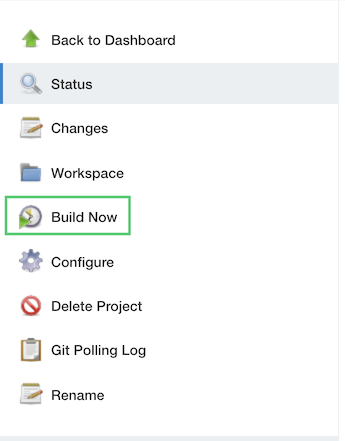
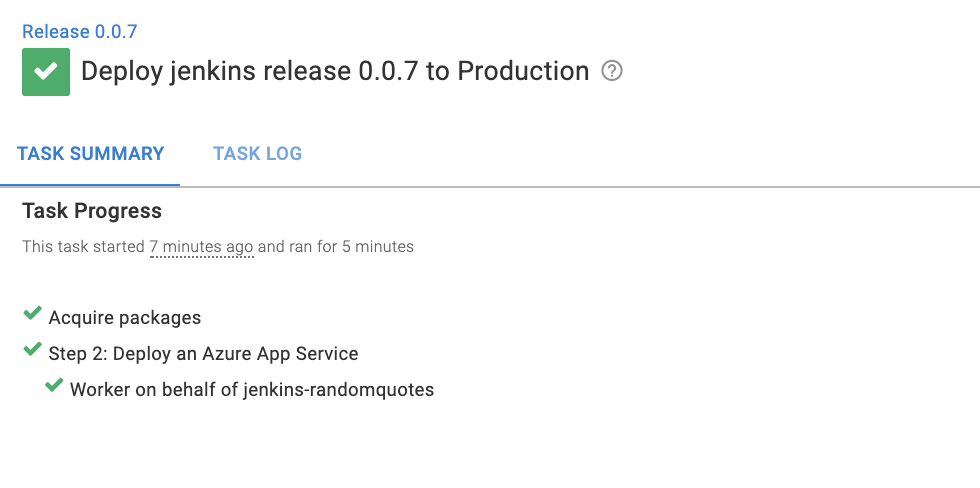

Jenkins is an open-source automation server that enables developers to automate building, testing, and deploying software. This blog post will show you how to configure a Jenkins instance, push a package to an Octopus Deploy instance, and deploy a web application to Azure.

To do this, you will need:

- An Octopus Deploy instance
- An Azure account
- A Jenkins instance

:::hint
You can set up Jenkins in many ways. One way is to follow [this guide](https://docs.microsoft.com/en-us/azure/developer/jenkins/configure-on-linux-vm), completing steps 1-4. The guide will give you a live Jenkins instance on Azure.
:::

## Jenkins

With Jenkins set up, go to the URL for your Jenkins instance to access the UI. In the UI, go to **{{Manage Jenkins, Manage Plugins}}** and search for the Octopus Deploy Plugin under Available, and install the plugin.

Generate an API key in the Octopus Deploy instance. To do this, in the Octopus Deploy instance, go to your **{{username, Profile, My API Keys}}** and create a key. Jenkins will use this value.

Go to **{{Manage Jenkins, Configure system}}**

Under the Octopus Deploy Plugin setting, set the URL to the Octopus Deploy instance and add the API key.

Jenkins can now make your compile packages available in Octopus to be deployed. Let's create a new job by going to the Jenkins home page and click **new item &rarr; freestyle project**, and assign the following settings:

### Source Code Management

Git: `https://github.com/OctopusSamples/RandomQuotes-JS.git`
Build specifier: `*/master`

### Build Triggers

Poll SCM: `H/5 * * * *`

### Build step - Execute shell

You will have to install npm and nodejs on the VM.

    npm install
    npm tests

### Build step Octopus Deploy: Package Application

Octopus Deploy CLI: default
Package ID: `RandomQuotes`
Version Number: `1.0.${BUILD_NUMBER}`
Package format: zip
Package include paths: `${WORKSPACE}/**`
Package output folder: `${WORKSPACE}`

### Build step Octopus Deploy: Push packages

Octopus Deploy CLI: default
Octopus Deploy Connection: Octo-Jenkins
Package paths: `${WORKSPACE}/RandomQuotes.1.0.${BUILD_NUMBER}.zip`
    
Click **SAVE**.

Go back to the job dashboard and click **Build now** to start the job.

When the build starts, you can navigate to the build number and inspect its progress. If every step passes, you will see a success status.

Jenkins will now upload the package to the Octopus Deploy instance under **{{Library, packages}}**. The package version corresponds to the latest build number in Jenkins.

## Configuring an Azure Account

You need to configure an Azure account and web application to act as a target for the deployment from Octopus. Other targets are possible, such as AWS or Linux and Windows servers.

Next, you need to create an account in Azure by navigating to the [Azure portal](https://portal.azure.com/). 

### Creating an Azure Service Principal with the Azure Portal {#create-service-principal-account-in-azure}

<iframe width="560" height="315" src="https://www.youtube.com/embed/QDwDi17Dkfs" frameborder="0" allow="accelerometer; autoplay; encrypted-media; gyroscope; picture-in-picture" allowfullscreen></iframe>

1. In the Azure Portal, open the menu, , navigate to **{{Azure Active Directory > Properties}}** and copy the value from the **Tenant ID** field. This is your **Tenant ID**.
1. Next you need your **Application ID**.
  - If you created an AAD registered application, navigate to **{{Azure Active Directory > App Registrations}}**, click **View all applications**, select the app and copy the **Application ID**.  Please note, the Azure UI defaults to **Owned Applications** tab.  Click the **All Applications** tab to view all app registrations. 
  - If you haven't created a registered app, navigate to **{{Azure Active Directory > App Registrations}}**, click on **New registration** and add the details for your app, and click **Save**. Make note of the **Application ID**.
1. Generate a one-time password by navigating to **{{Certificates & Secrets > New client secret}}**. Add a new **secret**, enter a description, and click **Save**. Make note of the displayed application password for use in Octopus. You can change the expiry date, if you don't want to accept the default one-year expiry for the password.

You now have the following:

- **Tenant ID**
- **Application ID**
- **Application Password/secret**

This means you can [add the Service Principal Account in Octopus](#add-service-principal-account).

Next, you need to configure your [resource permissions](#resource-permissions).

### Resource permissions {#resource-permissions}

Resource permissions ensure your registered app has permission to work with your Azure resources.

1. In the Azure Portal navigate to **Resource groups** and select the resource group(s) that you want the registered app to access. If a resource group doesn't exist, create one by going to **{{Home > Resource groups > Create}}**. After it's created, take note of the Azure subscription ID of the resource group.
2. Click the **Access Control (IAM)** option. Under **Role assignments**, if your app isn't listed, click **Add role assignment**. Select the appropriate role (**Contributor** is a common option) and search for your new application name. Select it from the search results, then click **Save**.

The next step is setting up an [Azure web application](#web-application-setup) and configuring its properties.

### Web application setup {#web-application-setup}

1. In your **Resource group** click **{{Create > Web App}}**
2. Create a Windows Node Application under runtime stack and operating system
3. Take note of your Azure app name, as this will be the address of your web application: [your-site].azurewebsites.net

### Add the Service Principal account in Octopus {#add-service-principal-account}

With the following values, you can add your account to Octopus:

- Application ID
- Tenant ID
- Application Password/Key

1. Navigate to **{{Infrastructure > Account}}**
2. Select **{{ADD ACCOUNT > Azure Subscriptions}}**
3. Give the account the name you want it to be known by in Octopus
4. Give the account a description
5. Add your Azure Subscription ID - this is found in the Azure portal under **Subscriptions**
6. Add the **Application ID**, the **Tenant ID**, and the **Application Password/Keyword**

Click **SAVE AND TEST** to confirm the account can interact with Azure. Octopus will attempt to use the account credentials to access the Azure Resource Management (ARM) API and list the Resource Groups in that subscription. 

You may need to whitelist the IP addresses for the Azure Data Center that you're targeting. See [deploying to Azure via a Firewall](https://octopus.com/docs/deployments/azure) for more details.

:::hint
A newly created Service Principal can take several minutes before the credential test passes. If you've double-checked your credential values, wait 15 minutes and try again.
:::

## Configure Octopus to deploy to Azure

In your Octopus instance, add a Production environment by going to **{{Infrastructure, Environments, Add Environment}}**

Go to **{{Infrastructure, Deployment Targets}}** and add an Azure Web App. Assign the Production environment and set a role (for example, azure) for the target. Choose the Azure account set up earlier and select your Azure Web application. Click **SAVE**.

Create a project by going to **{{Projects, Add Project}}**  

Go to the Process section. Add a `Deploy an Azure App Service step.`

### On Behalf of

1. Choose the role (for example, azure)

### Deployments

2. Select deploy from a zip, Java WAR, or NuGet package
3. Choose the package from the built-in Library
    
Leave everything else with the defaults.

Go to your project and create a release. Click **{{SAVE, Deploy to Production, Deploy}}** and wait for the deployment to complete.

Go to your site URL [your-site].azurewebsites.net) to see the deployed Web application.

## Post-Build

The Octopus Deploy Jenkins plugin can also be used to create releases and deployments from within Jenkins.

In the dashboard of your Jenkins job, go to configure and add the following steps:

### Post-build action: Create Release

Octopus Deploy CLI: default
Octopus Server: `Octo-Jenkins`
Project Name: `jenkins`
Release Version: `0.0.i`
Deploy this release after it is created?  Check the box

Click **SAVE**, go back to the job dashboard, and click **build now**. Jenkins will trigger the package's build and start the post-build release and deploy steps in Octopus Deploy.

In this blog post, you have set up and used a Jenkins instance to build and push a package to Octopus Deploy. You used this package to deploy a Web application to an Azure Web App. You have seen how Jenkins integrates with Octopus Deploy to manage releases and deployments automatically.

Happy Deployments! 

