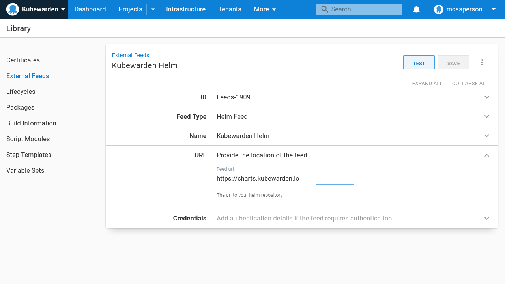
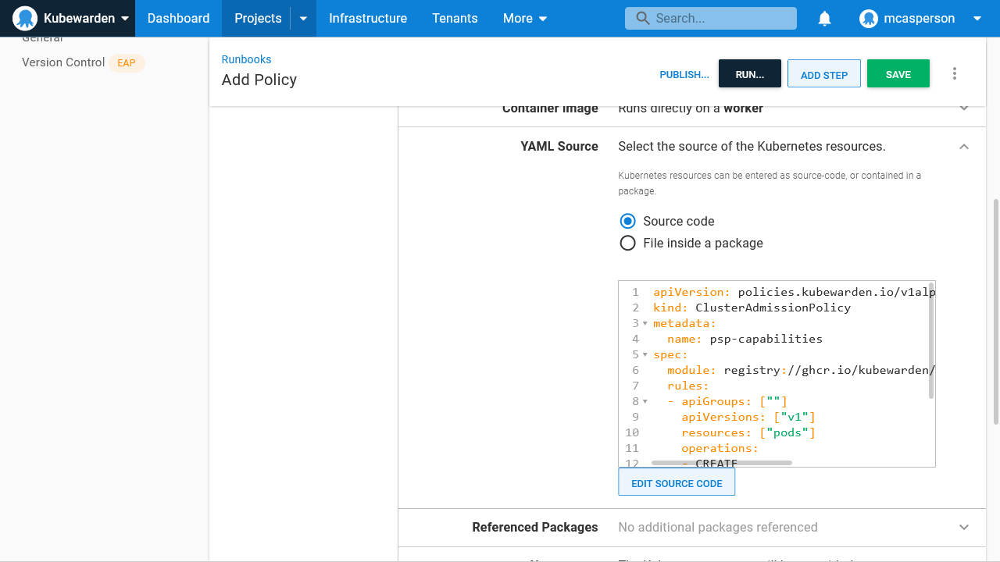

Kubernetes is fast becoming the operating system of the cloud. Every major cloud provider has a supported Kubernetes platform, Kubernetes can be run on-premises, and Kubernetes even has a package manager with Helm. And thanks to the [operator pattern](https://kubernetes.io/docs/concepts/extend-kubernetes/operator/), Kubernetes can natively describe and manage almost [any kind of workload](https://operatorhub.io/).

This flexibility is a blessing and a curse. Kubernetes can run almost anything, and yet it would be nearly impossible to maintain any real world production cluster hosting any random thing that was thrown at it.

Kubernetes Role Based Access Controls (RBAC) provide some level of control over the resources hosted by a cluster. However, RBAC can only allow top level resources, like deployments or pods, to be created. 

A pod can host almost anything, so it's often not enough to allow or disallow the deployment of a pod. Instead, teams need to inspect the properties of a given pod before allowing or denying them.

[Admission controllers](https://kubernetes.io/blog/2019/03/21/a-guide-to-kubernetes-admission-controllers/) provide the ability to inspect, modify, accept, or reject new resources by passing it to a custom service. This allows a fine grained level of control over resources created in a cluster, and ensures only those resources that meet your particular requirements are deployed.

This post looks at the [Kubewarden](https://www.kubewarden.io/) admission controller, which is an early project supporting admission policies written in a number of languages compiled down to WebAssembly. 

I walk you through creating a number of runbooks and deployments in Octopus to manage Kubewarden, and deploying pods to Kubernetes, testing out custom admission policies.

## Installing Kubewarden

The easiest way to install Kubewarden is via its Helm chart. 

Create a new Helm Feed in Octopus pointing to https://charts.kubewarden.io:



Kubewarden is installed via a runbook. Runbooks are useful for administration tasks, such as deploying cross-cutting services, because they're not bound by a lifecycle progression. This allows a new cluster to be spun up in an environment late in the deployment lifecycle (like a new production cluster) without first deploying services to earlier environments in the lifecycle:


## Deploy a suspicious pod

To demonstrate how Kubewarden can keep your cluster secure, deploy the pod below. This pod gives itself the `SYS_TIME` capability and uses the `date` command to set the system time in the container.

There's almost no reason for a pod to set the system time, and you can imagine how changing the time could lead applications to malfunction. For example, a warehouse stock service could place multiple orders if the date was wound back, or a task scheduler could trigger jobs at the incorrect time.

Although the pod below only sets the date and exits, its ability to do so indicates that other pods may be deployed with the ability to set the date:

```yaml
apiVersion: v1
kind: Pod
metadata:
  name: settime
spec:
  containers:
  - name: ubuntu
    image: index.docker.io/ubuntu
    command:
    - "/bin/bash"
    - "-c"
    - "date -s '19 APR 2012 11:14:00'"
    securityContext:
     capabilities:
       add:
       - SYS_TIME 
```

This pod is deployed with a **Deploy raw Kubernetes YAML** step:


Sure enough, the pod is deployed and updates the time within its container. This is not a desirable outcome, and so the next step is to add a Kubewarden policy to prevent resources like this from being deployed.

## Deploying a admission policy

Like all Kubernetes resources, a Kubewarden policy can be defined in YAML. The example below uses the [psp-capabilities](https://github.com/kubewarden/psp-capabilities) policy to strip the `SYS_TIME` capability from all pods as they're created or updated:

```yaml
apiVersion: policies.kubewarden.io/v1alpha2
kind: ClusterAdmissionPolicy
metadata:
  name: psp-capabilities
spec:
  module: registry://ghcr.io/kubewarden/policies/psp-capabilities:v0.1.3
  rules:
  - apiGroups: [""]
    apiVersions: ["v1"]
    resources: ["pods"]
    operations:
    - CREATE
    - UPDATE
  mutating: true
  settings:
    required_drop_capabilities:
    - SYS_TIME
```

The resource is deployed with the  **Deploy raw Kubernetes YAML** step in a runbook:



Now deploy the pod again. This time the deployment fails, as the Kubewarden policy prevents pods with the `SYS_TIME` capability from being deployed with the following error:

```bash
Error from server: error when creating "customresource.yml": admission webhook "psp-capabilities.kubewarden.admission" denied the request: PSP capabilities policies doesn't allow these capabilities to be added: {"SYS_TIME"} 
```

## Conclusion

Kubewarden is an example of an admission controller that accepts, rejects, or modifies resources as they're created, based on the values assigned to individual resource properties. This allows operations teams to ensure only the resources that meet their specific requirements can be deployed. It provides a much greater level of control than standard Kubernetes RBAC.

In this post you deployed Kubewarden using a Helm chart, deployed a policy with the **Deploy raw Kubernetes YAML** step, and saw how a pod deployment that failed the policy's rules was rejected, thus ensuring pods with a known invalid configuration could not be applied to the cluster.

## Register for the webinar: GCP Kubernetes deployments and provisioning with Octopus

Octopus has had fully-featured Kubernetes deployments as a concept for 3 years. We recently added full support for the Google Cloud Platform (GCP), and in 2020 we released Runbooks.

Join Matthew Casperson, Senior Product Manager, and Shawn Sesna, Senior Solutions Architect, to learn why Runbooks, GCP, and Octopus Deploy are the ultimate Kubernetes experience for engineers.

We're running three sessions of the webinar:

- Wed 6 Oct, 2021
- Thurs 7 Oct, 2021
- Mon 11 Oct, 2021

<span><a class="btn btn-success" href="/events/gcp-kubernetes-deployments-and-provisioning-with-octopus">Register now</a></span>

Happy deployments!