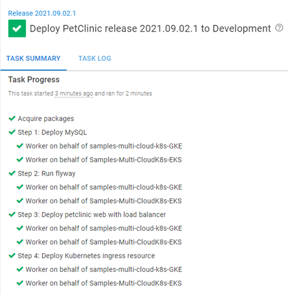

Containerizing applications on cloud platforms is a hot topic.  The big three cloud providers (Azure, Amazon Web Services (AWS), and Google Cloud Platform (GCP)) have all implemented Kubernetes (K8s) platform services:

- Azure Kubernetes Service (AKS)
- Elastic Kubernetes Service (EKS)
- Google Kubernetes Engine (GKE)

In this post, I demonstrate how easy it is to move from one K8s cloud platform to another using Octopus Deploy.

## Creating clusters
Before diving into deployments, create a cluster in each of the cloud providers mentioned above (Azure, AWS, and GCP).  Each provider has a command-line interface (CLI) available for you to use.  

Use the [Runbooks](https://octopus.com/docs/runbooks) feature of Octopus Deploy to create the clusters.  In addition, you need to use the [Execution Containers for Workers](https://octopus.com/docs/projects/steps/execution-containers-for-workers) feature, because the [Worker tools](https://hub.docker.com/r/octopusdeploy/worker-tools) image contains the CLI for all three platforms as well as kubectl.

(The following screenshot is using Octopus Cloud. Self-hosted instances of Octopus will need to create a Worker with Docker installed, to use this feature.)


:::hint
You need to configure an External Feed to a Docker Registry such as Docker Hub to use the Execution Containers feature.
:::

### Azure
To work with AKS, you first need to [create an Azure service principal](https://docs.microsoft.com/en-us/azure/active-directory/develop/howto-create-service-principal-portal).  

This post assumes you're familiar with creating an Azure service principal, so that won't be covered.  

After the service principal is created, add it as an Azure account in Octopus Deploy.  

You need the following pieces of information to add it to Octopus:

- Subscription ID
- Directory (tenant) ID
- Application (client) ID
- Application key/password (client secret for an App Registration)

Microsoft developed the [Azure CLI](https://docs.microsoft.com/en-us/cli/azure/install-azure-cli) to interface with all of your Azure resources.  Using the CLI, you can create a K8s cluster and add it to Octopus Deploy in 3 steps:

1. Create **Resource group**
1. Create K8s cluster
1. Add cluster as deployment target

#### Create Resource group
The first two steps in your process use the **Run an Azure Script** step template.  

Add a step to your runbook, choose the Azure category, and select the **Run an Azure Script** step.


The **Run an Azure Script** requires the Azure account you configured earlier, so select that account, then add the following script:

```powershell
$resourceGroupName = "<ResourceGroupName>"
$resourceGroupLocation = "<ResourceGroupRegionCode>"

if ((az group exists --name $resourceGroupName) -eq $false)
{
	Write-Output "Creating resource group $resourceGroupName in $resourceGroupLocation"
    az group create --location $resourceGroupLocation --name $resourceGroupName
}
```

#### Create K8s cluster
With a **Resource group** created, you can now create the K8s cluster.  

Repeat the steps for Create Resource group to add another **Run an Azure Script** to the runbook process.  

Add the following script:

```powershell
# Get the variables
$clusterName = "<Name of cluster to create>"
$resourceGroupName = "<Resource group name you created from previous step>"
$azureLocation = "<Azure region code>"
$dnsPrefix = "<DNS prefix>"
$azureNodeSize = "<VM size to be used for nodes>"
$azureServicePrincipalClientId = "<Client ID>"
$azureServicePrincipalSecretKey = "<Key/Password for Service Principal Account>"

# Create the Azure Kubernetes cluster
$azureKubernetesCluster = az aks create --name $clusterName --resource-group $resourceGroupName --dns-name-prefix $dnsPrefix --location $azureLocation --node-count 1 --node-vm-size $azureNodeSize --generate-ssh-keys --service-principal $azureServicePrincipalClientId --client-secret $azureServicePrincipalSecretKey
$azureKubernetesCluster = $azureKubernetesCluster | ConvertFrom-JSON

$azureKubernetesCluster
```
:::hint
If you add an Azure account as a variable, you can retrieve the Client ID and key/password directly from the variable without entering it again.  For example, if you create the variable with the name `Azure.Account.Name` you can use the following syntax:

```powershell
$clientId = $OctopusParameters['Azure.Account.Name.Client']
$secretKey = $OctopusParameters['Azure.Account.Name.Password']
```
:::

#### Add cluster as deployment target
The third and final step is to register the cluster with Octopus Deploy as a deployment target.  

The Octopus Deploy cmdlet `New-OctopusKubernetesTarget` makes creating a K8s cluster as a target a one-line operation.  

Add a **Run a script** step to the runbook and use the following script:

```powershell
# Get the variables
$clusterName = "<Name of the cluster>"
$resourceGroupName = "<Name of the resource group the cluster is in>"

# Add new Kubernetes cluster target
New-OctopusKubernetesTarget -Name "<Display name of target>" -clusterName $clusterName -clusterResourceGroup $resourceGroupName -octopusRoles "<Role list>" -octopusAccountIdOrName "<Name of Azure Account>" -namespace "default" -skipTlsVerification $true
```

### AWS
Similar to Azure, first create an AWS account in Octopus Deploy to interact with your AWS resources.

This post assumes you're familiar with how to [create AWS IAM users](https://docs.aws.amazon.com/IAM/latest/UserGuide/id_users_create.html).

To create the AWS account in Octopus, you need the following:

- Access key
- Secret key

Amazon developed the [AWS CLI](https://aws.amazon.com/cli/) that can be used to interface with all of your AWS resources.  Using the CLI, you can create a K8s cluster and add it to Octopus Deploy in 2 steps:

1. Create EKS cluster
1. Add cluster as deployment target

:::hint
An alternative to creating an AWS account is to use an IAM Role on a VM to perform the creation of the cluster.  Using an IAM Role will be specified in the **Create EKS cluster** step.
:::


#### Create EKS cluster
To create an EKS cluster, first add a **Run an AWS CLI Script** to your runbook.  Add a step to the runbook, choosing the AWS category:


The **Run an AWS CLI Script** is capable of using an IAM Role or executing under a different AWS service role.  For this post, you use the AWS account created earlier.  In addition to the account, the template needs to know the AWS Region code.  After you add that, add the following script to create an EKS cluster:

```powershell
# Get variables
$clusterName = "<Name of the cluster>"
$region = "<AWS Region code>"
$roleArn = "<AWS Role Arn that can create K8s clusters>"
$subnet1Id = "<ID of first subnet to use in your AWS VPC>"
$subnet2Id = "<ID of second subnet to use in your AWS VPC>"
$securityGroupId = "<ID of the security group to use in your AWS VPC>"


# Create EKS cluster
$eksCluster = aws eks create-cluster --name $clusterName --role-arn $roleArn --resources-vpc-config subnetIds=$subnet1Id,$subnet2Id,securityGroupIds=$securityGroupId
$eksCluster = $eksCluster | ConvertFrom-JSON

# Wait until the cluster is in a CREATING state
Write-Host "Waiting for cluster to be done creating..."
while ($eksCluster.Cluster.Status -eq "CREATING")
{
	# Wait for cluster to be done creating
	$eksCluster = aws eks describe-cluster --name $clusterName --instance-types "t3.medium" --instance-count 1
	$eksCluster = $eksCluster | ConvertFrom-JSON
}

# Display the final status of the cluster
Write-Host "Status of cluster: $($eksCluster.Cluster.Status)"

Write-Host "Creating node group..."
aws eks create-nodegroup --cluster-name $clusterName --nodegroup-name "$clusterName-workers" --subnets $subnet1Id $subnet2Id --instance-types "t3.medium" --node-role $nodeRoleArn

# Save the endpoint to an output variable
Set-OctopusVariable -name "EKSURL" -value $eksCluster.Cluster.Endpoint
```
Of the three CLI implementations, EKS is the only one that requires you to define the nodes in a separate command.

#### Add cluster as deployment target
Add a **Run a Script** step to your runbook (see screenshot in Azure section for reference).  Again use the `New-OctopusKubernetesTarget` cmdlet, but with slightly different parameters:

```powershell
# Get the variables
$clusterName = "<Name of cluster>"
$region = "<AWS region code>"
$eksUrl = $OctopusParameters['Octopus.Action[Create EKS Cluster].Output.EKSURL']

# Add new Kubernetes cluster target
New-OctopusKubernetesTarget -Name "<Display name of target" -clusterName $clusterName -octopusRoles "<Role list>" -octopusAccountIdOrName "<Name of AWS Account>" -namespace "default" -skipTlsVerification $true -clusterUrl $eksUrl
```

### GCP
Like the other two methods, you first need to create a Google Cloud account in Octopus Deploy.  

This post assumes you're familiar with how to [create a service account](https://cloud.google.com/iam/docs/creating-managing-service-accounts) in GCP so won't cover that part.  

To create a Google Cloud account, you need the JSON key file generated when adding a `Key` to a service account.

Google developed the [gcloud CLI](https://cloud.google.com/sdk) that can interface with all of your GCP resources.  Using the CLI, you can create a K8s cluster and add it to Octopus Deploy in 2 steps:

- Create GKE cluster
- Add cluster as deployment target

#### Create GKE cluster
To create a GKE cluster, you need to add a **Run gcloud in a Script** step to your runbook.  Choose the **{{Google Cloud Category,Run gcloud in a Script step.}}**


Similar to AWS, the **Run gcloud in a Script** step can use a VM service account to perform operations as well as impersonating.  For this post, use the Google account you created previously.  

Fill in the following:

- Google Cloud account
- Project (Google Cloud Project)
- Region OR Zone

Next, paste in the following script:

```powershell
# Get variables
$clusterName = "<Cluster name>"

# Get the GKE default kubernetes version
$kubernetesVersion = (gcloud container get-server-config --flatten="channels" --filter="channels.channel=STABLE" --format="json" | ConvertFrom-JSON)
$kubernetesVersion = $kubernetesVersion.defaultClusterVersion

# Create the GKE cluster
$gkeCluster = (gcloud container clusters create $clusterName --cluster-version=$kubernetesVersion --num-nodes=1 --format="json" | ConvertFrom-JSON)

# Save the end point
Set-OctopusVariable -name "GKEURL" -value $gkeCluster.Endpoint
```

#### Add cluster as deployment target

Add a **Run a Script** step to your runbook (see screenshot in Azure section for reference).  At the time of writing, the `New-OctopusKubernetesTarget` cmdlet had not been updated to work with GCP, so the script to register the target will look a bit different.

```powershell

# Get the variables
$clusterName = "<Cluster name>"
$octopusUrl = "<Url of your Octopus server>"
$apiKey = "<API Key for registering target>"
$spaceId = $OctopusParameters['Octopus.Space.Id']
$headers = @{ "X-Octopus-ApiKey" = $apiKey }

# Add new Kubernetes cluster target
$newMachine = @{
	Name = "<Display name of target>"
    Endpoint = @{
    	CommunicationStyle = "Kubernetes"
        Authentication = @{
        	AuthenticationType = "KubernetesGoogleCloud"
            AccountId = "<Google Account>"
            UseVmServiceAccount = $false
            ImpersonateServiceAccount = $false
            Project = "<Google Project Name>"
            Region = "<Google region code>"
            ClusterName = $clusterName
        }
        AccountType = "GoogleCloudAccount"
        DefaultWorkerPoolId = "<Your worker pool id>"
        Container = @{
        	FeedId = "<Your external feed id>"
            Image = "octopusdeploy/worker-tools:3.0.0-ubuntu.18.04"
        }
    }
    Roles = @("Test1")
    EnvironmentIds = @($OctopusParameters['Octopus.Environment.Id'])
}

# Call API to register cluster
Invoke-RestMethod -Method Post -Uri "$octopusUrl/api/$spaceId/machines" -Body ($newMachine | ConvertTo-JSON -Depth 10) -Headers $headers
```
:::info
In the case of GKE, you need to specify a Worker Pool to be used for health checks and use the Execution Containers feature.  This is because the `Hosted Windows` Worker Pool in Octopus Cloud does not have the gcloud CLI installed and will fail when attempting to check the health of a GKE cluster.

Update Nov 2021 - the `New-OctopusKubernetesTarget` has been updated to work with GKE.

```powershell
New-OctopusKubernetesTarget -Name "<Display name of target>" -clusterName $clusterName -octopusRoles "Test1" -octopusAccountIdOrName "<Google Account>" -namespace "default" -skipTlsVerification $true -octopusDefaultWorkerPoolIdOrName "Hosted Ubuntu" -healthCheckContainerImageFeedIdOrName "Docker Hub" -healthCheckContainerImage "octopusdeploy/worker-tools:3-ubuntu.18.04" -clusterRegion <Google region> -clusterProject <Google project name>
```
:::

If all three runbooks are executed, you should have 3 Kubernetes clusters.


## Switching cloud provider K8s services
Consider the following scenario: your organization chose to use AWS as its cloud provider.  You deployed your application, PetClinic, to EKS using the following process:

- **Deploy MySQL**: this step deploys a MySQL container to the K8s cluster to be used as the database back-end.
- **Run flyway**: this step executes a K8s job that will create and seed the database on the MySQL container.
- **Deploy petclinic web with load balancer**: this step creates a deployment for the PetClinic web front-end and places a load balancer in front of it.
- **Deploy Kubernetes ingress resource**: this step creates an NGINX ingress controller in front of the load balancer.

Your organization has just been acquired by another company and you must adhere to their standards, including cloud providers.  The new parent company uses GCP for all their applications and it's now your job to convert PetClinic from EKS to GKE.

Unlike Azure Web App or AWS Elastic Beanstalk, the Octopus Deploy steps for K8s deployments are not provider specific.  The same process will work for any K8s cluster registered as a deployment target.

Most migrations to new platforms start by deploying to both the old and the new, so you can ensure they function the same.  Run your GKE runbook to create a K8s cluster in GCP.  After the cluster has been registered with Octopus and is showing as healthy, create a new release or re-deploy an existing release.  

In the screenshot below, you can see the deployment to both targets was successful without changing anything in the deployment process:



If you run the runbook to create the AKS cluster, you can see the deployment is successful to all three targets.


## Conclusion
Octopus Deploy only requires the API endpoint to deploy to a Kubernetes cluster.  It doesn't matter if the K8s cluster is on-premises, a cloud provider K8s service, or a VM in the cloud running Kubernetes. If Octopus Deploy can communicate to the K8s API endpoint, it can deploy to the target without having to change the process.

## Watch the webinar

<iframe width="560" height="315" src="https://www.youtube.com/embed/qlsk8zdTcLA" title="YouTube video player" frameborder="0" allow="accelerometer; autoplay; clipboard-write; encrypted-media; gyroscope; picture-in-picture" allowfullscreen></iframe>

We host webinars regularly. See the [webinars page](https://octopus.com/events) for past webinars and details about upcoming webinars. 

Happy deployments!
