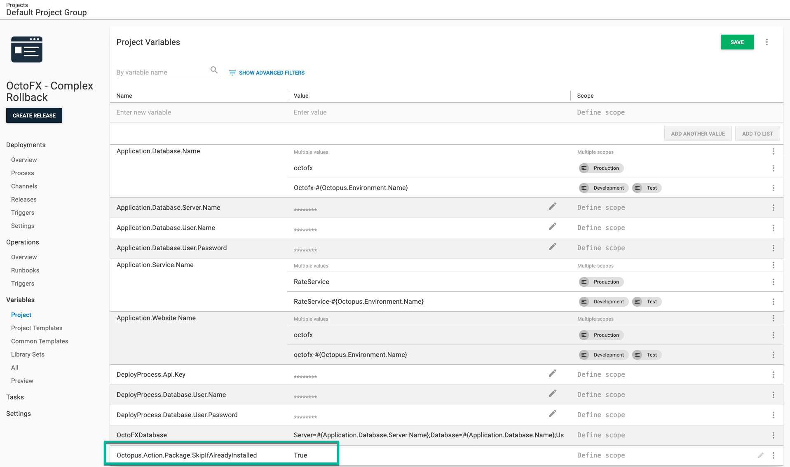

Whenever the topic of rollbacks comes up, inevitably the conversation will turn to blue/green, red/black, or canary deployment patterns.  Those patterns are fantastic and can make rollbacks a breeze.  However, they require a lot of time and effort to implement.  But at times they can be overkill, maybe you pushed out an API change to **Test** and you just want to get back to a known good state.  In this post, I am going to walk through some rollback strategies you can implement today without the need to implmenent those deployment patterns.

:::hint
**Out of scope**
Rolling back database changes **successfully** [is a complex topic](https://octopus.com/blog/database-rollbacks-pitfalls).  As such, they are out of scope for this article.   I am assuming one of the following is true:

- You haven't made any database changes since the last release.
- Your database changes are decoupled from your code changes.
- Your database changes are backward comptiable with the previous version of your code.

In practice, code and UI changes are much more frequent than database changes.  Especially in the **Test** environment.  Typically the "big" schema change happens at the start of a new feature, with a few minor tweaks made while the feature is being tested.
:::

# Rollfoward or Rollback

Let's get this out of the way, not all releases can and should be rolled back, and a roll foward strategy should be used.  A small fix can be easier to test and deploy than rolling back a major release.  Rolling foward is safer for numerous reasons.

- You cannot pick and choose which piece of code to rollback in a binary.  It either all rolls back or nothing rolls back.  A team on a once a month or once a quarter release schedule will have dozens if not 100s of changes. 
- Often, database and code changes are tightly coupled together.  Safely rolling back a database **without data loss** is [extremely difficult](https://octopus.com/blog/database-rollbacks-pitfalls).
- Users will notice when something is changed and then changed back.  Especially for custom business applications used all day by the same user base.  
- With the proliferation of [Service Oriented Architecture](https://en.wikipedia.org/wiki/Service-oriented_architecture)(SOA) and its cousin [Microservices](https://en.wikipedia.org/wiki/Microservices) code changes are rarely made in isolation.  "Proper" SOA and Microservices architecture are loosly coupled to each other and their clients.  However, in the real-world, coupling exists.  A rollback to a back-end service could have downstream impacts.

Despite that, there are several scenarios when a rollback can be right solution.  A legacy monolith applications with a large database can be successfully rolled back in specific circumstances.  Some of those scenarios include (but not limited to):

- Styling or markup only changes.
- Back-end code changes with no public interface or model changes.
- Zero to minimal coupling with external services or applications.
- Zero to minimal database changes (new index, changing a stored procedure for performance improvements, tweaked view including additional columns on already joined tables).
- Number of changes since last release is small.

Having a rollback strategy in place, even if it is rarely used, is a valuable option in your CI/CD pipeline. 

# Example Deployment Process

I am going to use the [OctoFX Sample Application](https://github.com/OctopusSamples/OctoFX) for my example rollback process.  I chose this application because it is built a few years ago with .NET 4.5.2, and has the following components:

- SQL Server Database
- Windows Service
- ASP.NET MVC Website

OctoFx is similar to a lot of applications I've seen (and worked on).  Your database platform, back-end service, and front-end might be using completely different technology.  The concepts below apply to almost every process/techology.

The deployment process for this application is:

1. Run a runbook to create the database when it doesn't exist.
1. Deploy the database changes.
1. Deploy the Windows Service.
1. Deploy the Website.
1. Pause the deployment and verify the application.
1. Notify stakeholders the deployment is complete.


# What is a rollback?

When I started working on the examples for this post (and our docs), I took a giant step back and asked, what is my end goal of rolling back the OctoFX application?  To answer that, I focused on the two scenarios I encountered when I was a developer.

- A change was deployed to **Test** with a critical bug and QA and the business analysts are blocked.
- A change was deployed to **Production** with a showstopping bug.

The end goal is the same in both scenarios, I need to get back to a known good state.  

:::hint
Ironically, most customers I talk to are focused on the **Production** scenario, yet the **Test** scenario happens much more often and has a much bigger impact than most people realize.  The mindset is often "eh, it's test, only a few people are affected."  But if QA cannot test, that causes deadlines to slip.  I've seen a QA team come in on the weekend to catch-up on work only to discover the latest build has a show-stopping bug.  If you follow Octopus' core rule of [build once, deploy everywhere](https://octopus.com/blog/build-your-binaries-once), the chances of a showstopping bug making to **Production** is rare (but not impossible).
:::

# Re-deploy previous release

The easiest way to get back to a known good state is to re-deploy the previous release.  And the good news is that scenario is supported with zero modifications in Octopus Deploy.

Select the release you want to redeploy to your target environment.  In my example, I am going to redeploy `2021.9.9.3` to **Test**.


Click on the overflow menu and select **Re-deploy...**.


You'll be sent to the deployment screen.  Click the **DEPLOY** button to kick off the re-deployment.


# Deployment Mode

Re-deploying a previous release as-is means _all_ the steps from the previous deployment will be re-run.  Typically, a rollback involves running a subset of steps, and perhaps one or two extra steps that should _only run during a rollback_.  In reality, there are three "deployment modes" to consider.

- **Deployment**: First time a release is deployed to a specific environment to add new features, fix bugs, and more to the application.
- **Rollback**: Re-deploying a previous release in a specific environment to return to a known good state.
- **Redeployment**: Re-deploying the same release in a specific environment when a new server comes online or you need to "kick" the application.

For example, during a deployment I'd want to run all the steps in my deployment process.

1. Run a runbook to create the database when it doesn't exist.
1. Deploy the database changes.
1. Deploy the Windows Service.
1. Deploy the Website.
1. Pause the deployment and verify the application.
1. Notify stakeholders the deployment is complete.

During a rollback I might want to skip steps 1 and 2.

1. ~~Run a runbook to create the database when it doesn't exist.~~
1. ~~Deploy the database changes.~~
1. Deploy the Windows Service.
1. Deploy the Website.
1. Pause the deployment and verify the application.
1. Notify stakeholders the deployment is complete.

And during a redeployment I only want to deploy the website and notify the stakeholders.

1. ~~Run a runbook to create the database when it doesn't exist.~~
1. ~~Deploy the database changes.~~
1. ~~Deploy the Windows Service.~~
1. Deploy the Website.
1. ~~Pause the deployment and verify the application.~~
1. Notify stakeholders the deployment is complete.

What is needed is the ability to calculate the "deployment mode."  And even better news, Octopus provides the necessary system variables to do that.

- `Octopus.Release.Number`: The number (`1.2.2`) of the current release.
- `Octopus.Release.CurrentForEnvironment.Number`: The ID (`1.1.1`) of the last **successful** release deployed to the current environment.

# Calculate Deployment Mode Step Template

I've created the step template, [Calculate Deployment Mode](https://library.octopus.com/step-templates/d166457a-1421-4731-b143-dd6766fb95d5/actiontemplate-calculate-deployment-mode), to perform that calculation for you.  It uses those system variables to set a number of output variables.

 - **DeploymentMode**: Will either be Deploy, Rollback or Redeploy.
 - **Trigger**: Will either be True or False.
 - **VersionChange**: Will either be Identical, Major, Minor, Build, or Revision.

While working on the step template, I realized almost everyone will want to use the **DeploymentMode** output variable in a [variable run condition](https://octopus.com/docs/projects/steps/conditions#variable-expressions).  The syntax for the run condition can be tricky, because what trips up most people is error handling.  When run conditions are used, Octopus will always evaluate the run condition to determine if the step should run, even if an error occurs in a previous step.  This has resulted in a lot of steps being run when they shouldn't have. 

The variable run condition when the deployment mode is **Rollback** with all the necessary error handling is:

```
#{unless Octopus.Deployment.Error}#{if Octopus.Action[Calculate Deployment Mode].Output.DeploymentMode == "Rollback"}True#{else}False#{/if}#{/unless}
```

I can foresee a lot of copy/paste errors.  To make that easier, I added the following output variables with the necessary error handling and comparison logic. 

- **RunOnDeploy**: Only run the step when the DeploymentMode is **Deploy**.
- **RunOnRollback**: Only run the step when the DeploymentMode is **Rollback**.
- **RunOnRedeploy**: Only run the step when the DeploymentMode is **Redeploy**.
- **RunOnDeployOrRollback**: Only run the step when the DeploymentMode is **Deploy** or **Rollback**.
- **RunOnDeployOrRedeploy**: Only run the step when the DeploymentMode is **Deploy** or **Redeploy**.
- **RunOnRedeployOrRollback**: Only run the step when the DeploymentMode is **Redeploy** or **Rollback**.
- **RunOnMajorVersionChange**: Only run the step when the VersionChange is **Major**.
- **RunOnMinorVersionChange**: Only run the step when the VersionChange is **Minor**.
- **RunOnMajorOrMinorVersionChange**: Only run the step when the VersionChange is **Major** or **Minor**.
- **RunOnBuildVersionChange**: Only run the step when the VersionChange is **Build**.
- **RunOnRevisionVersionChange**: Only run the step when the VersionChange is **Revision**.

With those output variables the syntax for that same **Rollback** run condition is:

```
#{Octopus.Action[Calculate Deployment Mode].Output.RunOnRollback}
```

# Prevent Release Progression Step Template

I mentioned earlier there might be a step or two that only runs during a rollback.  An example of a "rollback only" step is marking a release as "bad."  When thinking about roll backs, a roll back, even in a **Test** environment, is a significant event.  If a release has a lot of bugs in it, you don't want it to move onto the next environment in the lifecycle.  

Octopus provides the ability to [prevent release progression](https://octopus.com/docs/releases/prevent-release-progression), however that is a manual step.  I'm not a fan of manual steps, so I made a new step template, [Block Release Progression](https://library.octopus.com/step-templates/78a182b3-5369-4e13-9292-b7f991295ad1/actiontemplate-block-release-progression) to do prevent the release progression as part of the deploymnt process.  

# Deployment Process with Rollback Steps

Using the [Calculate Deployment Mode](https://library.octopus.com/step-templates/d166457a-1421-4731-b143-dd6766fb95d5/actiontemplate-calculate-deployment-mode), [variable run condition](https://octopus.com/docs/projects/steps/conditions#variable-expressions), and [Block Release Progression](https://library.octopus.com/step-templates/78a182b3-5369-4e13-9292-b7f991295ad1/actiontemplate-block-release-progression), the updated deployment process is:

1. Calculate Deployment Mode
1. Run a runbook to create the database when it doesn't exist (only run when deployment mode is **Deploy**).
1. Deploy the database changes (only run when deployment mode is **Deploy**).
1. Deploy the Windows Service.
1. Deploy the Website.
1. Block Release Progression (only run when deployment mode is **Rollback**).
1. Pause the deployment and verify the application (only run when deployment mode is **Deploy** or **Rollback**).
1. Notify stakeholders the deployment is complete.


:::hint
Make use of the step notes feature to indicate which step runs during deployments, rollbacks, or always.


:::

# Advanced Deployment Process with Rollback Steps

To keep downtime to a minimum, by default Octopus will do the following when you deploy a website or a service:

1. Extract the package to a new folder.
1. Perform any necessary configuration transforms.
1. Run any embedded scripts.
1. Update the web server (IIS, NGINX, Tomcat, etc.) or service to point to the new folder.

At first blush, you might think a re-deployment could take quite a bit of time.  But in practice, doing all that on a re-deployment should take 20-60 seconds.  In my experience, package transfer generally takes the most time.  Chances are, the packages will already be in the package cache on the deployment target.

Re-deploying the previous package should work without issue, but it isn't _exactly_ what was running before.  Octopus Deploy snapshots the deployment process, variables, and packages to make sure it is as close as possible. But, the variable snapshot could be refreshed, the embedded script could fail, or any other random error (like running out of disk space) could cause the re-deployment to fail.  

If you are deploying to a Windows or Linux target, by default Octopus keeps all the previous releases extracted on the tentacle (that can be configured via [retention policies](https://octopus.com/docs/administration/retention-policies)).  Platforms such as IIS and Windows Services support changing the physical path on a web application or service via a script.  You could have your deployment process point your web application or service to the previously extracted folder.  

:::hint
Unless there is a specific business reason to go down this route, I'd recommend sticking to the re-deployment.  It keeps the deployment process simple; all three deployment modes will use the same step to extract packages.  I added this because I wanted to highlight it is possible, and can be done if required.
:::

## Skip if Already Installed

One of the system variables you can set in your project is `Octopus.Action.Package.SkipIfAlreadyInstalled`.  As stated in our [documentation](https://octopus.com/docs/projects/variables/system-variables), that variable should be used with caution.  Let's see how that variable works to understand why we provide that warning.

To use that variable, first add it to your project with the value of `True`.



When Octopus sees that variable it will:

1. Search the DeploymentJournal.xml file on the deployment target.
1. If the package version is found it will set the output variable `Package.InstallationDirectoryPath` (for example `Octopus.Action[Deploy OctoFX Website].Output.Package.InstallationDirectoryPath`) to the extracted path found in the DeploymentJournal.xml file.  The most recent install directory will be selected.
1. Exit the step.  No other work will be done; embedded scripts and configuration transforms will be skipped.

It is important to point out the code doesn't check to see if the folder still exists.  Depending on the version you are rolling back to, it might have been cleaned up by retention policies.  

:::hint
Retention policies will always keep the two latest releases per environment.  If you are rolling back to the previous version, you shouldn't encounter any problems.  If you are rolling back to and older release you run the risk of it not being there.
:::

Most of the time, we don't want to skip a package if it is already installed during a deployment or redeployment.  Only a rollback.  I've seen a number of times where an application is re-deployed (same version) to "kick" the application to clear out a cache or clean up memory usage.  I don't recommend it, but it happens.

If you are going to use this process, I recommend:

- Set the variable value to be: `#{if Octopus.Action[Calculate Deployment Mode].Output.DeploymentMode == "Rollback"}True#{else}False#{/if}` so it only does this during a rollback.
- Scoping it to the steps such as Deploy to IIS or Deploy Windows Service that can leverage the DeploymentJournal.xml file.  This limits its potential impact.  

## Setting the physical path on web apps and services

For my rollback process I am going to be setting the physical path on the OctoFX Website and OctoFX Windows Service to previously installed folders.  With PowerShell that is simple to do.

- IIS: `IIS:\Sites\$websiteName -Name PhysicalPath -Value "#{Octopus.Action[Deploy OctoFX Website].Output.Package.InstallationDirectoryPath}"`
- Windows Service: `sc.exe config $serviceName binPath=#{Octopus.Action[Deploy OctoFX Windows Service].Output.Package.InstallationDirectoryPath}\OctoFX.RateService.exe`

