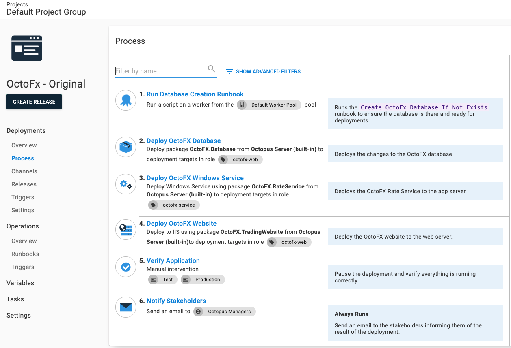
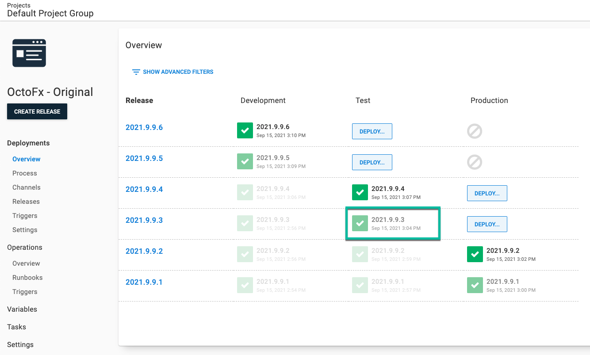
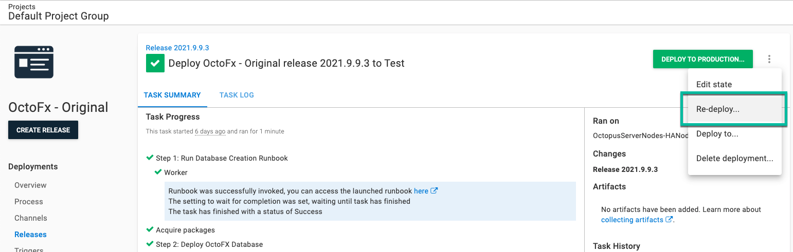
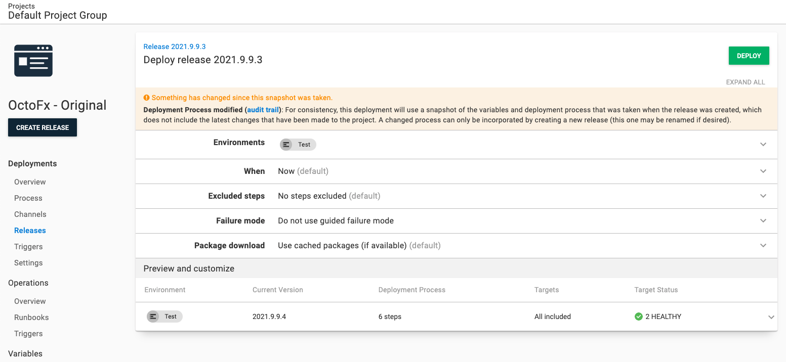
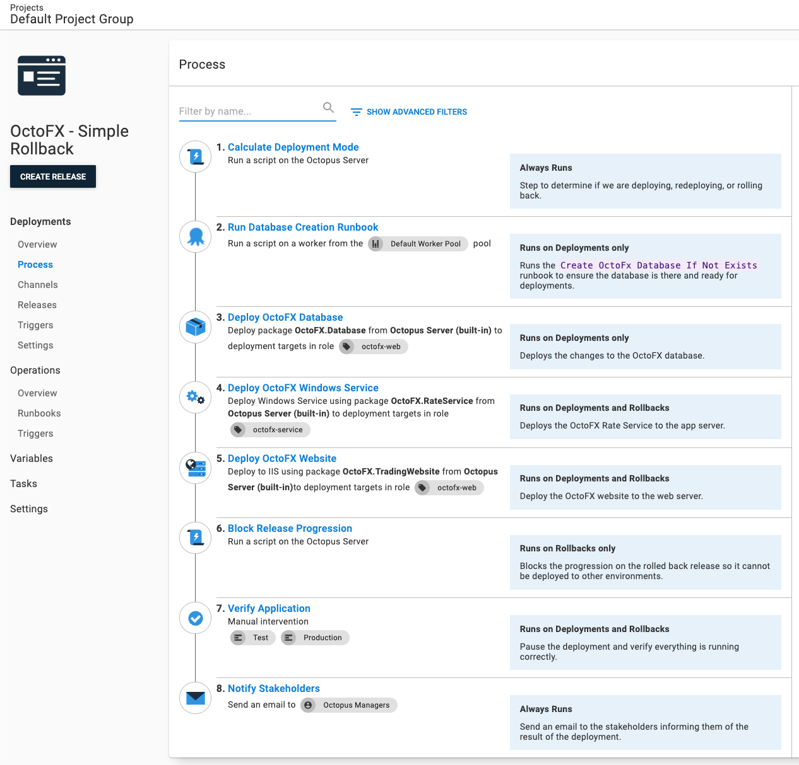
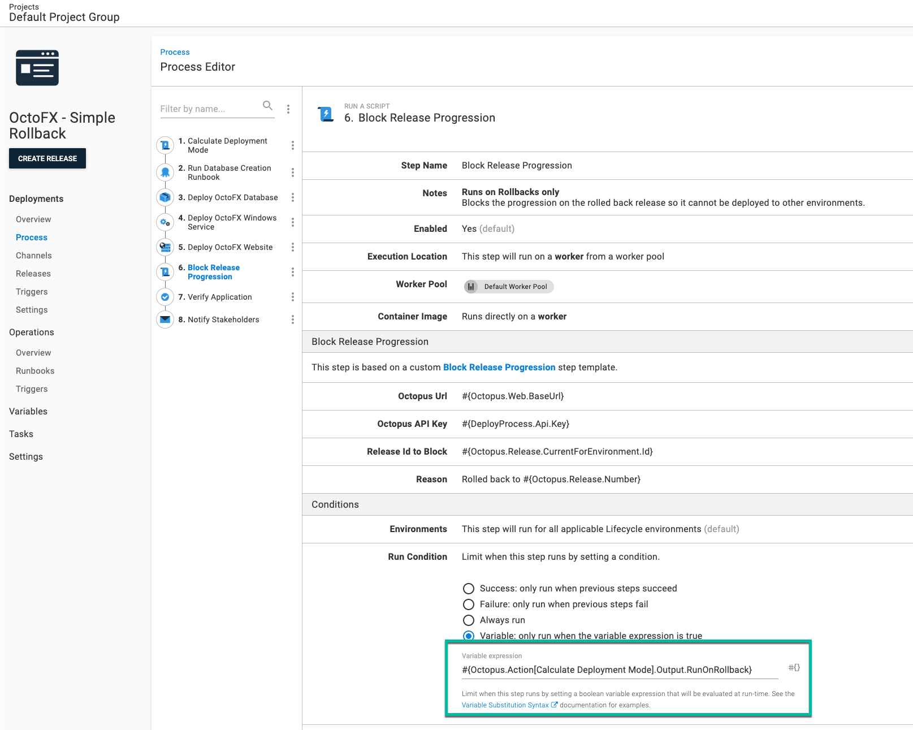
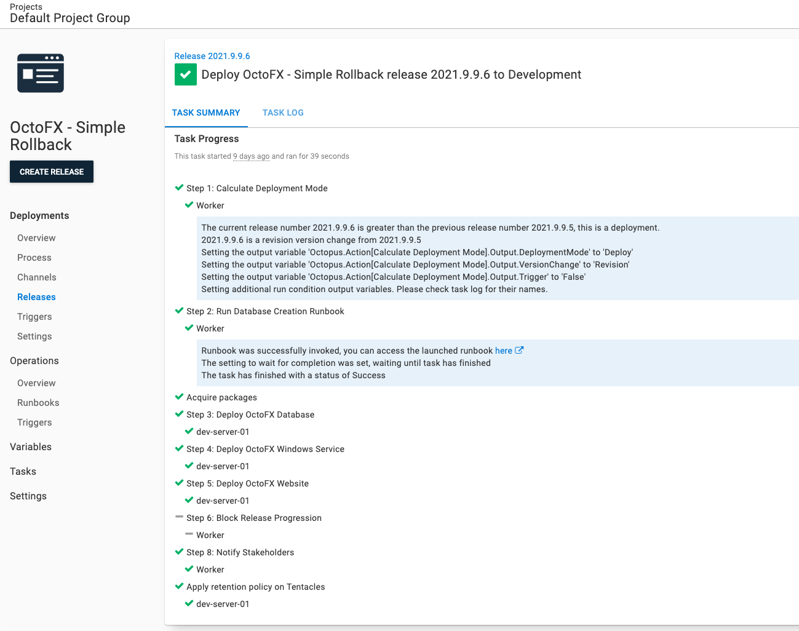
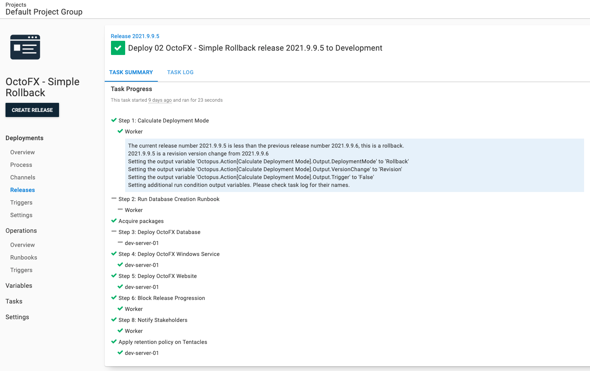
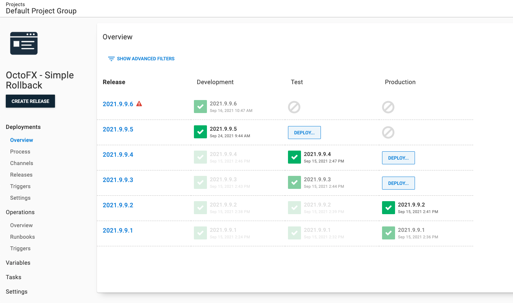

When discussing rollbacks, the conversation inevitably turns to blue/green, red/black, or canary deployment patterns. Those patterns make rollbacks easier, however, they're time-intensive to implement, and sometimes they're not necessary. Maybe you pushed out an API change to Test, and you want to get back to a known good state.  That's not when you should attempt to implement those patterns for the first time.  

In this post, I walk through a rollback strategy you can execute today, without implementing advanced deployment patterns.

:::warning
**Out of scope**
Rolling back database changes are out of scope for this post because doing them successfully [is a complex topic with many pitfalls](https://octopus.com/blog/database-rollbacks-pitfalls).  This post focuses on code-only rollbacks. It demonstrates how to skip database deployment steps during a rollback.  In practice, code and UI changes are much more frequent than database changes, especially in a test environment.  Most schema changes happen at the start of a new feature, with minor tweaks during testing.
:::

:::hint
You can also read about:

- [Rollback strategies when using an Apache Tomcat web server](https://octopus.com/blog/rolling-back-tomcat-deployment)
- [General and Kubernetes-specific rollback strategies using Octopus Deploy](https://octopus.com/blog/rolling-back-kubernetes-deployment)
:::

## What is a rollback?

This post will help you modify your existing (working and tested) deployment process to support rollbacks.  

First, let's examine what a rollback accomplishes.  

Consider these scenarios:

- The QA team is blocked because of a bug introduced in a recent deployment test, and the fix is hours from being checked in.
- During a production deployment verification, a show-stopping bug is found that will take over a day to fix and test.

The goal of a rollback is the same in both scenarios; quickly return the application to a known good state.

:::hint
Many customers focus on the production scenario, yet the test scenario occurs more often and has a bigger impact.  If you follow Octopus Deploy's core rule of [build once, deploy everywhere](https://octopus.com/blog/build-your-binaries-once), the chance of a show-stopping bug making it to production is rare.  However, test is different; there's a mindset that only a few people are affected, but that's untrue because deadlines will slip if QA is blocked for hours at a time.  
:::

The goal is to get back to a known good state, but that's different from a deployment.  Skipping specific steps can make rollbacks faster.  Many deployment processes are created assuming none of the dependent software or infrastructure has been configured.  For example, a deployment process could trigger a runbook to create a database if it didn't already exist; or install the latest version of Node.js.  During a rollback, those additional steps aren't needed.  If you check the database existed when deploying `2021.2.3` of your application, you won't need to check again when rolling back to `2021.2.1`.  

For this post: 
> A rollback is getting back to a known good state by running a modified version of the original deployment process.  

## Rolling forward or rolling back

Not all releases can and should be rolled back.  The scenarios above mention a fix is hours or days away.  Often, rolling forward is less risky and time-consuming.  A minor fix can be easier to test and deploy than rolling back a major release.  

Here are some typical reasons why we recommend rolling forward:

- You cannot choose which code to roll back in a binary.  It either all rolls back, or nothing rolls back.  A team on a monthly or quarterly release schedule has dozens or hundreds of changes.  That's why we also recommend smaller changesets released more regularly.
- Often, database and code changes are tightly coupled together.  Safely rolling back a database without data loss is [extremely difficult](https://octopus.com/blog/database-rollbacks-pitfalls), if not impossible.
- Users notice when something changes and then changes back, especially custom business applications used all day by the same people.  
- With the proliferation of [service-oriented architecture](https://en.wikipedia.org/wiki/Service-oriented_architecture) (SOA) and its cousin [microservices](https://en.wikipedia.org/wiki/Microservices), code changes are rarely made in isolation.  "Proper" SOA and microservices architectures are loosely coupled to each other and their clients.  However, in the real world, coupling exists.  A rollback to a back-end service can have downstream impacts.

There are several scenarios when a rollback can be the right solution though.  A legacy monolith application with a large database can be successfully rolled back in specific circumstances.  Some of these scenarios include:

- Styling or markup only changes
- Back-end code changes with no public interface or model changes
- Zero to minimal coupling with external services or applications
- Zero to minimal database changes (new index, changing a stored procedure for performance improvements, tweaked view including additional columns on already joined tables)
- A small number of changes since the last release

While we recommend rolling forward, having a rollback process in place is a valuable option in your CI/CD pipeline, even if a rollback occurs once a month.

## Test your rollback process

Many years ago, a few hours after a production deployment, I was informed about a show-stopping bug.  I was surprised as the release had gone through weeks of verification by QA.  We couldn't establish the cause and concluded a rollback was needed - the first in years.  

The rollback plan in the deployment document was: "rollback to the previous version of code".  Unfortunately, that's not a detailed plan.  We escalated the issue, and paged everyone involved with the release (from QA, to business owners, and managers).  

We created a new rollback plan from scratch.  Despite a new plan, we estimated the odds of a successful rollback at 10%. It was a no-win situation. We had a show-stopping bug we couldn't repro (and therefore fix), or we could roll back and take our chances.  

Rolling back offered some chance as opposed to none though. Each person was assigned a task. I went through the changelog, item by item, and documented the impact of rolling back.  

Fifteen minutes before we needed to make the final rollback decision, I discovered a block of code that looked suspicious.  My tests to hit that block of code established it was the culprit.  

We aborted the rollback plans, implemented a fix, and pushed the fix out later that day. We were relieved we didn't have to test an unproven rollback process.

This story highlights the importance of testing your rollback processes multiple times.  Ideally, it should be tested and verified weekly.  During a production outage, the last thing you want to do is develop a new rollback process or run an untested one.  

## Example deployment process

Now I explain how to update an existing deployment process to support rollbacks.  

I chose [OctoFX sample application](https://github.com/OctopusSamples/OctoFX) for this example because it's similar to many applications I see and work on.  It has the following components:

- SQL Server Database
- Windows Service
- ASP.NET MVC website

The deployment process for this application is:

1. Run a runbook to create the database when it doesn't exist
1. Deploy the database changes
1. Deploy the Windows Service
1. Deploy the website
1. Pause the deployment and verify the application
1. Notify stakeholders the deployment is complete



Your database platform, back-end service, and front-end might be using different technology.  In this post, I update the process to skip specific steps and run additional steps during a rollback.  

## Redeploy previous release

The core concept of my rollback process is redeploying a previous release. You can do that by:

Selecting the release you want to redeploy to your target environment.  In my example, I redeploy `2021.9.9.3` to **Test**.



Click the overflow menu and select **Re-deploy...**.



You'll be sent to the deployment screen.  Click **DEPLOY** to start the redeployment.



## Deployment mode

Redeploying a previous release as-is means _all_ the steps from the previous deployment will re-run.  As mentioned, a rollback's goal is to get back to a known state by running a slightly modified deployment process.  

:::hint
Your rollback process will be different from the example; I use the database steps as the example.  The goal is to show you _how_ to disable the steps, rather than _what_ is being disabled.
:::

To disable specific steps for a rollback, we need to know a rollback is occurring.  But we are going to redeploy an existing release.  Redeploying the same release to the current environment is a valid use case though.  What we need to know is the "deployment mode".

- **Deployment**: First time a release is deployed to a specific environment to add new features, fix bugs, and more to the application.
- **Rollback**: Redeploying a previous release in a specific environment to return to a known good state.
- **Redeployment**: Redeploying the same release in a specific environment when a new server comes online, or you need to "kick" the application.

We need to know this because it changes the deployment process.  The deployment process during a deployment runs all the steps:

1. Run a runbook to create the database when it doesn't exist
1. Deploy the database changes
1. Deploy the Windows Service
1. Deploy the website
1. Pause the deployment and verify the application
1. Notify stakeholders the deployment is complete

A rollback will skip the first two steps.

1. ~~Run a runbook to create the database when it doesn't exist~~
1. ~~Deploy the database changes~~
1. Deploy the Windows Service
1. Deploy the website
1. Pause the deployment and verify the application
1. Notify stakeholders the deployment is complete

For my application, I only redeploy when the web farm is scaled out.  I never scale out the app servers or database.  I only want to deploy the website and notify the stakeholders.  

1. ~~Run a runbook to create the database when it doesn't exist~~
1. ~~Deploy the database changes~~
1. ~~Deploy the Windows Service.~~
1. Deploy the website
1. ~~Pause the deployment and verify the application~~
1. Notify stakeholders the deployment is complete

We need the ability to calculate the "deployment mode".  Octopus provides the system variables:

- `Octopus.Release.Number`: The current release's number (`1.2.2`).
- `Octopus.Release.CurrentForEnvironment.Number`: The ID (`1.1.1`) of the last *successful* release, deployed to the current environment.

To calculate deployment mode you compare `Octopus.Release.Number` with `Octopus.Release.CurrentForEnvironment.Number`:  

- If it's greater, it's a deployment
- If it's less, it's a rollback
- If they're the same, it's a redeployment

## Calculate Deployment Mode step template

I created the step template, **[Calculate Deployment Mode](https://library.octopus.com/step-templates/d166457a-1421-4731-b143-dd6766fb95d5/actiontemplate-calculate-deployment-mode)**, to perform the calculation for you.  Using that result, it will set several output variables.

 - **DeploymentMode**: Will be `Deploy`, `Rollback`, or `Redeploy`
 - **Trigger**: Indicates if the deployment was caused by a deployment target trigger or a scheduled trigger -  it will be `True` or `False`
 - **VersionChange**: Will be `Identical`, `Major`, `Minor`, `Build`, or `Revision`

Working on the step template, I realized most people would use the **DeploymentMode** output variable in a [variable run condition](https://octopus.com/docs/projects/steps/conditions#variable-expressions).  Because of error handling, the syntax for the run condition can be tricky to get right.  Octopus always evaluates the variable run condition to determine if the step should run, even if an error occurs in a previous step.  If we don't include error handling in the run condition, it could evaluate to `True` and run the step.  We don't want that. 

The variable run condition when the deployment mode is `Rollback` with all the necessary error handling is:

```
#{unless Octopus.Deployment.Error}#{if Octopus.Action[Calculate Deployment Mode].Output.DeploymentMode == "Rollback"}True#{else}False#{/if}#{/unless}
```

I added the following output variables with the necessary error handling and comparison logic to make that easier. 

- `RunOnDeploy`: Only run the step when the DeploymentMode is `Deploy`
- `RunOnRollback`: Only run the step when the DeploymentMode is `Rollback`
- `RunOnRedeploy`: Only run the step when the DeploymentMode is `Redeploy`
- `RunOnDeployOrRollback`: Only run the step when the DeploymentMode is `Deploy` or `Rollback`
-`RunOnDeployOrRedeploy`: Only run the step when the DeploymentMode is `Deploy` or `Re-deploy`
- `RunOnRedeployOrRollback`: Only run the step when the DeploymentMode is `Redeploy` or `Rollback`
- `RunOnMajorVersionChange`: Only run the step when the VersionChange is `Major`
- `RunOnMinorVersionChange`: Only run the step when the VersionChange is `Minor`
- `RunOnMajorOrMinorVersionChange`: Only run the step when the VersionChange is `Major` or `Minor`
- `RunOnBuildVersionChange`: Only run the step when the VersionChange is `Build`
- `RunOnRevisionVersionChange`: Only run the step when the VersionChange is `Revision`

With those output variables, the syntax for that same **Rollback** run condition is:

```
#{Octopus.Action[Calculate Deployment Mode].Output.RunOnRollback}
```

## Block Release Progression step template

I mentioned an additional step I want to run during a rollback.  One example is blocking the release progression.  A rollback, even in a test environment, is a significant event.  If a release has multiple bugs, you don't want it to move on to the next environment in the lifecycle.  

Octopus lets you [prevent release progression](https://octopus.com/docs/releases/prevent-release-progression), however, that's a manual step.  I avoid manual steps, so I made a new step template, [Block Release Progression](https://library.octopus.com/step-templates/78a182b3-5369-4e13-9292-b7f991295ad1/actiontemplate-block-release-progression), to prevent the release progression as part of the deployment process.  

## Deployment process with rollback steps

Using the [Calculate Deployment Mode](https://library.octopus.com/step-templates/d166457a-1421-4731-b143-dd6766fb95d5/actiontemplate-calculate-deployment-mode), [variable run condition](https://octopus.com/docs/projects/steps/conditions#variable-expressions), and [Block Release Progression](https://library.octopus.com/step-templates/78a182b3-5369-4e13-9292-b7f991295ad1/actiontemplate-block-release-progression), the updated deployment process is:

1. Calculate Deployment Mode
1. Run a runbook to create the database when it doesn't exist (only run when deployment mode is **Deploy**)
1. Deploy the database changes (only run when deployment mode is **Deploy**)
1. Deploy the Windows Service
1. Deploy the website
1. Block Release Progression (only run when deployment mode is **Rollback**)
1. Pause the deployment and verify the application (only run when deployment mode is **Deploy** or **Rollback**)
1. Notify stakeholders the deployment is complete



:::hint
Use the step **Notes** feature to indicate which step runs during deployments, rollbacks, or always.


:::

### Setting run conditions

The steps marked as "only run when deployment mode is **Rollback**" or "only run when deployment mode is **Deploy** or **Rollback**" will need the **Run Condition** updated to be a variable.  The variable will be one of the output variables from the **[Calculate Deployment Mode](https://library.octopus.com/step-templates/d166457a-1421-4731-b143-dd6766fb95d5/actiontemplate-calculate-deployment-mode)** step.  



### Testing the rollback

For my test, I have two releases:

- `2021.9.9.5`: This is currently in the **Development** environment.
- `2021.9.9.6`: This is a new release I want to deploy to **Development**.

Deploying `2021.9.9.6` to **Development** went as expected.  Step 6 is skipped as that is set only to run when the deployment mode is **Rollback**.



In my test scenario, a show-stopping bug in `2021.9.9.6` is found after the deployment.  We want to:

- Rollback to `2021.9.9.5`.
- Block progression on `2021.9.9.6` to prevent it from being deployed to **Test** or **Production**.

Redeploying `2021.9.9.5` went as expected.  Steps 2 and 3 were skipped while step 6 ran.



In addition, `2021.9.9.6` has had the release progression blocked. Users will see a visual indicator on the project dashboard.



## Automatic rollbacks

Next you need to think about triggering the rollback.  I recommend manually triggering the rollback and logging an explanation.  When you see a pattern, you should add in automated tests to detect if a specific condition is met.  The concern I have is receiving a "false positive", causing a release to roll back in production when it shouldn't.  

In this scenario, I don't trigger the rollback automatically until I have automated all the steps to make a rollback decision.  

For example, if one of your conditions has no database changes, you should have a script check the SQL scripts for schema changes (for example: add table, add column).  If a schema change is found, then a rollback isn't possible.

Next, automatically trigger the rollbacks for all your non-production environments.  After several successful rollback decisions have been made, turn it on for production.  

## Conclusion

I was bullish adopting advanced deployment patterns such as blue/green, red/black, or canary as the only way to roll back.  I used to believe you should only roll forward if you couldn't adopt those patterns, to save time and money on existing applications.  There are legitimate business reasons to adopt advanced deployment patterns, for example, Google can never have an outage, so a canary-style deployment makes sense.  

But an internal business application used by a few dozen people from 6am EST to 10pm PST won't get the same benefits for the cost.

You can create a rollback process with a few tweaks to your existing deployment process using [variable run conditions](https://octopus.com/docs/projects/steps/conditions#variable-expressions) and the new step templates, **[Calculate Deployment Mode](https://library.octopus.com/step-templates/d166457a-1421-4731-b143-dd6766fb95d5/actiontemplate-calculate-deployment-mode)** and **[Block Release Progression](https://library.octopus.com/step-templates/78a182b3-5369-4e13-9292-b7f991295ad1/actiontemplate-block-release-progression)**.  While they won't support every possible rollback scenario, they give you other options if you find a bug.


## Watch the webinar: Rollback strategies with Octopus Deploy

<iframe width="560" height="315" src="https://www.youtube.com/embed/F_V7r80aDbo" title="YouTube video player" frameborder="0" allow="accelerometer; autoplay; clipboard-write; encrypted-media; gyroscope; picture-in-picture" allowfullscreen></iframe>

We host webinars regularly. See the [webinars page](https://octopus.com/events) for details about upcoming events, and live stream recordings.

Happy deployments!
