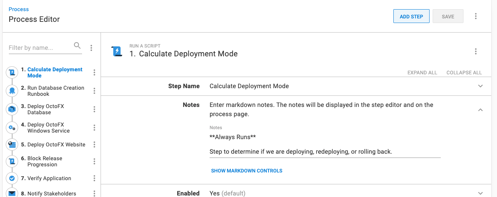

Whenever the topic of rollbacks comes up, inevitably the conversation will turn to blue/green, red/black, or canary deployment patterns.  Those patterns are fantastic and can make rollbacks a breeze.  However, they require a lot of time and effort to implement and they can be overkill.  Maybe you pushed out an API change to **Test** and you just want to get back to a known good state.  In this post, I am going to walk through some rollback strategies you can implement today without the need to implmenent those deployment patterns.

:::hint
**Out of scope**
Rolling back database changes **successfully** [is a complex topic](https://octopus.com/blog/database-rollbacks-pitfalls) and is out of scope for this article.  The use cases for this article are focused on code-only changes.  In practice, code and UI changes are much more frequent than database changes.  Especially in the **Test** environment.  Typically the "big" schema change happens at the start of a new feature, with a few minor tweaks made while the feature is being tested.
:::

# What is a rollback?

When I started working on the examples for this post (and our docs), I took a giant step back and asked, what is my end goal of rolling back an application?  To answer that, I focused on the two scenarios I encountered when I was a developer.

- A change was deployed to **Test** with a bug and the team is blocked.
- A change was deployed to **Production** with a showstopping bug.

The end goal is the same in both scenarios, I need to get back to a known good state.  

:::hint
Ironically, most customers I talk to are focused on the **Production** scenario, yet the **Test** scenario happens much more often and has a much bigger impact than most people realize.  The mindset is often "eh, it's test, only a few people are affected."  But if QA cannot test, that causes deadlines to slip.  I've seen a QA team come in on the weekend to catch-up on work only to discover the latest build has a show-stopping bug.  If you follow Octopus' core rule of [build once, deploy everywhere](https://octopus.com/blog/build-your-binaries-once), the chances of a showstopping bug making to **Production** is rare (but not impossible).
:::

In my experience, getting back to a known good state takes fewer steps than a typical deployment.  For example, during my deployment process I ran a series of steps to make sure the database was there, along with the SQL User.  I don't need to run those steps again because the database is already there.  But I might want to run other steps during a rollback, such as notifying additional people a rollback occurred.

A rollback is getting back to a known good state by running a slightly modified version of the original deployment process.  

# Rollfoward or Rollback

Let's get this out of the way, not all releases can and should be rolled back.  Rolling forward often is less risky and time consuming.  A small fix can be easier to test and deploy than rolling back a major release.  

Here are some typical reasons why we recommend rolling forward.

- You cannot pick and choose which piece of code to rollback in a binary.  It either all rolls back or nothing rolls back.  A team on a once a month or once a quarter release schedule will have dozens if not 100s of changes. 
- Often, database and code changes are tightly coupled together.  Safely rolling back a database **without data loss** is [extremely difficult](https://octopus.com/blog/database-rollbacks-pitfalls).
- Users will notice when something is changed and then changed back.  Especially for custom business applications used all day by the same user base.  
- With the proliferation of [Service Oriented Architecture](https://en.wikipedia.org/wiki/Service-oriented_architecture)(SOA) and its cousin [Microservices](https://en.wikipedia.org/wiki/Microservices) code changes are rarely made in isolation.  "Proper" SOA and Microservices architecture are loosly coupled to each other and their clients.  However, in the real-world, coupling exists.  A rollback to a back-end service could have downstream impacts.

Despite that, there are several scenarios when a rollback can be right solution.  A legacy monolith applications with a large database can be successfully rolled back in specific circumstances.  Some of those scenarios include (but not limited to):

- Styling or markup only changes.
- Back-end code changes with no public interface or model changes.
- Zero to minimal coupling with external services or applications.
- Zero to minimal database changes (new index, changing a stored procedure for performance improvements, tweaked view including additional columns on already joined tables).
- Number of changes since last release is small.

While we recommend rolling forward, having a rollback process in place is a valuable option in your CI/CD pipeline.  Even if the rollback process is rarely used.

# Test your rollback process

About 10 years ago I worked for a company who did 2 AM Saturday **Production** deployments.  Three hours after my first **Production** deployment, I got a phone call informing me a showstopping bug was found.  That was a bit of a shock as that release had gone through weeks of verification by QA.  We could not figure out what was causing it.  We came to the conclusion a rollback was needed and informed the necessary people.  This was the first rollback in years, and immediately the issue was esclated and the entire dev team was paged.  

It was a no-win scenario, we had a showstopping bug we couldn't repro (and therefore fix), or we could rollback and take our chances.  We pegged the odds of a successful rollback at 10%.  It was still better than 0% (which is what we had in our current state).  A new rollback plan had to be created from scratch.  Each person was assigned a task, I was assigned the task of going through the changelog item by item and documenting the impact of rolling back.  15 minutes before we made the final (final) rollback decision, I came across a small block of code that looked suspicious.  I ran some tests I knew hit that block of code and to my surprise that is what was causing the showstopping bug.  We reverted that block of code to the earlier state and pushed out the fix.  

I'm telling you this story because if you create a rollback process, you should test it multiple times.  In a perfect world, it should be tested and verified once a week.  The last thing you want to do is run an untested rollback process in **Production** during an outage.  

# Example Deployment Process

For the rest of this article, I am going to update an existing deployment process to support rollbacks.  I chose [OctoFX Sample Application](https://github.com/OctopusSamples/OctoFX) for this example because it is similar to a lot of applications I've seen (and workd on).  It has the following components:

- SQL Server Database
- Windows Service
- ASP.NET MVC Website

Your database platform, back-end service, and front-end might be using completely different technology.  The concepts below apply to almost every process/techology.

The deployment process for this application is:

1. Run a runbook to create the database when it doesn't exist.
1. Deploy the database changes.
1. Deploy the Windows Service.
1. Deploy the Website.
1. Pause the deployment and verify the application.
1. Notify stakeholders the deployment is complete.


By the end of this article, I will have updated the process to skip the database steps while still running everything else during a rollback.

# Re-deploy previous release

The core concept to my rollback process will be redeploying a previous release.  That can be done by:

Selecting the release you want to redeploy to your target environment.  In my example, I am going to redeploy `2021.9.9.3` to **Test**.


Click on the overflow menu and select **Re-deploy...**.


You'll be sent to the deployment screen.  Click the **DEPLOY** button to kick off the re-deployment.


# Deployment Mode

Re-deploying a previous release as-is means _all_ the steps from the previous deployment will be re-run.  As I stated earlier, I want to disable a two steps during a rollback.  

:::hint
Your rollback process will be different than the example, I'm using the database steps as the example.  In your process you might want to skip the notification step.  The goal is to show you _how_ to disable the steps, rather than _what_ is being disabled.
:::

In order to disable specific steps for a rollback we need to know a rollback is occurring.  But it is not just a rollback.  In fact, we need to consider three "deployment modes".

- **Deployment**: First time a release is deployed to a specific environment to add new features, fix bugs, and more to the application.
- **Rollback**: Re-deploying a previous release in a specific environment to return to a known good state.
- **Re-deployment**: Re-deploying the same release in a specific environment when a new server comes online or you need to "kick" the application.

My process during a deployment would be.

1. Run a runbook to create the database when it doesn't exist.
1. Deploy the database changes.
1. Deploy the Windows Service.
1. Deploy the Website.
1. Pause the deployment and verify the application.
1. Notify stakeholders the deployment is complete.

As stated earlier, I want to skip steps 1 and 2 during a rollback.

1. ~~Run a runbook to create the database when it doesn't exist.~~
1. ~~Deploy the database changes.~~
1. Deploy the Windows Service.
1. Deploy the Website.
1. Pause the deployment and verify the application.
1. Notify stakeholders the deployment is complete.

But during a redeployment I only want to deploy the website and notify the stakeholders.  

1. ~~Run a runbook to create the database when it doesn't exist.~~
1. ~~Deploy the database changes.~~
1. ~~Deploy the Windows Service.~~
1. Deploy the Website.
1. ~~Pause the deployment and verify the application.~~
1. Notify stakeholders the deployment is complete.

What is needed is the ability to calculate the "deployment mode."  The good news is Octopus provides the necessary system variables to do that.

- `Octopus.Release.Number`: The number (`1.2.2`) of the current release.
- `Octopus.Release.CurrentForEnvironment.Number`: The ID (`1.1.1`) of the last **successful** release deployed to the current environment.

# Calculate Deployment Mode Step Template

I've created the step template, [Calculate Deployment Mode](https://library.octopus.com/step-templates/d166457a-1421-4731-b143-dd6766fb95d5/actiontemplate-calculate-deployment-mode), to perform that calculation for you.  It uses those system variables to set a number of output variables.

 - **DeploymentMode**: Will either be Deploy, Rollback or Redeploy.
 - **Trigger**: Will either be True or False.
 - **VersionChange**: Will either be Identical, Major, Minor, Build, or Revision.

While working on the step template, I realized almost everyone will want to use the **DeploymentMode** output variable in a [variable run condition](https://octopus.com/docs/projects/steps/conditions#variable-expressions).  The syntax for the run condition can be tricky, because of the error handling.  Octopus will always evaluate the variable run condition to determine if the step should run, even if an error occurs in a previous step.  This has resulted in a lot of steps being run when they shouldn't have. 

The variable run condition when the deployment mode is **Rollback** with all the necessary error handling is:

```
#{unless Octopus.Deployment.Error}#{if Octopus.Action[Calculate Deployment Mode].Output.DeploymentMode == "Rollback"}True#{else}False#{/if}#{/unless}
```

To make that easier, I added the following output variables with the necessary error handling and comparison logic. 

- **RunOnDeploy**: Only run the step when the DeploymentMode is **Deploy**.
- **RunOnRollback**: Only run the step when the DeploymentMode is **Rollback**.
- **RunOnRedeploy**: Only run the step when the DeploymentMode is **Redeploy**.
- **RunOnDeployOrRollback**: Only run the step when the DeploymentMode is **Deploy** or **Rollback**.
- **RunOnDeployOrRedeploy**: Only run the step when the DeploymentMode is **Deploy** or **Redeploy**.
- **RunOnRedeployOrRollback**: Only run the step when the DeploymentMode is **Redeploy** or **Rollback**.
- **RunOnMajorVersionChange**: Only run the step when the VersionChange is **Major**.
- **RunOnMinorVersionChange**: Only run the step when the VersionChange is **Minor**.
- **RunOnMajorOrMinorVersionChange**: Only run the step when the VersionChange is **Major** or **Minor**.
- **RunOnBuildVersionChange**: Only run the step when the VersionChange is **Build**.
- **RunOnRevisionVersionChange**: Only run the step when the VersionChange is **Revision**.

With those output variables the syntax for that same **Rollback** run condition is:

```
#{Octopus.Action[Calculate Deployment Mode].Output.RunOnRollback}
```

# Prevent Release Progression Step Template

A roll back, even in a **Test** environment, is a significant event.  If a release has a lot of bugs in it, you don't want it to move onto the next environment in the lifecycle.  

Octopus provides the ability to [prevent release progression](https://octopus.com/docs/releases/prevent-release-progression), however that is a manual step.  I'm not a fan of manual steps, so I made a new step template, [Block Release Progression](https://library.octopus.com/step-templates/78a182b3-5369-4e13-9292-b7f991295ad1/actiontemplate-block-release-progression) to do prevent the release progression as part of the deploymnt process.  

# Deployment Process with Rollback Steps

Using the [Calculate Deployment Mode](https://library.octopus.com/step-templates/d166457a-1421-4731-b143-dd6766fb95d5/actiontemplate-calculate-deployment-mode), [variable run condition](https://octopus.com/docs/projects/steps/conditions#variable-expressions), and [Block Release Progression](https://library.octopus.com/step-templates/78a182b3-5369-4e13-9292-b7f991295ad1/actiontemplate-block-release-progression), the updated deployment process is:

1. Calculate Deployment Mode
1. Run a runbook to create the database when it doesn't exist (only run when deployment mode is **Deploy**).
1. Deploy the database changes (only run when deployment mode is **Deploy**).
1. Deploy the Windows Service.
1. Deploy the Website.
1. Block Release Progression (only run when deployment mode is **Rollback**).
1. Pause the deployment and verify the application (only run when deployment mode is **Deploy** or **Rollback**).
1. Notify stakeholders the deployment is complete.


:::hint
Make use of the step notes feature to indicate which step runs during deployments, rollbacks, or always.


:::

## Setting Run Conditions

The steps marked as "only run when deployment mode is **Rollback**" or "only run when deployment mode is **Deploy** or **Rollback**" will need the **Run Condition** updated to be a variable.  The variable will be one of the output variables from the [Calculate Deployment Mode](https://library.octopus.com/step-templates/d166457a-1421-4731-b143-dd6766fb95d5/actiontemplate-calculate-deployment-mode) step.  


## Testing the rollback

For my test, I have two releases:

- `2021.9.9.5`: This is currently in the **Development** environment.
- `2021.9.9.6`: This is a new release I want to deploy to **Development**.

Deploying `2021.9.9.6` to **Development** went as expected.  Step 6 is skipped as that is set to only run when the deployment mode is **Rollback**.


In my test scenario, a showstopping bug in `2021.9.9.6` is found after the deployment.  We want to:

- Rollback to `2021.9.9.5`
- Block progression on `2021.9.9.6` to prevent it from being deployed to **Test** or **Production**.

Re-deploying `2021.9.9.5` went as expected.  Steps 2 and 3 were skipped while step 6 ran.


In addition, `2021.9.9.6` has had the release progression blocked. Users will see a visual indicator on the project dashboard.


# Advanced Deployment Process with Rollback Steps

Octopus Deploy will do the following when you deploy a package to keep downtime to a minimum:

1. Extract the package to a new folder.
1. Perform any necessary configuration transforms.
1. Run any embedded scripts.
1. Update the web server (IIS, NGINX, Tomcat, etc.) or service to point to the new folder.

At first blush, you might think a re-deployment could take quite a bit of time.  But in practice, a re-deployment should take 20-60 seconds.  In my experience, package transfer generally takes the most time, and most rollbacks will pull the package from the cache.

When I talk customers it is not the speed of the rollback.  Re-deploying the previous package isn't _exactly_ what was running before.  Octopus Deploy snapshots the deployment process, variables, and packages to make sure it is as close as possible. But, the variable snapshot could be refreshed, the embedded script could fail, or any other random error (like running out of disk space) could cause the re-deployment to fail.  

If you are deploying to a Windows or Linux target, by default Octopus keeps all the previous releases extracted on the tentacle (that can be configured via [retention policies](https://octopus.com/docs/administration/retention-policies)).  Platforms such as IIS and Windows Services support changing the physical path on a web application or service via a script.  You could have your deployment process point your web application or service to the previously extracted folder.  The trick is finding the right folder to point to.

## Skip if Already Installed

It turns out, it is very easy to get the previously installed folder.  One of the system variables you can set in your project is `Octopus.Action.Package.SkipIfAlreadyInstalled`.  When that variable is set to `True` it will skip installing the package, and will set the ``Package.InstallationDirectoryPath` output variable (for example `Octopus.Action[Deploy OctoFX Website].Output.Package.InstallationDirectoryPath`) to the previously installed folder.  It does that by pulling the information from the `DeploymentJournal.xml` file stored on each deployment target.

To use that variable, first add it to your project with the value of `True`.


It is not all sunshine and rainbows.  As stated in our [documentation](https://octopus.com/docs/projects/variables/system-variables), that variable should be used with caution.  That is because:

- The code only looks at the `DeploymentJournal.xml` to find the path, it doesn't check to see if the path exists.
- There are several use cases in which you want to re-deploy a package, even if it already exists.  I've seen a number of times where an application is re-deployed to reset the configuration file because a person manually changed it.

:::hint
Retention policies will always keep the two latest releases per environment.  If you are rolling back to the previous version, you shouldn't encounter any problems.  If you are rolling back to and older release you run the risk of it not being there.
:::

If you are going to use this process, I recommend:

- Set the variable value to be: `#{if Octopus.Action[Calculate Deployment Mode].Output.DeploymentMode == "Rollback"}True#{else}False#{/if}` so it only does this during a rollback.
- Scoping it to the specific steps, in my example it is the Deploy Windows Service and Deploy Website steps.  This limits its potential impact.  

## Setting the physical path on web apps and services

For my rollback process I am going to be setting the physical path on the OctoFX Website and OctoFX Windows Service to previously installed folders using PowerShell.

- IIS: `IIS:\Sites\$websiteName -Name PhysicalPath -Value "#{Octopus.Action[Deploy OctoFX Website].Output.Package.InstallationDirectoryPath}"`
- Windows Service: `sc.exe config $serviceName binPath=#{Octopus.Action[Deploy OctoFX Windows Service].Output.Package.InstallationDirectoryPath}\OctoFX.RateService.exe`

IIS will pick up the change right away, while the Windows Service requires a restart.  Rather than re-invent the wheel by writing a customer script, I'll use the following library step templates

- [Windows Service - Change binary path](https://library.octopus.com/step-templates/b6860fcf-9dee-48a0-afac-85e2098df692/actiontemplate-windows-service-change-binary-path)
- [Windows Service - Restart](https://library.octopus.com/step-templates/d1df734a-c0da-4022-9e70-8e1931b083da/actiontemplate-windows-service-restart)
- [IIS WebSite - Update Property](https://library.octopus.com/step-templates/34118a0e-f872-435a-8522-d3c7f8515cb8/actiontemplate-iis-website-update-property)

:::hint
If you are using a web application in IIS instead of a website, the step template to use is [IIS App - Update Property](https://library.octopus.com/step-templates/4eb08b60-142c-4443-92cf-2e069727f438/actiontemplate-iis-app-update-property).
:::

## Deployment Process

The updated deployment process is now:

1. Calculate Deployment Mode
1. Run a runbook to create the database when it doesn't exist (only run when deployment mode is **Deploy**).
1. Deploy the database changes (only run when deployment mode is **Deploy**).
1. Deploy the Windows Service (will skip if package is already installed and deployment mode is **Rollback**).
1. Deploy the Website (will skip if package is already installed and deployment mode is **Rollback**).
1. Update Windows Service Path (only run when deployment mode is **Rollback**).
1. Restart Windows Service (only run when deployment mode is **Rollback**).
1. Update IIS Website path (only run when deployment mode is **Rollback**).
1. Block Release Progression (only run when deployment mode is **Rollback**).
1. Pause the deployment and verify the application (only run when deployment mode is **Deploy** or **Rollback**).
1. Notify stakeholders the deployment is complete.


## Testing the rollback

For my test, I am using the same two release numbers:

- `2021.9.9.5`: This is currently in the **Development** environment.
- `2021.9.9.6`: This is a new release I want to deploy to **Development**.

As expected, steps 6, 7, 8, and 9 were all skipped when deploying `2021.9.9.6` to **Development**.


In my test scenario, a showstopping bug in `2021.9.9.6` is found after the deployment.  We want to:

- Rollback to `2021.9.9.5`
- Block progression on `2021.9.9.6` to prevent it from being deployed to **Test** or **Production**.

Re-deploying `2021.9.9.5` went as expected.  Steps 2 and 3 were skipped while step 6, 7, 8, and 9 ran.


When I click into the task log I can see the Windows Service and Website show successful, but in fact were skipped.


# Wrapping Up

If you asked me a few months ago about roll backs you'd get the answer "you should roll-forward" or "you should adopt advanced deployment patterns such as Blue/Green, Red/Black or Canary."  Implementing Blue/Green, Red/Black, or Canary deployments takes time and money.  Especially if you hand roll your own solution because your web server or tech platform doesn't support it.  I also don't think every application needs to adopt those advanced deployment patterns.  They should be implemented when there is a compelling business reason.  For example, Google's Search Engine can never have an outage, so Canary style deployments make sense.  But an internal enterprise application used by a few dozen people during from 6 AM EST to 10 PM PST won't get the same benefits for the cost.

In specific scenarios, rolling foward can be safer and faster.  But there are specific scenarios, where rolling back is safer and faster.  By making a few tweaks to an existing process I get the best of both worlds.  My hope is by combining [variable run condition](https://octopus.com/docs/projects/steps/conditions#variable-expressions) and the new step templates, [Calculate Deployment Mode](https://library.octopus.com/step-templates/d166457a-1421-4731-b143-dd6766fb95d5/actiontemplate-calculate-deployment-mode) and [Block Release Progression](https://library.octopus.com/step-templates/78a182b3-5369-4e13-9292-b7f991295ad1/actiontemplate-block-release-progression) you can create your own rollback (and re-deployment) process with a minimal amount of effort.