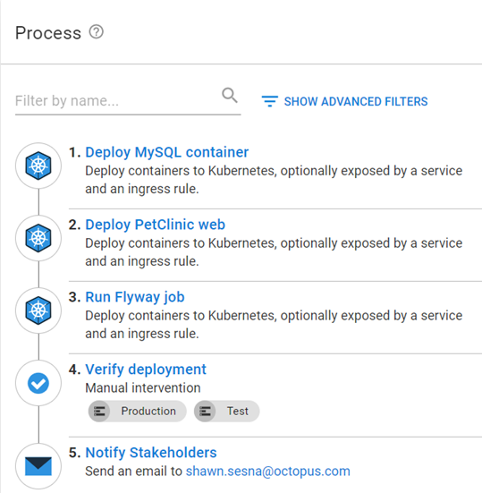

For various reasons, not every deployment goes as smoothly as we would like.  Bugs, unforseen circumstances, or hardware limitations can dictate whether an application will run once deployed to a Kubernetes cluster.  In the scenarios where the fix isn't easy or the application is unresponsive, you need to go back to the previous version, often referred to as a rollback.  In this post, I'll describe some general and Kubernetes specific rollback strategies using Octopus Deploy.

## Example deployment process
This post uses the built-in `Deploy Kubernetes Containers` to deploy a containerized version of the PetClinic, Java-based application.  This application consists of a web front-end and a MySQL back-end.  The MySQL back-end is also deployed as a container with the database updates being performed as a Kuberentes Job using Flyway.  The example process looks like this:

1. Deploy MySQL container
1. Deploy PetClinic web
1. Run Flyway job
1. Verify deployment
1. Notify stakeholders



This post assumes you're framiliar with the steps in example process and will only cover any updates you will need to make to implement any of the strategies discussed.

## Redeploy previous version
Perhaps the easiest way to recover from a failed deployment is to simply redeploy the previous version.  Within Octopus Deploy, all you have to do is click on `Releases`, select the release, then click on the **REDEPLOY** button next to the environment you want to redeploy to.


## Conditionally execute steps during a rollback
The redeploy method will execute the deployment exactly how it was deployed the first time, executing all steps within the process.  However, there may be steps you do not want to run during a rollback, such as the MySQL and Flyway steps.  For this, you need a way to determine what type of activity is occurring; a deploy, redeploy, or rollback and conditionally control which steps get executed.  In addition, you may also want to block the release your rolling back to progress to any other environments.  The updated process would look something like this:

1. Calculate Deployment Mode
1. Deploy MySQL container (only in Deployment mode)
1. Deploy PetClinic web
1. Run Flyway job (only in Deployment mode)
1. Verify Deployment
1. Notify Stakeholders
1. Block Release Progression (only in Rollback mode)


:::info
You'll note that the process now shows which modes this step will run in.  This is not a result of adding the condition statement, the process makes use of the `Notes` field of a step to make it easier to convey to the user which steps are executed in which scenarios.


:::

### Calculate Deployment Mode
To determine which mode the deployment is in, the Octopus Solutions team developed the [Calculate Deployment Mode](https://library.octopus.com/step-templates/d166457a-1421-4731-b143-dd6766fb95d5/actiontemplate-calculate-deployment-mode) step template.  This template compares the release number of what's being deployed to what was previously deployed to the environment to determine what activity is occurring. For convenience, it also sets [output variables](https://octopus.com/docs/projects/variables/output-variables) which can then be used as [conditions](https://octopus.com/docs/projects/steps/conditions) on steps.

### Deploy MySQL container and Run Flyway job
To make sure these steps only execute during a deployment, add the following output variable from `Calculate Deployment Mode` as the variable run condition

```
#{Octopus.Action[Calculate Deployment Mode].Output.RunOnDeploy}
```


### Block Release Progression
The ability to block a release from progressing has been in the Octopus Deploy product for quite some time.  However, this has to be done manually or with an API call.  The Octopus Solutions team developed the [Block Release Progression](https://library.octopus.com/step-templates/78a182b3-5369-4e13-9292-b7f991295ad1/actiontemplate-block-release-progression) step template to block the specified release from progressing.

To ensure that this step doesn't run during a deployment, you'll want to add the following variable run condition

```
#{Octopus.Action[Calculate Deployment Mode].Output.RunOnRollback}
```

## Use Kubernetes revision history
Kubernetes keeps a rolling revision history for pods allowing you to rollback to any stored revision (the default number of revisions to keep is 10).  For a deployment, the command `kubectl rollout history deployment.v1.apps/<deploymentname>` lists all the stored revisions.

```
REVISION  CHANGE-CAUSE
1         <none>
2         <none>
3         <none>
```
You'll need to modify your deployment process so that you can tie a revision to a specific release.  An updated process would look something like this

1. Calculate Deployment Mode
1. Rollback Reason (only in Rollback mode)
1. Deploy MySQL container (only in Deployment mode)
1. Deploy PetClinic web
1. Run Flyway job (only in Deployment mode)
1. Verify Deployment
1. Notify Stakeholders
1. Rollback to previous version for PetClinic Web (only in Rollback mode)
1. Block Release Progression (only in Rollback mode)


Let's go through the newly added and updated steps

### Rollback Reason
This step is a [Manual Intervention](https://octopus.com/docs/projects/built-in-step-templates/manual-intervention-and-approvals) step that prompts the user for the reason they're rolling back.  The reason specified can be used for the `Reason` field in the `Block Release Progression` step.  Add the variable run condition so it only executes during a Rollback.

### Deploy PetClinic web
There are two modifications you need to make on this step
- Add a run condition so that it runs only in Deploy mode
- Add a deployment annotation to tie the release to a revision

#### Add a run condition
We've already shown how to set a variable run condition to so that the step executes only during Deploy.

#### Add a deployment annotation
Locate the `Deployment Annotations` section of the `Deploy Kubernetes Containers` step and add an annotation type of `kubernetes.io/change-cause` with the value of `#{Octopus.Release.Number}`


Running `kubectl rollout history deployment.v1.apps/<deploymentname>` will now show

```
REVISION  CHANGE-CAUSE
1         2021.09.23.0
2         2021.09.23.1
3         2021.09.23.2
```

### Rollback to previous version for PetClinic Web
With the `CHANGE-CAUSE` column now containing the release the revision came from, you can use the `Run a Kubectl CLI Script` step to parse the rollout history to determine which version to roll back to

```powershell
# Init variables
$k8sRollbackVersion = 0
$rollbackVersion = $OctopusParameters['Octopus.Release.Number']
$namespace = $OctopusParameters['Project.Namespace.Name']
$deploymentName = $OctopusParameters['Project.Petclinic.Deployment.Name']

# Get revision history
Write-Host "Getting deployment $deploymentName revision history ..."
$revisionHistory = (kubectl rollout history deployment.v1.apps/$deploymentName -n $namespace)
$revisionHistory = $revisionHistory.Split("`n")

# Loop through history starting at index 2 (first couple of lines aren't versions)
Write-Host "Searching revision history for version $rollbackVersion ..."
for ($i = 2; $i -lt $revisionHistory.Count - 1; $i++)
{
	# Split it into two array elements
    $revisionSplit = $revisionHistory[$i].Split(" ", [System.StringSplitOptions]::RemoveEmptyEntries)
	
    # Check version
    if ($revisionSplit[1] -eq $rollbackVersion)
    {
    	# Record version index
        Write-Host "Version $rollbackVersion found!"
        $k8sRollbackVersion = $revisionSplit[0]
        
        # Get out of for
        break
    }
}

# Check to see if something was found
if ($k8sRollbackVersion -gt 0)
{
	# Issue rollback
    Write-Host "Rolling Kubernetes deployment $deploymentName to revision $k8sRollbackVersion ..."
    kubectl rollout undo deployment.v1.apps/$deploymentName -n $namespace --to-revision=$k8sRollbackVersion
}
else
{
	Write-Error "Version $rollbackVersion not found in cluster revision history."
}
```

## Conclusion
Using the strategies discussed in this post, you can configure rollback functionality directly within your deployment process!  Happy deployments!