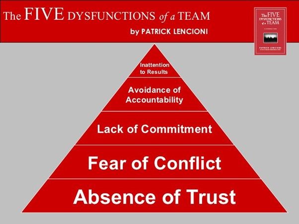

This blog post is part 5 of my safe schema updates series. 

Links to the other posts in this series are available below:

!include <safe-schema-updates-posts>

> *“No matter what the problem is, it’s always a people problem.”*
> *Gerald Weinberg*

In the previous post (part 4) we focussed on technical issues associated with software/database architecture. In this post we focus on the human issues.

[Conway’s law](https://en.wikipedia.org/wiki/Conway%27s_law) dictates that organizations are limited to design systems that mirror their internal communication patterns. As Eric S Raymond so eloquently put it in [The New Hacker’s Dictionary](https://www.goodreads.com/book/show/104746.The_New_Hacker_s_Dictionary), *“if you have four groups working on a compiler, you'll get a 4-pass compiler”*. 

Our team structures measurably affect our software architectures… but the reverse can also be true: complicated architectures can foster painful and toxic bureaucracy and working cultures. Together, left unchecked, it's possible for them to form a vicious circle. 

When things go wrong with critical but complex monoliths, and when it’s difficult to attribute cause and effect, individuals are generally quick to point fingers and cover their own backs. If we are honest with ourselves, we can probably all think of times when we acted defensively, even if we didn’t know whether we were at fault. We are all valuable but imperfect humans, and we share a deep personal instinct for self-preservation.

Patrick Lencioni talks about conflict, commitment, and accountability in [The Five Dysfunctions of a Team](https://octopus.com/blog/devops-reading-list#dysfunc). His fourth dysfunction explicitly calls out the avoidance of accountability as being detrimental to effective teamwork:
 

*Image source: [https://medium.com/taskworld-blog/lencionis-5-dysfunctions-of-a-team-330d58b2cd81](https://medium.com/taskworld-blog/lencionis-5-dysfunctions-of-a-team-330d58b2cd81)*

In [part 2](https://octopus.com/blog/safe-schema-updates-2-resilience-vs-robustness) of this series, as part of our discussion into reliability vs robustness, we discussed Richard Cook’s insightful research into [how complex systems fail](https://how.complexsystems.fail/). 

In particular, we looked at the problems with traditional views about accountability or blame and “root cause analysis” within complex systems, where failures are often caused by many, seemingly unrelated factors. These challenges are inescapable, but we can help ourselves by designing systems that are easier to observe and where relationships, dependencies, and expectations are more clearly defined.

When we break our complicated, monolithic architectures up into sets of smaller, more loosely coupled systems, it helps everyone to take responsibility for their own subsystems. These subsystems should be designed to run independently of other systems such that if one system fails, the failure is generally isolated to that system. There's no need to waste time investigating the wider system or pointing fingers. An appropriate team of engineers can focus their attention directly at the misbehaving subsystem, while others can monitor other subsystems to ensure that they are coping with the disruption as intended.

There's far less opportunity for counter-productive politics and it’s much easier for folks to focus on fixing the problem, learning, and improving. Everyone benefits: shareholders, managers, and engineers alike.

## Service Level Objectives (SLOs) and downtime budgets

The DevOps movement rejects the idea that development teams should be targeted on the speed of delivery, while separate operations teams are targeted on stability. The conflict between the objectives of these teams does not incentivize cooperation or systems thinking.

By breaking up monoliths into separate services, it allows for smaller, cross-functional teams to take responsibility for both the speed of delivery *and* the stability of their own services. Where there are conflicts between speed/stability objectives, they can be weighed against each other by the people who best understand the customer needs and technical details and who jointly own both the speed and stability objectives.

To support this, each service could be given a specific set of public Service Level Objectives (SLOs). Downstream services will be aware of these SLOs and can design their own services defensively with these SLOs in mind. For example, if the sales service (from the previous post) promises 99.9% uptime, the support service will not be designed to expect 99.99%.

But these SLOs go both ways. 99.9% uptime, also means 0.1% downtime (about 43 minutes/month). Understanding what those limits are is necessary for both designing any HA/DR strategy and planning deployments/risk management. By using specific numbers, we can make practical, informed decisions.

“Downtime budgets” set realistic expectations with all parties, whether they be the developers of dependent systems, or the end users. Explicit SLOs encourage teams to plan maintenance and design deployment patterns that keep downtime levels within limits that are both acceptable and practical. These downtime budgets also allow teams to balance their appetite for innovation/risk against their stability responsibilities.

For example, if a team has used up most of their monthly downtime budget within the first week of the month, perhaps now is the time to focus their energy on tasks associated with improving stability, rather than pushing ahead with risky new features. Equally, if they’ve been routinely outperforming their SLOs by a couple of orders of magnitude, perhaps they should prioritize the next customer facing feature over further stability investments.

By publishing both the SLO and performance metrics for each service, teams become accountable for their own work. If specific SLOs are missed on a regular basis, this should trigger a conversation about how the business can support the team to improve. Perhaps the SLO is unreasonable? Perhaps the team needs a little support? In either case, it allows the organization to focus their energy and investments where they are most needed.   

## Bounded contexts enable bounded autonomy

In an ideal world, where reviews are necessary, they should be carried out by someone who is able to read the code while it’s still fresh, understand the consequences, and provide insightful recommendations about improvements. Where regulatory compliance is concerned, the review should (as a minimum) be carried out by an engineer who understands the systems well enough to spot any potentially fraudulent changes. (Note: this often requires a great deal of technical skill as well as some hands on experience working with the codebase.) Preventing fraud, after all, is the entire point of the Sarbanes-Oxley (SOX) Act.

Since Continuous Integration teaches us to prioritize merging over diverging (see part 3), the reviewer should also prioritize the code review (merging) over any new changes they are currently working on (diverging). Ideally, within minutes of the change being submitted for approval, the reviewer(s) should pause whatever they are doing and review the change.

That’s right. It should be *expected* that reviewers take a break from any new development work, in order to prioritize the merging and deployment of “dev-complete” work.

From this stance, the idea of a weekly Change Advisory Board (CAB) meeting should sound as poisonous and inefficient as it is. The audacity of any CAB member to think that any WIP should sit around, festering for a week, to fit in with their own schedule, should be considered egregiously arrogant. What else are they doing with their time that is more important to the business than merging a week’s worth of putrid divergence? Delivering reliable updates is *literally the point of the job* – not a task to be put off until the end of the week. (I talked in more detail about why [Change Advisory Boards Don’t Work](https://octopus.com/blog/change-advisory-boards-dont-work) last year, so I won’t repeat myself further here.)

It’s clear that senior managers should not be reviewing deployments. They probably will not be able to drop whatever they are working on whenever someone submits a new pull request. Their role is to support healthy review practices, not to personally conduct the reviews.

Fortunately, by decoupling our systems, the number of stakeholders for any specific system should be significantly reduced. Why should an engineer from the sales system care about a release to the support system (and vice versa)? That's just going to ruin their focus and distract them from the work they are responsible for with their own tightly scoped subsystem(s). API dependencies should be codified in the test framework. If a dependency has been broken, that should be flagged automatically, and if a test is missing, it’s the responsibility of the team who are dependent upon it.

The people who own the speed and stability objectives for any given service should live within the team itself. They should not need a CAB, or any other external approvers. They are the most effective people to deliver on their goals.

By bringing the reviews into the cross-functional team for a given service, we enable reviews to happen on a radically timelier basis. This does not necessarily mean they are being completed by the developer themselves, or even someone with the same role. The team is cross-functional, after all. Perhaps a senior developer or an infrastructure engineer conducts the review? Maybe for a database change it’s a database specialist or even a DBA?

This revised review process will be more likely to catch errors and/or fraudulent changes and it maintains any “separation of duty” requirements. If anything, it’s *more* compliant with any legislation that I’ve come across to date than traditional CAB-based approval practices, and it supports the delivery of high-quality IT services, rather than hinders it. It also supports collaboration and knowledge sharing within the team responsible for delivering and maintaining the service.

One common concern folks have about dropping the CAB, is a perceived loss of control, authority, or oversight by senior management or security teams. This perception is unfounded. To those concerned folks, I encourage you to imagine a world where the status of each service, with respect to its SLO, is available on a live dashboard.

Any service that routinely misses their SLOs would be highlighted to the same folks who traditionally sat on the CAB. This would be a cue to start a conversation about why the SLOs are being missed and what could be done to help. This would allow all those senior management figures who care so deeply about minimizing risk, to focus their attention and energy with the people and services where they can deliver the most value with respect to improving safety.

Finally, for any reader with an objection about the need to scheduling releases or reveal updates to customers/users based on some higher level business need or marketing goal, I’m afraid I’m going to kick that can for another couple of posts. You’ll find answers to that objection in Part 7: Near-zero downtime deploys.

## Firm cultural leadership, from the top, is not optional

At first, the adoption of publicly reported SLOs can make engineers feel vulnerable. When things aren't going well, it takes courage to be open and honest about failure. This is especially true if they already work within politically toxic working cultures where failure typically leads to scapegoating and negative repercussions. If everyone can see when I screw up, will I be fired as soon as I make a mistake? I mean, we all make mistakes, embarrassingly often. Surely it's inevitable that sooner or later I'm going to be fired?

Guess I better work on my resume and put some feelers out?

(Fun fact: When I started this series, I thought it was going to be a single blog post! Then it became a 3-parter… Now it’s grown into something *much* bigger and I’m a long way behind my original publication schedule! I'm super grateful to the awesome folks at Octopus for their patience and understanding!)

The shift toward bounded responsibility can be hugely beneficial, but only if the team feel safe and supported, *especially* in failure. This is something that can only be achieved through clear, honest and sincere direction - from the top. If you'd like a little help imagining what that might look like, pop some headphones on, and click play:

<blockquote class="twitter-tweet">
Dear intern:  We&#39;ve all screwed something up, So welcome to the club.  &quot;That Sinking Feeling (The <a href="https://twitter.com/hashtag/HugOps?src=hash&amp;ref_src=twsrc%5Etfw">#HugOps</a> Song)&quot; <a href="https://t.co/KmwgSfx33h">pic.twitter.com/KmwgSfx33h</a>
&mdash; Forrest Brazeal (@forrestbrazeal) <a href="https://twitter.com/forrestbrazeal/status/1412586571170291718?ref_src=twsrc%5Etfw">July 7, 2021</a></blockquote> 

Creating a safe architecture, where it's *technically* safe to fail, is critical for delivering reliable services. However, this counts for nothing unless you also have inspiring leaders, who foster a culture that also values the *psychological* safety of all their team members.

## Next time

We started this series with a look at traditional database delivery hell, and the various factors that reinforce a vicious cycle that leads to a technical debt singularity. We then went on to imagine a better way, covering the theoretical foundations of resilience, continuous integration, and loose coupling. However, while we went into some detail imagining what a better system might look like, I’ve not written in any technical detail about how to transition from one architecture to the other.

In my next post (part 6), we’ll switch gears. We’ll move from theory into practice, with the first of three technical posts intended to aid you to develop three important capabilities that will support your transition to a loosely coupled architecture.

In the first of these three posts we’ll talk about the replacement of shared dev/test instances with the self-service and on-demand provisioning of useable and regulatory compliant dev/test environments. 

After that, we’ll finish this series with two posts that discuss near-zero downtime releases and a safe process for breaking monoliths up into smaller services.

While each of these capabilities is individually valuable, it’s in the combination of all three that the benefits of each are multiplied.

Links to the other posts in this series are available below:

!include <safe-schema-updates-posts>
 
## Watch the webinars 

Our first webinar discussed how loosely coupled architectures lead to maintainability, innovation, and safety. Part two discussed how to transition a mature system from one architecture to another. 

### Database DevOps: Imagining better systems

<iframe width="560" height="315" src="https://www.youtube.com/embed/oJAbUMZ6bQY" title="YouTube video player" frameborder="0" allow="accelerometer; autoplay; clipboard-write; encrypted-media; gyroscope; picture-in-picture" allowfullscreen></iframe>

### Database DevOps: Building better systems

<iframe width="560" height="315" src="https://www.youtube.com/embed/joogIAcqMYo" title="YouTube video player" frameborder="0" allow="accelerometer; autoplay; clipboard-write; encrypted-media; gyroscope; picture-in-picture" allowfullscreen></iframe>

Happy deployments!
