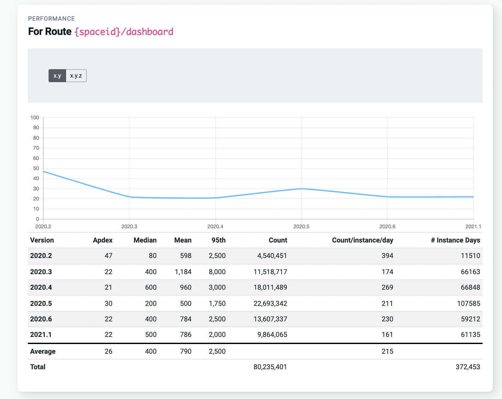

Over the years, Octopus Deploy has grown to include many new features and areas within the app.  Customers use these to view the dashboard, create or deploy releases, author projects or run runbooks against their infrastructure. To serve our customers better, we want to know how fast and responsive the experience is.

Like many software companies, we collect telemetry to measure how customers use and experience the product. Some of the telemetry we collect is the timing of API calls and database operations, which we call 'performance telemetry'. We surface this telemetry in our engineering dashboard, code-named Crow's Nest.

Crow's Nest provides a high-level overview of how users are experiencing the product. A web request triggers when a customer wants to visit a page or poll an endpoint, and Crow's Nest measures how long the request takes. 

We also track these requests over several versions to ensure Octopus Deploy's responsiveness continues to improve. 

## Apdex

We calculate an Apdex (Application Performance Index) score, which aims to convert measurements into insights about user satisfaction. The formula is:

    Apdex = (SatisfiedCount + ToleratingCount * 0.5) / TotalCount
 
Apdex uses API (web) requests that return a 2xx response. Apdex excludes certain requests that are called often and are cached. 

- Requests that are returned in less than or equal to 50ms are considered to be within the satisfied threshold. 
- Requests that are greater than 50ms and less than 200ms are considered to be within a tolerated threshold.

Apdex gives a uniform scale to test the customer experience. A higher number indicates a more positive user experience. We can vary thresholds to experiment with Apdex scores given a specific appetite for tolerance. 

The examples in this post display the default threshold values. These are configurable in real-time in the application to view Apdex scores against different criteria.

Only web requests with a 2xx status are included in the calculations. A 2xx status indicates a successful web request. Versions with less than 50 instances sending telemetry on any given data get filtered out to remove outliers. The response times of these web requests estimate how satisfied a customer is with their service. 

## Visualizing Apdex and Octopus Deploy

There are several ways to visualize Apdex. The following graphs show how we use Crow's Nest to display Apdex and gain valuable insights.

### Apdex for Cloud and Deploy

The blue line indicates the Apdex performance of recent versions in Octopus Cloud and the deployment server. The Cloud Apdex performance has been consistent at around 90 for this period. The deployment server is the internal Octopus instance not released to customers. 

The orange graph indicates a significant dip in Apdex from 2021.2.2048, where it recovered in 2021.2.4155 as we fixed the regressions. 

It's helpful to look back and see how different versions affected the user experience. If there's a significant dip in performance, we can conduct a root cause analysis to identify and address causes.

### Apdex by version and license

We can compare the Apdex score for different versions and licenses. The licenses are Cloud, On Premise, Trial, and Overall. There's a lot of variability in these numbers, as they're representative of all customers. 

<!--### Apdex customer view

-->

### Apdex overall score

Each customer has an overall Apdex score, which indicates the responsiveness of the customer experience.

### Apdex routes

The performance of individual routes are in the customer view. We time web requests and group the results on the route. From these timings we show the mean, median and 95th percentile time. 

By bucketing the requests by route, we avoid transmitting large amounts of data. We can use these metrics to identify the worst-performing routes in a later version. 

#### Apdex route difference

We can use Crow's Nest to view the differences in routes across different versions. The project routes improved between 2020.6 and 2021.1, as denoted by the green difference indicators for the Apdex score.

#### Apdex route view

Historical performance is visible on every route. This allows us to see how the performance of a route has changed in each release. 

For example, the performance of the certificates route above degraded from 2020.2 to 2020.6. The Apdex score decreased from 62 to 16. 

In 2021.1, we identified the cause of this decrease in Apdex score and resolved the issue, leading to an Apdex score of 77.

#### Future improvements

Crow's Nest helps us plan what to work on next. It highlights areas needing the most attention, that should be addressed first. It also gives us another signal when monitoring our overall application health.

<!---->

## Conclusion

Telemetry is a powerful tool that offers businesses a complete picture of user experiences. 

Telemetry and Apdex give full visibility of each user and the performance of each route. We can compare performance across different versions and licenses. Comparing versions quantifies the effect of each update. Poor-performing routes are visible on a per-user basis or across the Octopus Deploy platform. 

Our Crow's Nest tool helps to improve the customer experience, leading to more responsive interactions, and happier deployments.

