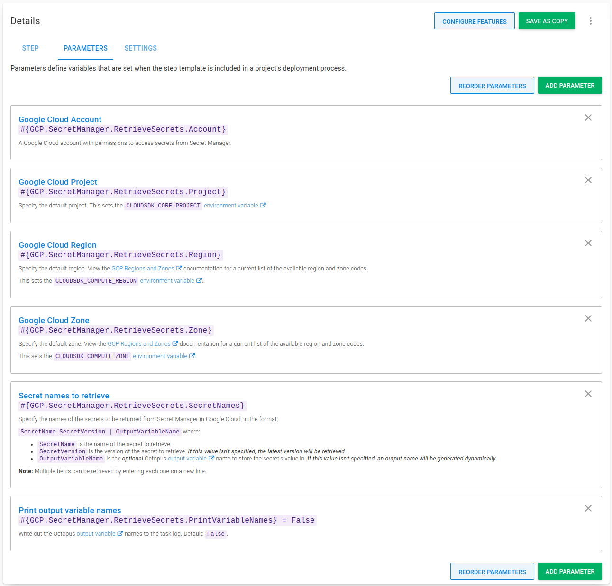

I've written previously about extending the functionality of Octopus to integrate with both [HashiCorp Vault](https://octopus.com/blog/using-hashicorp-vault-with-octopus-deploy) and [Azure Key Vault](https://octopus.com/blog/using-azure-key-vault-with-octopus) using step templates. As part of our commitment to provide more ways for our customers to be successful with Octopus, we're continuing to invest time in expanding our range of step templates that integrate with other secret managers.

In this post, I walk through a new step template, [GCP Secret Manager - Retrieve Secrets](https://library.octopus.com/step-templates/9f5a9e3c-76b1-462f-972a-ae91d5deaa05/actiontemplate-gcp-secret-manager-retrieve-secrets), which is designed to retrieve secrets from Secret Manager on Google Cloud Platform (GCP) for use in your deployments or runbooks.

## Introduction

This post assumes some familiarity with [custom step templates](https://octopus.com/docs/projects/custom-step-templates) and the Octopus [Community Library](https://octopus.com/docs/projects/community-step-templates). 

In addition, this post doesn't go into great detail about Secret Manager concepts or how to set it up. You can learn more by reading the [Secret Manager Quickstart guide](https://cloud.google.com/secret-manager/docs/quickstart) from Google.

The step template in this post retrieves secrets from [Secret Manager](https://cloud.google.com/secret-manager) using [gcloud](https://cloud.google.com/sdk/gcloud), the GCP command-line tool. The gcloud tool, version **338.0.0** or higher must be installed on the deployment target or worker before the step can retrieve secrets successfully. The step also requires Octopus **2021.2** and newer as it makes use of our recently added built-in support for [Google Cloud Platform](https://octopus.com/blog/google-cloud-platform-integration). The step template has been tested on both Windows and Linux (with `PowerShell Core` installed).

## Authentication {#authentication}

Before you can retrieve secrets from Secret Manager, you must authenticate with Google. In their [creating and accessing secrets documentation](https://cloud.google.com/secret-manager/docs/creating-and-accessing-secrets), Google describes the role needed to access secrets:

> Accessing a secret version requires the **Secret Manager Secret Accessor** role (`roles/secretmanager.secretAccessor`) on the secret, project, folder, or organization. IAM roles can't be granted on a secret version.

:::hint
To learn more about the different roles you can use with Secret Manager, read the [access control documentation](https://cloud.google.com/secret-manager/docs/access-control) on how to provide permissions to access to sensitive passwords, certificates, and other secrets.
:::

In Octopus, authentication with Google Cloud Platform can be achieved with a [Google Cloud Account](https://octopus.com/docs/infrastructure/accounts/google-cloud) that was added in version **2021.2**.

## Retrieving secrets {#retrieving-secrets}

The [GCP Secret Manager - Retrieve Secrets](https://library.octopus.com/step-templates/9f5a9e3c-76b1-462f-972a-ae91d5deaa05/actiontemplate-gcp-secret-manager-retrieve-secrets) step template retrieves one or more secrets from Secret Manager and creates sensitive output variables for each one retrieved. 

For each secret, you must provide a version of the secret to retrieve, and optionally provide a custom output variable name.

:::hint
**Always choose a specific secret version**
Google recommends that for Production appliations, you should always retrieve secrets with a specific version, and not with the *latest* version specifier.
:::

Retrieving a single secret requires:

- A Google Cloud account with permission to access the secret, including details of the default [Project](https://g.octopushq.com/GCPDefaultProject), [Region, and Zone](https://g.octopushq.com/GCPDefaultRegionAndZone).
- The name of the secret to retrieve.

An advanced feature of the step template offers support for retrieving multiple secrets at once. This requires entering each secret on a new line.

For each secret retrieved, a [sensitive output variable](https://octopus.com/docs/projects/variables/output-variables#sensitive-output-variables) is created for use in subsequent steps. By default, only a count of the number of variables created will be shown in the task log. To see the names of the variables in the task log, change the **Print output variable names** parameter to `True`.

### Step template parameters {#parameters}

The step template uses the following parameters:

- **Google Cloud Account**: A [Google Cloud account](https://octopus.com/docs/infrastructure/accounts/google-cloud) with permissions to access secrets from Secret Manager.
- **Google Cloud Project**: Specify the default project. This sets the `CLOUDSDK_CORE_PROJECT` environment variable.
- **Google Cloud Region**: Specify the default region. This sets the `CLOUDSDK_COMPUTE_REGION` environment variable.
- **Google Cloud Zone**: Specify the default zone. This sets the `CLOUDSDK_COMPUTE_ZONE` environment variable.
- **Secret names to retrieve**: Specify the names of the secrets to be returned from Secret Manager in Google Cloud, in the format: `SecretName SecretVersion | OutputVariableName` where:

    - `SecretName` is the name of the Secret to retrieve.
    - `SecretVersion` is the version of the secret to retrieve. *If this value isn't specified, the latest version will be retrieved*.
    - `OutputVariableName` is the *optional* Octopus [output variable](https://octopus.com/docs/projects/variables/output-variables) name to store the secret's value in. *If this value isn't specified, an output name will be generated dynamically*.

    **Note:** Multiple fields can be retrieved by entering each one on a new line.
- **Print output variable names**: Write out the Octopus [output variable](https://octopus.com/docs/projects/variables/output-variables) names to the task log. Default: `False`.



### Using the step {#using-the-step}

The **GCP Secret Manager - Retrieve Secrets** step is added to deployment and runbook processes in the [same way as other steps](https://octopus.com/docs/projects/steps#adding-steps-to-your-deployment-processes).

After you've added the step to your process, fill out the parameters in the step:


After you've filled in the parameters, you can execute the step in a runbook or deployment process. On successful execution, any matching secrets will be stored as sensitive output variables. If you've configured your step to print the variable names, they'll appear in the task log:


In subsequent steps, output variables created from matching secrets can be used in your deployment or runbook.

:::hint
**Tip:** Remember to replace `GCP Secret Manager - Retrieve Secrets` with the name of your step for any output variable names.
:::

Although not recommended, it's possible to retrieve the latest version of a secret, either by omitting the version from the secret names parameter like this:

```text
OctoSecrets-username | username-latest
```

Or by using the *latest* version specifier like this:

```text
OctoSecrets-password latest | password-latest
```

In both cases, the step template will emit a warning to the task log:


## Conclusion

The step template covered in this post demonstrates that it's easy to integrate with Google Cloud Secret Manager, and make use of secrets stored there with your Octopus deployments or runbooks.

Happy deployments!
