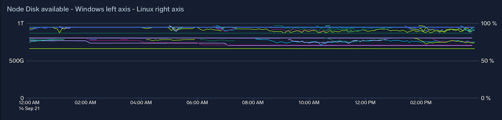

At Octopus Deploy we use Azure Kubernetes Service ([AKS](https://azure.microsoft.com/en-au/services/kubernetes-service/)) to manage a [Kubernetes](https://kubernetes.io) cluster that we use for a range of internal tools, as well as build and test workloads.

In order to efficiently use this resource, we need to be able to monitor how much it's being used along a number of dimensions – CPU, memory, disk, network bandwidth, and more.

For Linux [nodes](https://kubernetes.io/docs/concepts/architecture/nodes/) we use [Sumologic's solution for metric gathering from Kubernetes](https://github.com/SumoLogic/sumologic-kubernetes-collection), but it doesn't currently support gathering metrics from Windows. We use Windows nodes in our cluster, so we needed a way to monitor them too.

I'm going to walk you through our solution, and if you also need Windows node metrics I hope you can use this to find a solution that works for you.

## Gathering metrics on Windows hosts

Gathering metrics about a Kubernetes node has an established pattern for Linux nodes:

- run a DaemonSet of privileged pods on all Linux nodes and gather host-level metrics with [node_exporter](https://github.com/prometheus/node_exporter)
- have them labelled with something that Prometheus will scrape automatically

This doesn't work on Windows because Windows Containers cannot ([currently](https://github.com/Azure/AKS/issues/1975)) be privileged - i.e. they are not able to see the 'outside world' of the host VM. So we need some other way to peek into the host.

So, based on a fantastic [solution](https://github.com/aidapsibr/aks-prometheus-windows-exporter) by GitHub user aidapsibr, we built a way to mimic the standard pattern for Linux fairly closely, so that other folks working in our cluster can understand how the monitoring pipeline works without too much confusion.

There are three components:
1. A Virtual Machine Scale Set Extension, which installs the [windows-exporter](https://github.com/prometheus-community/windows_exporter) Windows service on each instance as it's created
2. A [reverse proxy](https://en.wikipedia.org/wiki/Reverse_proxy) container used to expose the windows-exporter running on the node as a Service in the cluster
3. Two remote-write rules for Prometheus to forward some Windows metrics into the Sumologic pipeline

### A Virtual Machine Scale Set Extension

aidapsibr's solution uses a PowerShell script for installing the extension once, but as we deploy our AKS cluster using Terraform and Continuous Deployment, we need a way to ensure that any VM in any of the Windows node pools ends up with this extension. Fortunately, the [Azure provider for Terraform](https://registry.terraform.io/providers/hashicorp/azurerm/latest/docs/resources/virtual_machine_scale_set_extension) already has a resource for scale set extensions, so we add the below to our Terraform file:

```terraform
data "azurerm_virtual_machine_scale_set" "blue_bldwin" {
  depends_on = [
    azurerm_kubernetes_cluster_node_pool.blue_nautilus_buildwindows
  ]
  name                = "aksbldwin"
  resource_group_name = join("", ["MC_", var.environment, var.name, "_", var.environment, var.name, "aks_australiaeast"])
}

resource "azurerm_virtual_machine_scale_set_extension" "blue_windows_exporter" {
  depends_on = [
    data.azurerm_virtual_machine_scale_set.blue_bldwin
  ]
  name                         = "windows-exporter-dsc"
  virtual_machine_scale_set_id = data.azurerm_virtual_machine_scale_set.blue_bldwin.id
  publisher                    = "Microsoft.Powershell"
  type                         = "DSC"
  type_handler_version         = "2.80"
  # ensure that the AKS custom script extension has already run
  provision_after_extensions = ["vmssCSE"]
  auto_upgrade_minor_version = false
  settings = jsonencode({
    wmfVersion = "latest"
    configuration = {
      url      = var.vmss_metrics_extension_zip
      script   = "aks_setup"
      function = "Setup"
    }
    privacy = {
      dataEnabled = "Disable"
    }
  })
}
```

We seperately build a DSC .zip file, referenced above as `var.vmss_metrics_extension_zip`, and host it as a GitHub release artifact. This .zip file contains the windows-exporter .msi installer, and a PowerShell DSC module file that the extension will invoke once the VM is up and running. The module just installs the .msi installer.

Once this is deployed, we can now scrape our Windows nodes manually from inside our cluster and get back Prometheus-formatted metrics:

```
# curl 10.240.0.4:9100/metrics | grep windows_cpu_time
# HELP windows_cpu_time_total Time that processor spent in different modes (idle, user, system, ...)
# TYPE windows_cpu_time_total counter
windows_cpu_time_total{core="0,0",mode="dpc"} 486.953125
windows_cpu_time_total{core="0,0",mode="idle"} 19035.953125
windows_cpu_time_total{core="0,0",mode="interrupt"} 18.53125
windows_cpu_time_total{core="0,0",mode="privileged"} 2327.78125
windows_cpu_time_total{core="0,0",mode="user"} 5324.1875
...
```

Now, we need a way to allow Kubernetes Services (and Prometheus ServiceMonitors) to discover and scrape these metrics – an equivalent of the DaemonSet used for Linux nodes.
### A reverse proxy

We package up nginx (a widely-used [reverse proxy](https://en.wikipedia.org/wiki/Reverse_proxy)) as a container, with an entrypoint that takes in an environment variable and uses it as the upstream server in this configuration file:

```nginx
http {
    include       mime.types;
    default_type  application/octet-stream;

    sendfile        on;

    keepalive_timeout  65;

    upstream backendhostname {
            server PROXY_HOSTIP:PROXY_PORT;
    }

    server {
        listen       9100;
        server_name  localhost;

        location /health {
            return 200;
        }

        location /metrics {
            proxy_pass http://backendhostname/metrics;
            proxy_http_version 1.1; 
            proxy_set_header Upgrade $http_upgrade; 
            proxy_set_header Connection "upgrade"; 
        }
    }
}
```

`PROXYHOSTIP` is set to the node's InternalIP by deploying the nginx container as a DaemonSet with this definition:

```yaml
apiVersion: apps/v1
kind: DaemonSet
metadata:
  name: # a useful name
  namespace: # your monitoring namespace
  labels:
    # labels that match any existing Prometheus ServiceMonitors
spec:
  selector:
    matchLabels:
      # labels that match any existing Prometheus ServiceMonitors
  updateStrategy:
    type: RollingUpdate
  template:
    metadata:
      labels:
        # labels that match any existing Prometheus ServiceMonitors
    spec:
      hostNetwork: false
      containers:
        - name: windows-metric-proxy
          image: # your docker container location
          imagePullPolicy: Always
          ports:
            - name: metrics
              containerPort: 9100
              protocol: TCP
          env:
            - name: PROXY_HOSTIP
              # this will get the current node's internal IP and forward metric scrapes to the windows-exporter service running on the node
              valueFrom:
                fieldRef:
                  fieldPath: status.hostIP
            - name: PROXY_PORT
              value: '9100'
      securityContext:
        runAsNonRoot: false
      nodeSelector:
        kubernetes.io/os: windows
```

As long as your `labels` match your existing Linux node metrics pipeline's `ServiceMonitor` Prometheus will automatically pick up these for scraping. For Sumologic, that means this:

```yaml
labels:
  app: prometheus-node-exporter
  release: collection
```

Now that the Prometheus instance inside the cluster is gathering metrics, we need to send them off to Sumologic for longer-term retention.
## Forwarding to Sumologic

The Sumologic collection solution is a Helm chart that installs everything you need to gather all sorts of Kubernetes monitoring data (not just metrics, but events and logs and all sorts of things). We upgrade the chart as part of our continuous deployment of the cluster infrastructure.

The chart allows us to specify additional remote write rules that tell Prometheus to send metrics to an instance of fluentd that the chart also installs - so we added two rules in our `values.yaml` override file to send these new Windows metrics to the same places that the Linux ones go. This wouldn't have been necessary if the windows-exporter used the same metric names as the Linux exporter.

```yaml
prometheus:
  prometheusSpec:
    nodeSelector:
      agentpool: default
    # Add new remote writes (toward fluentd) for our windows metrics, which are unfortunately prefixed with windows_
    # We don't need to use new fluentd targets because these represent the same measurements as the existing ones.
    remoteWrite:
      - url: http://$(FLUENTD_METRICS_SVC).$(NAMESPACE).svc.cluster.local:9888/prometheus.metrics.container
        remoteTimeout: 5s
        writeRelabelConfigs:
          - action: keep
            # regex: job-name;metric-name-regex
            regex: node-exporter;(?:windows_container_cpu_usage_seconds_total|windows_container_memory_working_set_bytes|windows_container_fs_usage_bytes|windows_container_fs_limit_bytes|windows_container_cpu_cfs_throttled_seconds_total|windows_container_network_receive_bytes_total|windows_container_network_transmit_bytes_total)
            sourceLabels: [job, __name__]
      - url: http://$(FLUENTD_METRICS_SVC).$(NAMESPACE).svc.cluster.local:9888/prometheus.metrics.node
        remoteTimeout: 5s
        writeRelabelConfigs:
          - action: keep
            regex: node-exporter;(?:windows_cpu_time_total|windows_logical_disk_free_bytes|windows_logical_disk_size_bytes|windows_memory_.*|windows_net_bytes_received_total|windows_net_bytes_sent_total|windows_os_.*|windows_system_.*)
            sourceLabels: [job, __name__]

```

Note: We needed to include all of the other `remoteWrite` rules from the original chart, otherwise they were no longer present if we just used the above values.

## Conclusion

After connecting up all of the above, we're now able to monitor (for example) the node disk consumption across our entire cluster in one place, which makes it significantly easier to experiment with changes to our workloads because we no longer risk exhausting resources in the cluster.



## Learn more

- [link](https://www.example.com/resource)
- [Our AKS Windows Exporter repo](https://github.com/OctopusDeploy/aks-prometheus-windows-exporter)