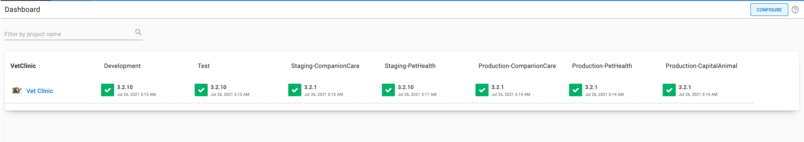
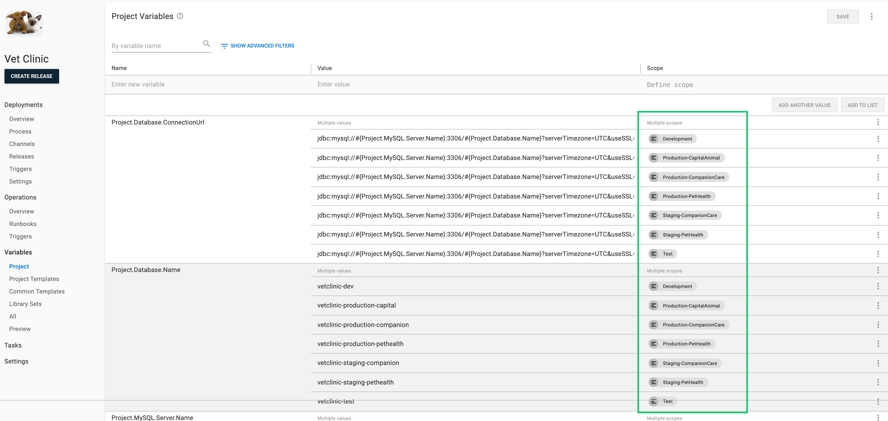
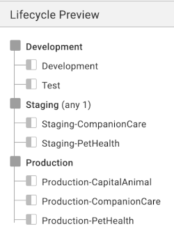
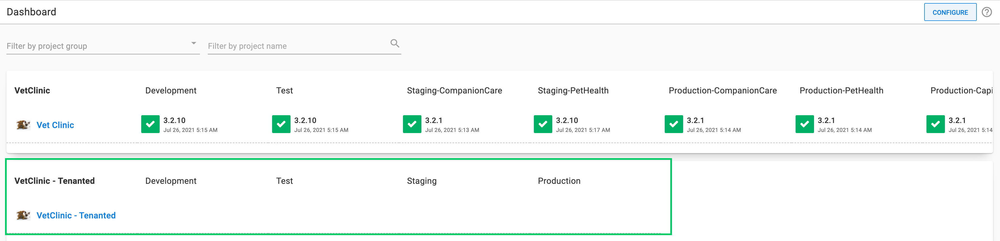
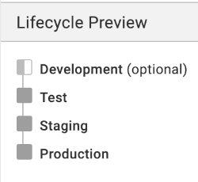
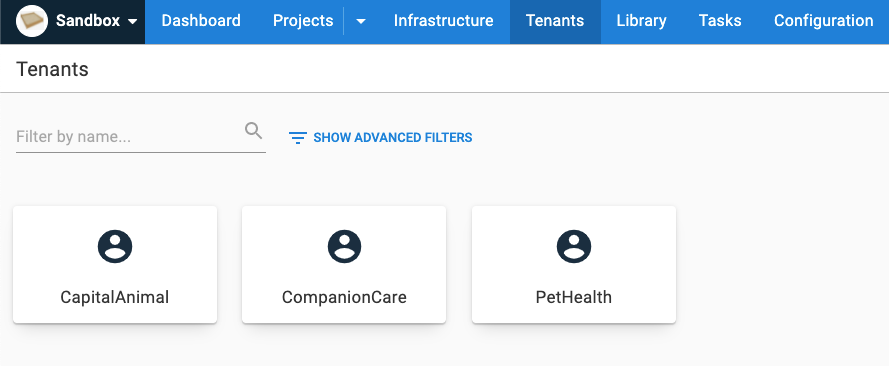
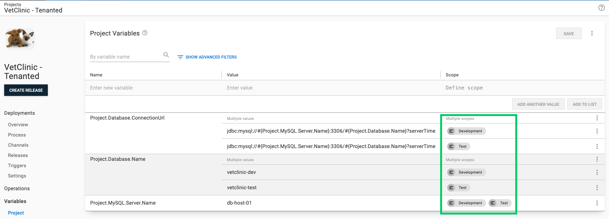
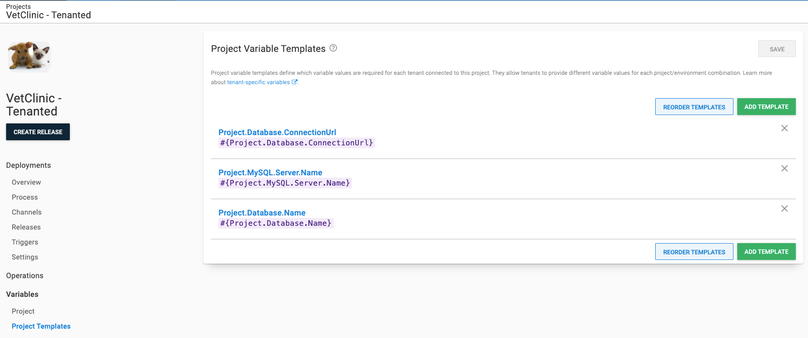
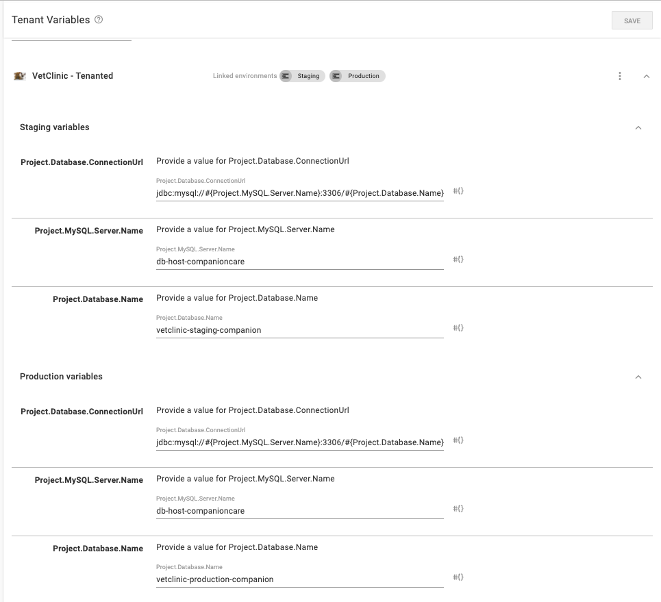

In a previous post, Mark Harrison wrote about the [benefits of multi-tenancy](https://octopus.com/blog/better-multi-tenancy-with-octopus#using-multiple-environments) in Octopus. Designing an application to fit multi-tenancy from the start is easier than retrofitting one, but what should you do with an existing application? I often see people create customer-specific environments when they're deploying multiple instances of the same application to each of their customers. This can lead to complicated lifecycles, unclear release dashboards, and complex variable scoping for projects.

Fortunately, since Octopus 2.0, the Octopus REST API has been available to help manage multi-tenancy. 

Using a sample project called [Vet Clinic](https://samples.octopus.app/app#/Spaces-682/projects/vet-clinic/deployments), I demonstrate how you can leverage the Octopus REST API and start automating your conversion to multi-tenancy.

## Initial project state

The overview screen of the [Vet Clinic project](https://samples.octopus.app/app#/Spaces-682/projects/vet-clinic/deployments) shows a variety of environments where you can deploy the project. Some of the environments are customer-specific and include the customer name. These are the environments you convert to tenants.



The project has multiple variables being scoped to each environment to specify the value for the customer. It's the variables scoped to customer environments that you convert to project templates, to provide each tenant you create with the specific variable values for tenanted deployments. 

Variables scoped to generic environments, such as Development and Test, are kept as project-specific variables for untenanted deployments.



The last piece is the project's lifecycle. Each customer has their specific environment, and each phase in the lifecycle has multiple environments to which you can deploy the project. 

You create a new lifecycle with a single environment for each phase the project can deploy to. The old lifecycle determines which environments each new tenant can have the project deployed to.



## Getting started

To start the conversion process, you create a new project alongside your existing Vet Clinic project. Do this by [cloning the existing project](https://octopus.com/docs/projects#clone-a-project). The clone allows you to test changes in parallel, without worrying about mishaps disrupting your current project's deployments. 

After you're happy with results on the cloned project, remove it and run the conversions scripts on the original project. Alternatively, you can move everything to the new, cloned project and eventually retire the original project.

:::hint
To connect tenants to a project, you need to enable tenanted deployments on that project. You can read our [documentation on tenanted deployments](https://octopus.com/docs/tenants/tenant-creation/tenanted-deployments) to learn how.
:::



Next, you create a new, simplified lifecycle for the project to use after the conversion is complete. Each phase in the lifecycle has a single environment to deploy to, which offers a more comprehensive view of what release has deployed to which environment and tenant.



## Creating the scripts

:::hint 
The examples provided are for reference and should be modified and tested prior to using in a production Octopus instance. 
:::

With those two pieces in place, you can start creating your scripts. For the first script, you create the tenants from the old environments. 

You need to specify the following inputs:

- `$projectnames`: The project(s) you would like to attach your tenants to
- `$tenantTags`: Tenant tags to apply to all newly created tenants
- `$spaceName`: The Octopus space name your project is in
- `$lifecycleName`: The name of the old lifecycle your untenanted project is using 
- `$newEnvironmentNames`: A list of environments to not convert to tenants

With those inputs set, the script gets a list of *old environments* to convert. 

While looping through the list of *old environments* a few things happen: 

- Since the environment names follow the convention of `EnvironmentName-CustomerName`, it parses out the desired tenant name. 
- From the new tenant name, there is then a check to see if the tenant already exists. 
- To determine which new environments each tenant should deploy to, the script loops through each phase in the old lifecycle. 
- The project(s) from the input get combined with the environments that the tenant should deploy to. 
- If the tenant doesn't exist, the script will call the API to create a new tenant with the gathered data. 
- If the tenant doesn't exist, the script will send a request to up the tenant with the environments it should deploy to, for the project(s).

<details>
<summary>Full script create_tenants_from_environments.ps1</summary>
<p>

```ps
$ErrorActionPreference = "Stop";

# Define working variables
$octopusURL = "https://youroctopus.octopus.app"
$octopusAPIKey = "API-YOURAPIKEY"
$header = @{ "X-Octopus-ApiKey" = $octopusAPIKey }

# Provide project names to attach new tenants to.
$projectNames = @("VetClinic - Tenanted")

# Optionally, provide existing tenant tagsets you wish to apply.
$tenantTags = @() # Format: TagSet/Tag

# Provide the space name
$spaceName = "Sandbox"
# Get space
$space = (Invoke-RestMethod -Method Get -Uri "$octopusURL/api/spaces/all" -Headers $header) | Where-Object {$_.Name -eq $spaceName}

# Provide the old lifecycle name
$lifecycleName = "Vet Clinic"
# Get lifecycle
$lifecycle = (Invoke-RestMethod -Uri "$octopusURL/api/$($space.Id)/lifecycles/all" -Headers $header) | Where-Object {$_.Name -eq $lifecycleName}

# List of environments to not convert to tenants
$newEnvironmentNames = @("Development","Test","Staging","Production")

# List of environment names and ids being converted to Tenants
$oldEnvionments = (Invoke-RestMethod -Uri "$octopusURL/api/$($space.Id)/environments/all" -Headers $header) | Where-Object {$_.Name -notin $newEnvironmentNames} | Select-Object -Property Id,Name

# Get the environment ids to attach the tenant to from the phase in the old lifecycle that the environment was apart of
function Build-EnvironmentIds {
    param ($oldEnvId)

    $environmentIds = @()

    foreach ($phase in $lifecycle.Phases) {
        if ($phase.AutomaticDeploymentTargets -contains $oldEnvId -or $phase.OptionalDeploymentTargets -contains $oldEnvId)
        {
            $newEnvId = (Invoke-RestMethod -Method Get -Uri "$octopusURL/api/$($space.Id)/environments/all" -Headers $header) | Where-Object {$_.Name -eq $phase.Name} | ForEach-Object {$_.Id}
            $environmentIds += $newEnvId
        }
    }

    ,$environmentIds
}

# Parse the old environment name for the new tenants name
function Edit-EnvironmentName {
    param ($oldEnvName)

    $start = $oldEnvName.IndexOf("-")+1
    $end = $oldEnvName.Length
    $newName = $oldEnvName.Substring($start, ($end-$start))
    $newName
}

# Get projects to attach tenants to
$projectIds = @()
foreach ($projectName in $projectNames)
{
    $projectIds += ((Invoke-RestMethod -Method Get -Uri "$octopusURL/api/$($space.Id)/projects/all" -Headers $header) | Where-Object {$_.Name -eq $projectName}).Id
}

# Loop though the old environment and create tenants
foreach($oldEnv in $oldEnvionments) {
    $tenantName = Edit-EnvironmentName($oldEnv.Name)

    # Check if tenant already exists
    $existingTenant = (Invoke-RestMethod -Method Get -Uri "$octopusURL/api/$($space.Id)/tenants/all" -Headers $header) | Where-Object {$_.Name -eq $tenantName}

    # Get environment ids to attach the tenants to
    $envIds = Build-EnvironmentIds($oldEnv.Id)

    # New tenant creation
    if ($null -eq $existingTenant) {        
        # Build project/environments
        $projectEnvironments = @{}
        foreach ($projectId in $projectIds)
        {
            $projectEnvironments.Add($projectId, $envIds)
        }

        # Build json payload
        $jsonPayload = @{
            Name = $tenantName
            TenantTags = $tenantTags
            SpaceId = $space.Id
            ProjectEnvironments = $projectEnvironments
        } | ConvertTo-Json

        # Create tenant
        Invoke-RestMethod -Method Post -Uri "$octopusURL/api/$($space.Id)/tenants" -Body $jsonPayload -Headers $header -ContentType "application/json"
    }
    else {

        foreach ($projectId in $projectIds) {
            $existingTenant.ProjectEnvironments.($projectId) += $envIds
        }

        $jsonPayload = $existingTenant | ConvertTo-Json

        # Update tenant
        Invoke-RestMethod -Method Put -Uri "$octopusURL/api/$($space.Id)/tenants/$($existingTenant.Id)" -Body $jsonPayload -Headers $header -ContentType "application/json"
    }
}

```
</p>
</details>

***

After the tenants are created, you need to make the following script that turns the old project variables into [variable templates](https://octopus.com/docs/projects/variables/variable-templates) to provide a value for each tenant. 

The script requires the following inputs:

- `$projectNames`: The *old* project name that contains the current project variables along with the *new* name of the project you'd like to create the variable templates for
- `$$newEnvironmentNames`: A list of environment names used to scope project variables and template variables per tenant
- `$spaceName`: The Octopus space name that contains the project(s)

A list of the project variables from the specified *old project* is retrieved. The script then loops through each variable and each environment scope the variable has. 

If the scoped environment is one of the new environments you'll use for tenanted deployments, a project variable gets created. Otherwise, the script will create a variable template. 

There is a check to see if the project variable or variable template already exists for the project in both cases. When they don't exist, details from the old variables are used to create the new variable types and they're added to their respective collections, retrieved at the beginning of the script. 

After the loop finishes, there's a call to the API to update the project's variable collection, and another call to update the project variable templates.

After the API call that creates the variable templates for the project, the script loops back through each variable to provide values to the templates for each tenant. The old variable's environment scopes get looped through to parse out the name of the environment and tenant that the value will belong to. The parsed tenant name retrieves the tenant data. 

From the tenant data, the script then loops through each project environment attached to the tenant and then through each template until the name of the old variable matches the name of the template, and the project environment matches the environment scope. An API call gets made to update the variables for the tenant with the new value.

<details>
<summary>Full script create_project_variables_and_templates.ps1</summary>
<p>

```powershell
$ErrorActionPreference = "Stop";

# Define working variables
$octopusURL = "https://youroctopus.octopus.app"
$octopusAPIKey = "API-YOURAPIKEY"
$header = @{ "X-Octopus-ApiKey" = $octopusAPIKey }

# Provide the current project name and the new project name.
$projectNames = @{
    old = "Vet Clinic" 
    new = "VetClinic - Tenanted"
}

# Names of new environments
$newEnvironmentNames = @("Development","Test","Staging","Production")
$newEnvironmentIds = (Invoke-RestMethod -Uri "$octopusURL/api/$($space.Id)/environments/all" -Headers $header) | Where-Object {$_.Name -in $newEnvironmentNames} | ForEach-Object {$_.Id}

# Provide the space name
$spaceName = "Sandbox"
# Get space
$space = (Invoke-RestMethod -Method Get -Uri "$octopusURL/api/spaces/all" -Headers $header) | Where-Object {$_.Name -eq $spaceName}

# Get old project
$oldProject = (Invoke-RestMethod -Method Get -Uri "$octopusURL/api/$($space.Id)/projects/all" -Headers $header) | Where-Object {$_.Name -eq $projectNames['old']}

# Get new project
$newProject = (Invoke-RestMethod -Method Get -Uri "$octopusURL/api/$($space.Id)/projects/all" -Headers $header) | Where-Object {$_.Name -eq $projectNames['new']}

# Get old variable set
$oldVariableSet = Invoke-RestMethod -Method Get -Uri "$octopusURL/api/$($space.Id)/variables/$($oldProject.VariableSetId)" -Headers $header

# Get the new projects variables
$newProjectVariables = Invoke-RestMethod -Method Get -Uri "$octopusURL/api/$($space.Id)/variables/$($newProject.VariableSetId)" -Headers $header

# Get the tenants attached to the new project
$tenants = Invoke-RestMethod -Method Get -Uri "$octopusURL/api/$($space.Id)/tenants/all?projectId=$($newProject.Id)" -Headers $header 

# Create a new project variable
function New-Project-Variable {
    param (
        $oldVariable
    )
    # Check to see if variable is already present
    $variableToUpdate = $newProjectVariables.Variables | Where-Object {$_.Name -eq $oldVariable.Name -and $_.Scope -eq $oldVariable.Scope} 

    # If the variable does not exist create it
    if ($null -eq $variableToUpdate)
    {
        # Create new object
        $variableToUpdate = New-Object -TypeName PSObject
        $variableToUpdate | Add-Member -MemberType NoteProperty -Name "Name" -Value $oldVariable.Name
        $variableToUpdate | Add-Member -MemberType NoteProperty -Name "Value" -Value $oldVariable.Value
        $variableToUpdate | Add-Member -MemberType NoteProperty -Name "Type" -Value $oldVariable.Type
        $variableToUpdate | Add-Member -MemberType NoteProperty -Name "IsSensitive" -Value $oldVariable.IsSensitive
        $variableToUpdate | Add-Member -MemberType NoteProperty -Name "Scope" -Value $oldVariable.Scope

        # Add to collection
        $newProjectVariables.Variables += $variableToUpdate

        $newProjectVariables.Variables
    } 
}

# Create a new project template variable
function New-Project-Template {
    param (
        $oldVariable
    )

    # Check to see if the template already exists
    $templateToUpdate = $newProject.Templates | Where-Object {$_.Name -eq $oldVariable.Name}

    # If the template does not exist, create it
    if ($null -eq $templateToUpdate) {
        $templateToUpdate = New-Object -TypeName PSObject
        $templateToUpdate | Add-Member -MemberType NoteProperty -Name "Name" -Value $oldVariable.Name
        $templateToUpdate | Add-Member -MemberType NoteProperty -Name "DisplaySettings" -Value @{'Octopus.ControlType' = 'SingleLineText'}

        # Add to collection
        $newProject.Templates += $templateToUpdate

        $newProject.Templates
    }
}

# Create project template values for tenants
function New-Template-Values {
    param (
        $oldVariable
    )

    foreach ($envScope in $oldVariable.Scope.Environment) {

        # Get environment name from the old environment scope
        $environmentName = ($oldVariableSet.ScopeValues.Environments | Where-Object {$_.Id -eq $envScope}).Name

        if ($environmentName -notin $newEnvironmentNames)
        {
            $tenantNameAndEnvironment = $environmentName.Split("-")
            $tenantName = $tenantNameAndEnvironment[1]
            $newEnvironment = $tenantNameAndEnvironment[0]
            $environmentId = (Invoke-RestMethod -Uri "$octopusURL/api/$($space.Id)/environments/all" -Headers $header) | Where-Object {$_.Name -eq $newEnvironment} | ForEach-Object {$_.Id}

            # Get the tenant with that name
            $tenant = $tenants | Where-Object {$_.Name -eq $tenantName}
            # Get tenants variable set
            $tenantVariables = (Invoke-RestMethod -Method Get -Uri "$octopusURL/api/$($space.Id)/tenants/$($tenant.Id)/variables" -Headers $header)
            $newProjectId = $newProject.Id

            # Go through each tenant project environment and create a tenant template value for the corresponding template 
            foreach ($projectEnv in $tenant.ProjectEnvironments.$newProjectId) {
                foreach ($template in $tenantVariables.ProjectVariables.$newProjectId.Templates) {
                    if ($oldVariable.Name -eq $template.Name -and $projectEnv -eq $environmentId) {
                        $tenantVariables.ProjectVariables.$newProjectId.Variables.$projectEnv | Add-Member -MemberType NoteProperty -Name $template.Id -Value $oldVariable.Value
                    }
                }
            }

            # Update the variables with the new value
            Invoke-RestMethod -Method Put -Uri "$octopusURL/api/$($space.Id)/tenants/$($tenant.Id)/variables" -Headers $header -Body ($tenantVariables | ConvertTo-Json -Depth 10)
        }
    }
}

# Go through old project variables to create new project variables and template variables
foreach ($oldVariable in $oldVariableSet.Variables) {

    foreach ($environment in $oldVariable.Scope.Environment)
    {
        # Create project variables to old variables scoped to non tenant environments
        if ($environment -in $newEnvironmentIds) {
            # Create new project variable
            New-Project-Variable($oldVariable)
        }
        else {
            # Create new project template
            New-Project-Template($oldVariable)
        }   
    }  
}

# Update the new projects variable collection
Invoke-RestMethod -Method Put -Uri "$octopusURL/api/$($space.Id)/variables/$($newProject.VariableSetId)" -Headers $header -Body ($newProjectVariables | ConvertTo-Json -Depth 10)

# Update the new projects templates
Invoke-RestMethod -Method Put -Uri "$octopusURL/api/$($space.Id)/projects/$($newProject.Id)" -Headers $header -Body ($newProject | ConvertTo-Json -Depth 10)

# Loop through old variables again to update tenant variable values after the project templates have been created
foreach ($oldVariable in $oldVariableSet.Variables) {
    New-Template-Values($oldVariable)
}

```
</p>
</details>

## End result

After running the two scripts against the Vet Clinic project, you can see the new items the scripts created. 

On the tenant dashboard, you can now see three different tenants:



The *Vet Clinic - Tenanted* project now only has project variables scoped to new environments:



The project also includes the new variable templates to provide a value for each tenant:



Inside each new tenant, the variable values have been updated for each environment using the scope and value from the old project variables:



:::hint
To start using your new tenants with your deployments, you need to set up your [infrastructure](https://octopus.com/docs/tenants/tenant-infrastructure) and any [tenant tags](https://octopus.com/docs/tenants/tenant-tags) you want to use to manage groups of tenants.
:::

## Conclusion

Multi-tenancy in Octopus is a powerful feature that you can leverage to create scalable, reusable, simplified deployments. Converting a sizable existing project to multi-tenancy can seem like a momentous task though. 

This post shows a few of the steps to convert an existing project to multi-tenancy. I hope it demonstrates how the Octopus API helps you automate the steps in the process, saving you time and the possibility of hundreds of mouse clicks in the UI.

## Learn more

- [Multi-tenancy documentation](https://octopus.com/docs/tenants)
- [Multi-tenancy guides](https://octopus.com/docs/tenants/guides)
- [Better multi-tenancy with Octopus](https://octopus.com/blog/better-multi-tenancy-with-octopus#using-multiple-environments)

## Watch the webinar: Better multi-tenancy deployments using Octopus Deploy

<iframe width="560" height="315" src="https://www.youtube.com/embed/dD8psiK1wL4" title="YouTube video player" frameborder="0" allow="accelerometer; autoplay; clipboard-write; encrypted-media; gyroscope; picture-in-picture" allowfullscreen></iframe>

We host webinars regularly. See the [webinars page](https://octopus.com/events) for past webinars and details about upcoming webinars. 

Happy deployments!
