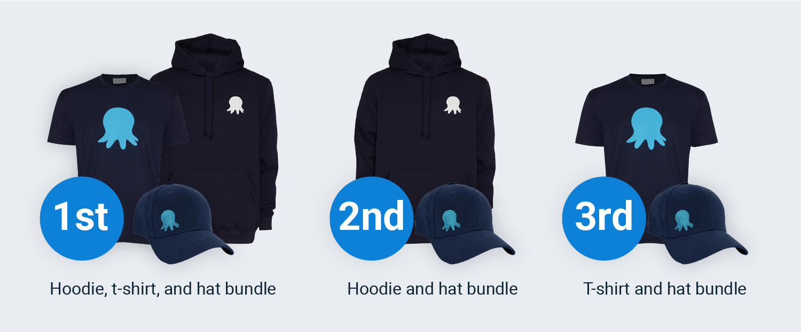

Octopus Deploy is part of this year’s [Festive Tech Calendar](https://festivetechcalendar.com), running a hackathon competition. 

The aim of the hackathon is to deploy an Azure Web App using Octopus Deploy.

## What is the Festive Tech Calendar?

The [Festive Tech Calendar](https://festivetechcalendar.com) is a free, month-long, community-run tech event. People from all tech communities are invited to submit talks, content, and competitions, and participate in the activities.

## The Octopus hackathon

**What**: Deploy an Azure Web App using Octopus Deploy, then fill out our [hackathon submission form](https://forms.gle/PeGkA92uhnGsHy268)

**When**: Complete the exercise between Wednesday, December 1 – Wednesday, December 15, 2021

**Prize**: One of three Octopus Deploy swag bundles

### Hackathon guidelines

Our guidelines are loose:

- We don’t mind how you configure your deployment or what the resulting web application is, provided you deploy with Azure using Octopus Deploy 
- It doesn’t matter how simple or complex your application and process are
- You can build a new web application or use one of the Octopus samples: 
   - [OctoPetShop](https://github.com/OctopusSamples/OctoPetShop)
   - [Random Quotes](https://github.com/OctopusSamples/RandomQuotes)
- You can use technologies that are new to you, or those you’re familiar with, anything from ARM templates, PowerShell, and Terraform, to GitHub Actions and more

Primarily, we just want you to have fun and learn something!

### How to enter

- Use an existing Azure account or sign up for an [Azure free account](https://azure.microsoft.com/free) 
   - If you’re signing up for an Azure free account, you automatically receive $200 in Azure credits for 30 days and a limited quantity of additional free services for 12 months
- Use an existing Octopus Deploy instance or sign up for an [Octopus Cloud free trial](https://octopus.com/start/cloud)
- Deploy an Azure Web App using Octopus Deploy 
- After completing the hackathon, fill out all required fields in our [hackathon submission form](https://forms.gle/PeGkA92uhnGsHy268) before 5 pm GMT, Wednesday, December 15, 2021

### Winners

We’ll randomly select three winners from the submissions and they’ll receive one of our swag bundles: 

We’ll announce the winners around 2 pm GMT, Monday, December 20, 2021.

### Spreading community spirit

Feel free to write a blog post, create a video, or tweet about your hackathon implementation, tagging [@OctopusDeploy](https://www.twitter.com/OctopusDeploy); we’d love to hear from you.  

These optional activities don’t get you extra credit but will spread some community spirit. 

#### The fine print

- A purchase or payment isn’t necessary and doesn’t increase your chances of winning. 
- We’ll only consider one entry per person. 
- The hackathon is not open to employees, representatives, or agents of Octopus Deploy, including all members of their immediate family and household.
- The hackathon is not open to any other individual involved with the design, production, promotion, execution, or distribution of the hackathon, including all members of their immediate family and household.
- Hackathon submission period: 8 am GMT, December 1, 2021 – 5 pm GMT, December 15, 2021. 
- Winners announced on or around 2 pm GMT, Monday, December 20, 2021.

## Getting started with Octopus Deploy

If you haven’t used Octopus Deploy before, check out the following resources:

- [Getting Started docs](https://octopus.com/docs/getting-started)
- [Getting Started YouTube videos](https://www.youtube.com/playlist?list=PLAGskdGvlaw268i2ZTPC1ZrxwFjjKIdKH)
- [Our blog](https://octopus.com/blog)
- The [Octopus Community Slack space](https://octopususergroup.slack.com) - to ask questions and meet other people from the Octopus community 

Happy deployments!
