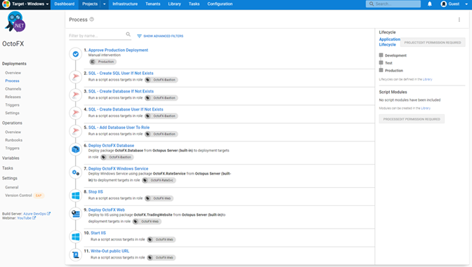
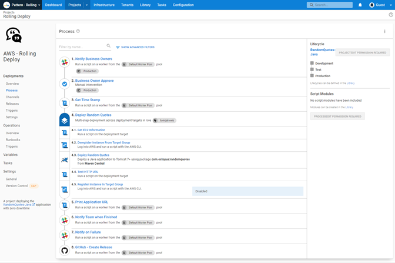

Hey folks, welcome back to the "From Zero to Octopus Hero" blog series, this is part 2!  I joined Octopus Deploy in October 2021 and am on a learning journey with the product and want to share that journey with you all!  In part one I covered off what Octopus Deploy is and set up the infrastructure needed to get started.  
 
Part 2 is going to look at DevOps and how Octopus Deploy deals with helping to implement that for your organization. 

## Introduction to DevOps
“DevOps is the union of people, process, and products to enable continuous delivery of value to our end users.” - Donovan Brown
 
I’ve spent years in the IT industry and worked my way through a lot of checklists with things that need to be done when deploying a server or helping to release a new version of software to customers.
 
While those checklists were helpful, the human element in that process can be flawed.  Assuming we’d completed a task. Skipping tasks.  Or even using an outdated version of that checklist.
 
This is where DevOps can help, if you build that checklist into an automation sequence, the automation tool won’t assume anything.  It won’t skip a task because it is tired or in a rush.
 
DevOps can help to introduce that consistency we all want in our IT environment.  It can also carry out tasks faster than a human in some cases.
 
When we talk about DevOps you often hear the terms Continuous Integration and Continuous Deployment or CI/CD mentioned.
 
Continuous Integration (CI) is the process of checking all your code, into a version control system.  The popular choice seems to be using Git.  With code repository choices being GitHub, GitLab, Azure DevOps, or BitBucket.
 
CI will then pull that code into a pipeline that builds your code, or compiles your application.  It can then carry out automated tests. Package your code or app into a deployable artifact, such as a Zip file or NuGet Package, or Docker image.  That artifact can then be deployed using a Continuous Deployment pipeline. 

Continuous Deployment (CD) focuses on the deployment, the actual installation, and distribution of your bits, the code, or the application.  CD helps you distribute your code or application through different environments, from Dev, to Test to Production. 

## DevOps with Octopus Deploy
Octopus Deploy can work in conjunction with continuous integration servers (or build servers) like Azure DevOps, TeamCity, Bamboo, Jenkins, and GitHub Actions. 
 
And it’s been eye-opening over the last few weeks. I've been working on getting an ASP.NET Application built using the CI pipeline capabilities in Azure DevOps. Then passing it to Octopus Deploy to deploy to my cloud platform.
 
The power that you have for deployment within Octopus Deploy is impressive.  You configure your CD pipeline using something called [Step Templates](https://octopus.com/docs/projects/built-in-step-templates). The step templates you have access to range from being able to run a script to steps such as importing a certificate into your Windows Server.
 
These step templates mean, you don’t have to code. You don’t have to know the exact scripting syntax for doing tasks like importing a certificate into your Windows Server. You select the step template and then answer some basic questions and Octopus Deploy takes care of everything else.

As someone who isn’t a coder, this has made getting started with Octopus Deploy and having a working CD pipeline a fast process.  Don’t get me wrong, I’ve had my fair share of failures setting the pipeline up.  Mostly that was due to my misunderstanding of how to configure the steps. 

Bringing in the power of Octopus Deploy’s [Runbooks’](https://octopus.com/docs/runbooks) into my deployment pipeline has been game-changing. 

Using the runbook process I’ve been able to build up a process that deploys all my infrastructure components, resources groups within Azure, Web Apps, and SQL Databases.  And actually have that as part of my CD pipeline. 

I’ve also got a runbook process that tears down all my Azure resources, don’t want to run up any unnecessary costs when I am not using the resources. 

## Deployment Strategies
A deployment strategy or pattern is important for any kind of software deployment or update management.   A deployment strategy should help to reduce downtime and make the process of rolling something new out seamless. 

What I’ve been learning recently is in the development and DevOps world deployment strategies have exciting names: 
- Rolling Deployments
- Blue/Green pattern
- Canary Deployments
- Multi-region Deployments

It’s been interesting learning the differences between them and when they are best used.  The concepts are by no means new to mean, just the terminology and the benefits when we approach software deployment or system upgrades from the development or DevOps perspective. 
 
We recently published a [great blog](https://octopus.com/blog/common-deployment-patterns-and-how-to-set-them-up-in-octopus) covering these common deployment patterns and how each of them can be used with Octopus Deploy.  

## Rolling Deployments with Octopus Deploy
Taking the basic pipeline that I had built earlier and adapting it to a rolling deployment was a straightforward process.  There is a button within step templates, where you can say you want to configure a rolling deployment and then Octopus Deploy sets up any further steps you want as child steps until the logic of your rolling deployment is carried out. 

It takes something that comes across as complex and simplifies it right down. 

 
## Lessons Learned
The ease with which I’ve created and had deployments with Octopus Deploy working is a testament to the work the team has put into the product, and not my skills!  I’ve heard [Derek Campbell](https://twitter.com/DevOpsDerek) speak at conferences and sung the virtues of how easy Octopus Deploy is to set up and was always skeptical (I’m Scottish after all), but I am now well and part of that camp. 
 
The one I would say is if your logic is flawed then no matter how easy it is to put in place with Octopus Deploy, your deployments aren’t going to be successful.  So take the time to sit down and plan how your deployment process.  Think about the steps that need to happen before each other. What variables do you need?  When do you need to put in manual checks and what can be fully automated?  That planning will set you up for success when you configure the steps within Octopus Deploy. 
 
I’ll be honest and say I worried that my lack of development experience would be a real hurdle to diving into the DevOps learning journey, but it hasn’t been.  There is new terminology to learn, but the concepts are ones that I am more than familiar with, just in a non-automation world. 
 
So never be frightened to test your knowledge and learn something new, you might surprise yourself.  
 
## Next Steps
I want to start looking at more complex deployments using Octopus Deploy, especially [Tenants](https://octopus.com/docs/tenants), and how they solve problems with different features branches, customers, or even geographic data centers. 
 
This learning journey is really exciting and things are starting to click and I’m excited about expanding on that knowledge and testing it!

