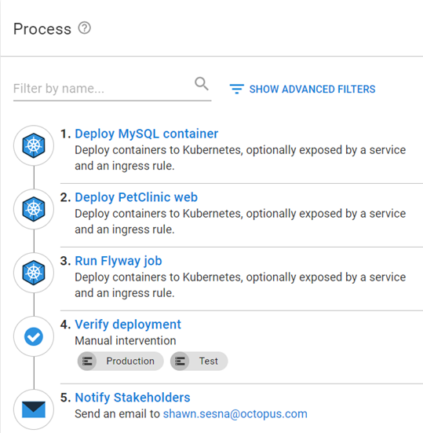
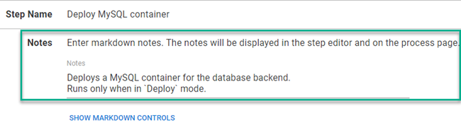
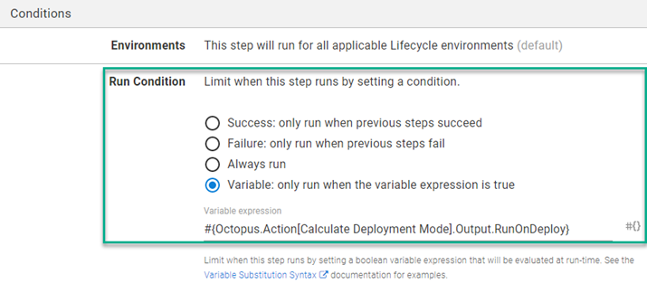
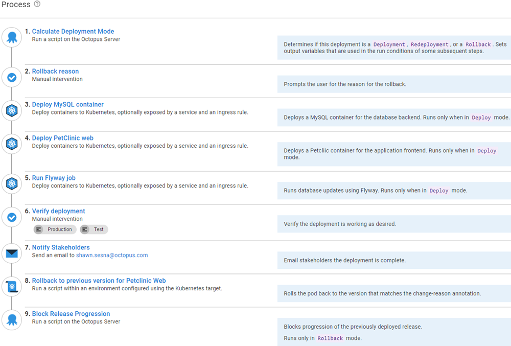
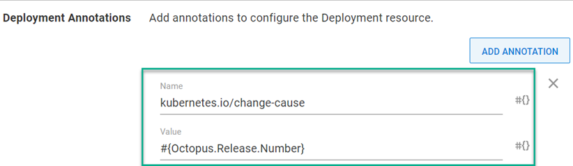

Not every deployment goes as smoothly as we'd like when deploying to Kubernetes.  Bugs, container environment variables, and hardware limitations can dictate whether an application will run after it’s deployed to a Kubernetes cluster.  When a fix isn't easy or the application is unresponsive, you need to go back to the previous version. This process is called a rollback.  

In this post, I describe some general and Kubernetes-specific rollback strategies using Octopus Deploy.

:::hint
You can also read about:

- [Rollback strategies that don’t require advanced deployment patterns](https://octopus.com/blog/rollback-strategies)
- [Rollback strategies when using an Apache Tomcat web server](https://octopus.com/blog/rolling-back-tomcat-deployment) 
:::

## Example deployment process

This post uses the built-in **Deploy Kubernetes Containers** to deploy a containerized version of the Java-based [PetClinic application](https://bitbucket.org/octopussamples/petclinic/src/master/).  

This application consists of a web front-end and a MySQL back-end.  The MySQL back-end is also deployed as a container with the database updates being performed as a Kubernetes job using Flyway.  The example process looks like this:

1. Deploy MySQL container
1. Deploy PetClinic web
1. Run Flyway job
1. Verify deployment
1. Notify stakeholders



This post assumes you're familiar with the steps in the example process. I only cover updates to implement the strategies I discuss here.

## Redeploy previous version
It's easy to recover from a failed deployment by redeploying the previous version.  In Octopus Deploy, you just click **Releases**, select the release, then click **REDEPLOY** next to the environment you want to redeploy to.


## Conditionally execute steps during a rollback
The redeploy method executes the deployment exactly how it was deployed the first time, executing all steps in the process.  However, you might want to skip steps during a rollback, for example database steps.  

To skip steps, you need to determine what activity is occurring; a deploy, redeploy, or rollback, then conditionally control which steps are executed.  You may also want the release you're rolling back to be blocked from progressing to other environments.

The updated process looks something like this:

1. Calculate Deployment Mode
1. Deploy MySQL container (only in Deploy mode)
1. Deploy PetClinic web
1. Run Flyway job (only in Deploy mode)
1. Verify deployment
1. Notify Stakeholders
1. Block Release Progression (only in Rollback mode)


:::info
You'll note the process shows which modes this step will run in.  This is not a result of adding the condition statement. The process makes use of the **Notes** field of a step so you know which steps are executed in which scenarios.


:::

### Calculate Deployment Mode
To determine which mode the deployment is in, our team developed the **[Calculate Deployment Mode](https://library.octopus.com/step-templates/d166457a-1421-4731-b143-dd6766fb95d5/actiontemplate-calculate-deployment-mode)** step template.  This template compares the release number of what's being deployed, to what was previously deployed to the environment, to determine what activity is occurring. For convenience, it also sets [output variables](https://octopus.com/docs/projects/variables/output-variables) which can then be used as [conditions](https://octopus.com/docs/projects/steps/conditions) on steps.

### Skipping database steps during rollback
To make sure the MySQL and Flyway steps only execute during a deployment, add the following output variable from **Calculate Deployment Mode** as the variable run condition:

```
#{Octopus.Action[Calculate Deployment Mode].Output.RunOnDeploy}
```



### Block Release Progression step
Blocking the progression of a release is not new in Octopus Deploy, however, it needs to be done manually or with an API call.  Our team developed the **[Block Release Progression](https://library.octopus.com/step-templates/78a182b3-5369-4e13-9292-b7f991295ad1/actiontemplate-block-release-progression)** step template to block the specified release from progressing in a deployment process.

To ensure this step doesn't run during a deployment, add the following variable run condition:

```
#{Octopus.Action[Calculate Deployment Mode].Output.RunOnRollback}
```

## Rolling back using Kubernetes revision history

Kubernetes keeps a rolling revision history for pods, so you can roll back to any stored revision (the number of revisions is configurable with a default value of 10).  The command `kubectl rollout history deployment.v1.apps/<deploymentname>` lists all the stored revisions for a Kubernetes deployment.

```
REVISION  CHANGE-CAUSE
1         <none>
2         <none>
3         <none>
```
You need to modify your deployment process to tie a revision to a specific release.  An updated process would look something like this:

1. Calculate Deployment Mode
1. Rollback Reason (only in Rollback mode)
1. Deploy MySQL container (only in Deployment mode)
1. Deploy PetClinic web
1. Run Flyway job (only in Deployment mode)
1. Verify deployment
1. Notify Stakeholders
1. Rollback to previous version for PetClinic web (only in Rollback mode)
1. Block Release Progression (only in Rollback mode)



Let's go through the newly added and updated steps.

### Rollback reason
**Rollback reason** is a **[Manual Intervention](https://octopus.com/docs/projects/built-in-step-templates/manual-intervention-and-approvals)** step that prompts you for the reason you're rolling back.  The reason specified can be used for the **Reason** field in the **Block Release Progression** step.  Add the variable run condition so it only executes during a rollback.

### Deploy PetClinic web
There are two modifications you need to make on this step
- Add a run condition so that it runs only in Deploy mode
- Add a deployment annotation to tie the release to a revision

#### Add a run condition
We've already seen how to set a variable run condition so the step only executes during Deploy.

#### Add a deployment annotation
In the **Deploy Kubernetes Containers** step, go to **Deployment Annotations** and add an annotation type of `kubernetes.io/change-cause` with the value of `#{Octopus.Release.Number}`



Running `kubectl rollout history deployment.v1.apps/<deploymentname>` will now show:

```
REVISION  CHANGE-CAUSE
1         2021.09.23.0
2         2021.09.23.1
3         2021.09.23.2
```

### Rollback to previous version for PetClinic web
Now the `CHANGE-CAUSE` column contains the release the revision came from, you can use the **Run a Kubectl CLI Script** step to parse the rollout history to determine which version to roll back to.

```powershell
# Init variables
$k8sRollbackVersion = 0
$rollbackVersion = $OctopusParameters['Octopus.Release.Number']
$namespace = $OctopusParameters['Project.Namespace.Name']
$deploymentName = $OctopusParameters['Project.Petclinic.Deployment.Name']

# Get revision history
Write-Host "Getting deployment $deploymentName revision history ..."
$revisionHistory = (kubectl rollout history deployment.v1.apps/$deploymentName -n $namespace)
$revisionHistory = $revisionHistory.Split("`n")

# Loop through history starting at index 2 (first couple of lines aren't versions)
Write-Host "Searching revision history for version $rollbackVersion ..."
for ($i = 2; $i -lt $revisionHistory.Count - 1; $i++)
{
	# Split it into two array elements
    $revisionSplit = $revisionHistory[$i].Split(" ", [System.StringSplitOptions]::RemoveEmptyEntries)
	
    # Check version
    if ($revisionSplit[1] -eq $rollbackVersion)
    {
    	# Record version index
        Write-Host "Version $rollbackVersion found!"
        $k8sRollbackVersion = $revisionSplit[0]
        
        # Get out of for
        break
    }
}

# Check to see if something was found
if ($k8sRollbackVersion -gt 0)
{
	# Issue rollback
    Write-Host "Rolling Kubernetes deployment $deploymentName to revision $k8sRollbackVersion ..."
    kubectl rollout undo deployment.v1.apps/$deploymentName -n $namespace --to-revision=$k8sRollbackVersion
}
else
{
	Write-Error "Version $rollbackVersion not found in cluster revision history."
}
```

Other than container start up time, this operation can be completed in seconds.

## Conclusion

Using the strategies discussed in this post, you can configure rollback functionality directly in your deployment process, including for an application deployed to Kubernetes.

## Watch the webinar: Rollback strategies with Octopus Deploy

<iframe width="560" height="315" src="https://www.youtube.com/embed/F_V7r80aDbo" title="YouTube video player" frameborder="0" allow="accelerometer; autoplay; clipboard-write; encrypted-media; gyroscope; picture-in-picture" allowfullscreen></iframe>

We host webinars regularly. See the [webinars page](https://octopus.com/events) for details about upcoming events, and live stream recordings.

Happy deployments!
