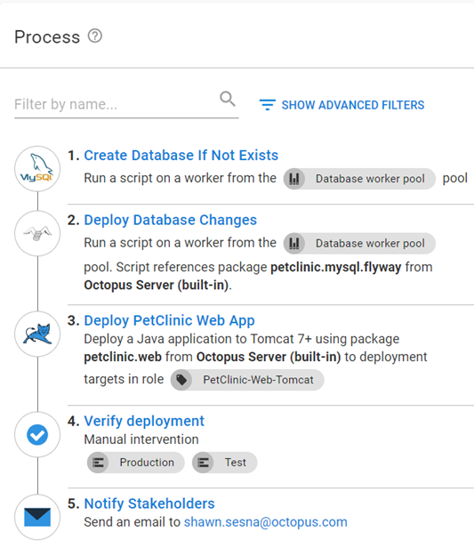
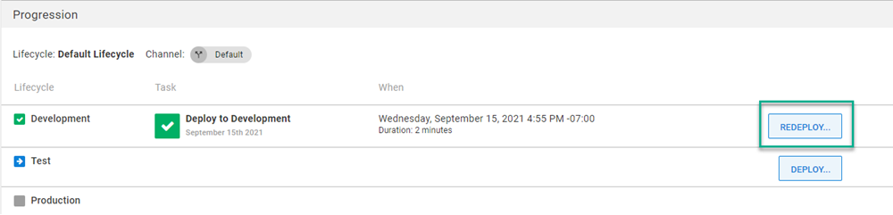
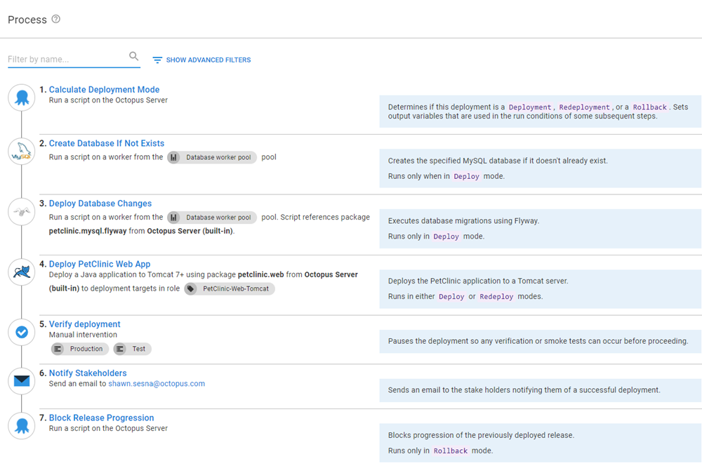
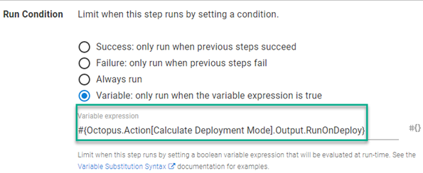
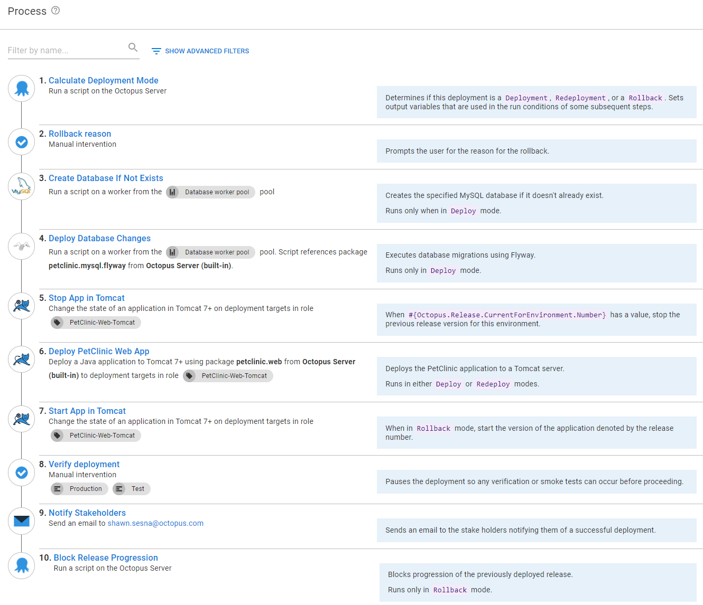
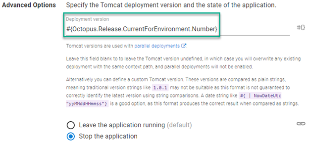
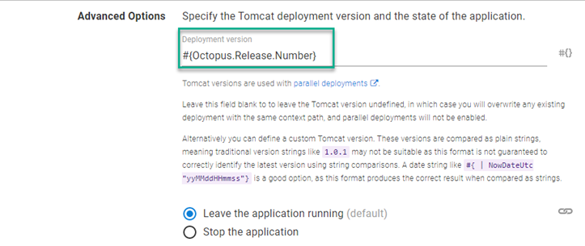
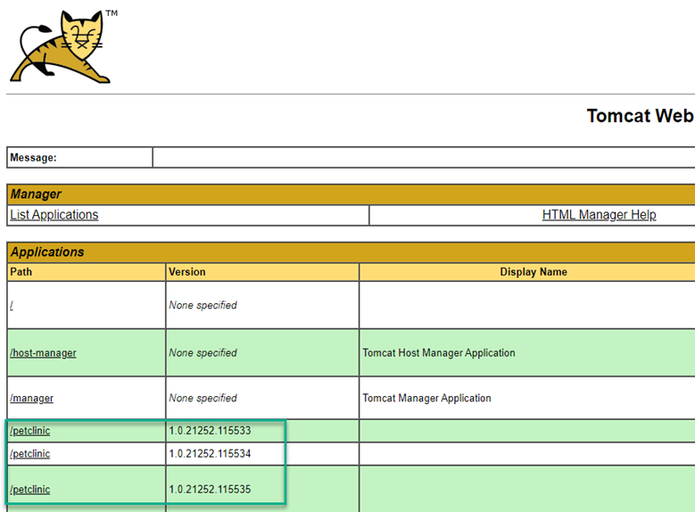

The DevOps feedback loop usually has automated processes to capture issues as early in the pipeline as possible.  While these automated processes allow for early detection, bugs can still find their way into production code.  Some bugs are severe enough to warrant backing out of the recently deployed version.  The process of reverting changes is called a rollback.  

In this post, I discuss different rollback strategies when using an Apache Tomcat web server.

:::hint
You can also read about:

- [Rollback strategies that don’t require advanced deployment patterns](https://octopus.com/blog/rollback-strategies)
- [General and Kubernetes-specific rollback strategies using Octopus Deploy](https://octopus.com/blog/rolling-back-kubernetes-deployment)
:::


## Initial deployment process

This post uses the [PetClinic application](https://bitbucket.org/octopussamples/petclinic/src/master/) to deploy to an Apache Tomcat web server.  The PetClinic application requires a database back-end and uses Flyway to perform database migrations.  

The example process looks like this:

1. Create Database If Not exists
1. Deploy Database Changes
1. Deploy PetClinic Web App
1. Verify deployment
1. Notify Stakeholders



This post assumes you're familiar with the steps included in this deployment process and won't go into detail for each step.

## Deploying the previous version
Using Octopus Deploy, you can roll back by redeploying the previous release of the application.  You simply select the previous release from the **Releases** screen and click the **REDEPLOY** button next to the desired environment.



All steps in the deployment process are executed as they were configured when the release was created.  For Apache Tomcat, the package will be re-extracted on the Tomcat server, a variable substitution performed, and it will be repackaged before being sent to the Tomcat Manager for deployment.  The size of the package will determine how long it takes.

## Simple rollback
As mentioned, all steps in the deployment process will be re-executed as they were the first time.  While the built-in method of redeployment is effective, there may be steps you don't want executed when performing a rollback.  

You usually roll back if something was wrong with the release.  In this case, it's a good idea to mark the release being rolled back as bad, and block it from being promoted to other environments.  To conditionally skip steps and mark the release as bad, the process needs to be modified:

1. Calculate Deployment Mode
1. Create Database If Not exists (skip during rollback)
1. Deploy Database Changes (skip during rollback)
1. Deploy PetClinic Web App
1. Verify deployment
1. Notify Stakeholders
1. Block Release Progression (only during rollback)

:::info
Using the **Notes** field in a deployment step, you can provide documentation for the steps and which mode they'll run in.
:::



You'll notice two new steps, **Calculate Deployment Mode** and **Block Release Progression**, plus some conditions applied to existing steps.  Let's look at those in more detail.

### Calculate Deployment Mode
The first part of a rollback process is determining if it's a deployment, a rollback, or a redeployment operation.  

Our team developed the community step template **[Calculate Deployment Mode](https://library.octopus.com/step-templates/d166457a-1421-4731-b143-dd6766fb95d5/actiontemplate-calculate-deployment-mode)** which determines which mode the deployment is in, and produces a number of [output variables](https://octopus.com/docs/projects/variables/output-variables) containing a variable [run condition](https://octopus.com/docs/projects/steps/conditions#run-condition) syntax (see the documentation in the description of the step for more details).

### Database steps
The **Create Database If Not Exists** and **Deploy Database Changes** steps do not need to be run in a rollback. They need to be configured to be skipped.  The `RunOnDeploy` output variable from the **Calculate Deployment Mode** can be applied to the variable run condition of these steps to skip them:

```
#{Octopus.Action[Calculate Deployment Mode].Output.RunOnDeploy}
```



### Block Release Progression
Blocking the progression of a release is not new in Octopus Deploy, however, it needs to be done via the UI or an API call.  

Our team recognized that automating this activity is critical when dealing with rollbacks and developed the **[Block Release Progression](https://library.octopus.com/step-templates/78a182b3-5369-4e13-9292-b7f991295ad1/actiontemplate-block-release-progression)** template which automates the blocking of a release. 

This step should only run during a rollback operation. Use the following output variable from **Calculate Deployment Mode** as the variable run condition to ensure this:

```
#{Octopus.Action[Calculate Deployment Mode].Output.RunOnRollback}
```

## Complex rollbacks

Both the built-in and simple rollback methods will extract and repackage the `.war` file before delivering it to the Tomcat server for deployment.  If your application is large it could take some time.  Using the Tomcat [parallel deployment](https://tomcat.apache.org/tomcat-7.0-doc/config/context.html#Parallel_deployment) feature, it's possible to perform a rollback in seconds.

### Tomcat parallel deployments

The parallel deployments feature was introduced in Tomcat version 7 and allows you to deploy multiple versions of the same application to a Tomcat server.  

After a newer version of the application is in a running state, new sessions will run on the new version and existing sessions continue to run on the older version until they expire. You need to supply a version number with the context path.  The Tomcat server combines the version number and context path and renames the deployed `.war` to `<contextpath>##<version>.war`

### Complex rollback process

To implement a rollback process using the parallel deployments feature, you need to modify your process to look something like this:

1. Calculate Deployment Mode
1. Rollback reason (only during rollback)
1. Create Database If Not exists (skip during rollback)
1. Deploy Database Changes (skip during rollback)
1. Stop App in Tomcat (run on rollback or run on deployment and rollback)
1. Deploy PetClinic Web App (only during deployment or redeployment)
1. Start App in Tomcat (only during rollback)
1. Verify deployment
1. Notify Stakeholders
1. Block Release Progression (only during rollback)



Let's go over the changes to the process to make this work.

#### Rollback reason

The **Rollback reason** step is a manual intervention that prompts you for the reason for the rollback.  The reason you specify is used in the **Reason** field in the **Block Release Progression** step further down in the process.  This step only runs during a rollback so it needs to have the variable run condition set to the following:

```
#{Octopus.Action[Calculate Deployment Mode].Output.RunOnRollback}
```

#### Stop App in Tomcat 
Both the **Stop** and **Start** steps use the **Start\Stop App in Tomcat** step.  The **Stop** step is optional when in **Deployment Mode**, but required in **Rollback Mode** as Tomcat will funnel new sessions to the most recent version of the deployed application that's running.  

When rolling back, we need to stop the version that's bad so the previously deployed version will start getting the sessions.  

Set the variable run condition to only run during rollback: 

```
#{Octopus.Action[Calculate Deployment Mode].Output.RunOnRollback}
```

Alternatively, you can use the [system variable](https://octopus.com/docs/projects/variables/system-variables) `Octopus.Release.CurrentForEnvironment.Number` to check if there was a previously deployed release:

```
#{if Octopus.Release.CurrentForEnvironment.Number}True#{/if}
```

The version number for the **Advanced Options** for the Tomcat step is below with the selected action of **Stop the application**:

```
#{Octopus.Release.CurrentForEnvironment.Number}
```



#### Start App in Tomcat {#start-app-in-tomcat}
During a rollback, this process stops the version being rolled back.  

You need a step that starts the version you're rolling back to.
The version number specified in the **Advanced Options** for the Tomcat step is below with the selection action of **Leave the application running**:

```
#{Octopus.Release.Number}
```



This step needs to be configured to run in `Rollback Mode` only using the following variable run condition:

```
#{Octopus.Action[Calculate Deployment Mode].Output.RunOnRollback}
```

#### Deploy PetClinic Web App
This step needs the same **Advanced Options** set as the **Start App in Tomcat** step, supplying `#{Octopus.Release.Number}` for the version being deployed.  (See image in [Start App in Tomcat](#start-app-in-tomcat) for reference.)

#### Block Release Progression
In the simple rollback scenario, the **Reason** field for the **Block Progression** is being statically set.  The **Rollback reason** step prompts you for the reason for the rollback, and the **Notes** output variable can be used as the input of **Reason** to have a more meaningful message for the blocked release.  

Modify the **Reason** field to use the **Notes** output variable from the **Rollback reason** step like this:

```
#{Octopus.Action[Rollback reason].Output.Manual.Notes}
```

:::warning
Enabling the [undeployOldVersions](https://tomcat.apache.org/tomcat-9.0-doc/config/host.html) feature in Tomcat can interfere with the complex rollback strategy.
:::

Parallel deployments will appear similar to this in the Tomcat Manager:



### Cleaning up old versions

The retention policies of Octopus Deploy help keep your targets clean by removing old versions that have been deployed.  However, the Tomcat Manager places the `.war` files in its own folder which is unknown to Octopus Deploy. 

If you're not using the parallel deployment feature, the `.war` is simply overwritten with the new version and the application is deployed.  

The parallel deployments feature of Tomcat renames the `.war` to `<contextpath>##<version>.war` so they are unique.  These files will continue to accumulate unless an `undeploy` operation is executed against the versioned application entry.  

To assist in Tomcat maintenance, our team developed **[Undeploy Tomcat Application via Manager](https://library.octopus.com/step-templates/34f13b4c-64e1-42b4-ad1a-4599f25a850e/actiontemplate-undeploy-tomcat-application-via-manager)**, a community step template that performs undeploy operations on a Tomcat server, currently available in Bash syntax.

## Conclusion

In this post I walked through several ways you can roll back an application deployment to an Apache Tomcat web server.  I hope one of these methods will help you in your DevOps journey.  

## Watch the webinar: Rollback strategies with Octopus Deploy

<iframe width="560" height="315" src="https://www.youtube.com/embed/F_V7r80aDbo" title="YouTube video player" frameborder="0" allow="accelerometer; autoplay; clipboard-write; encrypted-media; gyroscope; picture-in-picture" allowfullscreen></iframe>

We host webinars regularly. See the [webinars page](https://octopus.com/events) for details about upcoming events, and live stream recordings.

Happy deployments!
